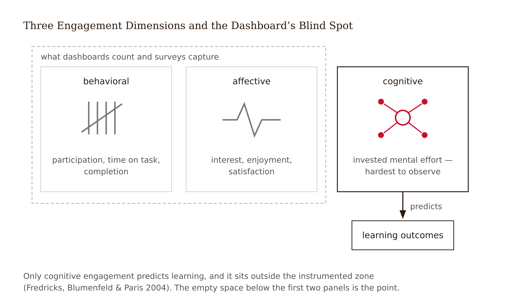
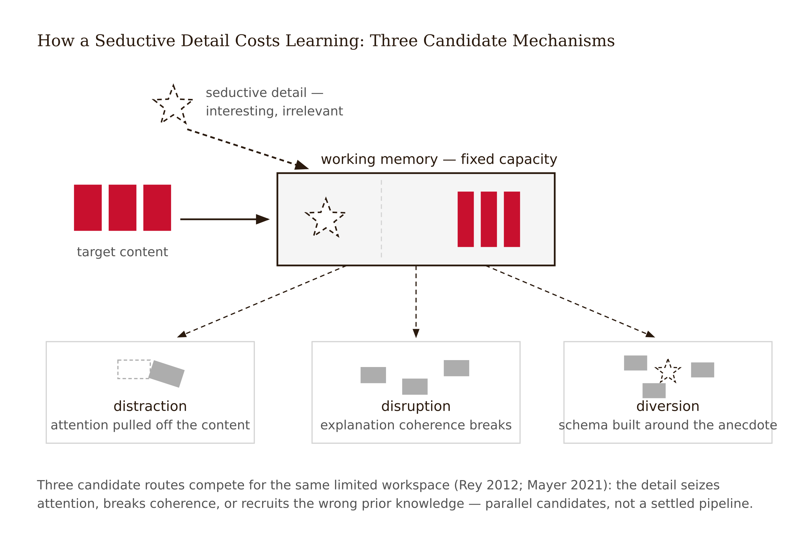
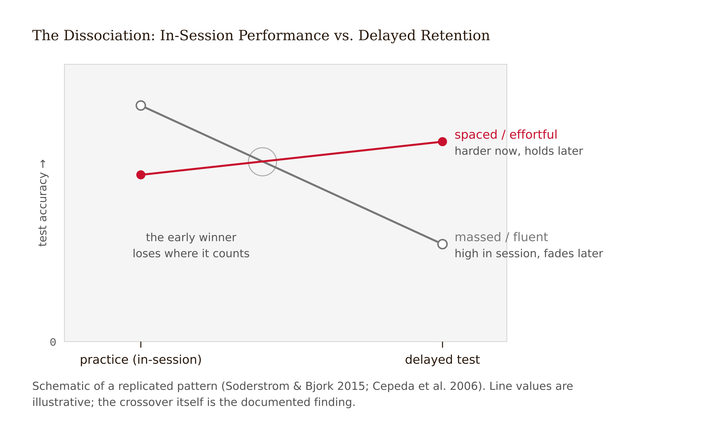
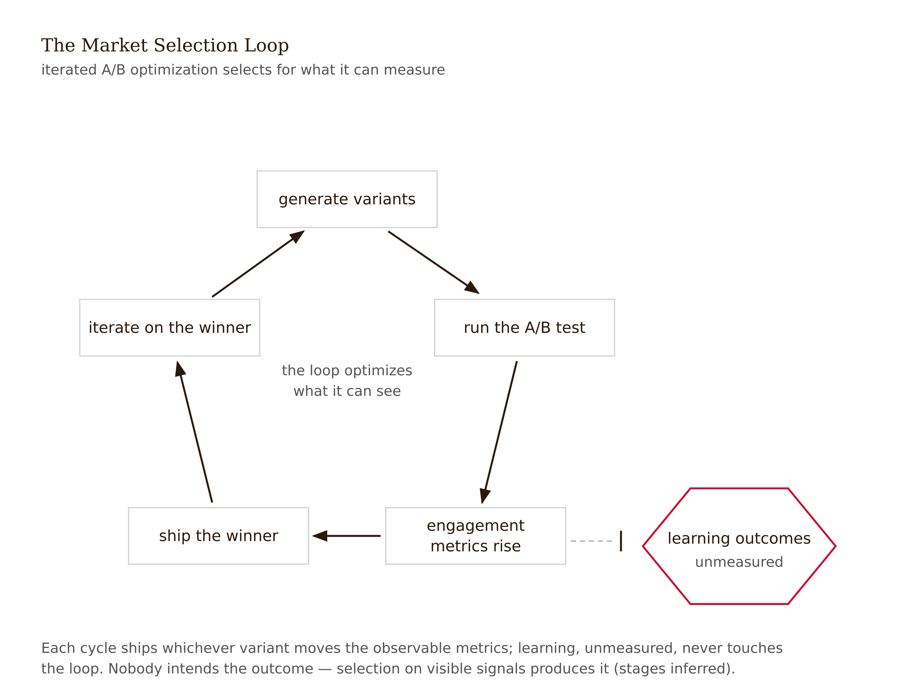
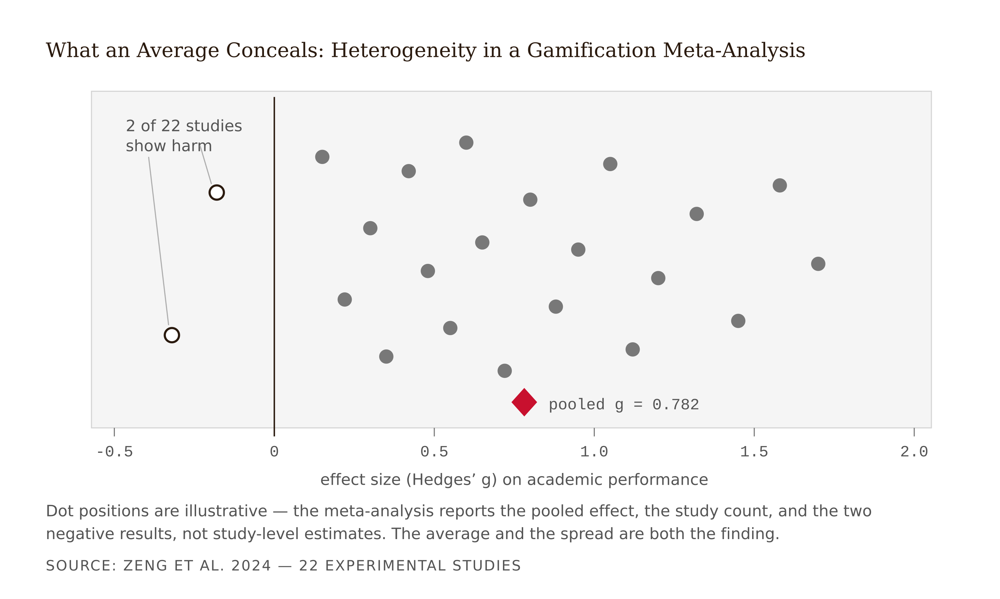

# Chapter 1 — The Engagement Trap: Why Learners Love Products That Don't Teach
*What the five-star rating actually measured — and why it isn't what you think.*

There is a learning app with a 4.8-star rating and several hundred thousand reviews. The reviews say things like "My daughter asks to practice every day" and "Finally an app that makes learning fun" and "I've kept my streak going for 214 days." The home screen has a chirpy mascot, a progress path through pastel islands, confetti when you finish a lesson. Sessions are short and frictionless. When you get something wrong, the app softens the blow, shows you the answer, and moves on. Retention of users is excellent. Retention of *content* is not measured anywhere in the product.

A design team somewhere is benchmarking this app because their own engagement numbers look anemic beside it. The brief from leadership: make ours feel like theirs. The team catalogs the mechanics — the streaks, the treasure chests, the mascot, the confetti, the micro-lessons — and starts a backlog. Nobody in the room asks the question that this book exists to ask: is there any evidence that the app's users are learning anything?

There is, in fact, evidence. And it is uncomfortable.

When researchers developed evidence-based criteria for what makes an app genuinely educational — active cognitive engagement, meaningful connection to the learner's world, social interaction, a clear learning goal — and then scored the market's most popular "educational" apps against those criteria, most of the top-rated, most-downloaded apps provided minimal learning value, and more than half scored low on basic design quality (Hirsh-Pasek et al. 2015; Meyer et al. 2021). The market's star ratings and the evidence-based ratings were measuring different things, and they came apart. The five stars measured how the experience *felt*: polished, rewarding, frictionless, kind. Real properties, all of them. None of them learning.

That would be merely interesting if it were just a gap — pleasant on one axis, neutral on the other. The harder part is that some of the pleasant features are purchased *at the cost* of learning. The app that softens the blow and reveals the answer immediately has just removed exactly the cognitive effort that would have consolidated the memory. The mascot's joke between items sounds harmless; it is a candidate seductive detail, stealing the working-memory bandwidth that the explanation needed. The short, frictionless session feels productive; it may be the enemy of the spacing schedule that actually creates durable knowledge.

None of this is visible in the rating. None of it is visible in the dashboard. The people who built the app may not know it. The learners who love the app certainly don't — they are reporting a feeling, and the feeling is accurate. It just doesn't measure what they think it measures.

---

Here is the distinction the entire book rests on, stated plainly before any apparatus is added to it: **learning is not the same thing as performance**.

Performance is what you can observe during practice — current, situation-supported accuracy. Learning is the relatively permanent change that shows up later, somewhere else. The two dissociate in both directions. Conditions that inflate performance during practice can depress learning afterward. Conditions that depress performance during practice can improve learning. This is not a theoretical possibility — it is one of the most robustly replicated findings in cognitive psychology, documented across hundreds of experiments over more than a century (Soderstrom & Bjork 2015).

The reason it matters so much for this book is that learners' own judgments about whether something is working track performance, not learning. When studying feels effective, it correlates with in-session fluency — and in-session fluency is precisely what desirable difficulty suppresses while it works. So learners who are getting the most out of a spaced retrieval practice routine feel like they are struggling and not retaining. Learners who are getting the least out of massed review and instant-answer reveals feel confident and successful. The five-star rating is structurally set up to reward the second experience over the first.

This is not a story about users being fooled. It is a story about what ratings can and cannot observe.

---

The research literature on engagement is more useful when it is broken into its actual components. The canonical decomposition distinguishes behavioral engagement — participation, time on task, completion, the things a dashboard counts — from affective engagement — interest, enjoyment, belonging, the things a survey captures — from cognitive engagement — the investment of mental effort in understanding, the thing that actually predicts learning, and the hardest of the three to observe (Fredricks, Blumenfeld & Paris 2004). A fourth dimension, academic engagement, covers participation directly tied to achievement-bearing tasks.

For teachers, this maps onto something already legible from the classroom: the difference between a student who is busy and a student who is thinking. For designers, it is the uncomfortable news that your analytics stack measures the first two dimensions almost exclusively. The clickstream cannot see cognitive engagement. Your session-length chart cannot see it. Your completion rate cannot see it.



The features that drive behavioral and affective engagement — streaks, rewards, short frictionless sessions, social pressure, progress bars, immediate positive feedback — are well understood. They work. They reliably increase time-on-task, completion, and user satisfaction. The problem is not that they fail at what they do. The problem is that what they do is not learning.

<!-- → [TABLE: Three-column comparison of behavioral, affective, and cognitive engagement — column headers: Engagement Type, What It Measures, What It Does Not Establish — rows with specific examples from app mechanics (streaks → behavioral, confetti → affective, retrieval effort → cognitive)] -->

And some of what they do actively competes with learning. This is the part that requires more care to explain, because the mechanism is not obvious.

---

A seductive detail is an interesting addition that is not necessary for the learning goal. The dramatic anecdote in the lightning lesson. The cute animation in the fractions app. The trivia sidebar. The mascot's joke between items. The term comes from the multimedia learning literature, where Richard Mayer and colleagues spent two decades demonstrating a result that still surprises designers: adding interesting-but-irrelevant material frequently reduces learning of the target content (Mayer 2021). A meta-analysis by Rey (2012) synthesized dozens of experiments and found a reliable negative effect of seductive details on both retention and transfer.

Why would interesting hurt? Three candidate mechanisms recur. Distraction: the detail captures attention the target content needed. Disruption: the detail breaks the coherence of the explanation, leaving the learner with a fragmented mental model. Diversion: the detail activates the wrong prior knowledge, so the learner organizes the material around the anecdote instead of the principle. The evidence does not yet cleanly distinguish the three. What it establishes is the direction of the effect: interesting, when misaligned with the learning target, costs something.



The design implication is a relevance discipline that runs against most product-design instincts. In consumer UX, delight is nearly free — a smooth animation, a pleasant sound, a witty microcopy moment. In learning design, misplaced delight has a measurable cost, and the learner pays it later, invisibly, on a test the designer never sees.

Delight aimed at the learning target itself — a beautiful visualization of the concept, a narrative that *is* the worked example — is not a seductive detail. It is good design. The question is always functional alignment: is this element directing attention and cognitive effort toward the thing the learner is supposed to be processing, or is it borrowing that attention for something else?

---

Now run the mechanism in reverse, because there is a symmetric problem on the other side of the enjoyment/learning gap, and it is equally counterintuitive.

Robert Bjork named these desirable difficulties — conditions of practice that make learning feel slower and harder in the moment while measurably improving long-term retention and transfer (Bjork 1994; Bjork & Bjork 2011). The word *desirable* is doing a lot of work in that phrase, and it only holds under specific conditions, which is something to come back to. But the basic finding is this: some of what works for learning feels bad.

Spacing: distributing practice over time, rather than massing it into one session, produces reliably better retention when measured later — one of the most robust findings in experimental psychology, replicated across hundreds of studies (Cepeda et al. 2006). Cramming feels productive and tests poorly. Retrieval practice: testing yourself — pulling the answer out of memory rather than reading it again — beats restudy, even when the restudy condition feels far more effective to the learner (Roediger & Karpicke 2006). In a striking demonstration, retrieval practice outperformed elaborate concept-mapping study on a delayed test, while learners predicted the opposite (Karpicke & Blunt 2011). Interleaving: mixing problem types during practice, rather than blocking by type, improves the ability to discriminate which method a problem calls for — and it reliably feels more confusing while it works (Rohrer & Taylor 2007).

The features that the evidence most strongly recommends are precisely the features that engagement metrics punish. A spaced-review schedule means the app surfaces old material when the learner wanted to move forward — friction. Retrieval before reveal means the learner has to struggle before getting the answer — friction. Interleaved practice means the session feels disorganized and harder — friction. In an A/B test optimizing for session length or completion, all three of these evidence-backed designs are likely to lose.



This is where the market's selection mechanism closes the trap. Nobody at the company set out to build a product that doesn't teach. The team ran the tests they could run, optimized for the metrics they could see, and shipped what survived. Over enough iterations, the market produces beautifully engaging products whether or not anyone intended to neglect learning — the way click-driven media produces clickbait without any journalist intending to write it. The incentive structure selects for the observable signals, and learning is the signal almost no one in the chain is paid to observe.



---

The evidence behind these claims comes in a form worth understanding directly — because for the rest of this book, and the rest of your career, vendors, papers, and colleagues will hand you numbers dressed as verdicts.

An effect size is a standardized measure of how big a difference is. The one you will meet most often, Hedges' *g*, expresses the difference between two group means in units of standard deviation — roughly, how spread out scores typically are — with a correction that keeps small samples from exaggerating results. A *g* of 0.5 means the average person in the treatment group scored half a standard deviation above the average control person. By a conventional (and often abused) heuristic, 0.2 is small, 0.5 medium, 0.8 large.

What an effect size establishes: the average magnitude and direction of a difference, in the studied populations, under the studied conditions, on the studied measures. What it does not establish: that your product, with your learners, on your outcome, will see that effect — or any effect.

The single most important word for reading meta-analyses — studies that statistically combine many individual studies — is **heterogeneity**: the degree to which those individual studies disagree with each other. An average can be moderately positive while concealing studies that found nothing and studies that found harm. The Zeng et al. (2024) meta-analysis of gamification reports a moderately positive average effect on academic performance (*g* = 0.782 across 22 experimental studies), but the exact distribution of negative findings remains a manuscript-freeze check. "Gamification works, *g* = 0.782" and "some gamification implementations may harm learning" can both be true in the same evidence base. A designer who can only repeat the first sentence is a liability.



Three more habits of effect-size hygiene, from the statistical-literacy literature (Spiegelhalter 2019; Bergstrom & West 2020): ask what was measured and *when* — an effect on an immediate quiz is a performance effect, not a learning effect; ask what the comparison was — "better than nothing" and "better than a well-taught lesson" are different claims with different effect sizes; and be skeptical of numbers that launder weak claims — the polish of a statistic is not evidence of its strength.

One benchmark you will meet constantly deserves naming now: John Hattie's *Visible Learning* synthesis aggregates meta-analyses across 252 educational influences and treats *d* = 0.40 — the average effect across all of them — as a practical hinge point for prioritization. Used carefully, the hinge is a triage tool; used carelessly, it becomes everything this section warns against — a single number standing in for judgment. And the AI era adds a question the league table was never built to answer: an influence's effect size says nothing about whether the effect survives AI delivery. Re-rank the same influences by *who performs the cognitive work* and the table splits — a question Chapter 12 takes up, and the companion volume *Visible Learning × AI* treats in full.

<!-- → [TABLE: Evidence summary for Chapter 1's core claims — columns: Finding, Source, Direction and Size, Key Limits — rows: EVER finding, seductive details, spacing, retrieval practice, interleaving, gamification heterogeneity, Bastani AI tutor finding] -->

There is one more data point worth placing here precisely because it is recent and sharp. In 2025, a randomized controlled trial — an experiment where learners are randomly assigned to conditions so outcome differences can be attributed to the intervention — found that students given access to a GPT-based tutor practiced happily with it, then scored roughly 17% worse than unassisted peers on a subsequent exam taken without AI assistance (Bastani et al. 2025). Every individual interaction felt helpful. The aggregate was damage. That is not a reason to dismiss AI tutoring; it is a reason to understand what the AI was doing to the cognitive processing that the exam later required. The chapter that treats this study in full comes later. Here it stands as the sharpest current instance of the pattern this chapter has been describing: the experience learners prefer and the experience that teaches them are not the same experience, and the market cannot tell them apart. The series this book belongs to gives that pattern a name — the Frictional principle: the struggle is the mechanism of learning, not its price (see Appendix: The Fundamental Themes).

---

The warning that closes this chapter is about the word *desirable* in desirable difficulties, because it is easy to read the preceding argument in a direction that causes its own kind of damage.

*Desirable* is a conditional, not a slogan. The same difficulty that enhances learning in a knowledgeable learner can be a design flaw for a novice. Spacing works when the learner has something in memory to space; introducing it before initial acquisition just produces confusion without consolidation. Retrieval practice requires that the learner can *attempt* retrieval — a complete blank is not a retrieval effort, it is a signal of encoding failure. Interleaving requires enough mastery of individual types that mixing them is the challenge. "It's hard, therefore it's working" is as much an engagement-trap fallacy as "they love it, therefore it's working." The mechanisms are real; applying them requires knowing where the learner actually is, not just knowing that difficulty is sometimes good.

That condition — knowing where the learner actually is — turns out to be the hard problem. The engagement signals tell you where the learner is emotionally and behaviorally. The cognitive-engagement signal, the one that actually predicts learning, is the one almost nobody has figured out how to measure at scale. The instruments exist in the research literature; they are unstandardized and labor-intensive; they have not crossed over into commercial product design in any reliable way. That gap is where much of what follows in this book lives.

For now, the thing to sit with is simpler: that the five stars measured something real, the experience was genuinely pleasant, and pleasant and effective are different axes. A learning product can score high on both. It can score high on one and low on the other. The market, as currently constituted, selects primarily on one axis and is largely blind to the other. A designer who knows this is working with a different instrument than one who doesn't. That is what this chapter was for.

---

## Exercises

**Warm-up**

1. *(Recall — engagement dimensions)* A learning app tracks these metrics: daily active users, average session length, lesson completion rate, in-session quiz accuracy, and Net Promoter Score. For each metric, name which engagement dimension — behavioral, affective, or cognitive — it most directly measures, and explain in one sentence why it is or is not evidence of learning.

2. *(Recall — learning vs. performance)* Define the learning/performance distinction in your own words without using the source text. Then give one concrete example, drawn from your own experience as a learner, of a time when your in-session performance and your later retention came apart in either direction.

**Application**

3. *(Apply — seductive details)* You are designing a module on electrical safety for new technicians. Your content team proposes opening each lesson with a dramatized account of a real workplace accident involving the concept being taught. Apply the seductive details framework: under what conditions would this be a seductive detail, and under what conditions would it be functional delight? What specific design decisions would determine which it becomes?

4. *(Apply — effect size reading)* A vendor's sales deck includes this sentence: "Independent research shows our platform improves learning outcomes with an effect size of *g* = 0.61." Write four questions you would need answered before treating that number as evidence. For each question, name the concept from this chapter it is testing (outcome timing, comparison condition, heterogeneity, or population match).

5. *(Apply — market selection)* Explain, in three to four sentences, why a company could iterate through fifty A/B tests and consistently ship decisions that reduce long-term learning — without anyone on the team intending to, and without the data ever showing it. Use the learning/performance distinction and at least one other concept from this chapter.

**Synthesis**

6. *(Synthesize — EVER evaluation)* Choose one learning app with at least 4.5 stars and a large install base. Evaluate it against the four EVER criteria: active cognitive engagement, meaningful connection to the learner's world, social interaction, and clear learning goal (Hirsh-Pasek et al. 2015). Rate each criterion pass/partial/fail with one concrete observation from the app as your warrant. Then write a two-sentence divergence statement: where does the market rating and the evidence-based rating come apart most sharply, and what does that gap reveal about what the market is selecting for?

7. *(Synthesize — desirable difficulty design)* A colleague proposes removing the "reveal answer" button from your app's flashcard feature and replacing it with forced retrieval — the learner must type a response before seeing the answer. Leadership objects that this will hurt engagement scores. Construct the argument for the change, citing the relevant evidence with effect sizes and their limits, and then honestly describe the conditions under which the colleague's proposal would fail — where forced retrieval is not a desirable difficulty but a design flaw.

**Challenge**

8. *(Challenge — heterogeneity)* The Zeng et al. (2024) meta-analysis reports *g* = 0.782 for gamification's effect on academic performance, but two of twenty-two studies found negative effects. You are advising a team about to gamify an onboarding course for a population and context quite different from the meta-analysis sample. Write the two-paragraph briefing you would give — one paragraph on what the evidence supports, one paragraph on what it cannot tell you — that would let the team make a genuinely informed decision rather than a number-laundered one.

---
## Chapter 1 Exercises: The Engagement Trap — Why Learners Love Products That Don't Teach
**Project:** The Redesign Dossier
**This chapter adds:** `dossier/01-evidence-brief.md` — an evidence brief for the learning experience you will redesign, separating what its engagement signals actually measure from what would count as evidence of learning.
---
### Exercise 1 — When to Use AI

**The judgment:** In this chapter's work, AI assistance is appropriate for the following tasks:

- Inventorying the visible engagement mechanics of your chosen experience — the streaks, progress bars, mascots, completion stats, ratings — and sorting them into behavioral, affective, and cognitive bins for your review — *Why AI works here:* this is pattern recognition against a stable taxonomy, and you can check every classification yourself because the chapter gave you the criteria.
- Drafting the skeleton of the evidence brief — sections, tables, a sources log — before you put a single claim in it — *Why AI works here:* this is reformatting and drafting; structure is cheap to verify and carries no evidential weight.
- Generating the standard interrogation questions for any effect-size claim you encounter (what was measured, when, against what comparison, in what population, with what heterogeneity) — *Why AI works here:* this is generating options from a known checklist; the questions cost nothing if wrong and you judge which ones bite.

**The tell:** You know you are using AI appropriately when you can evaluate the output — when you have independent criteria to judge whether it is correct, complete, and fit for purpose.

---
### Exercise 2 — When NOT to Use AI

**The judgment:** In this chapter's work, the following tasks belong to you, not the model — they are exactly where this chapter's evidence discipline gets built or lost:

- Summarizing "the research" on your product category and trusting the numbers it reports — *Why AI fails here:* hallucination risk in its most damaging educational form — misquoted effect sizes and fabricated studies that read exactly like real ones. A wrong *g* in your evidence brief propagates through fourteen more dossier files.
- Rendering a verdict on whether your experience actually teaches — *Why AI fails here:* missing ground truth. No delayed or transfer data exists yet, so any fluent verdict is the five-star rating in prose form — a confident report of how the experience *feels* dressed as a finding about learning.
- Classifying features as seductive details versus functional delight on its own — *Why AI fails here:* this is a criteria judgment that depends on functional alignment with a learning target you have not yet fixed. Without the objective, "is this delight aimed at the content or borrowing attention from it?" has no answer, and the model will supply one anyway.

**The tell:** You know you have crossed the line when you are using AI output as your reason for a conclusion rather than as a tool for reaching one. If you could not explain the conclusion without the AI, the AI did the work that should have been yours.

**Series connection:** Tier 4 Metacognitive — this chapter's whole skill is knowing what a signal measures: five stars measure feeling, not learning. The same skill applies to model output: fluency measures the model's training, not the truth of the citation. Knowing what each signal does and does not establish is one competence with two targets.

---
### Exercise 3 — LLM Exercise

**What you're building this chapter:** `dossier/01-evidence-brief.md` — the dossier's first file.

**Tool:** Claude (a standard chat is fine for this first file; from Chapter 2 onward you will create a Claude Project named "Redesign Dossier" to hold the growing dossier as project knowledge).

**The Prompt:**
```
I am building the first file of a Redesign Dossier: an evidence brief for a real
learning experience I am going to redesign chapter by chapter. Your job is to help me
structure and stress-test the brief — not to supply evidence for me.

THE EXPERIENCE: I will describe it here — what it is, who the learners are, what it
claims to teach, and every engagement signal I can observe (ratings, reviews, streaks,
completion stats, dashboards, satisfaction scores). If I have left out anything you
need, ask me before proceeding.

ONE EVIDENCE CLAIM I FOUND: a quantitative or evidence-flavored claim from the
product's marketing, an app-store page, a review, or a paper — pasted here with its
source.

MY OWN READ OF THAT CLAIM, written before this conversation: what I think the number
actually measured (outcome, timing, comparison group), and what I think it does NOT
establish.

YOUR TASK, in order:
1. Find the single weakest point in MY read of the claim and press me on it with one
   question. Wait for my answer before continuing. Then ask, one at a time, any
   standard effect-size questions I missed (outcome timing, comparison condition,
   heterogeneity, measure validity, population match) — as questions I must answer,
   not answers you provide.
2. Classify every engagement signal I listed as behavioral, affective, or cognitive
   engagement. For each, propose the classification plus one sentence on what that
   signal does NOT establish about learning — then ask me to confirm or correct each.
3. List the features that are candidate seductive details and candidate desirable
   difficulties. Label every single one "HYPOTHESIS — cannot be judged until the
   learning objective is fixed," because functional alignment depends on a learning
   target we have not established yet.
4. Draft the brief as a markdown file named 01-evidence-brief.md with these sections:
   Experience Snapshot; Engagement Signal Inventory (table: Signal, Dimension, What It
   Establishes, What It Does Not Establish); Evidence Claims Log (the claim, my read,
   your challenges, and my final judgment — which I will write, not you); Candidate
   Seductive Details and Desirable Difficulties (all marked HYPOTHESIS); Sources Log.
5. Sources Log rules: every study, statistic, or effect size appearing anywhere in
   this brief is listed with status VERIFIED BY ME (I have seen the primary source) or
   UNVERIFIED — DO NOT CITE. You may not invent studies, authors, journals, or effect
   sizes. Anything you recall from training enters as UNVERIFIED until I check it. If
   you are unsure a source exists, say so explicitly.
6. Do not render a verdict on whether this experience teaches. The brief documents
   what the signals measure; the verdict requires delayed and transfer data that does
   not exist yet.
```

**What this produces:** A complete first draft of `dossier/01-evidence-brief.md`: a signal inventory classified by engagement dimension, an interrogated evidence claim with your final judgment, a hypothesis list for later chapters, and a sources log in which every citation carries a verification status.

**How to adapt this prompt:**
- *For your own project:* the structure is domain-agnostic — a compliance course's signals are completion rates and post-course surveys; a classroom's are attendance and participation grades; a CFA-prep product's are streaks and mock-exam scores. Only the signal list changes; the inventory columns do not.
- *For ChatGPT / Gemini:* both tend to barrel through the numbered steps instead of waiting for your replies — if that happens, respond "Stop. Step 1 only, then wait." Gemini often attaches web citations with links; those still enter the Sources Log as UNVERIFIED until you have clicked through and read the primary source.
- *For a Claude Project:* once you create the "Redesign Dossier" project in Chapter 2, move rules 5 and 6 (the sources-log discipline and the no-verdict rule) into the project's custom instructions so they govern every future conversation; the message then carries only your experience description and claim.

**Connection to previous chapters:** This is the dossier's first file.

**Preview of next chapter:** Chapter 2 turns the profiled experience into a formal commitment — `dossier/02-project-charter.md`, where you select the experience for the whole book and write the optimization-target statement no neighboring discipline would sign.

---
### Exercise 4 — CLI Exercise

**What you're building this chapter:** The `dossier/` directory scaffold — a fifteen-file map plus the evidence-brief template with a verification-disciplined sources log.

**Tool:** Claude Code (Cowork works identically if you prefer not to use a terminal) — this is file scaffolding, the simplest thing an agentic tool does well.

**Skill level:** Beginner — your first terminal exercise; it only creates new files and is instructed to stop rather than overwrite.

**Setup:**
- [ ] Claude Code installed and running in an empty project folder (or Cowork connected to one)
- [ ] No prior dossier files required — this is file one
- [ ] Suggested CLAUDE.md line added (see note below) so the no-invented-sources rule exists before any content does

**The Task:**
```
Create a directory named dossier/ in this project. Inside it, create exactly two files
and nothing else.

1. dossier/README.md — a map of the Redesign Dossier listing all fifteen planned files
   with a one-line description each: 01-evidence-brief.md, 02-project-charter.md,
   03-load-audit.md, 04-motivation-audit.md, 05-learner-research.md, 06-journey-map.md,
   07-codesign-record.md, 08-prototype-test-report.md, 09-variability-audit.md,
   10-motivation-decision.md, 11-modality-decision.md, 12-ai-integration-decision.md,
   13-measurement-plan.md, 14-evaluation.md, 15-portfolio.md. Mark every file except 01
   as "not yet started."

2. dossier/01-evidence-brief.md — an empty template with these headed sections:
   Experience Snapshot; Engagement Signal Inventory (markdown table with columns:
   Signal, Engagement Dimension (behavioral/affective/cognitive), What It Establishes,
   What It Does Not Establish); Evidence Claims Log; Candidate Seductive Details and
   Desirable Difficulties (with a standing note that every entry is a hypothesis until
   the learning objective is fixed in chapter 3); Sources Log (table with columns:
   Source, Claim It Supports, Status — where Status permits exactly two values:
   "VERIFIED BY ME" or "UNVERIFIED — DO NOT CITE").

Leave the template sections empty — no example content, no sample citations, no
placeholder studies. Do not create any other files or directories. Do not overwrite
anything: if dossier/ or either file already exists, stop and tell me instead. When
done, list the files you created and print the Sources Log table so I can verify the
two-status rule made it in.
```

**Expected output:** A `dossier/` directory containing `README.md` (the fifteen-file map) and `01-evidence-brief.md` (the empty template), plus a printed listing and the sources-log header for verification.

**What to inspect in the output:**
- The README contains all fifteen canonical filenames, spelled exactly — these names are load-bearing for the rest of the book.
- The Sources Log status column permits only the two allowed values — this is the chapter's anti-fabrication discipline made structural.
- The signal-inventory table keeps "What It Establishes" and "What It Does Not Establish" as separate columns — the chapter's core distinction, baked into the template so you cannot fill one without confronting the other.

**If it goes wrong:** The most likely failure is helpfulness: the model pre-fills the template with example rows, including plausible example citations. Do not leave them in, even labeled as examples — an unverified sample citation in a template is exactly how fabricated sources survive into final portfolios. Ask it to strip all example content and re-print the file, then re-check the Sources Log is empty.

**CLAUDE.md / AGENTS.md note:** Add: *"This project builds a Redesign Dossier. Never invent sources. Every evidence claim in any dossier file needs either a citation marked VERIFIED BY ME or an explicit verification-needed flag — no third state exists."*

---
### Exercise 5 — AI Validation Exercise

**What you're validating:** A pre-generated AI "evidence summary" of the kind Exercise 2 warned you against commissioning — provided here deliberately, so you practice catching fabrication on an artifact with known errors before you trust your own outputs.

**Validation type:** Factual claim.

**Risk level:** High — the evidence brief is the dossier's foundation; a fabricated citation accepted here gets repeated in thirteen more files and, eventually, in front of stakeholders with your name on it.

**Setup:** Option (b) — validate the artifact below, not your own output, because this chapter's lesson requires a specific failure mode: fluent prose containing planted errors. Validate it using only this chapter and whatever primary sources you can actually retrieve. An answer key follows the task — do not read it first.

> **AI-generated evidence summary (validate before trusting):**
> Research consistently supports retrieval practice: Roediger and Karpicke (2006) showed that self-testing beats restudying for delayed retention, and Karpicke and Blunt (2011) found that elaborate concept mapping outperformed retrieval practice on delayed tests of meaningful learning. For gamification, Zeng et al. (2024) meta-analyzed 22 experimental studies and found a large, consistent positive effect on academic performance (*g* = 1.28), confirming that game mechanics reliably improve learning across contexts. Streak mechanics have direct support: Hartman and Liu (2019), in the *Journal of Digital Pedagogy*, found that daily-streak features improved 30-day content retention by 23% in a sample of 1,400 language learners. On the cost side, Rey (2012) meta-analyzed the seductive-details literature and found a reliable negative effect of interesting-but-irrelevant additions on retention and transfer.

**The Validation Task:** Work claim by claim. For each of the four:
- [ ] **Correctness** — does the cited study exist, and does it say what the summary says? Check each against this chapter; for any study the chapter does not cover, try to retrieve it. A citation you cannot find is not "probably fine."
- [ ] **Completeness** — does the summary disclose what the studies' averages conceal? Where is the heterogeneity?
- [ ] **Scope** — do the claims generalize beyond the studied populations and conditions, and does the summary's language ("reliably," "across contexts") match what the evidence licenses?
- [ ] **Effect-size hygiene (chapter-specific)** — for every number: what was measured, *when* (immediate performance or delayed learning?), and against what comparison?
- [ ] **Heterogeneity disclosure (chapter-specific)** — does any reported average hide studies that found nothing or found harm? What word would the summary need to contain for you to trust it?
- [ ] **Failure mode check** — fluent-but-wrong: which sentence reads most authoritatively, and is its confidence correlated with its accuracy? Fabrication: can you locate every journal and author? Missing ground truth: does any claim about "learning" rest on a measure taken during or immediately after practice?

**Answer key (read only after finishing):** Two claims are sound (Roediger & Karpicke 2006; Rey 2012). The Karpicke & Blunt (2011) finding is inverted — retrieval practice beat concept mapping, not the reverse. The Zeng et al. (2024) effect size is misquoted (*g* = 0.782, not 1.28) and "consistent" launders the heterogeneity — two of the twenty-two studies found negative effects. Hartman and Liu (2019) and the *Journal of Digital Pedagogy* do not exist. If you caught the fabrication but missed the inversion, note which check would have caught it: the inversion is only visible if you verify what a real study *found*, not just that it exists.

**What to do with your findings:** This artifact fails multiple checks by design — that is the calibration. From now on: an AI evidence summary that passes all checks may enter your dossier with sources marked VERIFIED BY ME; one failed check means revise, re-verify, re-run; multiple fails means you are in "When NOT to Use AI" territory — go to the primary sources yourself and write the summary by hand. Apply this exact protocol to your own Exercise 3 output before the brief is final.

**AI Use Disclosure prompt:** Every dossier file from here forward closes with a two-sentence disclosure. Sentence one: what AI produced and how you used it. Sentence two: one specific thing AI could not determine that required your judgment. For this chapter's brief, for example: *"AI drafted the brief's structure and proposed the signal classifications; I verified every citation against primary sources and wrote all final judgments myself. AI could not determine whether any signal in this experience constitutes evidence of learning rather than engagement — that required applying the learning/performance distinction to a product it cannot observe."*

**Series connection:** This exercise trains fabrication detection — the validation failure mode where fluency masquerades as evidential strength. Tier 4 Metacognitive: the five-star rating and the confident AI summary are the same trap at different scales, and the same question disarms both — *what did this signal actually measure?*

---

## References

*Added by fact-check pass (2026-06-07). All entries below were verified against primary or authoritative sources; see `factchecks/01-the-engagement-trap-why-learners-love-products-that-dont-teach-assertions.md` for findings.*

1. Hirsh-Pasek, K., Zosh, J. M., Golinkoff, R. M., Gray, J. H., Robb, M. B., & Kaufman, J. Putting Education in "Educational" Apps: Lessons From the Science of Learning. Psychological Science in the Public Interest, 2015. https://pubmed.ncbi.nlm.nih.gov/25985468/
2. Meyer, M., Zosh, J. M., McLaren, C., Robb, M., McCafferty, H., Golinkoff, R. M., Hirsh-Pasek, K., & Radesky, J. How educational are "educational" apps for young children? App store content analysis using the Four Pillars of Learning framework. Journal of Children and Media, 2021. https://pubmed.ncbi.nlm.nih.gov/35282402/
3. Soderstrom, N. C., & Bjork, R. A. Learning versus performance: An integrative review. Perspectives on Psychological Science, 2015. https://journals.sagepub.com/doi/abs/10.1177/1745691615569000
4. Fredricks, J. A., Blumenfeld, P. C., & Paris, A. H. School Engagement: Potential of the Concept, State of the Evidence. Review of Educational Research, 2004. https://journals.sagepub.com/doi/10.3102/00346543074001059
5. Mayer, R. E. Multimedia Learning (3rd ed.). Cambridge University Press, 2021. https://www.cambridge.org/highereducation/books/multimedia-learning/FB7E79A165D24D47CEACEB4D2C426ECD
6. Rey, G. D. A review of research and a meta-analysis of the seductive detail effect. Educational Research Review, 2012. https://www.sciencedirect.com/science/article/abs/pii/S1747938X12000413
7. Cepeda, N. J., Pashler, H., Vul, E., Wixted, J. T., & Rohrer, D. Distributed practice in verbal recall tasks: A review and quantitative synthesis. Psychological Bulletin, 2006. https://pubmed.ncbi.nlm.nih.gov/16719566/
8. Roediger, H. L., & Karpicke, J. D. Test-enhanced learning: Taking memory tests improves long-term retention. Psychological Science, 2006. https://journals.sagepub.com/doi/10.1111/j.1467-9280.2006.01693.x
9. Karpicke, J. D., & Blunt, J. R. Retrieval Practice Produces More Learning than Elaborative Studying with Concept Mapping. Science, 2011. https://www.science.org/doi/10.1126/science.1199327
10. Rohrer, D., & Taylor, K. The shuffling of mathematics problems improves learning. Instructional Science, 2007. http://uweb.cas.usf.edu/~drohrer/pdfs/Rohrer&Taylor2007IS.pdf
11. Zeng, J., Sun, D., Looi, C.-K., & Fan, A. C. W. Exploring the impact of gamification on students' academic performance: A comprehensive meta-analysis of studies from the year 2008 to 2023. British Journal of Educational Technology, 2024. https://doi.org/10.1111/bjet.13471
12. Bastani, H., Bastani, O., Sungu, A., Ge, H., Kabakcı, Ö., & Mariman, R. Generative AI without guardrails can harm learning: Evidence from high school mathematics. PNAS, 2025. https://www.pnas.org/doi/10.1073/pnas.2422633122
13. Hattie, J. Hattie Ranking: 252 Influences And Effect Sizes Related To Student Achievement. Visible Learning, 2018. https://visible-learning.org/hattie-ranking-influences-effect-sizes-learning-achievement/
