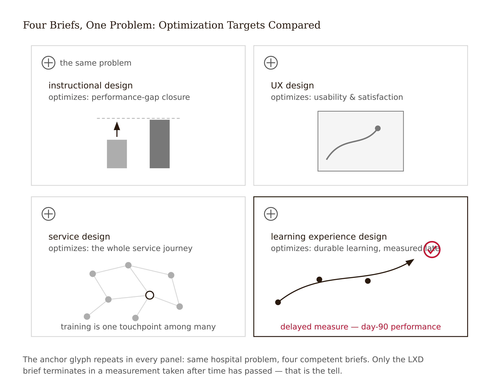
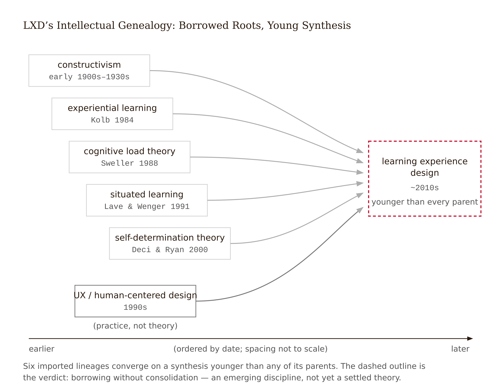
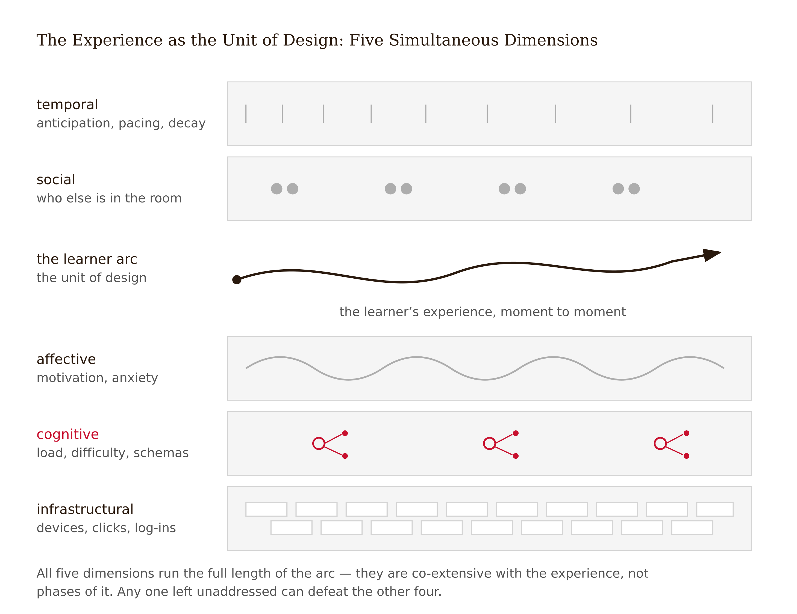
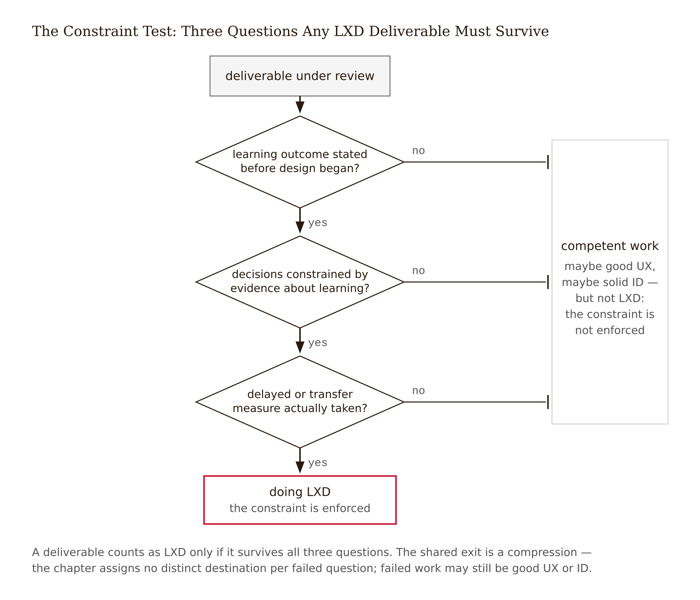
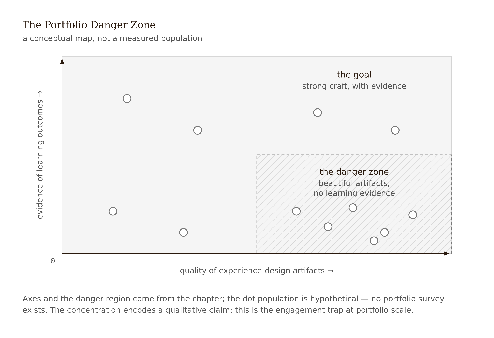

# Chapter 2 — Learning Experience Design: The Discipline and Its Borders
*Where the design ends and the learning begins — and why the line is harder to draw than it looks.*

Four designers walk into a hospital. No, really — sit with this for a moment, because it is one of the cleanest thought experiments in the field and it is going to do a lot of work in this chapter.

A regional hospital network has a problem: new nurses are making medication-administration errors in their first ninety days. The existing training — a four-hour slide deck with a quiz — is despised and demonstrably not working. In a fit of methodological honesty, the consultancy running the project assigns discovery to four designers from four different traditions and asks each for a one-page brief.

The instructional designer opens with a performance gap analysis. The errors cluster in three task types. The training objectives don't match them. Fix that alignment — task-analyzed objectives, sequenced modules, practice items, a criterion-referenced assessment — and you've fixed the problem. The brief is rigorous about what must be learned and nearly silent about what it is like to be a terrified new nurse at hour eleven of a twelve-hour shift.

The UX designer opens with usability findings. The training portal is six clicks from the scheduling app nurses actually live in. The quiz interface breaks on their phones. Search doesn't surface the medication protocol at the moment it's needed. Fix the artifact — redesign the interface, validated by task-completion testing — and you've fixed the problem. The brief is rigorous about the artifact and nearly silent about whether anyone learns anything from it.

The service designer barely mentions the training. The brief maps the medication-administration *service*: the pharmacy's labeling process, the interruptions at the med cart, the preceptor's role, the culture of not asking questions. The training is one touchpoint among nineteen. Fix the system and the training problem largely solves itself. The brief is rigorous about the whole and treats learning as one lever it may or may not pull.

The fourth designer — the one this book is about — opens with three days of shadowing and interviews. The brief describes the first-ninety-days arc as the new nurse *lives* it: pre-arrival anxiety, the firehose week, the moment around week six when questions start feeling too embarrassing to ask. The deliverable is a redesigned *experience* across that arc — spaced micro-practice tied to actual shift moments, a structured question channel that removes the embarrassment tax, just-in-time protocol access. And then — this is the tell — a proposed measurement: error rates and a delayed scenario assessment at day ninety, because this designer knows that satisfaction scores will not answer the question the hospital is actually asking.

Four competent briefs. Four different deliverables. One product.

Then a fifth consultant arrives, uninvited by the original design of the thought experiment but unavoidable in the year the hospital actually runs it: a product manager from an AI company. This brief opens with a demo. A GPT-based advisor answers nurse questions in natural language — about dosages, protocols, interactions — twenty-four hours a day, infinitely patient, never embarrassing to ask. The brief proposes replacing the training module entirely with the advisor. Usage metrics from a pilot at another hospital are strong: high adoption, high satisfaction, thousands of questions answered. There is no outcome data in the brief — no error rates, no delayed assessment, no measure of what nurses can do when the system is down. The LXD brief is the only one in the room that knows how to evaluate the fifth brief, because it is the only one that asks what nurses can do in week thirteen without the system open.

<!-- → [TABLE: side-by-side comparison of the four briefs — columns: designer type, opening move, deliverable, what it optimizes for, what it cannot see; caption: The same problem statement produces four different design commitments. The learning experience design brief is distinguished not by its methods but by what it accepts as the success criterion.] -->

Now here is the question the chapter is going to answer honestly rather than defensively: is that fourth brief a *discipline* — with its own question, methods, and standards — or is it just the first brief with empathy, the second with content, and the third with homework? The uncomfortable answer is more interesting than either camp wants it to be.

---

The field calls itself Learning Experience Design, and its academic synthesis is younger than some of the practitioners teaching it. Jahnke and colleagues frame LXD as the integration of three dimensions — sociocultural (who the learner is, with whom, in what context), pedagogical (how the learning is structured), and technological (through what medium) — arguing that designs fail when any dimension is treated as an afterthought (Jahnke et al. 2021). McDonald and Westerberg (2023) offer the formulation I find most defensible: LXD is an *orienting guide* — it helps designers influence human learning by combining evidence about how people learn with human-centered design methods. Note the modesty of "orienting guide." Not a theory. Not a settled method. A stance. Niels Floor, whose *This is Learning Experience Design* (2023) is the field's practitioner canon, places it at the intersection of design disciplines and learning sciences and foregrounds human-centered, goal-oriented, iterative design over the linear develop-and-deliver models that instructional design became associated with in practice.

What the synthesis does *not* include is its own original theory. LXD's theoretical pillars — constructivism, experiential learning (Kolb 1984), situated learning (Lave & Wenger 1991), cognitive load theory (Sweller 1988), self-determination theory (Deci & Ryan 2000) — are all imported. The field's literature suggests growth by borrowing from UX, instructional design, educational technology, and the learning sciences rather than by consolidating around a canonical theory of its own; the stronger bibliometric version of that claim remains a manuscript-freeze check.
Whether that is damning or normal for a young applied field is the question this chapter is actually trying to answer.

The cleanest way to locate LXD is not to describe it from the inside but to read what each neighboring field *optimizes for*. Methods travel freely across disciplinary borders — journey maps, personas, formative evaluation, learner analysis appear in all four traditions. What does not travel is the optimization target: the thing the design ultimately maximizes, and is willing to trade other goods to get.

Instructional design optimizes for *performance efficiency* — closing a defined gap between what learners can do now and what the organization needs them to do. Its institutional formation runs through military training, ADDIE, Dick and Carey, and a long tradition of writing measurable objectives before touching a single instructional decision. UX design optimizes for *satisfaction and usability* — "user experience" itself is a designed term, coined in the 1990s by Don Norman to name everything beyond the interface. Service design optimizes for *systemic experience quality* — its blueprinting method (Stickdorn et al. 2018) maps frontstage and backstage actors, treating the whole service as the unit of analysis. LXD claims to optimize for something none of the others will accept as *the* constraint: *learning*, specifically durable learning, with motivation and usability as supporting variables rather than the goal.

One more optimization target now belongs in this comparison, because it is the one increasingly delivering education at scale. AI-native delivery design optimizes for engagement, retention, and daily active use — with satisfaction and completion as primary evidence claims. What it cannot see: whether the intervention produces capability the learner retains without the system. This is not a critique of the people building these products. Google's own engineers have documented that frontier models default to delivering answers rather than supporting learning — and that pedagogical alignment requires deliberate, separate engineering work. Most products never do that work.



That last distinction is the one you need to hold onto, because it is also the source of the field's most serious critique.

---

The critique, stated most pointedly in practitioner discourse, runs: *LXD is instructional design with better branding*. Every definition of LXD emphasizing human-centeredness, iteration, and empirical testing describes what good instructional design has always been. Dick and Carey's model includes learner analysis and formative evaluation. ADDIE, done honestly, is iterative. On this view, LXD is what happens when instructional designers need to escape the compliance-training connotations of their job title, and the "new discipline" is a marketing artifact with a Medium following.

Parts of this critique are simply true. The methods are not new. Learner analysis predates personas. Formative evaluation predates prototyping sprints. Nothing in the LXD canon improves on Sweller or Bjork — it cites them, exactly as ID does. The title inflation is real: employers use the labels interchangeably, and salary data for the two titles overlap almost completely. And the failure mode the critique warns against is common: portfolios full of empathy maps and delight language with no learning outcome anywhere in them — experience design *minus* the constraint.

What the critique misses, on the best current evidence, is that the *centers of gravity* genuinely differ. ID's institutional formation — performance gaps, objectives, efficiency — produces practitioners optimized for alignment; the experience-design lineage produces practitioners who instinctively map journeys, prototype early, and treat emotion and context as design material rather than noise. The literature cuts both ways: LXD has no canonical theory of its own (point to the critics), but it also shows a distinct, growing, cross-citing conversation with its own venues, programs, and research questions — institutionalizing whether or not it is theoretically original. Disciplines have been founded on less. UX itself was "just" human factors with better branding for a decade before anyone conceded otherwise. The 2025 Springer volume *Transdisciplinary Learning Experience Design* is among the first edited academic collections treating LXD as canonical — not proof of distinctiveness, but evidence that the institutional machinery is running.

The question of whether LXD is a discipline is, in part, *not settleable by evidence*, because "is X a discipline" is a sociological fact that hasn't finished happening. What would settle the empirical piece: whether LXD-trained and ID-trained designers, given the same brief, produce measurably different processes, artifacts, or — the question that would actually matter — learning outcomes. I am aware of no direct comparative study; because that is a negative-existence claim, it remains a manuscript-freeze check rather than a settled fact. If you are still in this field in ten years, you may be the one who runs it.

My position, stated once and enforced everywhere in this book: **an emerging discipline, borrowing without consolidation**. The honest answer. The only answer the evidence permits.



---

The most defensible *positive* claim of LXD is about scope. The unit of design is the **experience** — temporal, social, affective, cognitive, and infrastructural — not the content, the artifact, or the session.

Each of those adjectives picks out something a content outline cannot see. *Temporal* means learning happens across an arc. The syllabus shows week three; the experience contains the Sunday-night dread of week three — the anxiety that narrows working memory before the learner opens the module. *Social* means the preceptor, the cohort, the embarrassment tax on asking questions. Situated learning theory (Lave & Wenger 1991) holds that this is not the context of the learning but part of its substance — knowing is inseparable from doing, and doing is inseparable from the community of practice in which it happens. *Affective* means motivation decays on a schedule, and anxiety trades cognitive resources that belong to the learning task; Chapter 4 makes both of these designable rather than just regrettable. *Cognitive* is the load and difficulty machinery of Chapter 3. *Infrastructural* is the six clicks from the scheduling app and the phone the quiz breaks on.



This is the scope that justifies the existence of the discipline. An instructional designer working at the level of the objective cannot see the Sunday-night dread. A UX designer working at the level of the interface cannot see the community-of-practice dynamic that makes asking questions feel dangerous. A service designer working at the level of the system blueprint can see both but has no particular stake in whether the learning sticks. The LXD frame is the one that *requires* all of these to be simultaneously in the design conversation, because any of them — unaddressed — can defeat the others.

But here is the danger, and the reason I wrote this book rather than just assigning Floor: an experience-first frame with no evidence discipline degrades into **vibe design** — optimizing the feel of the journey, precisely the variable that Chapter 1 showed the market already over-rewards and that learners cannot use to judge their own learning. The seductive-details and desirable-difficulties literatures are standing proof that experience quality and learning quality can be traded against each other without anyone noticing, including the designers. Cognitive load research keeps discovering that lessons optimized for clarity and smoothness are often worse for learning than lessons that feel difficult, confusing, and effortful. The learner who reports a great experience may have learned nothing durable. The learner who reports a frustrating one may have learned everything that mattered.

So the book's definition adds the spine explicitly. LXD is experience design under a **falsifiable learning constraint**: every major design decision is an empirical claim about what these learners will durably gain, and the design is not done until the claim is checked or honestly labeled as unchecked.

That last clause is the book's grading mechanic, defined here formally. The **Evidence Disclosure**, attached to every studio assignment from Week 5 forward, names which design decisions are *evidence-grounded* (the literature constrains them), which are *research-grounded* (your own learner data supports them), and which are *assumptions awaiting measurement*. It exists because the alternative — implying that everything is evidence-based — is the portfolio that claims delight and shows no outcomes, dressed in better vocabulary than it deserves.

<!-- → [TABLE: Evidence Disclosure structure — three columns: decision type, definition, example from the hospital case; caption: The Evidence Disclosure is not a confession of weakness. It is a precision instrument. A design with three evidence-grounded decisions and five labeled assumptions is more trustworthy than one that claims everything is research-based.] -->

---

Now I want to return to the hospital and run the constraint test — three questions that any LXD deliverable should survive — because the test is more useful as a diagnostic than as a hiring filter, and I want you to have it before the studio work begins.



First question: *what was the intended learning outcome, stated before design began?* This question is devastating in practice. Not "what does the training cover" — what specific thing should the learner be able to do, in what context, at what level of proficiency, and when? The most common answer, when you press the people who commissioned or built the learning experience, is silence followed by something like "they should understand the material." That is not a learning outcome; it is an aspiration. Writing "no outcome was specified before design began" in your studio profile is not a failure — it is the assignment. Most real experiences, if they are honest with themselves, would write that sentence.

Second question: *which design decisions were constrained by evidence about learning?* Not "which features were inspired by design principles" and not "which choices felt right" — which decisions would have come out differently if the designer had read Bjork's work on desirable difficulties, or Cepeda's work on spacing, or Sweller's work on load? If the answer is "the spacing between practice items was reduced because learners complained it felt hard" — that is not an evidence-constrained decision; that is a satisfaction-constrained one. The distinction matters and most portfolios cannot make it, because they lack the disclosure habit.

Third question: *what would you measure to know if it worked, and did you?* Satisfaction and completion are the most common answers, and Chapter 1 already settled why they are insufficient. The question is whether there is any delayed measure — tested after the forgetting curve has done its work — or any transfer measure — tested in a context different from the one in which the learning happened. On content where transfer is the point (medication administration, surgery, driving), the absence of a transfer measure is not a methodological gap; it is a disciplinary abdication.

A portfolio that survives all three questions is doing LXD. A portfolio that fails all three is doing something — maybe good UX, maybe solid ID — but it is not enforcing the constraint that justifies the discipline's existence.



---

The studio project is the mechanism by which this chapter becomes operational rather than conceptual. By the end of this week you select the learning experience you will carry through the next thirteen weeks — researching it, mapping it, co-designing it, prototyping a redesigned segment, auditing it, instrumenting it, evaluating it, and assembling the portfolio. Skip a week and Week 15 has a hole shaped exactly like it.

Track B is the recommended path: a course you teach or took, a product you work on or use, a training you can reach — with access to three to five real learners by Week 5, not personas, not memories, people you can interview. Track A is always available: the instructor's statistics course, with provided learner data, the case the worked examples in Acts Two and Three build on. You may switch once, at the Week 8 checkpoint.

The profile — ungraded, required for Week 5 — is one page. The experience described *as an experience*: learner, context, arc, infrastructure, the social and affective texture, not just the content. The intended learning outcome as its owners actually state it, quoted directly; the vagueness is data. The current evidence of effectiveness, classified with Chapter 1's vocabulary — which engagement dimension does each existing metric measure, and is there any delayed or transfer evidence at all. And one sentence: why this experience deserves fifteen weeks.

The most common failure: choosing a content area instead of a specific, reachable experience. "Something about onboarding" is not a studio project. "My company's day-one-to-day-thirty engineering onboarding, whose owner has agreed to talk to me" is one.

Write "none" in the current evidence section if that is the truth. It is a passing answer. A satisfaction score described as learning evidence is not.

---

Here is what I want you to hold from this chapter as you begin the studio work.

LXD's claim to exist as a distinct practice rests on a single thing: the willingness to treat learning — durable, transferable, measurable — as the constraint that the design must satisfy, not as one among several competing values that gets traded away when stakeholders push back. Every other distinguishing feature of the field — the journey maps, the prototyping, the experience-first scope — is borrowed methodology that is genuinely useful and genuinely shared with neighboring disciplines. The constraint is the thing that is not shared. ID will sometimes trade learning for efficiency. UX will sometimes trade learning for satisfaction. Service design will sometimes not think about learning at all.

LXD, done right, will not make those trades without naming them. That is its discipline. That is also, when you survey the portfolios in the field honestly, its most frequent failure.

The bibliometric finding — that LXD borrows without consolidating — is not a temporary embarrassment that the field will eventually grow out of. It is the permanent condition of applied design disciplines. Engineering borrowed all its physics and nobody minds. What matters is whether the borrowing is disciplined: whether the practitioners who reach for Sweller know what cognitive load theory actually predicts, whether the ones who reach for Lave and Wenger know what situated learning theory actually implies for the design of practice, whether the ones who run empathy mapping sessions know what the resulting data can and cannot tell them about durable learning.

That is the question the next thirteen weeks will answer about your own practice. Not whether you are an LXD designer or an ID designer or a UX designer — those categories will continue to blur in the market regardless — but whether you have the evidence discipline to enforce the constraint.

The constraint is the thing. Chapter 3 opens with the cognitive architecture: load, difficulty, and what "durable learning" actually means at the level of the machinery. A redesign that made a lesson smoother, prettier, easier, and worse is waiting there as the opening example.

---

## Exercises

**Warm-up**

1. *(Understand / classify)* Write one sentence each for the instructional design brief, the UX brief, the service design brief, and the LXD brief in the hospital case, naming the optimization target. Then identify which brief's question is *least represented* in the experience you have chosen for your studio project. *What this tests: your ability to classify design work by optimization target rather than by method or artifact.*

2. *(Understand / recall)* The Evidence Disclosure classifies design decisions into three categories. Name and define each, and give one example of each from the hospital case — one decision the fourth designer might label evidence-grounded, one research-grounded, and one assumption awaiting measurement. *What this tests: whether you have internalized the disclosure structure before it becomes a graded artifact.*

3. *(Understand / apply)* Look at the three constraint-test questions in the chapter. Apply all three to one learning experience you know well — not your studio project, a different one. What does the test reveal? *What this tests: facility with the diagnostic before using it on your own work.*

**Application**

4. *(Apply / analyze)* A colleague shows you a portfolio that includes an empathy map, a learner journey map, a before/after interface comparison, and a closing metric: "learner satisfaction rose from 3.1 to 4.6 out of 5." Using Chapter 1's vocabulary and this chapter's four-field table, identify which field's success criterion has been met and write the one-sentence question that names what is missing. *What this tests: ability to classify real portfolio evidence, not just describe the framework.*

5. *(Apply / produce)* A skeptical stakeholder says the LXD brief for the hospital project is "just instructional design with better empathy." Write three sentences in response: one that grants what is true in the critique, one that states the optimization-target distinction, and one that names the evidence that would settle the disagreement. Do not be defensive. *What this tests: ability to argue both sides of the rebranding debate with precision rather than tribal loyalty.*

6. *(Apply / produce — the gate)* Write your one-page studio project profile: the experience as an experience (learner, context, arc, infrastructure, social and affective texture); the intended learning outcome as its owners state it, quoted directly; the current evidence of effectiveness classified with Chapter 1's vocabulary; one sentence on why this experience deserves fifteen weeks. If Track B, confirm your access to three to five real learners. If Track A, profile the statistics course and name one assumption about its learners you expect the provided data to overturn. *What this tests: ability to describe a learning experience at the level of experience rather than content outline — and to write "none" honestly when the evidence is not there.*

**Synthesis**

7. *(Synthesize / evaluate)* The chapter claims that "vibe design" — experience design without the learning constraint — is the characteristic failure mode of LXD. A classmate argues that this is unfair: the constraint cannot be enforced when you don't have access to outcome data, and most practitioners don't. Respond to the classmate's argument: where is it right, where is it wrong, and what does it imply for how you should label design decisions you cannot yet measure? *What this tests: whether you can hold the tension between the ideal and the institutional reality without collapsing into either cynicism or wishful thinking.*

8. *(Synthesize / design)* The hospital network decides to hire one designer for the project, not four. The job description lists methods from all four traditions — learner analysis, usability testing, service blueprinting, journey mapping. Write a one-paragraph argument for why the primary optimization target of the role should be LXD's rather than one of the others', and name the one deliverable that would be missing from the project if it were not. *What this tests: ability to use the optimization-target distinction as a practical design argument, not just a theoretical classification.*

**Challenge**

9. *(Challenge / open-ended)* The chapter says the disciplinary question — "is LXD a real discipline?" — is partly unsettleable by evidence, because disciplines are sociological facts that haven't finished happening. Design the study that would settle the *empirical* piece: what would you measure, using which participants, in which context, to determine whether LXD-trained designers produce different learning outcomes than ID-trained ones? Name the three hardest methodological problems in running that study and say how you would handle each. You do not need to solve them. You need to see them. *What this tests: ability to translate a theoretical debate into a research design, and to distinguish empirical questions from institutional ones.*

---
**Project:** The Redesign Dossier
**This chapter adds:** `dossier/02-project-charter.md` — the formal selection and profile of the experience you will redesign, anchored by an optimization-target statement only LXD would sign and the three constraint-test answers.
---
### Exercise 1 — When to Use AI

**The judgment:** In this chapter's work, AI assistance is appropriate for the following tasks:

- Restructuring your raw profile notes — the shadowing observations, the owner's emails, your own memory of the experience — into the charter's sections — *Why AI works here:* this is reformatting; the content is yours, and you can check at a glance whether anything was added or lost in the move.
- Generating feasibility risks and failure scenarios for your learner-access plan (what if the owner stops answering? what if only one learner shows up?) — *Why AI works here:* this is generating options; a long list of risks costs nothing, and you are the only one who can judge which are live for your situation.
- Drafting interview questions for extracting the intended learning outcome from the experience's owners, exactly as they state it — *Why AI works here:* this is drafting against a clear goal — questions that elicit a quotable answer — and a bad question is obvious the moment you imagine asking it.

**The tell:** You know you are using AI appropriately when you can evaluate the output — when you have independent criteria to judge whether it is correct, complete, and fit for purpose.

---
### Exercise 2 — When NOT to Use AI

**The judgment:** In this chapter's work, the following tasks belong to you, not the model — they are the charter's spine, and the model will offer to write all three:

- Writing the optimization-target statement — *Why AI fails here:* this is a values judgment about what your redesign will trade away, and the model reliably flattens the four disciplines' distinctions into marketing copy — "a delightful, learner-centered, outcomes-driven experience" — language every discipline would sign and none would be constrained by. A statement that names no trade is the rebranding critique made true of your own project.
- Choosing the experience — *Why AI fails here:* missing ground truth. Feasibility turns on facts only you hold: whether you can actually reach three to five real learners twice, whether the owner will talk to you, whether one segment is prototypable. The model will optimize for an interesting-sounding project; the chapter's most common failure — a content area instead of a reachable experience — is precisely what fluent AI suggestions produce.
- Supplying the intended learning outcome when the owners haven't stated one — *Why AI fails here:* hallucination risk in its most corrosive form. The chapter is explicit that the vagueness is data; an invented-but-plausible outcome papers over the silence and destroys the constraint test's first question before you ever ask it. "No outcome was specified before design began" is a passing answer. A fabricated one is not.

**The tell:** You know you have crossed the line when you are using AI output as your reason for a conclusion rather than as a tool for reaching one. If you could not explain the conclusion without the AI, the AI did the work that should have been yours.

**Series connection:** Tier 4 Metacognitive — classifying design work by its optimization target is metacognition about the discipline itself. The same move applies to the model: it optimizes for your satisfaction with the response, which is exactly why it flattens distinctions into language you will like. Knowing what the tool optimizes for is this chapter's skill, applied twice.

---
### Exercise 3 — LLM Exercise

**What you're building this chapter:** `dossier/02-project-charter.md` — the charter that governs every later dossier file.

**Tool:** Claude Project — create one now, named "Redesign Dossier," and add `01-evidence-brief.md` as project knowledge; from here on the dossier accumulates as persistent context so no chapter starts from a blank slate.

**The Prompt:**
```
I am building the second file of my Redesign Dossier: the project charter for the
learning experience I will redesign across the rest of this book. My evidence brief
(01-evidence-brief.md) is in this project's knowledge — read it before responding.
Your job is to stress-test my selection and then format the charter. You do not choose
the experience, and you do not write or improve the optimization-target statement.
Those are mine.

MY DRAFT PROFILE: the experience described as an experience — learner, context, arc,
infrastructure, social and affective texture; the intended learning outcome exactly as
its owners state it, quoted directly, or the sentence "no outcome was specified before
design began"; the current evidence of effectiveness; my learner access (the 3–5 real
people I can reach, and how); and one sentence on why this experience deserves the
whole book. I will paste all of this here. If any piece is missing, ask me for it
before doing anything else.

MY OPTIMIZATION-TARGET STATEMENT, written before this conversation: one or two
sentences naming what this redesign optimizes for and what I am explicitly willing to
trade away to get it. I will paste it here.

YOUR TASK, in order:
1. Interrogate feasibility one question at a time, waiting for my answer each time:
   Will I really reach these learners twice — once for research, once for co-design?
   Is one segment of this experience prototypable and testable? Is the intended
   outcome specific enough that a delayed or transfer measure could exist for it?
2. Audit my current-evidence section against my own evidence brief in project
   knowledge: have I classified any engagement metric as learning evidence, or
   contradicted my own signal inventory? Make me defend each classification — do not
   reclassify anything for me.
3. Test my optimization-target statement with this rule: if an instructional designer,
   a UX designer, and a service designer would all happily sign it, it has no content.
   Tell me which of them would sign mine and why — then make me sharpen the wording
   myself. Do not propose improved wording.
4. Argue, concretely, that I have chosen the WRONG experience — the best honest case
   for switching. Make me respond before continuing.
5. Then format the charter as a markdown file named 02-project-charter.md with these
   sections: Experience Profile (as an experience, not a content outline); Intended
   Learning Outcome (verbatim quote with source, or "no outcome was specified before
   design began" — never a paraphrase); Current Evidence of Effectiveness (each item
   labeled with its engagement dimension and whether any delayed or transfer evidence
   exists); Optimization-Target Statement (my final wording, character for character);
   Constraint-Test Answers (the three questions and my answers); Learner Access;
   Feasibility Risks I Am Accepting.
6. Do not invent details I have not given you. Do not soften my trade-offs into
   agreeable language. Where my answer was "none" or "no outcome was specified," that
   exact wording survives into the file.
```

**What this produces:** A stress-tested `dossier/02-project-charter.md` whose load-bearing sentences — the selection, the optimization target, the constraint-test answers — are yours, and whose evidence section is consistent with the brief from Chapter 1.

**How to adapt this prompt:**
- *For your own project:* the charter structure holds for any domain — a bank's compliance training, a CFA-prep course, an engineering team's tooling tutorial. Only the learner-access question changes shape: colleagues you can ping, students you can survey, or customers you need permission to contact. Name which, honestly, in the profile.
- *For ChatGPT / Gemini:* there is no project knowledge — paste the full text of `01-evidence-brief.md` at the top of the message, and verify the model actually read it by asking it to quote your signal inventory back before step 1. A ChatGPT custom GPT or Gemini Gem can hold the dossier files, but the read-back check still applies.
- *For a Claude Project:* move the standing rules — never invent details, verbatim quotes survive untouched, the sources-log discipline from Chapter 1 — into the project's custom instructions; the message then carries only your profile and your statement.

**Connection to previous chapters:** The charter builds directly on `01-evidence-brief.md` — step 2 forces the two files to agree about what each signal measures, so the dossier cannot contradict itself by file two.

**Preview of next chapter:** Chapter 3 puts your chosen experience under the load microscope — `dossier/03-load-audit.md`, a friction ledger that decides which difficulty is waste and which is the curriculum.

---
### Exercise 4 — CLI Exercise

**What you're building this chapter:** Your project charter, validated against a mechanical checklist that catches optimization-target flattening before it hardens into the dossier.

**Tool:** Claude Code — read-and-annotate validation against explicit rules is a job for an agent that can see both dossier files at once and is forbidden to edit prose.

**Skill level:** Beginner — read, flag, report; no file creation beyond comments.

**Setup:**
- [ ] `dossier/01-evidence-brief.md` complete (Chapter 1, Exercises 3–5)
- [ ] A draft of `dossier/02-project-charter.md` saved in the project (copy your Exercise 3 output into it, or write one directly)
- [ ] Claude Code running in the project root; the Chapter 1 CLAUDE.md line in place
- [ ] Recommended: put the folder under version control (`git init` and commit) so any unauthorized rewrite is visible as a diff

**The Task:**
```
Read dossier/02-project-charter.md and dossier/01-evidence-brief.md. Do not modify
01-evidence-brief.md or any file other than the charter.

Validate the charter against the checklist below. For each failure, insert an HTML
comment flag (<!-- CHECK: reason -->) on its own line directly above the failing line
in 02-project-charter.md. Flags only — do not rewrite, fix, reword, or "improve" any
of my text, and change no other characters in the file.

1. The Intended Learning Outcome section contains either a verbatim quote in quotation
   marks with its source named, or the exact sentence "no outcome was specified before
   design began." A paraphrase fails.
2. Every metric in Current Evidence of Effectiveness is labeled behavioral, affective,
   or cognitive, and matches how the same signal is classified in 01-evidence-brief.md.
   Any cross-file mismatch fails.
3. The Optimization-Target Statement names at least one concrete thing being traded
   away — a satisfaction, efficiency, or polish cost accepted for the sake of durable
   learning. A statement with no named trade fails.
4. Flag every use of "engaging," "delightful," "learner-centered," "innovative," or
   "seamless" that is not attached to an operational definition or a measure.
5. All three constraint-test answers are present: the outcome stated before design
   began; which decisions are evidence-constrained; what would be measured to know it
   worked, and whether it was.

When finished: print a summary table (checklist item, pass/fail, count of flags and
their line numbers), then confirm the only file you modified was
dossier/02-project-charter.md. If the charter file does not exist, stop and tell me —
do not create one.
```

**Expected output:** Your charter annotated with `<!-- CHECK -->` flags at each failure, plus a five-row pass/fail summary table.

**What to inspect in the output:**
- Checklist item 3 first: does your optimization-target statement actually fail it? Most first drafts do, and that flag is the chapter working — the constraint is the discipline, and a statement with no named trade is vibe design in charter form.
- Item 2's cross-file check: your first two dossier files should already agree about what each signal measures; a mismatch here means one of them is wrong, and you decide which.
- The diff: confirm the model added only comment lines. An agent that "fixed" your prose while flagging it has overwritten the judgments the file exists to record.

**If it goes wrong:** The most likely failure is silent rewriting — the model smooths your charter's language while inserting flags, because it cannot resist improving prose. Recovery: run `git diff` (or compare against your saved copy), revert every non-comment change, and re-run with the instruction "flags only, change no other characters" quoted back. The durable fix is the version-control step in Setup — make it a habit before any agent touches dossier files.

**CLAUDE.md / AGENTS.md note:** Add: *"Charter and decision files record the learner's judgments. Claude may flag, question, and report — it may never rewrite a quote, a verdict, or an optimization-target statement."*

---
### Exercise 5 — AI Validation Exercise

**What you're validating:** Your own `dossier/02-project-charter.md` from Exercise 3 — the file every later decision will cite.

**Validation type:** Reasoning chain (a structured document whose claims must hold together and constrain future work).

**Risk level:** Medium-High — a flattened optimization target doesn't break anything visibly; it quietly de-fangs thirteen chapters of decisions by removing the constraint they were supposed to satisfy.

**Setup:** Option (a) — your own output. Have your raw materials beside it: your notes or recording of how the owners actually stated the outcome, and your `01-evidence-brief.md`.

**The Validation Task:**
- [ ] **Correctness** — is the quoted learning outcome a true verbatim quote? Compare character by character against your notes; models smooth quotes into better sentences, and a smoothed quote is a fabricated one.
- [ ] **Completeness** — all seven charter sections present, and every honest "none" and "no outcome was specified" survived formatting without being upgraded to something more presentable.
- [ ] **Scope** — does the charter describe the experience you can actually reach, or did it inflate ("the day-one-to-day-thirty onboarding" becoming "the company's learning culture")? An unreachable charter fails at Chapter 5.
- [ ] **The four-signatures test (chapter-specific)** — read the optimization-target statement as the hospital's four designers. Would the instructional designer sign it? The UX designer? The service designer? If all four would, it has been flattened into marketing copy; it must name a trade only the fourth brief would accept.
- [ ] **Vagueness preserved (chapter-specific)** — where the owners' outcome was vague, is the vagueness still visible and quoted? The chapter says the vagueness is data; check that nobody — model or you — papered over it with a plausible invention.
- [ ] **Failure mode check** — fluent-but-wrong: a charter that reads beautifully and constrains nothing. Agreeable flattening: distinctions dissolved into language everyone likes (this chapter's signature AI failure). Missing ground truth: claims about learners you have not yet met stated as facts rather than labeled assumptions.

**What to do with your findings:** All checks pass — the charter is the dossier's governing file; commit it. One fail — revise that section yourself, then re-run the Exercise 4 checklist as the mechanical second opinion. Multiple fails, especially the four-signatures test — the selection-and-statement work migrated to the model; this is a "When NOT to Use AI" moment. Rewrite the optimization-target statement by hand, then re-run only step 3 of Exercise 3 against it.

**AI Use Disclosure prompt:** This chapter defined the Evidence Disclosure; your charter closes with its AI counterpart, two sentences. Sentence one: what AI produced and how you used it. Sentence two: one specific thing AI could not determine that required your judgment. For example: *"AI stress-tested my selection, audited my evidence classifications against the brief, and formatted the charter; the experience choice, the optimization-target statement, and all constraint-test answers are mine. AI could not determine whether my learner access will survive contact with reality — that feasibility risk, and the decision to accept it, required knowing these specific people and this specific organization."*

**Series connection:** This exercise trains detection of agreeable flattening — the model optimizing for your satisfaction the way the market optimizes for stars. Tier 4 Metacognitive: the same discipline that asks what a five-star rating measures asks what the model's pleasing paraphrase preserved — and what it traded away without telling you.

---

## References

*Added by fact-check pass (2026-06-07). All entries below were verified against primary or authoritative sources; see `factchecks/02-learning-experience-design-the-discipline-and-its-borders-assertions.md` for findings. The bibliometric-review claim and the "no direct comparative study" claim remain UNVERIFIED and are flagged inline; no reference is added for them.*

1. McDonald, J. K., & Westerberg, T. J. Learning Experience Design as an Orienting Guide for Practice: Insights From Designing for Expertise. Journal of Applied Instructional Design, 2023. https://edtechbooks.org/jaid_12_3/LXD_as_an_orienting_guide
2. Jahnke, I., Earnshaw, Y., Schmidt, M., & Tawfik, A. Theoretical Considerations of Learning Experience Design. EdTech Books, 2021. https://edtechbooks.org/theory_comp_2021/toward_theory_of_LXD_jahnke_earnshaw_schmidt_tawfik
3. Floor, N. This is Learning Experience Design: What it is, how it works, and why it matters. New Riders, 2023. https://lxd.org/lxdbook/
4. Norman, D. Where did the term "User Experience" come from? JND.org. https://jnd.org/where-did-the-term-user-experience-ux-come-from/
5. Stickdorn, M., Hormess, M., Lawrence, A., & Schneider, J. This Is Service Design Doing. O'Reilly, 2018.
6. Schmidt, M., Earnshaw, Y., Exter, M., Tawfik, A., & Hokanson, B. (Eds.). Transdisciplinary Learning Experience Design: Futures, Synergies, and Innovation. Springer, 2025. https://link.springer.com/book/10.1007/978-3-031-76293-2
