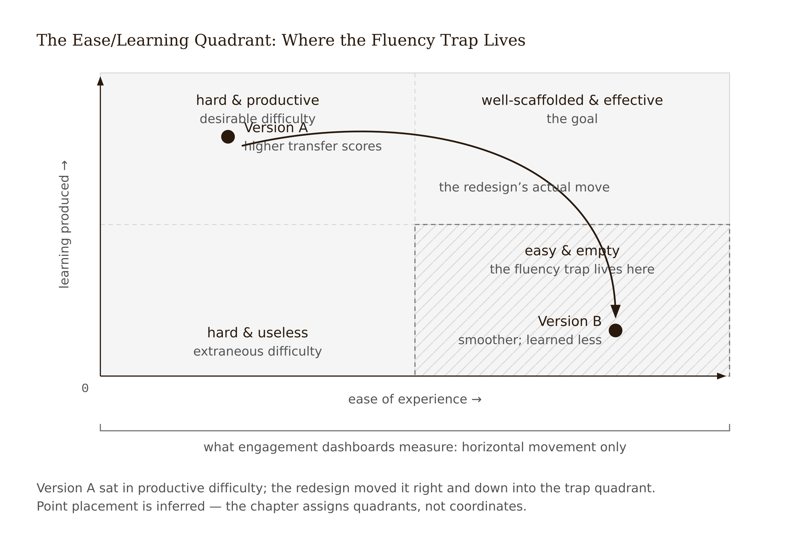
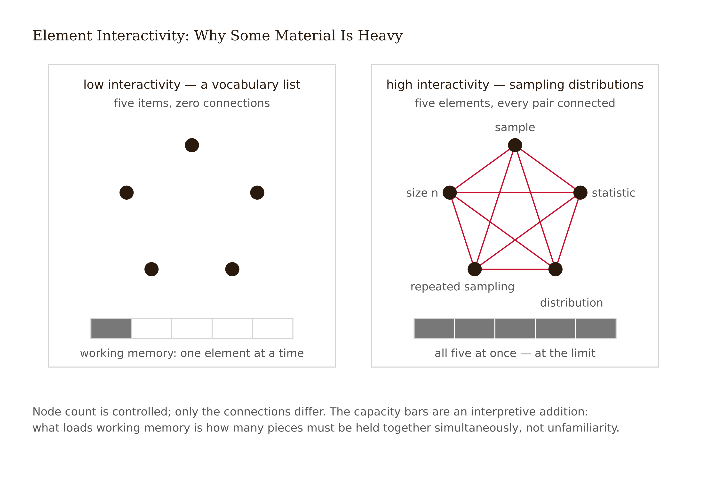
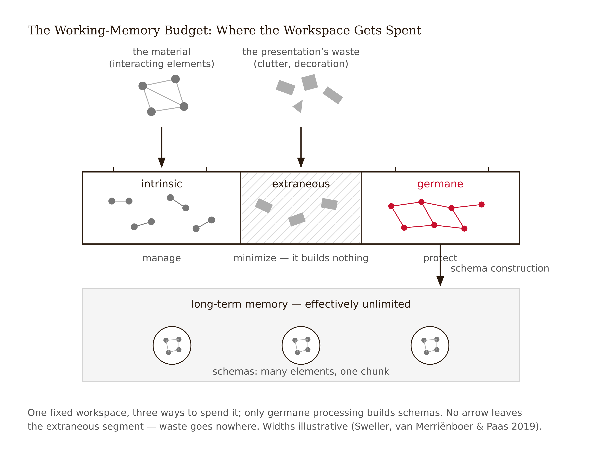
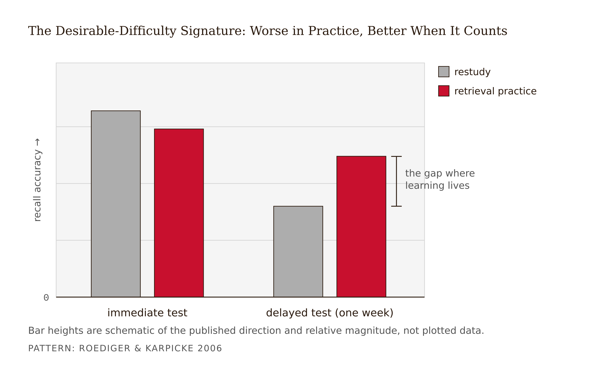
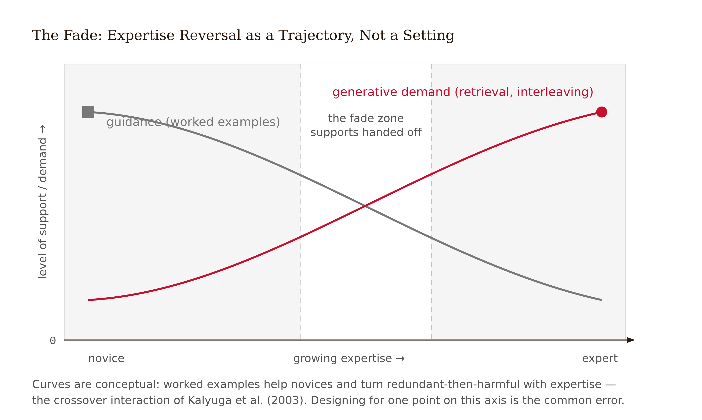
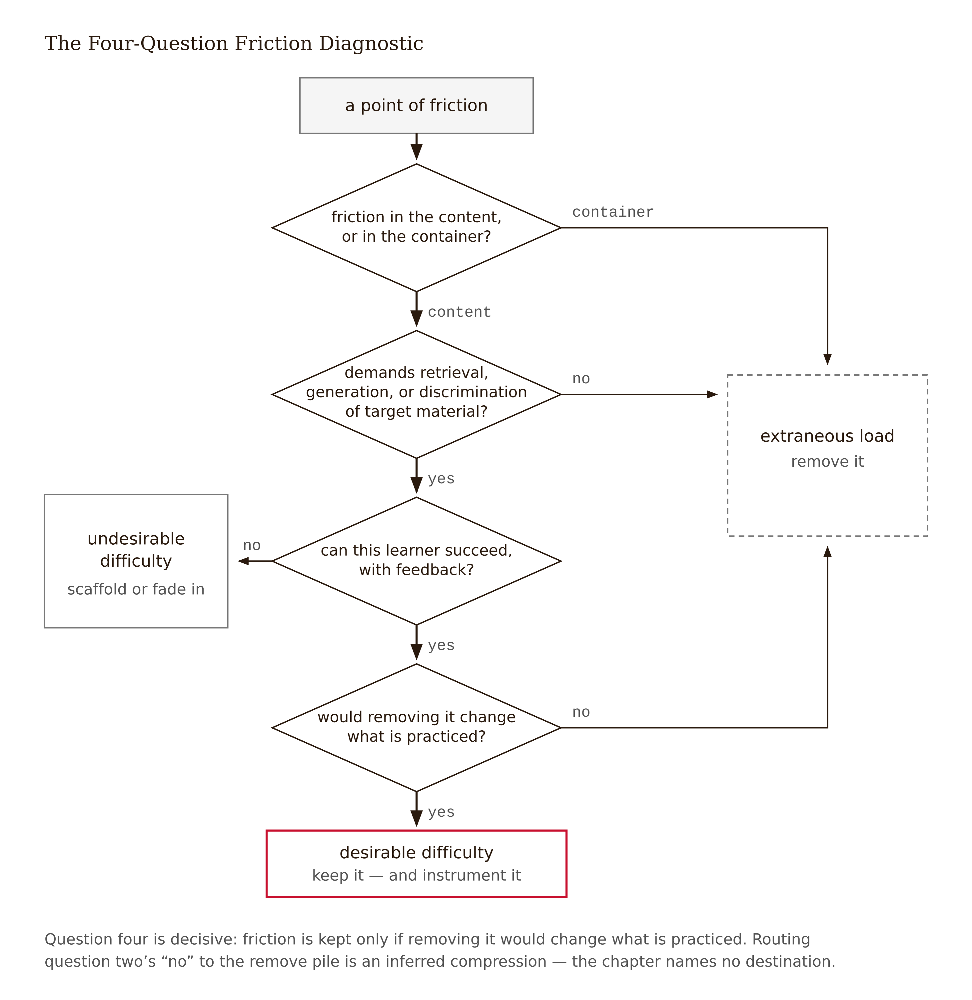

# Chapter 3 — The Cognitive Machinery: Load, Difficulty, and Durable Learning
*Why the lesson that feels easiest to survive is often the hardest to learn from.*

Here is the thing that should bother you about the opening case. A team of talented designers looked at a lesson everyone agreed was a mess — cluttered, demanding, a complaint magnet — and fixed it. They decluttered the screen. They replaced an awkward prediction prompt with a smooth animated walkthrough. They moved a jarring mid-lesson recall question to the end-of-module quiz where it belonged. Every metric they were given to watch went up: completion, satisfaction, time-to-complete down 22%. They wrote a case study. Eight weeks later, the instructor pulled final-exam data and found that students who took the beautiful new version scored *worse* on the transfer items — the questions that asked them to apply sampling-distribution reasoning to a scenario they hadn't seen before. Every instrument the team watched said triumph. The instrument nobody watched said disaster.

This is not a story about bad designers or a careless team. It is a story about a gap between two things that feel like they should be the same thing and aren't: how easy an experience is to get through, and how much learning it produces. The gap has a mechanism. Understanding the mechanism is what this chapter is for.



---

Working memory is the bottleneck. Everything else in this chapter flows from that sentence, so it is worth sitting with.

When you encounter something genuinely new — a concept you have never seen before, a relationship you are constructing rather than recalling — you hold it in a workspace called working memory while you figure out what to do with it. That workspace is small. Cramped, really. The exact figure depends on the material and how you measure it, but the classic framing — about seven items, plus or minus two — has been refined by decades of subsequent work into something more like: *a handful of novel elements, for a matter of seconds, before they start falling out*. The limit is not a bug or a human failing to be designed around. It is the architecture.

Long-term memory is different. Effectively unlimited, and it stores knowledge not as a list of facts but as *schemas* — organized structures that bundle many elements into one. Your statistics instructor reads `P(A|B)` as a single chunk, the way you read "the" as a single thing rather than three letters. For a novice, that same expression is five or six elements fighting for the same cramped workspace: the P, the parentheses, the vertical bar, what A means, what B means, the conditional relationship between them. Same notation. Utterly different cognitive demand. What counts as "a handful of elements" depends entirely on what the learner already knows, which means the bottleneck is not a fixed property of the material — it is a relationship between the material and the person encountering it.

Cognitive Load Theory, developed by John Sweller and colleagues from the 1980s onward, turns this architectural fact into design guidance by asking a simple question about any learning interaction: *where is the working-memory budget being spent?* (Sweller 1988; Sweller, van Merriënboer & Paas 2019). The answer comes in three categories.

The first is **intrinsic load** — the complexity inherent in the material relative to this learner's prior knowledge. Sweller formalizes this as *element interactivity*: how many things must be held in mind simultaneously because they interact, because understanding any one of them requires having the others. Sampling distributions have high element interactivity for a novice: sample, statistic, the act of repeated sampling, the distribution *of* the statistic across those repetitions — all at once, or no understanding. You cannot sequence your way around intrinsic load; you can only manage it, by pre-training isolated elements before combining them, or by segmenting the material at natural joints. But you cannot eliminate it without changing what is being taught.



The second is **extraneous load** — workspace consumed not by the material but by the presentation. A cluttered screen. A diagram and its explanation placed six centimeters apart so the learner must hold one in memory while reading the other. Narration that duplicates text already on screen. A decorative animation that runs while the concept is being introduced. This is pure waste. Every unit of working memory spent navigating the container is a unit unavailable for the content. Eliminating extraneous load is the designer's first job, and it is not in conflict with the learner's interest; it is entirely on their side.

The third — and this is where the opening case turns — is **germane processing**: effort devoted to the learning itself. Generating a prediction before seeing the answer. Retrieving a definition from memory rather than looking it up. Explaining in your own words why your initial sketch was wrong. Constructing the schema rather than watching someone else's schema displayed. This processing is what the design exists to provoke, and it costs workspace, and it is supposed to. The design crime is not that it is effortful. The design crime is confusing it with the other two and removing it in the name of polish.

One honest note on the taxonomy: whether germane processing constitutes a distinct category of load or is better understood as *managed intrinsic* load has been debated inside CLT itself, and later formulations fold it into the intrinsic bucket (Sweller, van Merriënboer & Paas 2019). The three-category version is taught here because it directs design attention most clearly. Treat it as a working tool, not a settled ontology.



The design rule in one sentence: minimize extraneous, manage intrinsic by expertise, protect germane. And the professional note for designers in the room: "reduce friction," the prime directive of consumer product design, is not portable to learning design without a load analysis. Friction that is extraneous: remove it. Friction that is germane: removing it is the error. The animated walkthrough in Version B was a correct extraneous-load fix on the cluttered screen; it was a category error on the prediction prompt. The partition is also a delegation rule, and Chapter 12 will hold AI to it as a phase gate: extraneous load is what you may hand off; germane processing is what must never cross the line.

---

The prediction prompt is doing something specific, and the specificity is what matters. It belongs to a family of interventions that Robert Bjork named **desirable difficulties** — conditions that slow apparent performance during learning but improve delayed retention and transfer (Bjork & Bjork 2011). The unifying mechanism: each one forces retrieval or generation rather than passive re-exposure, and effortful retrieval is itself a learning event that strengthens and reorganizes the schema. This is the series' Frictional principle stated as mechanism: the difficulty is the trigger of consolidation, not its price (see Appendix: The Fundamental Themes).

Spacing is the schedule version. Distributing practice across sessions — returning to sampling distributions in week six, when the session-four material has had time to partially fade — produces more durable retention than massing the same total practice into a single session (Cepeda et al. 2006). The design lever is the *return*: week-six work that silently requires week-two's concept, retrieved cold. The catch is that it produces more errors during practice and less felt fluency, which means every metric on the engagement dashboard will ding it, and it will be optimized away at the next sprint review unless someone in the room has read the literature.

Retrieval practice is the interaction version. Before showing, ask. Version A's predict-simulate-reconcile cycle is the pattern: generate your expected answer, run the simulation, write two sentences about why you were wrong. The reconciliation — *why was my sketch off?* — is germane processing of the highest grade. It is also the interaction learners most want removed from the experience, because it is uncomfortable and error-prone, and because learners sincerely and measurably mispredict what will help them. When Karpicke and Blunt (2011) had students choose between restudying material and practicing retrieval, students preferred restudy; restudy produced worse retention. The preference is coherent — restudy *feels* like learning, because the material becomes fluent — but the feeling is wrong.



Interleaving is the sequencing version. Mix problem types so the learner must first decide which approach applies — the discrimination that blocked practice quietly performs for them (Rohrer & Taylor 2007). In the statistics course: confidence-interval, hypothesis-test, and descriptive questions arriving shuffled, because the exam — and life — will not announce the chapter title before presenting a scenario.

Now the conditional. A difficulty is desirable only if the learner can succeed at the processing it induces. This is where the CLT literature and the difficulties literature, which can look like they are arguing, are actually one argument read at two expertise levels.

For novices facing high-element-interactivity material, generation and minimal guidance can overload working memory entirely before any schema forms. The worked-example effect captures this precisely: novices learn more from studying fully worked solutions than from attempting equivalent problems unaided (Sweller & Cooper 1985). Not because being shown things is generally better than doing things — it isn't — but because for a novice, attempting a high-interactivity problem means burning the entire working-memory budget on search and error management rather than on the structure of the solution. The difficulty is real; it is just not doing useful work. It is the right kind of effort aimed at a target the learner does not yet have the machinery to hit.

The flip side is equally important: the **expertise reversal effect** (Kalyuga et al. 2003). The worked example that helps a novice becomes useless and then actively harmful as expertise grows, because the expert now processes the example's guidance as redundant information — which is itself extraneous load. What was scaffolding becomes noise. The optimal design is not a setting; it is a trajectory. Strong guidance and worked examples early; supports progressively withdrawn; retrieval, interleaving, and generation dialed up as schemas solidify. Sweller's term for this arc is *the completion problem* — fading worked examples by progressively removing steps — and it is the mechanism under what good teachers do by craft when they say "I'm not going to tell you this one."



This synthesis — call it *the fade* — is also the mechanism under the long "discovery learning" controversy. Minimally guided instruction reliably underperforms guided instruction for novices (Kirschner, Sweller & Clark 2006). "Learners construct knowledge, therefore withhold instruction" is the field's most expensive non sequitur. Active cognitive construction — the kind that produces durable learning — is fully compatible with, and for novices demands, strong guidance. What changes as expertise grows is not whether construction is happening; it is where the guidance sits on the fade.

---

There is a diagnostic method in here, and it is the most practically useful thing this chapter can give you. Two pieces of friction can look identical on the surface — learners stall, complain, make errors, abandon — while one is a design flaw and the other is the learning working. Engagement data cannot tell them apart. Mechanism analysis can.

Four questions, run against any point of friction:

**One.** Is the learner effortfully processing the content or the container? Struggling to recall the standard error is content — plausibly germane. Struggling to find where the standard error was defined, to parse a cluttered screen, to fight the input widget: container — extraneous, eliminate it.

**Two.** Does the effort involve retrieval, generation, or discrimination of the target material? If yes, you are probably looking at a desirable difficulty. If the effort is re-orienting, decoding instructions, or managing the tool, no.

**Three.** Can *this* learner succeed at the processing it induces, with feedback? A prediction prompt a novice fails productively — sketch, simulate, reconcile — is desirable. The same prompt with no feedback loop, or aimed at material the learner has no schema for yet, is abandonment dressed as rigor.

**Four.** Would removing it change what is practiced? This is the decisive question. Removing Version B's clutter changed nothing about what learners practiced — extraneous friction, correct to remove. Removing the prediction prompt changed practice from *generating and reconciling a model* to *watching an animation* — that friction was the curriculum.

Priya, the LXD consultant brought in after the Version B disaster, builds her friction ledger by running exactly these questions against every A→B change in the redesign. The process has two dead ends worth naming, because you will hit them too. The first: the team relitigates aesthetics ("A was objectively cluttered!") — true, and useless, because clutter and the prediction prompt are being tried in the same courtroom. The differences must be itemized before they can be judged. The second dead end: she tries to settle the prediction-prompt question with in-course data and almost cannot — quiz scores inside the module favor B, naturally, because B's quiz is open-reference and the practice smoother — and she nearly accepts performance evidence for a learning question. The only data that can adjudicate is delayed and transfer-flavored. She writes in her report: "We are lucky this product sits inside a course with a final exam. Most products aren't that lucky. Build the delayed measure in."

The ledger settles into three piles. *Extraneous, B was right:* the declutter; the integrated diagram-and-explanation (a split-attention fix); the segmented structure; eliminating the six-click path to the formula sheet. *Germane, A was right:* the predict-simulate-reconcile cycle; the mid-lesson closed-book recall of standard deviation versus standard error (relocating it to an open-reference quiz converted retrieval into lookup — the entire point of the exercise removed without anyone noticing). *Seductive, both wrong in different ways:* Tilly the cartoon t-distribution, who delivers charm and extraneous load in equal measure, and who would earn her screen time if she delivered the prediction prompt instead of existing between sections.

Version C ships with B's surfaces and A's demands. Predict-simulate-reconcile restored, now preceded by a pre-training screen that names the three interacting elements before asking the learner to generate — a straight intrinsic-load-management move that keeps the generation inside novices' cognitive capacity without removing the difficulty. Closed-book recall restored mid-lesson with immediate feedback; the open-reference version stays in the end quiz as a spaced second touch. Tilly delivers the prediction prompt or doesn't appear. And two instrumented events — prediction-attempt quality and closed-recall success rate — now feed a delayed follow-up item three weeks later, so the next redesign can argue from learning data instead of forum sentiment.

<!-- → [TABLE: friction ledger — three columns: "A→B change," "Load classification," "Verdict." Rows: declutter (extraneous → remove, correct); animated walkthrough replacing prediction prompt (germane → remove, error); recall relocated to open-reference quiz (germane → remove, error); diagram-explanation integrated (extraneous → remove, correct); Tilly mascot (extraneous → keep with task alignment or remove). Caption: "The ledger forces itemization before judgment. Every whole-version verdict hides a mixture of correct and incorrect moves."] -->

---

Three theoretical traditions organize most LXD conversation, usually as mood music. It is worth reducing each to the design implication that survives the evidence — the only form worth carrying into practice.

Constructivism, the tradition running from Piaget through Vygotsky: knowledge is constructed by the learner through active processing, not transmitted by exposure. The design implication is real and important — *design for what the learner does, not what the content says.* The prediction prompt, the self-explanation, the problem before the lecture: these are constructivist moves that have solid experimental support. What constructivism does *not* imply: withholding guidance. The non sequitur is elegant — "learners construct knowledge, therefore let them construct without support" — but it dissolves immediately on contact with the worked-example evidence. Active cognitive construction is fully compatible with strong guidance; for novices on high-interactivity material, it requires it. Vygotsky's zone of proximal development — the band between what a learner can do alone and with support — is, in the chapter's terms, the load-managed region where difficulty stays desirable.

Situated learning, from Lave and Wenger (1991): learning is bound to the context, community, and authentic activity in which it occurs. The design implication: close the distance between practice environment and performance environment — authentic tasks, real tools, the social fabric designed rather than assumed. The honest limit: a powerful lens with a thinner experimental base than CLT's, and it sits in structural tension with scalable platforms that strip context by design. That tension is not resolved here; it is kept live.

Embodied cognition: cognitive processes are rooted in the body's interaction with the world; movement and gesture can be part of thinking, not decoration around it. The design implication, and the evidence's key moderator: *bodily action helps when it is functionally aligned with the learning task.* Tracing the curve. Enacting the rotation. Recent meta-analytic work finds positive overall effects under that alignment condition. Gesture for gesture's sake — tablet interactions designed to feel tactile without connecting to the concept — adds extraneous load. The alignment condition is not a minor qualification; it is the entire finding.

The pattern across all three reductions is the same: each theory earns its place in practice exactly insofar as it survives translation into the load-and-difficulty machinery. That is not theoretical imperialism. It is the discipline of asking every framework the same question: *what does working memory do differently under your design?*

---

One warning, because it is the most common failure mode in practice. The machinery above compresses temptingly into a checklist — *declutter ✓, add retrieval ✓, space the practice ✓* — and a checklist is exactly the wrong container, because every item is a conditional whose truth depends on the learner, the material, and the moment. Retrieval before any schema exists: undesirable difficulty. A worked example handed to an expert: the expertise reversal in action. The checklist preserves the verbs and discards the conditions, and the conditions are the knowledge.

The professional form of this chapter is a habit of argument, not a feature list: *for this learner, at this point in their schema formation, this design choice directs working memory toward the target processing — and here is the evidence status of that claim.* Sat next to a "reduce friction" ticket, the right question is not "does friction increase or decrease?" but "which friction, for whom, and does removing it change what is practiced?"



What load theory cannot tell you is why a learner who *can* keep going *wants* to. The machinery of this chapter is a theory of capacity — of the conditions under which the bottleneck stays clear enough for learning to happen. It says nothing about whether anyone opens the app on day forty. That gap is exactly one chapter wide.

---

## Evidence Box

<!-- → [TABLE: evidence summary — columns: Finding, Source, Direction & size, Heterogeneity/limits. Rows corresponding to each major empirical claim in the chapter.] -->

| Finding | Source | Direction & size | Heterogeneity / limits |
|---|---|---|---|
| Working memory severely limited for novel elements; schemas circumvent the limit | CLT synthesis, Sweller, van Merriënboer & Paas 2019 | Framework-level; massive convergent support | Precise capacity estimates vary by material and measure; design implication is insensitive to exact number |
| Worked-example effect: novices learn more from solutions than unaided solving | Sweller & Cooper 1985; replicated extensively | Positive, moderate-to-large for novices | Reverses with expertise; strongest in well-structured domains |
| Expertise reversal: guidance that helps novices harms experts | Kalyuga et al. 2003 (review) | Crossover interaction | Single most design-relevant moderator in the chapter; requires knowing learner level |
| Multimedia load principles (coherence, signaling, split-attention, redundancy, segmenting, pre-training) | Mayer 2021 | Positive, mostly small-to-moderate per principle | Strongest for novices; boundary conditions actively studied |
| Spacing improves delayed retention | Cepeda et al. 2006 (meta-analysis) | Positive, robust | Optimal gap scales with retention interval |
| Retrieval practice beats restudy; learners mispredict it | Roediger & Karpicke 2006; Karpicke & Blunt 2011 | Positive, moderate-to-large delayed | Transfer gains positive but smaller than retention gains |
| Interleaving beats blocking for discrimination | Rohrer & Taylor 2007 | Positive delayed; *negative during practice* | Domain-dependent; practice-performance dip is the engagement-trap hazard |
| Generation/minimal guidance harms novices on high-element-interactivity material | Chen et al. 2018; Kirschner, Sweller & Clark 2006 | Negative for novices under complexity | Boundary literature for the difficulties program; exact thresholds unsettled |
| Embodied action helps when functionally aligned with task | Lyu & Deng 2024; see Chapter 11 references | Positive overall, alignment-moderated | Treat exact effect-size claims cautiously across domains |
| Germane load as separate construct | Debated within CLT; Sweller, van Merriënboer & Paas 2019 | — | Working tool, not settled ontology; later formulations fold into intrinsic |

**What remains unsettled:** where the desirable/undesirable boundary sits for a given learner and material (no general formula — hence learner research and instrumentation); how lab-calibrated effects scale into commercial products; whether real-time load measurement will ever be reliable enough to drive adaptive design.

---

## What Would Change My Mind

The chapter's central claim is that working-memory load architecture — minimize extraneous, manage intrinsic by expertise, protect germane processing — is the right primary lens for diagnosing why learning designs succeed or fail. Two findings would force revision. Narrowly: well-powered, preregistered failures to replicate the cornerstone interactions in ecologically valid digital products — particularly the expertise reversal and the worked-example advantage for novices — would collapse the fade prescription this chapter's guidance hangs on. More broadly: if real-time load measurement matures and large instrumented studies find that load indices add *no predictive power* for delayed retention beyond simple time-and-errors telemetry, the load framework stands exposed as redescription rather than mechanism. Neither finding currently exists; the second is the one to watch as instrumentation improves.

---

## Still Puzzling

- **Where is the boundary, numerically?** "Difficulty is desirable when the learner can succeed at the induced processing" is true and unsatisfying — no formula converts prior-knowledge measures into a difficulty setting.
- **Does germane processing exist as a measurable thing?** If germane effort cannot be measured separately from intrinsic load, the chapter's tidiest design rule rests on a distinction instruments cannot see.
- **How much survives the leap from lab to market?** The load effects are mostly lab- and classroom-calibrated. The direction seems robust; the sizes at product scale are genuinely unknown.
- **Whose effort budget are we managing?** Load analysis treats learner effort as a resource to allocate. Learners are also people with finite evenings. The ethics of deliberately designing effortful experiences for tired adults gets surprisingly little attention in a literature built mostly on undergraduates with course credit.

---

## Exercises

**Warm-up**

1. *(Recall — intrinsic/extraneous/germane)* A designer proposes replacing a mid-lesson "explain in your own words" prompt with a multiple-choice comprehension check, on the grounds that the open-response format creates unnecessary frustration. Classify the load each format generates. Which, if either, is extraneous, and which is germane? State the prior-knowledge condition that would change your answer.
*Difficulty: low. Tests: load-category classification.*

2. *(Recall — expertise reversal)* An adaptive platform serves the same fully worked example to all learners regardless of their assessment history. Describe the specific harm this causes for high-expertise learners and the mechanism that produces it.
*Difficulty: low. Tests: expertise reversal, extraneous load.*

3. *(Recall — desirable difficulties taxonomy)* Name three desirable difficulties from the chapter, state the design lever for each (schedule, interaction, or sequencing), and name the dashboard metric most likely to flag each one as a problem.
*Difficulty: low. Tests: difficulties taxonomy and the engagement-trap hazard.*

**Application**

4. *(Apply the fade)* You are redesigning a four-week online module on Bayesian inference for learners ranging from complete novices to practitioners who have used Bayes informally. Sketch the structure of worked-example and generation-prompt use across the four weeks — which weeks lean on examples, which introduce retrieval, at what point interleaving enters. Justify each transition point by naming the schema-formation condition it assumes.
*Difficulty: moderate. Tests: the fade trajectory applied to realistic content.*

5. *(Apply the diagnostic)* A learner forum post reads: "The practice problems are unfair — they ask us to solve things we've never been shown how to do." Run the four-question diagnostic. What facts would you need to collect to determine whether this is an extraneous friction, a desirable difficulty, or an undesirable difficulty? Name the specific measurement for each open question.
*Difficulty: moderate. Tests: four-question diagnostic, prior-knowledge dependence.*

6. *(Apply the friction ledger)* The statistics module described in this chapter had five A→B changes: screen declutter, animated walkthrough replacing the prediction prompt, recall question relocated to open-reference quiz, diagram-explanation integrated, and Tilly the mascot added. Rebuild the friction ledger: load classification, verdict, and the mechanism sentence for each. For at least two rows, name the delayed outcome measure that would let the verdict defend itself empirically.
*Difficulty: moderate. Tests: friction-ledger method across all five changes.*

**Synthesis**

7. *(Synthesize CLT + difficulties + constructivism)* A colleague argues that constructivist pedagogy and cognitive load theory are incompatible — "CLT wants to reduce effort; constructivism wants active struggle." Write a 200-word rebuttal that uses the worked-example effect, the expertise reversal, and Vygotsky's zone of proximal development together to show why the apparent conflict dissolves.
*Difficulty: moderate-high. Tests: theoretical integration across the chapter.*

8. *(Synthesize load + difficulties + the fade)* Design a single retrieval-practice interaction for a novice audience on a high-element-interactivity topic of your choice. Show: (a) how you manage intrinsic load before the retrieval demand; (b) the retrieval structure itself; (c) the feedback mechanism that keeps the difficulty desirable rather than undesirable; and (d) how the interaction would change for an expert audience, citing the expertise reversal.
*Difficulty: high. Tests: integrated application of the chapter's full machinery.*

**Challenge**

9. *(Challenge — open)* The chapter claims the four-question friction diagnostic is itself an unvalidated instrument: it synthesizes the literature but has not been tested as a design tool. Propose a study that would test whether designers trained on the diagnostic classify friction more accurately — and with better learning outcomes — than untrained designers. What is your outcome measure, your comparison condition, and your primary threat to validity? One page maximum.
*Difficulty: high. Tests: research-design thinking, honest engagement with the chapter's own epistemic limits.*

---

## Further Reading

- **Sweller, J., van Merriënboer, J., & Paas, F., "Cognitive Architecture and Instructional Design: 20 Years Later," *Educational Psychology Review* (2019)** — the field's own honest stocktaking of CLT, including the germane-load debate.
- **Mayer, R., *Multimedia Learning*, 3rd ed. (2021)** — the experimental principle catalog for screen-based instruction; the most directly design-actionable book on this list.
- **Brown, P., Roediger, H., & McDaniel, M., *Make It Stick* (2014)** — desirable difficulties for the general reader; assign it to stakeholders who need the why without the citations.
- **Kirschner, P., Sweller, J., & Clark, R., "Why Minimal Guidance During Instruction Does Not Work," *Educational Psychologist* (2006)** — the polemic that forced the guidance debate into the open; read it with its rebuttals for the full exchange.
- **Liljedahl, P., *Building Thinking Classrooms in Mathematics* (2021)** — what learners actually do with the tasks we design (mimic, stall, fake, think), from fifteen years of classroom observation.

---
## Chapter 3 Exercises: The Cognitive Machinery — Load, Difficulty, and Durable Learning
**Project:** The Redesign Dossier
**This chapter adds:** `dossier/03-load-audit.md` — a friction ledger for your chosen experience: every point of friction run through the four-question diagnostic and classified as extraneous, desirable difficulty, or undesirable difficulty, with the assumption and delayed measure each verdict rests on.
---
### Exercise 1 — When to Use AI

**The judgment:** In this chapter's work, AI assistance is appropriate for the following tasks:

- Converting your raw walkthrough notes into a structured task inventory — for each friction point: what the learner sees, what they must do, what feedback they get, where in the arc it sits — *Why AI works here:* this is reformatting of observations you made yourself; you can verify every cell against your own notes, and the inventory carries facts, not verdicts.
- Generating the strongest opposite-verdict argument for each classification you have already made — *Why AI works here:* this is generating options as adversarial input. Priya's two dead ends show why a second courtroom voice helps; you remain the judge of whether the opposing argument survives the four questions.
- Drafting mechanism sentences after you have fixed a verdict ("removing the prediction prompt changes practice from generating a model to watching an animation") — *Why AI works here:* this is drafting against a completed judgment, and each sentence is checkable against your own four answers — if the sentence doesn't follow from them, you wrote the verdict wrong or the model wrote the sentence wrong, and either way you can tell.

**The tell:** You know you are using AI appropriately when you can evaluate the output — when you have independent criteria to judge whether it is correct, complete, and fit for purpose.

---
### Exercise 2 — When NOT to Use AI

**The judgment:** In this chapter's work, the following tasks belong to you, not the model — because the model cannot see the one thing every load classification depends on:

- Classifying friction as extraneous versus germane — *Why AI fails here:* causal identification. The model's training is saturated with consumer-UX doctrine where friction is always the enemy, so it defaults to classifying all friction as extraneous. It cannot run question four — *would removing this change what is practiced?* — because it does not know what is supposed to be practiced. Without your charter's learning objective, the model cannot distinguish the prediction prompt from the cluttered screen; Version B's designers made exactly this category error with full sincerity.
- Answering question three — *can this learner succeed at the induced processing?* — *Why AI fails here:* missing ground truth. The desirable/undesirable boundary is a relationship between the material and the person, set by prior knowledge the model has no access to. Any confident answer it gives about your learners' schema state is invention, and the expertise reversal means an invented answer flips the verdict.
- Adjudicating a verdict from engagement data — *Why AI fails here:* the learning/performance dissociation is a calibration problem the model inherits. In-course metrics favor the smooth version by construction — Priya nearly accepted performance evidence for a learning question, and a model summarizing your analytics will make her near-miss into a confident conclusion. Only delayed and transfer measures adjudicate, and you almost certainly don't have them yet.

**The tell:** You know you have crossed the line when you are using AI output as your reason for a conclusion rather than as a tool for reaching one. If you could not explain the conclusion without the AI, the AI did the work that should have been yours.

**Series connection:** Tier 5 Causal — the ledger is mechanism-level reasoning. Each verdict is a causal claim: *this* friction produces durable learning; *that* friction merely produces complaints. The model can correlate friction with sentiment all day; the causal claim about what working memory is doing requires the mechanism this chapter taught, applied to a learner only you can characterize.

---
### Exercise 3 — LLM Exercise

**What you're building this chapter:** `dossier/03-load-audit.md` — the friction ledger, with every verdict yours and every assumption named.

**Tool:** Claude Project "Redesign Dossier" — with `01-evidence-brief.md` and `02-project-charter.md` in project knowledge, the model can hold your learning objective and learner profile while it attacks your classifications, instead of inventing both.

**The Prompt:**
```
I am building the third file of my Redesign Dossier: a cognitive load audit of the
experience profiled in 02-project-charter.md. Read 02-project-charter.md for the
intended learning outcome and the learner profile, and 01-evidence-brief.md for the
seductive-detail and desirable-difficulty hypotheses we logged. Your role is to
structure the audit and attack my classifications — never to author a verdict. Every
verdict in the final file is mine.

MY TASK INVENTORY: a list of friction points in the experience. For each: what the
learner sees, what they must do, what feedback they get, and where in the arc it sits.
I will paste it here. If my descriptions mix observation with judgment, separate the
two and ask me to confirm the factual version before proceeding.

MY CLASSIFICATIONS, written before this conversation: for each friction point, my
verdict — extraneous friction / desirable difficulty / undesirable difficulty — and my
answers to the four diagnostic questions: (1) is the learner effortfully processing
the content or the container? (2) does the effort involve retrieval, generation, or
discrimination of the target material? (3) can this learner succeed at the processing,
with what feedback? (4) would removing it change what is practiced? I will paste these
here.

YOUR TASK, in order:
1. Work one friction point at a time. For each, identify which of my four answers
   rests on the least evidence and press me on it with one question. Wait for my
   reply before continuing.
2. Then argue the opposite verdict as strongly as the facts I gave allow. Where the
   opposite case needs a fact I have not given you, say "this would only hold if—"
   and name the missing fact. Do not invent learner attributes, prior-knowledge
   levels, or usage data. Do not soften the critique to be agreeable.
3. Wherever my answer to question 3 rests on prior knowledge I have not measured,
   mark it ASSUMPTION and ask what evidence from real learners would settle it.
   Refuse "more analytics" unless I name the specific metric and explain why it
   indexes load or learning rather than behavior.
4. Format the audit as a markdown file named 03-load-audit.md: a friction ledger
   table with columns — Friction Point | Q1: Content or Container | Q2: Retrieval,
   Generation, or Discrimination | Q3: Can This Learner Succeed, With What Feedback |
   Q4: Does Removal Change What Is Practiced | Verdict (mine) | Assumption It Still
   Rests On | Delayed or Transfer Measure That Would Test It. Below the table, add a
   Verdict Distribution line (counts of extraneous / desirable / undesirable) and
   this note verbatim: "If nearly everything is extraneous, suspect consumer-UX bias
   in the auditor before believing the product is difficulty-free."
5. You may not change any verdict. If, after my replies, you still disagree with one,
   record your dissent in its Assumption column as "Reviewer dissent: ..." and leave
   my verdict standing.
```

**What this produces:** `dossier/03-load-audit.md` — a complete friction ledger in which the facts came from your inventory, the verdicts survived an adversarial review, the unsupported assumptions are flagged with the learner evidence that would settle them, and any remaining disagreement is recorded as dissent rather than silently resolved.

**How to adapt this prompt:**
- *For your own project:* the ledger works on non-digital experiences directly — in a classroom course the friction points are activities and assessments, not screens; in an onboarding program, social friction (the embarrassment tax on asking questions) is a legitimate ledger row. Only Q1's "container" changes shape; the four questions do not.
- *For ChatGPT / Gemini:* paste the charter's learning outcome and learner profile inline at the top — without them the model cannot even pretend to answer Q4. Long one-point-at-a-time interrogations drift in both; re-anchor with "Next friction point, same protocol." If Gemini renders the ledger as prose, demand "markdown table only, one row per friction point."
- *For a Claude Project:* the no-verdict-authoring rule and the dissent mechanism belong in the project's custom instructions, alongside Chapter 1's sources-log rule; each message then carries only the inventory and your classifications.

**Connection to previous chapters:** The ledger inherits its ground truth from the charter — question four is unanswerable without `02-project-charter.md`'s intended learning outcome, which is why the charter had to come first. And the seductive-detail and desirable-difficulty hypotheses logged in `01-evidence-brief.md` finally get their hearings here: each one becomes a ledger row and leaves with a verdict or an ASSUMPTION flag.

**Preview of next chapter:** Load theory told you when a learner *can* keep going; Chapter 4 audits why anyone *wants* to — `dossier/04-motivation-audit.md` takes the same experience apart by autonomy, competence, relatedness, and task value.

---
### Exercise 4 — CLI Exercise

**What you're building this chapter:** A load-audit ledger generator — it ingests your raw task inventory and produces the `03-load-audit.md` skeleton with every factual column filled and every judgment cell deliberately left empty.

**Tool:** Claude Code — multi-file reading with strict structural rules about which columns the agent must not fill is exactly the constrained generation an agentic CLI is built for, and the constraint *is* the lesson.

**Skill level:** Intermediate — three input files, structural rules, and a verification pass you are expected to actually read.

**Setup:**
- [ ] `dossier/01-evidence-brief.md` and `dossier/02-project-charter.md` complete
- [ ] Your raw task inventory written to `dossier/notes/task-inventory.md` — one friction point per bullet, facts only (what the learner sees, must do, gets as feedback, and where in the arc it sits)
- [ ] Claude Code in the project root; CLAUDE.md rules from Chapters 1–2 in place; folder under version control

**The Task:**
```
Read dossier/notes/task-inventory.md (my raw task inventory),
dossier/02-project-charter.md (for the intended learning outcome and learner profile),
and dossier/01-evidence-brief.md (for the seductive-detail and desirable-difficulty
hypotheses). Create dossier/03-load-audit.md. Modify no other file.

The new file contains a friction ledger: one table row per friction point in my
inventory, with columns — Friction Point | What the Learner Sees, Does, and Gets as
Feedback | Q1: Content or Container | Q2: Retrieval, Generation, or Discrimination |
Q3: Can This Learner Succeed, With What Feedback | Q4: Does Removal Change What Is
Practiced | Verdict | Delayed or Transfer Measure.

Rules:
1. Fill ONLY the first two columns, using the facts in my inventory. Every cell in
   Q1 through Q4, Verdict, and Measure must contain exactly the string
   "[learner to classify]". Do not classify any friction point, even tentatively,
   even where the answer seems obvious — classification without the learner's schema
   state is the failure mode this audit exists to catch.
2. Exception: where my inventory contains nothing about the learner's prior knowledge
   at that point in the arc, put "[insufficient data: prior knowledge unknown]" in
   that row's Q3 cell instead.
3. Where a friction point matches a hypothesis already logged in 01-evidence-brief.md,
   append "(hypothesis from 01)" to its Friction Point cell.
4. Below the table, under the heading "Ground Truth for Q4," copy the intended
   learning outcome from 02-project-charter.md, verbatim and in quotation marks.
5. Verify before finishing, and print the results: (a) the row count and the count of
   friction points in my inventory, which must match; (b) confirmation that every
   cell outside the first two columns contains one of the two permitted placeholder
   strings and nothing else; (c) confirmation that the only file you created or
   modified is dossier/03-load-audit.md. If dossier/notes/task-inventory.md does not
   exist, stop and tell me — do not invent an inventory.
```

**Expected output:** A ledger skeleton in `dossier/03-load-audit.md`: facts filled from your inventory, every judgment cell holding a placeholder, the charter's learning outcome quoted as ground truth, and the three verification results printed.

**What to inspect in the output:**
- The discipline held: zero auto-filled classifications. If any Q-cell or Verdict cell contains anything beyond the two placeholders, the generator crossed the exact line this chapter draws — friction judged without the learning objective.
- The "Ground Truth for Q4" quote matches the charter character for character — this is the sentence every verdict you write next will be tested against.
- The `[insufficient data: prior knowledge unknown]` flags: read them as a list. Each one is a learner-research question for Chapter 5, writing itself.

**If it goes wrong:** The most likely failure is partial compliance — the model fills Q1 and Q2 "because they're objective" (Q1 sometimes nearly is; Q2 already requires knowing the target material, which means it requires the verdict). Recovery: don't negotiate cell by cell. Re-run with rule 1 quoted back verbatim and read the verification output; if pre-fills persist, have it replace every non-placeholder judgment cell with the placeholder, re-print the verification, and then spot-check three rows yourself against the inventory before filling any verdicts via Exercise 3.

**CLAUDE.md / AGENTS.md note:** Add: *"In load audits, the four diagnostic answers and all verdicts are learner judgments. Claude fills factual columns only. A generated classification is a defect, not a head start."*

---
### Exercise 5 — AI Validation Exercise

**What you're validating:** Your completed `dossier/03-load-audit.md` — the Exercise 4 skeleton with verdicts filled through Exercise 3's interrogation.

**Validation type:** Reasoning chain.

**Risk level:** High — a germane friction misclassified as extraneous gets "fixed" away in your redesign chapters, and the result is the Version B disaster in your own project: every metric you can see improves while transfer quietly dies on a test you never see.

**Setup:** Option (a) — your own output. Have the chapter's Evidence Box open beside it, plus your charter and your raw inventory.

**The Validation Task:**
- [ ] **Correctness** — internal consistency, row by row: do the four answers actually entail the verdict? A "desirable difficulty" whose Q2 answer is "managing the tool" contradicts itself; a verdict of "extraneous" with Q4 answered "yes, removal changes what is practiced" is the Version B error in a single row. Any effect or finding cited in a Measure cell must match the chapter's Evidence Box, not a remembered version of it.
- [ ] **Completeness** — every friction point from the inventory has a row; no judgment cell still holds a placeholder; every ASSUMPTION flag names the learner evidence that would settle it.
- [ ] **Scope** — verdicts claim only what the four answers establish. A Q3 answer about "learners like these" or "typical users" instead of your charter's profiled learners is out of scope — the boundary is a relationship between the material and *these* people.
- [ ] **The distribution check (chapter-specific)** — count the verdicts. If extraneous approaches one hundred percent, suspect the consumer-UX prior — the model's or your own — before believing the product is difficulty-free. Take the two or three extraneous verdicts you are most confident about and re-run Q4 against the charter's quoted outcome, in writing.
- [ ] **The adjudication check (chapter-specific)** — no verdict is justified by an engagement signal: complaints, completion, satisfaction, session length. And every Measure cell is genuinely delayed or transfer-flavored — an immediate quiz score is a performance measure and fails this check, exactly as Priya's open-reference in-course data nearly fooled her.
- [ ] **Failure mode check** — fluent-but-wrong: mechanism sentences that sound causal but merely restate the verdict ("this is extraneous because it doesn't help learning"). The chapter-relevant failure: all-friction-is-bad bias that survived the adversarial review because you accepted the model's opposite-verdict arguments selectively. Missing ground truth: verdicts standing on unmeasured prior knowledge without an ASSUMPTION flag.

**What to do with your findings:** All checks pass — the ledger feeds the redesign decisions of the next several chapters; commit it. One fail — fix that row yourself and re-check its internal consistency. Multiple fails, especially the distribution check — the model's priors did the classifying; this is a "When NOT to Use AI" moment. Re-run Exercise 3's interrogation on every extraneous verdict, this time writing your Q4 answer before the model speaks.

**AI Use Disclosure prompt:** Two sentences at the bottom of the ledger, in the pattern the Evidence Disclosure set: what AI produced and how you used it; one specific thing AI could not determine that required your judgment. For example: *"AI structured the ledger, argued the opposite verdict for every classification, and flagged my unsupported assumptions; all verdicts and mechanism sentences are mine. AI could not determine whether my learners can succeed at the generation-style prompts — every Q3 answer rests on prior-knowledge evidence I will not have until the learner research, and is flagged ASSUMPTION in the file."*

**Series connection:** This exercise trains the causal-identification failure mode: accepting a fluent correlational story (friction correlates with complaints) as a causal verdict (friction harms learning). Tier 5 Causal — the validation question is the chapter's question in miniature: not *does this output sound mechanistic?* but *would the mechanism it names actually change what working memory does?*

---

## References

All cornerstone empirical claims in this chapter were fact-checked on 2026-06-07 and confirmed against primary sources. See factchecks/03-the-cognitive-machinery-load-difficulty-and-durable-learning-assertions.md for the full report.

1. Sweller, J. Cognitive load during problem solving: Effects on learning. *Cognitive Science*, 12(2), 257–285, 1988. https://onlinelibrary.wiley.com/doi/10.1207/s15516709cog1202_4
2. Sweller, J., van Merriënboer, J. J. G., & Paas, F. Cognitive Architecture and Instructional Design: 20 Years Later. *Educational Psychology Review*, 31, 261–292, 2019. https://link.springer.com/article/10.1007/s10648-019-09465-5
3. Sweller, J., & Cooper, G. A. The Use of Worked Examples as a Substitute for Problem Solving in Learning Algebra. *Cognition and Instruction*, 2(1), 59–89, 1985. https://www.tandfonline.com/doi/abs/10.1207/s1532690xci0201_3
4. Kalyuga, S., Ayres, P., Chandler, P., & Sweller, J. The Expertise Reversal Effect. *Educational Psychologist*, 38(1), 23–31, 2003. https://www.tandfonline.com/doi/abs/10.1207/S15326985EP3801_4
5. Cepeda, N. J., Pashler, H., Vul, E., Wixted, J. T., & Rohrer, D. Distributed practice in verbal recall tasks: A review and quantitative synthesis. *Psychological Bulletin*, 132(3), 354–380, 2006. https://pubmed.ncbi.nlm.nih.gov/16719566/
6. Roediger, H. L., & Karpicke, J. D. Test-enhanced learning: Taking memory tests improves long-term retention. *Psychological Science*, 17(3), 249–255, 2006. https://journals.sagepub.com/doi/10.1111/j.1467-9280.2006.01693.x
7. Karpicke, J. D., & Blunt, J. R. Retrieval Practice Produces More Learning than Elaborative Studying with Concept Mapping. *Science*, 331(6018), 772–775, 2011. https://www.science.org/doi/10.1126/science.1199327
8. Rohrer, D., & Taylor, K. The shuffling of mathematics problems improves learning. *Instructional Science*, 35(6), 481–498, 2007. http://uweb.cas.usf.edu/~drohrer/pdfs/Rohrer&Taylor2007IS.pdf
9. Kirschner, P. A., Sweller, J., & Clark, R. E. Why Minimal Guidance During Instruction Does Not Work. *Educational Psychologist*, 41(2), 75–86, 2006. https://www.tandfonline.com/doi/abs/10.1207/s15326985ep4102_1
10. Chen, O., Castro-Alonso, J. C., Paas, F., & Sweller, J. Undesirable Difficulty Effects in the Learning of High-Element Interactivity Materials. *Frontiers in Psychology*, 9, 1483, 2018. https://www.frontiersin.org/articles/10.3389/fpsyg.2018.01483/full
11. Lyu, B., & Deng, Y. (candidate for the chapter's "2024 meta-analysis"). Effectiveness of embodied learning on learning performance: A meta-analysis based on the cognitive load theory perspective. *Learning and Individual Differences*, 116, 102564, 2024. https://www.sciencedirect.com/science/article/abs/pii/S1041608024001572 — *Note: confirms the positive overall effect (g≈0.52); confirm/strengthen the task-alignment moderator attribution before manuscript freeze.*
12. Mayer, R. E. *Multimedia Learning* (3rd ed.). Cambridge University Press, 2021.
