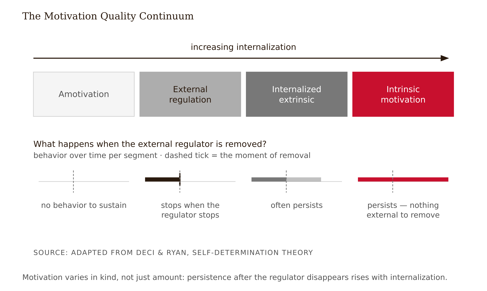
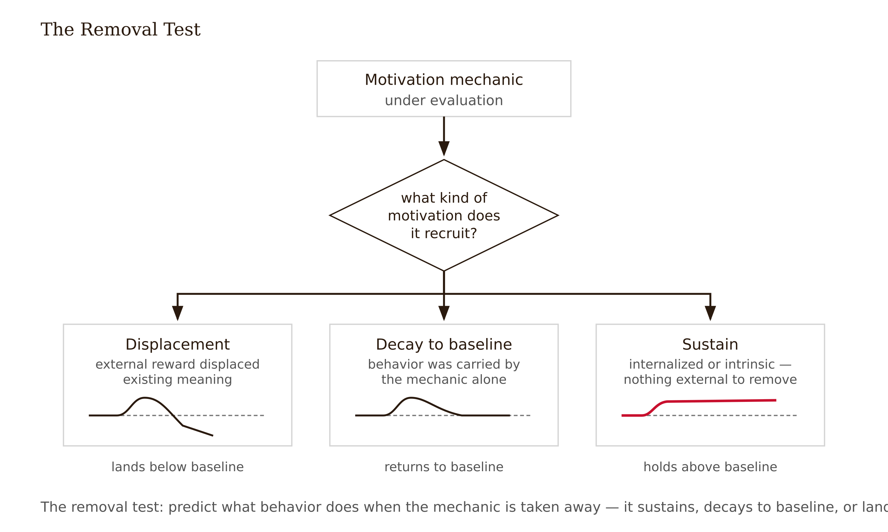
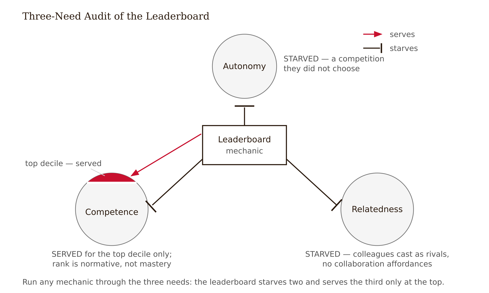
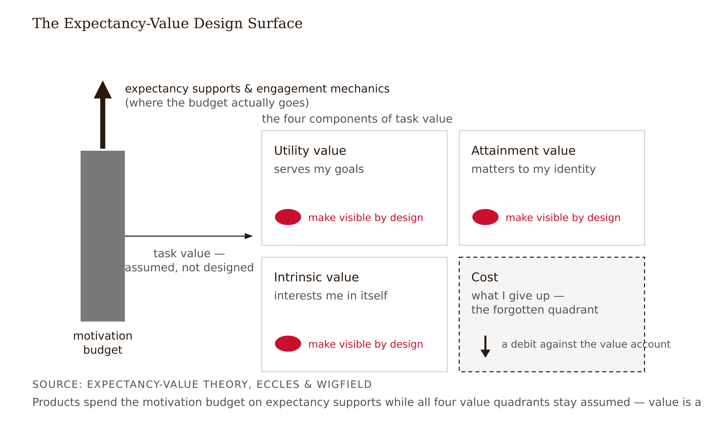
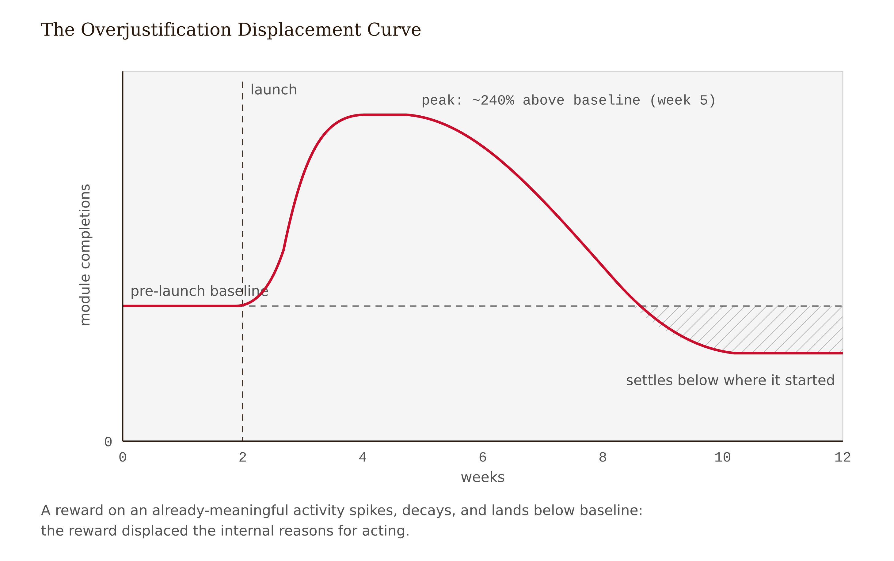

# Chapter 4 — Motivation by Design: Self-Determination, Flow, and Task Value
*Why the leaderboard that worked until it didn't is the most diagnostic experiment your product will ever run.*

The learning platform team at a mid-sized logistics company had a problem most teams would envy: leadership wanted more engagement with the compliance and upskilling library, and was willing to fund it. They shipped a leaderboard. Every completed module earned points; points ranked employees within their region; the top ten names appeared on a dashboard that managers could see.

The launch was everything the vendor's case studies promised. Weekly active users tripled in the first month. Module completions ran 240% above baseline by week five. The pulse survey came back glowing — "fun," "finally a reason to do these," "love seeing my name up there." Leadership asked to extend the mechanic to the entire catalog.

Then the curve bent. Week eight: completions still above baseline, but falling. Week ten: at baseline. Week twelve: *below* the pre-launch baseline — meaning fewer people were completing modules than before the leaderboard had ever existed. The people who had raced up the rankings in October were, by January, not opening the platform at all. The pulse surveys stayed positive the whole time. People still *said* they liked the leaderboard. They had simply stopped acting on it.

The team's first hypothesis was a content problem: the library had been exhausted by the early burst. The data said no — most users had completed fewer than 15% of available modules. The second hypothesis was novelty: the mechanic had grown old. Closer, but it raised a question the team could not answer. If the leaderboard merely stopped working, completions would have returned to baseline. They landed *below* it. A mechanic that stops working returns you to where you started. A mechanic that drops you below where you started did something to the motivation that was already there.

That last detail is the tell, and this chapter is about learning to read it.

---

The mistake the leaderboard team made begins with a unit error. They treated motivation as a single substance — a tank you fill with any available fuel — and asked only "how much?" Four decades of motivation research says the more important question is "what kind?"

Self-determination theory, developed by Edward Deci and Richard Ryan, arranges motivation on a continuum of quality rather than quantity (Deci & Ryan 1985; Ryan & Deci 2000). At one end: amotivation, no intent to act. At the other: intrinsic motivation, acting because the activity is satisfying in itself. In between: extrinsic motivation, acting for a separable consequence. The crucial move is that extrinsic motivation is not one thing. It ranges from *external regulation* — I do it for the points, and when the points stop, I stop — through progressively more internalized forms. A nursing student grinding pharmacology flashcards is rarely intrinsically motivated by flashcards. But "this is what a safe nurse does" is an internalized reason, and it will still be there after the quiz, after the course, after the app is deleted. Points will not.

A meta-analysis of SDT-based interventions in education found meaningful overall benefits, with the clearest gains in intrinsic motivation (g ≈ 0.58) — but the relatedness-support effect did not reach statistical significance (Wang et al. 2024). Hold onto that asymmetry: the need that depends most on other humans is the one interventions find hardest to move at scale, a result this chapter will keep meeting. This is one of the better-replicated intervention bodies available to a learning designer, which is worth saying because the framework sometimes reads like humanistic preference. It is not. It is a body of experimental and quasi-experimental evidence that the motivation you build from converges on a prediction: behaviors driven by external regulation persist only while the regulator is present and salient. Behaviors driven by internalized or intrinsic motivation persist on their own.



The practical consequence: when you evaluate a motivation mechanic, the first question is not "will this increase activity?" Almost anything novel increases activity. The question is: *what kind of motivation does this mechanic recruit, and what happens when the mechanic is removed?* That second clause — the removal test — is the motivational equivalent of Chapter 1's delayed retention test. Apply it to every mechanic you are ever tempted to build.



---

SDT proposes three basic psychological needs whose support or starvation determines where on the quality continuum a given design will land.

**Autonomy** is the experience of acting from choice rather than coercion. The common misreading is that autonomy means absence of structure — in practice, unstructured experiences often reduce felt autonomy by inducing helplessness. Autonomy is meaningful choice within structure: which of these three practice domains would you like to draw problems from? Which project brief fits your context? The learning outcomes stay fixed; the path is the learner's. The anti-pattern is a forced linear sequence with arbitrary locks communicating nothing except "the system won't trust you until you've clicked through its requirements." That is coercion with a progress bar.

**Competence** is the experience of growing mastery against challenge calibrated near the upper edge of ability. Design expressions: feedback that is informational rather than merely evaluative — "here is what your attempt reveals and what to try next" rather than "7/10" — and visible progress tied to capability rather than throughput. "You can now interpret a confidence interval" is a competence signal. "You've completed 12 modules" is a throughput signal. One tells the learner what has grown inside them. The other tells them how much of the product they have consumed. These are not the same, and learners who have been saturated with throughput signals while starved of competence signals tend to describe a specific feeling: busy, and somehow not better.

**Relatedness** is the experience of mattering to others and belonging — the most neglected need in EdTech, because it is the hardest to fake at scale. A forum requirement that says "post once, reply twice" simulates the behavioral surface of community while delivering none of its experience. Relatedness requires that your contribution changes something for someone, and that you know it. Real interdependence, real instructor response to your actual work, peer review where you can see that your feedback helped — these are the conditions. The shortcut is to notice them by their absence: a learning product that has no mechanism by which one learner's action matters to another has, by omission, told every learner they are alone.

Run any motivation mechanic through these three. The leaderboard: autonomy starved, because it defined what counted and conscripted everyone into a competition they did not choose. Competence served for the top decile, starved below, because rank is a normative signal — how you compare — rather than a mastery signal — what you can do. In any ranking, most participants are not winning, by construction, and they are receiving a legible signal about it every time they check. Relatedness starved: colleagues as rivals, no collaboration affordances.



<!-- → [TABLE: SDT needs audit applied to four mechanics — columns: Mechanic, Autonomy (serves/ignores/starves), Competence (serves/ignores/starves), Relatedness (serves/ignores/starves), Removal-test prediction — rows: points leaderboard, streak counter, mastery badge, peer review with visible impact] -->

This is not an argument that leaderboards never work. The gamification evidence is heterogeneous — Chapter 10 treats that heterogeneity as the headline — and the moderators include exactly these design features. It is the explanation the leaderboard team was missing: not "it fatigued" but *which psychological needs it starved and which it served only conditionally*, and why the removal prediction therefore reads below baseline rather than back to it.

---

Before the mechanism behind that below-baseline landing, a detour through a concept you will meet constantly, and which deserves honest treatment.

Mihaly Csikszentmihalyi's concept of **flow** — the state of total absorption arising when challenge and skill are balanced near the upper edge of ability, marked by time distortion, loss of self-consciousness, intrinsic enjoyment of the activity — is genuinely useful as a design heuristic (Csikszentmihalyi 1990). The question "is the challenge calibrated to the learner's current skill, with immediate feedback?" is excellent. It converges nicely with SDT's competence need and with the desirable-difficulty reasoning from Chapter 3. Reach for it when you need a vocabulary for the felt quality of a well-calibrated learning experience.

But carry two caveats into every conversation where flow appears.

The first is a measurement problem, and it should be stated plainly: across the educational literature, "flow" has been operationalized as retrospective surveys of varying construction, experience-sampling pings, behavioral persistence, and physiological proxies — and these measures do not cleanly converge. Two studies claiming to show flow effects are usually not comparable, because they measured different things and called them the same name. When a vendor or a paper claims a design "produces flow," you usually cannot tell what was measured. Flow is the weakest-measured construct in this chapter, and the field often doesn't say so.

The second is the absorption-is-not-learning problem. Absorption can attach to the interface rather than the content. A slot machine produces flow-like absorption and teaches nothing. This is the seductive-details pattern from Chapter 1 wearing a more flattering name: a learner in flow with the game layer of your product may be in flow *around* the learning, not through it. Use flow as a heuristic — calibrated challenge, immediate feedback, voluntary persistence after the required session ends — and refuse it as an evaluation claim. Replace "this redesign will increase flow" with the measurable commitments underneath: success-rate bands, time-to-feedback, free-choice continuation rate. Those you can instrument. "Flow" you cannot, not in any way two evaluators would currently agree on.

---

Here is the finding that should most rearrange your design priorities, and it does not come from SDT at all.

Expectancy-value theory holds that effort on a learning task is a function of two things: expectancy ("can I succeed at this?") and task value ("is this worth doing?"). Task value itself decomposes: utility value — it serves my goals; attainment value — it matters to my identity; intrinsic value — it interests me; and cost — what I give up to do it (Eccles et al. 1983; Eccles & Wigfield 2002).

In research on online learners, task-value beliefs appear central to the cognitive behaviors that produce learning — the elaboration and deep processing that separate engagement from genuine comprehension. The direction is well supported across the expectancy-value program; the stronger single-predictor ranking and variance percentages are not settled enough for final prose and remain in the manuscript-freeze checks. Treat the precise numbers as provisional. The direction is not.

Why does this rearrange priorities? Because most learning products spend their motivation budget on expectancy supports — scaffolding, encouragement, progress bars — and on engagement mechanics, while leaving task value assumed. The course catalog says "this module covers hypothesis testing." Nowhere does the experience show the learner what hypothesis testing will let *them* do, or decide, or avoid. The value exists; an instructor could articulate it in a sentence; but it is not visible in the design. The learner is expected to supply the "why" themselves, and the learners most likely to disengage are exactly those least equipped to supply it.

Task value is designable. Open a unit with an authentic decision the skill enables, not a topic announcement. "Here is a real A/B test report; by Friday you'll be able to say whether its conclusion is justified" does something "Unit 6: Significance Testing" does not. Make future use visible by showing where this skill reappears in the learner's stated goal or in the course's later weeks. And design for *cost* — the forgotten quadrant of expectancy-value — because every hour of friction, every opaque requirement, every dead end in the UX is a debit against the value account. Persuasion would tell you to claim value loudly. The evidence says to make value *experienceable*. The difference between those two is roughly the difference between marketing and design.



---

Now the mechanism behind the below-baseline landing.

The classic demonstration is Lepper, Greene and Nisbett (1973): preschoolers who enjoyed drawing were promised a certificate for drawing. After the reward phase ended, they drew *less than they had before the reward was introduced* — and less than children who had never been rewarded. The reward had converted "I draw because I like it" into "I draw to get the certificate." When the certificate stopped, so did the drawing — and it took the original motivation down with it.

This overjustification effect scaled into a meta-analysis: Deci, Koestner and Ryan (1999), synthesizing 128 experiments, found that tangible rewards made contingent on performing an interesting task reliably undermined subsequent intrinsic motivation. The economists call the same phenomenon motivational crowding-out: an external incentive can displace, rather than add to, the internal reasons for acting.

Two honest qualifications, because this finding is frequently overclaimed. The undermining effect applies to *interesting* tasks — rewards for tasks with no initial intrinsic pull have little to crowd out. And verbal, informational feedback — "your analysis correctly identified the confound" — tends to enhance rather than undermine, because it supports competence rather than replacing intrinsic justification with a separable prize. The field's settled center is that expected, tangible, contingent rewards on already-meaningful activity carry real crowding risk. Unexpected rewards and competence-affirming feedback largely do not.

The logistics platform: before launch, a modest population was completing modules for internalized reasons — role relevance, manager encouragement, professional identity. The leaderboard re-priced that activity in points. Points became the reason. When the points stopped mattering, the original justification did not automatically return. Overjustification predicts exactly this: not a return to baseline but displacement below it, because the internal accounting was overwritten.



A boundary worth marking here: the distinction between motivation design and persuasion engineering. Cialdini's influence research catalogs compliance mechanics — commitment and consistency, social proof, scarcity — that demonstrably move behavior (Cialdini 2009). Streaks are commitment devices. Leaderboards are social proof. Limited-time badges are scarcity. These mechanics work, in the narrow sense that they produce behavior. But they produce *compliance* — behavior that persists only under the mechanic's pressure and is justified by the mechanic rather than the activity. A compliance mechanic in a learning product is a loan against future motivation. Sometimes the loan is worth taking, to carry a learner over a cold start when the content itself has not yet established its own pull. But the evidence-disciplined designer takes it knowingly, names the decay risk, and plans the handoff to internalized motivation. The leaderboard team took the loan without knowing it was one.

---

A closing calibration, because this chapter can be misread as saying that motivation is the goal. It is not.

Motivated engagement is necessary but not sufficient for learning. Chapter 1's whole argument is that the experience learners prefer and the experience that teaches them are not the same experience. Motivation gets the learner to the desirable difficulty and keeps them there. It does not replace the difficulty. A design that maximizes motivational comfort can fail exactly the way an engagement-maximizing design fails — by removing the effortful processing that produces learning. Chapter 12's AI tutor is the canonical case: highly satisfying support that bypassed struggle and produced 17% worse exam performance on a subsequent unassisted test (Bastani et al. 2025). The learners were motivated. They were also, on the relevant measure, getting worse. In the series' vocabulary, this is the Frictional principle met from the motivation side: the struggle the support removed was the mechanism of their learning, not its price (see Appendix: The Fundamental Themes).

The sequence matters: first secure the learning mechanism, then design the motivational support that keeps learners engaged with it. Autonomy-supportive structure. Competence-calibrated challenge. Genuine relatedness. Visible task value. And treat every engagement mechanic beyond those four as an empirical claim with a stated decay risk — a loan, not a fuel source. Motivation by design, not motivation as decoration.

One more calibration, about where the strongest levers actually live. The highest-effect motivational supports in the evidence base are relational — teacher-student relationship, teacher credibility, quality feedback from someone who knows the learner. These are not designed into an app; they are properties of a human teaching relationship. Motivation design in a fully app-mediated experience is operating with the most powerful motivational levers already removed. This does not mean app-mediated experiences cannot motivate — it means their ceiling is lower, and the design must work harder to compensate.

---

## Exercises

**Warm-up**

1. *(Recall — SDT)* Define autonomy, competence, and relatedness in your own words without looking at the text. For each, give one design expression from a product you use and one anti-pattern you have encountered. Three sentences per need.

2. *(Recall — removal test)* A language-learning app introduces a streak counter: consecutive days of practice, with a badge at 30 days and a public flame on your profile. Daily active use rises 40%. Using the vocabulary of this chapter, write two sentences: one predicting what happens to practice behavior if the streak feature were removed after six months, and one naming which construct — external regulation, internalized regulation, or intrinsic motivation — the streak most plausibly recruits, and why.

**Application**

3. *(Apply — needs audit)* Run the three-need SDT audit on a real mechanic from a product you use. For each need — autonomy, competence, relatedness — classify the mechanic as *serves*, *ignores*, or *starves*, with one sentence of evidence. Then apply the removal test: what does your audit predict about behavior at 90 days without the mechanic? State one piece of observable data that would falsify your prediction.

4. *(Apply — task value audit)* Choose one unit from a real course or product. For each value component — utility, attainment, intrinsic, and cost — document where in the actual learner-facing experience that component is *visible by design* or mark it ASSUMED. Then redesign the unit's opening (one screen, one paragraph, or one task) to make the strongest missing value component experienceable rather than claimed. Deliverable: audit table plus before/after artifact plus a three-sentence rationale citing this chapter's evidence.

5. *(Apply — flow limits)* A colleague argues: "Our redesign improved flow scores by 23% on the post-session survey." Write the two-paragraph response you would give: one paragraph naming what the measurement problem actually is and why two flow operationalizations are typically not comparable, and one paragraph proposing three specific, instrumentable alternatives that would let the team evaluate the same design change more rigorously.

**Synthesis**

6. *(Synthesize — decay prediction)* Three mechanics: (a) a public weekly leaderboard reset every Monday; (b) an unlockable "explainer" role where learners who pass a mastery check can answer peers' questions; (c) a completion badge auto-posted to LinkedIn. For each, predict *sustain* or *decay after novelty*, name the mechanism (which needs are fed, what regulation type is recruited, what crowding risk exists), and state what data at 90 days would falsify your prediction.

7. *(Synthesize — crowding vs. scaffolding)* A corporate learning team is considering adding points and a leaderboard to an onboarding module that survey data shows new hires already find relevant and engaging. Construct the argument against the leaderboard using the crowding literature, with effect sizes and their limits. Then construct the argument for a limited, cold-start extrinsic mechanic that phases out at day 30. Conclude with the design decision you would make and the data you would need to know you were right.

**Challenge**

8. *(Challenge — heterogeneity and design decision)* The Zeng et al. (2024) meta-analysis reports *g* = 0.782 for gamification's effect on academic performance — and two of twenty-two studies found negative effects. The Hanus and Fox (2015) classroom study found lower intrinsic motivation and exam performance in the gamified condition by semester's end. A client wants to gamify a 12-week professional certification course. Write the briefing you would give: what the meta-analytic average supports, what the negative-effect studies reveal about moderating conditions, what design features the SDT evidence would recommend to shift from the negative toward the positive side of the distribution, and what you would measure at 12 weeks to know which side you landed on.

---


**Project:** The Redesign Dossier
**This chapter adds:** `dossier/04-motivation-audit.md` — a mechanic-by-mechanic motivation audit of your chosen experience: which SDT need each mechanic serves, ignores, or starves; a removal-test prediction for each, with a 90-day falsification observable; and a task-value map showing where utility, attainment, intrinsic value, and cost are visible by design versus merely assumed.

One scheduling note before the tasks, because this chapter carries the midterm. The Evidence Diagnostic is closed-AI: you will sit with a mechanic description and a behavior trace and produce the diagnosis yourself, no model in the loop. That is not an anti-cheating precaution; it is the measurement. The diagnostic tests whether the kind-of-motivation judgment lives in you or in your chat history. Every task below is built with that exam in mind — the AI does legwork, and the judgment gets rehearsed exactly where the midterm will look for it.

### Exercise 1 — When to Use AI

**Task 1 — Decompose your project's mechanics.** Walk through your chosen experience and list every motivation mechanic it contains — points, streaks, badges, leaderboards, progress bars, certificates, reminder emails, deadlines, grades. Paste your raw descriptions into the model and have it decompose each into a uniform structure: triggered behavior, reward, contingency (what exactly earns what; expected or surprise; tangible or verbal/informational), and audience (private or public). *Why AI works here:* this is decomposition — converting messy descriptions into consistent structure. The model adds no facts you didn't supply, and you can verify every cell against the product sitting in front of you.

**Task 2 — Generate need-serving alternatives.** For each need your audit will reveal as ignored or starved, have the model generate five candidate design moves that serve it — informational feedback formats for competence, meaningful-choice structures for autonomy, visible-impact mechanisms for relatedness. You are not adopting any of them this week; you are stocking the shelf for Chapter 10's gamification decision. *Why AI works here:* option generation — divergent listing where breadth beats depth, and where the chapter's three-need definitions give you the criteria to cull the list yourself.

**Task 3 — Drill the boundary conditions before the midterm.** Have the model generate practice scenarios — a streak counter on an already-loved hobby app, a certificate for mandatory compliance training, a public badge on a peer-review contribution — and quiz you: which regulation type is recruited, what does the removal test predict, which boundary condition (task interestingness, reward expectancy, tangible vs. verbal) decides the case. You commit your answer before it says anything. *Why AI works here:* retrieval-practice generation against a well-documented literature. The chapter is your answer key — Deci, Koestner and Ryan's boundary conditions are stated on the page — so you can check the model's scoring instead of trusting it.

**The tell:** You know you are using AI appropriately when you can evaluate the output — when you have independent criteria to judge whether it is correct, complete, and fit for purpose.

### Exercise 2 — When NOT to Use AI

**Task 1 — Do not ask the model whether your mechanic serves your learners' relatedness need.** *Why AI fails here:* missing ground truth. Relatedness is whether one learner's action actually matters to another in your specific population — and whether they know it. The model has never met your learners, never seen your forum go quiet, never watched a peer-review comment land. It will return a fluent verdict either way, and a fluent verdict resting on no evidence is worse than no verdict, because it feels like knowledge. Mark those cells ASSUMED and carry them to Chapter 5, where real interviews settle them.

**Task 2 — Do not ask the model for your removal-test predictions.** *Why AI fails here:* causal identification. Decay versus durability turns on details the model does not have: the mechanic's exact reward contingency, what motivation existed before launch, whether the rewarded activity had intrinsic pull to crowd out. Given the case cold, it produces a fluent, generic SDT essay — the leaderboard vendor's case study with better citations. The prediction is the causal work this chapter exists to teach, and the midterm will ask you to do it unassisted.

**Task 3 — Do not run AI-assisted practice diagnostics and call it midterm prep.** Using the model to "check" each practice diagnosis as you go feels efficient and leaves you exactly where the chapter's closing warning points: motivated, supported, and unable to perform on the unassisted test. The Evidence Diagnostic is closed-AI precisely because diagnosis-with-help and diagnosis are different skills. *Why AI fails here:* calibration. You cannot find out whether the judgment lives in you while a system that always has a judgment is filling the silence. Chapter 12 puts a number on this (17% worse, unassisted); don't pre-enroll in the treatment arm.

**The tell:** When the task is done, close the chat and explain the conclusion — and the evidence behind it — out loud, to a colleague or to the wall. If the explanation is yours, the AI was an instrument. If you could not explain the conclusion without the AI, the AI did the work that should have been yours.

**Series connection:** This is Tier 5 Causal judgment. The audit's central question — does the mechanic serve a need or rent behavior? — is a causal claim about your learners, and only evidence from your learners can settle it.

### Exercise 3 — LLM Exercise: Build dossier/04-motivation-audit.md

This exercise absorbs the chapter's standalone LLM exercise: its hostile-reviewer move is now Phase 3 of the build, and its guardrail still applies — the model never predicts before you do.

**Tool:** Claude Project named "Redesign Dossier," with your dossier files added as Project knowledge. The persistent context is the point: the audit must answer to your charter and your load audit, not to a fresh conversation's imagination.

**Before you start:** complete Exercise 1, Task 1 (the mechanic inventory), and write your own removal-test prediction for each mechanic — on paper or in a scratch file. The prompt enforces this ordering; the Project cannot do your causal work.

Copy-paste prompt:

```
You are my audit partner and then my hostile reviewer for the Redesign Dossier
project. We are building dossier/04-motivation-audit.md — a motivation audit of
my chosen learning experience using self-determination theory, the removal
test, expectancy-value theory, and the overjustification literature. Read
dossier/02-project-charter.md (what the experience is and who it serves) and
dossier/03-load-audit.md (where the desirable difficulties live — nothing we do
here may propose smoothing them) before we begin. If those files are not in
this Project, ask me to paste them.

Work in five phases. Do not skip ahead.

PHASE 1 — INVENTORY. Interview me, one question at a time, until you can list
every motivation mechanic in the experience: points, streaks, badges,
leaderboards, progress bars, deadlines, certificates, reminder emails, social
features, grades. For each, get from me: what behavior triggers what reward;
whether the reward is expected or a surprise, tangible or verbal/informational,
private or public; and what learners did before the mechanic existed, if known.

PHASE 2 — THREE-NEED AUDIT. Build the audit table: each mechanic against
autonomy, competence, and relatedness, classified serves / ignores / starves.
Propose a classification only as a question, and require an evidence sentence
from me — something observable in the product or its data — before recording
it. If I cannot supply one, record the cell as ASSUMED, never as your best
guess. Do not classify from plausibility. Remember: rank is a normative signal,
not a mastery signal; completion counts are throughput signals, not competence
signals.

PHASE 3 — REMOVAL TESTS, MINE FIRST. For each mechanic I will state my own
prediction — sustain, decay to baseline, or displacement below baseline — with
the mechanism: which needs are fed, which regulation type is recruited, what
crowding risk exists, and one piece of 90-day data that would falsify me. You
do not predict, and you do not supply corrected predictions. After I commit
each one, stress-test it: (a) does my stated mechanism actually support my
prediction, or did I name a construct without doing causal work with it;
(b) name one boundary condition from the motivation literature — reward
expectancy, task interestingness, tangible vs. verbal feedback — that I ignored
and that could flip my prediction; (c) would my falsification criterion
genuinely distinguish my prediction from the rival prediction at 90 days, and
if not, why not. Flag every place I use "engagement," "motivation," or
"novelty" without specifying which construct I mean.

PHASE 4 — TASK-VALUE MAP. For the experience as a whole: utility value,
attainment value, intrinsic value, and cost. For each, ask me where in the
actual learner-facing experience it is visible by design, and record VISIBLE
(with the location) or ASSUMED. Press hardest on cost — interruptions, time,
face-threat — the forgotten quadrant.

PHASE 5 — ASSEMBLE. Output the complete dossier/04-motivation-audit.md in
markdown: mechanic inventory; three-need audit table with evidence status per
cell; my removal-test predictions with your stress-test notes and my final
calls; the task-value map; and a CARRY-FORWARD list of every ASSUMED cell —
these become interview probes in Chapter 5. Close the file with the three
hardest questions a midterm examiner could ask me about this audit. Do not
answer them.
```

**What this produces:** your fourth dossier file — a motivation audit in which every classification carries an evidence status, every removal-test prediction is yours and has survived a stress test, and the ASSUMED cells are explicitly queued for next chapter's interviews rather than quietly rounded into facts.

**How to adapt:** *Own project:* the phases work for any experience; if yours has no engineered mechanics (a plain workshop, a mentoring program), audit the four needs-plus-value directly — what in the current experience serves autonomy, competence, relatedness, and visible value, and what starves them. *ChatGPT/Gemini:* no Claude Project — use a ChatGPT Project or a Gemini Gem with the dossier files attached, or paste 02 and 03 at the top of a fresh conversation; the five phases travel in the prompt unchanged. *Claude Project split:* keep one persistent "Redesign Dossier" Project for the whole book and add each completed file to Project knowledge as you finish it, so later chapters reference earlier decisions without re-pasting.

**Connection to previous chapters:** `dossier/02-project-charter.md` defines the experience and its falsifiable outcome — the audit inherits that scope. `dossier/03-load-audit.md` marks the desirable difficulties, and this chapter's closing calibration — first secure the learning mechanism, then design the motivational support — becomes a hard constraint: no motivation fix may smooth what the load audit classified as desirable. `dossier/01-evidence-brief.md` supplies the effect-size literacy you will need when these predictions meet Chapter 10's meta-analyses.

**Preview of next chapter:** the audit's ASSUMED cells — above all the relatedness column and the task-value map — are exactly what Chapter 5's interviews exist to settle. `dossier/05-learner-research.md` replaces assumption with evidence, and the motivation-typing codes you will apply to real interview data are this chapter's constructs.

### Exercise 4 — CLI Exercise: Lint the Audit

**Tool:** Claude Code or Cowork — either works. Justification: this is a file job, not a conversation — reading three dossier files, cross-referencing them, writing one report. An agent with folder access does it without the copy-paste shuffle, and the discipline of scoped file permissions is itself part of what you're practicing.

**Skill level:** Beginner. Read-only on your sources; one new file created.

**Setup checklist:**
- `dossier/` folder containing 01–04 (04 from Exercise 3)
- A backup of the folder, or `git init` plus a commit — before your first agent run, always
- Claude Code installed, or Cowork with the folder connected
- A `CLAUDE.md` in the dossier folder containing this line: *"Files in dossier/ are evidence documents. Never edit them; write all checks and reports to dossier/_checks/ only. Never add claims, mechanics, quotes, or data that do not appear in the source files."*

Paste-ready Task block:

```
Read dossier/04-motivation-audit.md, dossier/03-load-audit.md, and
dossier/02-project-charter.md. These files are read-only: do not modify them
or any other existing file.

Create dossier/_checks/04-motivation-audit-check.md containing exactly four
sections:

1. COMPLETENESS REGISTER. One row per mechanic in 04: does it have all three
   need classifications, an evidence sentence (or explicit ASSUMED) per
   classification, a removal-test prediction naming a regulation type, and a
   90-day falsification observable? Mark every gap.

2. FLATTERY SCAN. List every "serves" classification — especially "serves
   competence" — whose evidence cell is empty, marked ASSUMED, or contains a
   rationale ("badges make people feel capable") rather than an observation.
   This checks the audit for the competence-flattery default.

3. CROSS-FILE CONTRADICTIONS. (a) Any mechanic in 04 whose discussion proposes
   removing or smoothing a difficulty that 03-load-audit classified as
   intrinsic or desirable. (b) Any mechanic in 04 that does not appear in
   02-project-charter's description of the experience — possible invention.

4. COUNTS. The number of mechanics found in 04 versus mechanics or features
   named in 02, listed by name, so I can verify nothing was invented or
   dropped.

Stop after writing this one file. Do not propose redesigns, do not fix
anything you find, do not create or edit any other file.
```

**Expected output:** one new file, `dossier/_checks/04-motivation-audit-check.md`, four sections, nothing else changed.

**What to inspect:** Open the COUNTS section first — a mechanic the agent "found" that you never wrote is an invention, and you want to catch the checker hallucinating before you trust its checks. Then the FLATTERY SCAN: how many *serves competence* cells rest on a rationale instead of an observation. Then CROSS-FILE CONTRADICTIONS — any collision with the load audit goes straight onto your fix list.

**If it goes wrong:** If the agent edited 04 or any source file, restore from your backup or `git checkout`, confirm the CLAUDE.md line is in place, and re-run — that line existing is most of the fix. If the check file lists mechanics that are not in your audit, the checker itself hallucinated: delete `dossier/_checks/`, re-run, and add *"cite the exact line from the source file for every item"* to the Task block. If it volunteered redesign suggestions, ignore them — that judgment belongs to Chapters 5–10 — and tighten the stop condition next run.

**CLAUDE.md/AGENTS.md note:** keep the evidence-documents line permanently — every later CLI exercise in this book assumes it. If your agent reads `AGENTS.md` instead, mirror the same line there.

### Exercise 5 — AI Validation Exercise: The Flattery Audit

**Validates:** your Exercise 3 output — the audit the model helped you assemble. Use your own artifact: this chapter's failure mode is best caught in your own file, where the flattery was aimed at you.

**Validation type:** classification audit against independent criteria — the chapter's construct definitions and the actual product.

**Risk level:** Medium. Nothing ships from this file directly, but its verdicts feed Chapter 10's gamification decision; a flattering classification today becomes a confident wrong decision six chapters from now.

**Setup:** open `dossier/04-motivation-audit.md` beside the chapter's three-need definitions and, if you can, the product itself. Thirty minutes. No AI in the loop.

**The checklist:**
- **Correctness.** Do the classifications use the constructs as defined? Rank is a normative signal, not a mastery signal — a leaderboard classified "serves competence" with no qualifier about position fails this check. Completion counts are throughput, not competence.
- **Completeness.** Every mechanic present; all three needs classified per mechanic; every removal test names a regulation type and a 90-day observable; all four task-value quadrants filled, including cost.
- **Scope.** Only mechanics that exist in your project — no invented features, no redesign proposals smuggled into an audit.
- **Evidence anchoring (chapter-specific).** Every *serves* or *starves* verdict cites something observable — a screen, a data trace, a quote — not a plausible rationale. Rationales are the model's natural product; observations are yours.
- **Displacement honesty (chapter-specific).** Every decay prediction distinguishes return-to-baseline from below-baseline displacement and says which, with the crowding mechanism named. "It will decay" without the distinction is the leaderboard team's level of analysis.
- **Failure mode check.** (1) *Fluent-but-wrong:* would this audit read just as authoritative with the classifications shuffled? If a cell's justification could defend the opposite verdict, it is rhetoric, not analysis. (2) *The flattery default (chapter-relevant):* count what fraction of mechanics got "serves competence." If it is nearly all of them, suspect the default — the chapter's own leaderboard served competence only for the top decile, conditionally; an audit where everything supports competence has not done the audit. (3) *Missing ground truth:* any relatedness verdict not marked ASSUMED that rests on no learner evidence. You have not interviewed anyone yet; until Chapter 5, almost every relatedness cell should say ASSUMED.

**What to do with findings:** All checks pass — file the audit and write the disclosure. One fail — fix it yourself, in your own words, and note the fix in the disclosure. Multiple fails — this is a When-NOT moment: the model did judging that was yours. Re-run Phases 2–3 of Exercise 3 supplying your own evidence sentences first, or redo the classifications by hand and keep the model for formatting only.

**AI Use Disclosure prompt:** Add exactly two sentences at the top of `dossier/04-motivation-audit.md`. Sentence one states what the AI produced and what you produced (e.g., *"Claude structured the mechanic inventory and stress-tested my predictions; all need classifications, evidence sentences, and removal-test calls are mine."*). Sentence two states what you verified and what remains open (e.g., *"Every classification was checked against the product itself; relatedness cells are ASSUMED pending Chapter 5 interviews."*).

**Series connection:** this exercise trains detection of the flattery default — the model's pull toward classifying every mechanic as need-serving, which is fluent-but-wrong in its most agreeable form. The judgment being protected is Tier 5 Causal: whether a mechanic serves a need or rents behavior is a causal claim about your learners, and the evidence for it cannot come from the model.

---

## References

Fact-checked on 2026-06-07; see factchecks/04-motivation-by-design-self-determination-flow-and-task-value-assertions.md. One claim was found OVERSTATED (Wang et al. 2024 — see inline flag) and one quantification UNVERIFIED (task-value variance figures — see inline flag). The references below are CONFIRMED.

1. Wang, J., et al. A systematic review and meta-analysis of self-determination-theory-based interventions in the education context. *Learning and Instruction*, 2024. https://www.sciencedirect.com/science/article/abs/pii/S0023969024000572 — *Note: intrinsic-motivation effect g≈0.58 (partially significant); relatedness effect g=0.44 NOT significant. The chapter's summary overstates this; see fact-check report.*
2. Deci, E. L., & Ryan, R. M. *Intrinsic Motivation and Self-Determination in Human Behavior.* Plenum, 1985.
3. Ryan, R. M., & Deci, E. L. Self-determination theory and the facilitation of intrinsic motivation, social development, and well-being. *American Psychologist*, 55(1), 68–78, 2000.
4. Deci, E. L., Koestner, R., & Ryan, R. M. A meta-analytic review of experiments examining the effects of extrinsic rewards on intrinsic motivation. *Psychological Bulletin*, 125(6), 627–668, 1999. https://www.semanticscholar.org/paper/8ad9801baea65b40fbbe6fc56e34b2b7be47d0ba
5. Lepper, M. R., Greene, D., & Nisbett, R. E. Undermining children's intrinsic interest with extrinsic reward: A test of the "overjustification" hypothesis. *Journal of Personality and Social Psychology*, 28(1), 129–137, 1973.
6. Zeng, J., et al. Exploring the impact of gamification on students' academic performance: A comprehensive meta-analysis of studies from the year 2008 to 2023. *British Journal of Educational Technology*, 2024. https://bera-journals.onlinelibrary.wiley.com/doi/full/10.1111/bjet.13471
7. Hanus, M. D., & Fox, J. Assessing the effects of gamification in the classroom: A longitudinal study on intrinsic motivation, social comparison, satisfaction, effort, and academic performance. *Computers & Education*, 80, 152–161, 2015.
8. Bastani, H., Bastani, O., Sungu, A., Ge, H., Kabakcı, Ö., & Mariman, R. Generative AI without guardrails can harm learning: Evidence from high school mathematics. *PNAS*, 2025. https://www.pnas.org/doi/10.1073/pnas.2422633122
9. Csikszentmihalyi, M. *Flow: The Psychology of Optimal Experience.* Harper & Row, 1990.
10. Eccles, J. S., et al. Expectancies, values, and academic behaviors. In J. T. Spence (Ed.), *Achievement and Achievement Motives.* Freeman, 1983.
11. Eccles, J. S., & Wigfield, A. Motivational beliefs, values, and goals. *Annual Review of Psychology*, 53, 109–132, 2002.
12. Cialdini, R. B. *Influence: Science and Practice* (5th ed.). Pearson, 2009.
