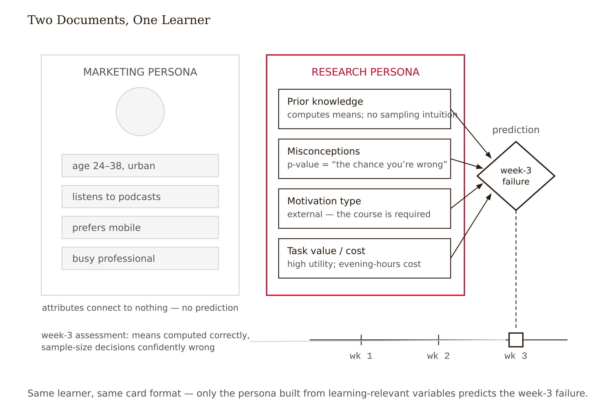
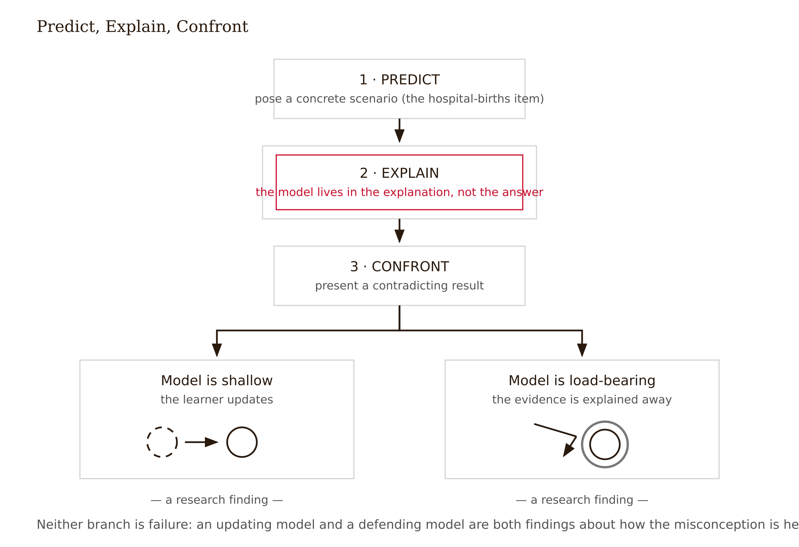
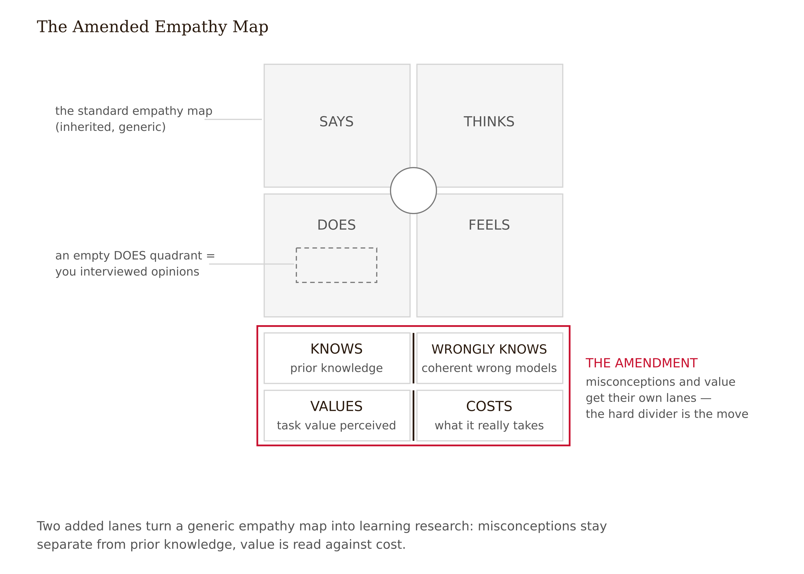
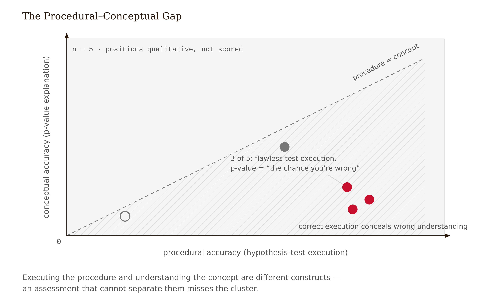
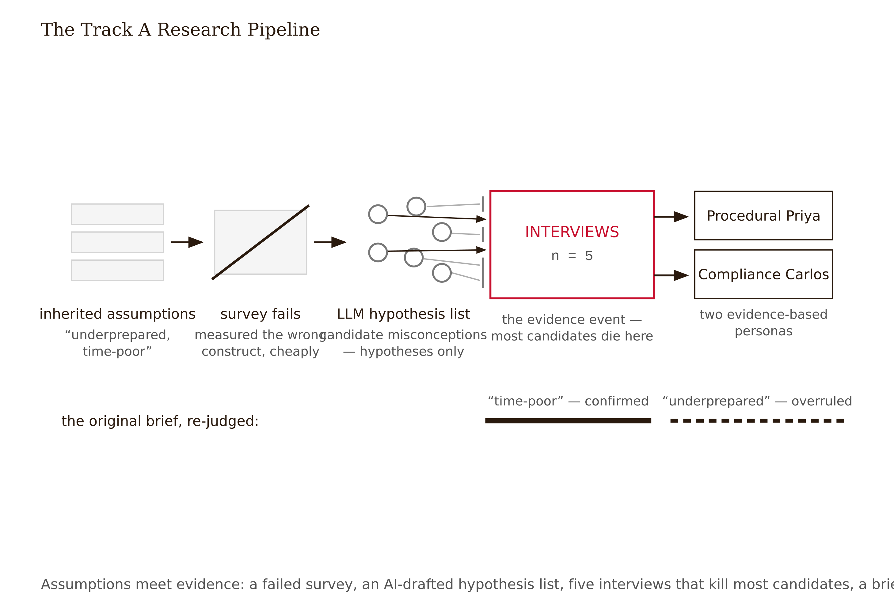

# Chapter 5 — Learner Research: Personas, Misconceptions, and Task-Value Mapping
*What is actually in your learner's head — and why the answer will surprise you.*

Here is a thought experiment that is also a real event that happens every few months at every company that makes learning products.

A workplace-skills platform is preparing to redesign its data-literacy course. Two documents about the same target learner are circulating in the same week.

The first comes from the marketing team, beautifully art-directed. "Busy Brenda, 34" smiles from a stock photo beside a tidy grid of attributes: mid-level operations manager, suburban, two kids, podcasts on her commute, "values efficiency and work-life balance," prefers mobile, "wants bite-sized learning that fits her busy life." Designers love it. It is, in the precise sense this course cares about, almost perfectly useless for learning design — and worse than useless, because it *feels* like knowledge. Nothing in it predicts what Brenda will do when she meets a confidence interval.

The second document comes from a learning researcher who spent four hours interviewing five actual operations managers. No photo. It says things like: *Holds a coherent wrong model of averages — believes an average is a "typical case" and is robust, so a department mean from six data points feels as trustworthy as one from six hundred. Took one statistics course nine years ago; remembers procedures, not meaning. Motivation is identified-regulation: she wants the analyst on her team to stop being able to end arguments she can't evaluate. Utility value is high but invisible to her in the current course — she described Module 3 as "math I'll never use," yet her own weekly dashboard depends on exactly that math. Cost sensitivity: interruptions every 8–10 minutes at work; evening study competes with childcare; she abandons anything that punishes a three-day gap.*

Six months after the redesign launches, the week-three assessment produces a familiar disaster: learners compute means and standard deviations correctly but make confidently wrong decisions in every scenario question involving sample size. The marketing persona could not have predicted this — nothing about podcasts and busyness touches it. The research persona predicted it almost verbatim: the "averages are robust" model, surfacing exactly where wrong model and assessment collide.

Only one of these documents is a research artifact. The other is demographic decoration. The question this chapter answers: how do you produce the first kind, and how do you recognize how much of what you currently believe about your own learners is actually the second?

---

The confusion between market research and learner research runs deep enough that it is worth naming precisely. Market research asks: *who will choose this product, and why?* Learner research asks: *what is in this person's head, and what will happen when our design meets it?* The two overlap in method — both interview, both segment — and differ completely in what counts as a finding. "Prefers mobile" is a market finding. "Believes a p-value is the probability the hypothesis is true" is a learning finding. The first shapes packaging. The second predicts failure at a specific moment in your course.

The distinction matters because LXD inherited the persona from UX, and UX inherited it from market segmentation, and at each inheritance the artifact kept its format while losing its function. The format is a character. The function — the actual research function — is a prediction machine: given these design inputs, where will this learner struggle, disengage, or fail? A persona that cannot make that prediction is decoration.

Four properties make research learning-relevant, and they become the organizing structure of everything you produce this week. First: **prior knowledge** — what the learner can actually do now, not what their transcript implies. Second: **misconceptions** — the wrong models they hold, which are not absences of knowledge but presences of something else, and which will defeat your instruction if you ignore them. Third: **motivation type** — which needs and regulations are actually in play, measured from the learner rather than assumed from the design. Fourth: **task-value perception** — whether the learner can currently see the utility, identity relevance, or interest in what you are teaching, and what the experience costs them in attention, time, and face.

Before you interview anyone this week, write down your design's current assumptions in these four categories. You almost certainly have them — every design does, usually inherited and unexamined. The week's real deliverable is finding out which ones survive contact with real people.



---

The reflexive objection to interviewing five learners is: "that isn't a sample." It is correct and it misunderstands what the measurement is for. Douglas Hubbard's framing is the right discipline here: a measurement is any observation that reduces uncertainty (Hubbard 2014). If you know nothing about what your learners wrongly believe, the difference between zero interviews and five is enormous; the difference between five and fifty is much smaller, and you will get the fifty later, cheaply, from instrumentation. Qualitative research at n = 3–5 cannot estimate prevalence — "40% of learners hold this misconception" — never report it as if it can. It is excellent at establishing existence: this misconception lives in this population, here is its structure, here is the moment it bites.

The craft of the interview is almost entirely about choosing observables that carry more signal than opinions. Learners' self-assessed confidence is among the least trustworthy signals in learning research. Learners systematically misjudge their own knowledge, and fluent experiences — the kind that *feel* like mastery — inflate the misjudgment. The same mechanism that makes satisfaction ratings worthless as learning evidence (Chapter 1) makes "do you feel confident with data?" worthless as a research question.

What beats it: interview around artifacts and episodes. "Walk me through the last time you used a spreadsheet to decide something" extracts a model in action. "Do you feel confident with data?" extracts vocabulary. The distinction sounds obvious in print; it is easy to forget when the interview is live and the participant is friendly and talking.

The second craft rule: ask for predictions and explanations, not reports. "What do you think would happen if..." exposes the model in the learner's head; "do you know about sampling?" exposes only whether they recognize the word. And the third: separate what they say from what they do. Give a small authentic task during the interview and watch. Five minutes of observed behavior routinely contradicts thirty minutes of self-report.

A note on ethics that is not optional: real learners are giving you data about their own ignorance — the most face-threatening data there is. Anonymize by default, get explicit consent for recording, and never let an excerpt become traceable in critique. The relationship between researcher and participant here is not neutral; it is an act of trust that your analysis either honors or betrays.

---

Now to the deepest idea this week, the one that most separates learner research from every other kind of user research. A **misconception** is not a missing piece of knowledge. It is a present, coherent, usually hard-won wrong model that actively generates wrong answers — and it will survive your instruction unless the design engages it directly.

This is not an intuition. Decades of conceptual-change research document it across domains: naive models are stable, self-consistent, and resistant to mere exposition. Instruction that ignores them produces students who pass procedural tests while the wrong model sits intact underneath, waiting for a transfer question to surface it. The lesson your student seemed to understand on Friday is not there on Monday because the lesson never dislodged what was there before it.

Statistics is the best-documented territory for this phenomenon, which is part of why the instructor chose it for the continuing case. Three examples from the literature.

The **law of small numbers**: people believe small samples should resemble the population in detail — so a department average of six observations feels as reliable as one of six hundred (Tversky & Kahneman 1971). This is not innumeracy; it is a coherent, internally consistent, wrong theory of sampling. It generates confident wrong answers on questions that require sample-size reasoning, even in students who can execute a hypothesis test flawlessly.

The **meaning-free p-value**: learners who can run a statistical test correctly will tell you the p-value is "the probability the null hypothesis is true" or that statistical significance means *importance*. Spiegelhalter (2019) documents how natural the misreading is; the CAOS instrument (delMas et al. 2007) shows it surviving completion of statistics courses at rates nobody in the field found comfortable. Procedural competence and conceptual understanding are not the same thing, and assessment design that cannot distinguish them will not see this failure until it is too late to be useful.

**Averages as typical and robust**: the mean is read as "the normal case," immune to outliers, meaningful without spread information. This makes every downstream concept — variance, sampling distributions, regression to the mean — land on hostile ground, because each of them requires the learner to have already updated a model they have not updated.

The interview technique that surfaces wrong models is the **predict–explain–confront** structure. First, give a concrete scenario and ask for a prediction: "A hospital records the days when more than 60% of births are boys. Would you expect more such days at a small hospital or a large one?" The wrong model — averages are stable properties, size doesn't affect reliability — says "same at both." Second, whatever they answer, ask *why*: the model lives in the explanation, not the answer. A correct answer with a wrong explanation underneath is a misconception with good camouflage, and it will surface three weeks later wearing the assessment. Third, present a result that contradicts their prediction and watch how they handle it. A learner whose model is shallow will update; a learner whose model is load-bearing will explain the contradicting evidence away — and they will do it fluently, confidently, and fascinatingly, and you must not argue. You are researching, not teaching. What you are watching is the model defending itself.

Each documented misconception becomes a design input with a location: the wrong model, the journey moment where it will collide with your content, and the design implication — which is almost never "explain harder" or "add a review module." The conceptual-change evidence favors designs that elicit the wrong prediction *first*, before teaching, and then make the confrontation an experience the learner generates rather than a paragraph the designer wrote. A misconception your research has documented is a designable event. One it hasn't is a week-three assessment disaster.



A finding from the GLP measurement framework is useful here: genuine learning produces coherent error trajectories — errors follow conceptually adjacent paths as the mental model develops. Random errors suggest borrowed certainty from an AI explanation that was fluent but not processed. Patterned errors suggest a developing but wrong model. Your misconception finding sheet should note whether the errors have conceptual structure or are scattered.

---

Raw interviews rot into anecdotes unless structured quickly. Two tools.

The **empathy map** organizes one learner's data into quadrants: *says* (verbatim quotes), *thinks* (inferences you can defend), *does* (observed behavior, including behavior that contradicts the saying), *feels* (affect, named or displayed). Two amendments make the generic tool learning-relevant: a **knows/wrongly-knows** lane, keeping prior knowledge and misconceptions separate rather than blurring them into a single "background" box; and a **values/costs** lane, capturing task-value perception and the real costs the learner pays. The tool is honest about its evidence status: a practitioner sense-making method with essentially no direct learning-outcome evidence — it earns its place by forcing the says/does separation and by making thin spots visible. An empty *does* quadrant means you interviewed opinions. That is the artifact telling you to go back.

**Motivation typing** applies Chapter 4's constructs as a coding scheme to the interview data. For each learner: which regulation style dominates their account of why they are here — external ("my manager requires it"), identified ("I need to stop being snowed by the analyst"), intrinsic (rare; treasure it when you find it)? Which SDT needs does their current experience feed or starve, in their own telling? And the task-value map — utility, attainment, interest — each scored *visible to this learner* or *invisible*, with the evidence, plus cost in their actual units: interrupted attention, evening hours, the face-threat of being seen struggling. These are not survey fields. They are codes applied to recorded speech, and the quotes are the evidence.



---

A **learner persona** is a composite character that compresses the research into a usable design tool. The format earns its keep only under discipline.

Every load-bearing attribute traces to evidence. A defensible persona footnotes its claims to interview moments: *"believes averages are robust (P2, P4; prediction task 3)."* An attribute with no source is decoration or projection — cut it or label it ASSUMED. The four learning-relevant categories are mandatory: prior knowledge, misconceptions with their structure, motivation type, task-value perception including cost. A fifth mandatory attribute joins them: calibration pattern — how does this learner respond when wrong? Do they update or explain away? A learner who consistently explains away contradicting evidence has a load-bearing wrong model. This is the error-trajectory signal in behavioral data and requires different design treatment from a surface misconception. Demographics enter only where they carry design weight: time poverty, device access, language.

The test of a persona is whether a designer who has never met your learners can read it and predict where this learner struggles, disengages, or fails — and be right. Apply this test to the two Brenda documents at the top of the chapter. One passes. One doesn't. What separates them is not the visual design, the empathy, or the length. It is whether the variables captured are the ones that predict the failure.

Two or three personas, not six. Each should represent a genuinely different design problem — different misconception structure, different motivation type, different cost profile — not a different demographic. If two personas predict the same failures, they are one persona with extra art direction.

Now the shortcut, because it is 2026 and this book will not pretend the shortcut doesn't exist. You can paste a course description into a language model and receive, in seconds, three articulate personas with names, goals, frustrations, and plausible-sounding misconceptions. The field genuinely uses this for early-cycle drafting. Here is the discipline: **an AI-generated persona is a hypothesis document, never a research artifact.** The model produces the centroid of the literature — the misconceptions common in published accounts of learners in general. What it cannot produce is the situated finding: that *your* learners hold a specific variant for a specific reason, or the verbatim quote that wins the design argument, or the discovery that surprises you. The generated persona is fluent, confident, and sourced to nothing: possibly true, evidentially empty.

Legitimate uses: drafting interview protocols, generating candidate misconceptions to probe for in the interview where they get confirmed or killed, stress-testing your real personas for gaps. The illegitimate use is the obvious one. The Evidence Disclosure on your studio assignment requires you to state your learner-data source — "generated" is an automatic fail of the research-grounded label. In the series' taxonomy this boundary is Tier 6 — collective intelligence requires real contact with people who have real stakes — and the phase gate that enforces it is simple: AI drafts the protocol; the human meets the learner (see Appendix: The Fundamental Themes).

---

Walk through the Track A case and the structure becomes concrete.

*DataWise 101*: an introductory statistics online course required across several professional master's programs. Eight self-paced modules. Auto-graded problem sets, a proctored final. Known symptoms: roughly 55% completion, a dropout concentration near week three, and an instructor's observation that students "pass the procedures and fail the meaning." The course team's diagnosis: "students are underprepared and time-poor; we need more review content and shorter videos." This is a learner-deficit hypothesis ("they lack things") with a content remedy ("add material"). Both halves are assumptions. Nobody had asked what the students *wrongly possess*.

The first research attempt — a survey — returned what self-report returns: most respondents "somewhat agree" they are comfortable with basic statistics. Useless twice: selection bias in who responded, and confidence is not knowledge. The survey measured the wrong construct cheaply.

A team member prompted an LLM for personas and got "Returning Professional Raj" who "struggles with mathematical notation." Against the interview transcripts, wrong in the way that matters: the real students were mostly fine with notation. Their problem was meaning, not symbols. The generated misconceptions were textbook-generic. The draft had one legitimate use: its candidate misconceptions became probes in the interview protocol, where most of them died.

Five interviews, 45 minutes each, built around an episode walk-through and predict–explain tasks from the course's own week-three content. The hospital-births item went to all five. Four answered "same at both hospitals," and their *explanations* shared a structure: averages are stable properties; sample size affects effort, not trustworthiness. One student, confronted with a contradicting simulation, explained it away as "a weird random thing" — the law of small numbers defending itself in real time, in 2026, exactly as Tversky and Kahneman predicted it would in 1971. Three of five could execute a full hypothesis test while describing the p-value as "the chance you're wrong." Two described the entire course as "math for the final," utility value invisible, despite each independently telling a work story — a dashboard, a vendor report, an A/B test — where exactly this content decides something they cared about.



The research compresses into two personas. **"Procedural Priya"**: can compute anything in the course; holds the stable-averages model and the meaning-free p-value; identified regulation; utility value high in life, invisible in course; cost profile — evening study, abandons after unexplained failure. **"Compliance Carlos"**: external regulation, minimal prior knowledge, few active misconceptions; at risk from cost, not confusion. Every attribute footnoted to transcript moments.

The team's original brief is then held against the research. "Underprepared" — *fails* for four of five. They are *mis*-prepared. More review content would feed the wrong model more procedure; it cannot dislodge the wrong model underneath. "Time-poor" — *survives*. One design assumption overruled. One confirmed. The research did not validate the brief; it rewrote it. That is what the method is for.



The limit is honesty about scope: five interviews establish that the stable-averages model is real, structured, and active in this population. They do not establish whether it afflicts 40% or 90% of the 240 enrolled, which matters for how much redesign budget it deserves. That estimate needs instrumentation — Chapter 13 builds a detector from item-response patterns. And interview research over-samples the articulate and the willing. The students who most need the redesign may be the ones who didn't answer the recruiting email. Both limits belong in the Evidence Disclosure rather than rounded away.

---

Before the studio work, a methodological honesty the field does not always supply. The evidence base for this week's *content* — misconceptions, task value, the conceptual-change findings — is among the strongest this course uses. The evidence base for this week's *artifacts* — empathy maps, persona format — is practitioner consensus. A communication and compression tool. There is essentially no direct evidence that persona use improves learning outcomes; the research inside the persona is evidence-based, but the character format is folklore. That is not a reason to skip the format — it is a reason to keep the evidence in the transcripts and treat the persona as packaging. When the persona and the transcripts disagree, the transcripts win.

What the week establishes, stripped to the bone: every design you have ever built was built on assumptions about what learners know, wrongly know, want, and can afford. Most of those assumptions were inherited, untested, and invisible. The method this week makes them testable — not by proving they are wrong, but by putting them in a room with five real people and seeing which ones survive. The ones that don't survive are where the redesign begins.

Chapter 6 maps the journey the syllabus cannot see. You now know Priya's wrong model and her cost profile. But where, exactly, in eight weeks of experience, do they detonate?

---

## Exercises

**Warm-up**

1. *(Understand / classify)* Take the "Busy Brenda" marketing persona from the opening case. For each attribute listed, classify it: *learning-relevant as stated / learning-relevant if reframed (state the reframe) / decoration.* Then write the single predict–explain interview question most likely to reveal whether the real Brenda holds the stable-averages misconception. *What this tests: whether you can convert a demographic attribute into a research probe, not just label it useless.*

2. *(Understand / apply)* A colleague reports from an interview: "P3 has a knowledge gap around sampling — she didn't know what a sampling distribution is." State the crucial thing this report may have gotten wrong, and write the follow-up task you would send the colleague back to conduct. *What this tests: the gap/misconception distinction — the chapter's core disciplinary move.*

3. *(Understand / recall)* The Evidence Disclosure classifies design decisions into three categories. Name and define each. Then classify the following decision from the Track A case: "the team shortened videos to under six minutes because the survey showed learners felt overwhelmed." *What this tests: ability to apply the disclosure structure to a real decision before it is your own decision at risk.*

**Application**

4. *(Apply / produce)* Draft your full interview protocol for Studio Assignment #1: one episode walk-through prompt anchored to a real artifact; two or three predict–explain tasks built from your actual course content; one confront move prepared for your highest-stakes suspected misconception; a consent script. Bring this to studio before running any interview — use the LLM Exercise below to red-team it first. *What this tests: ability to operationalize the interview structure, not just describe it.*

5. *(Apply / analyze)* Using the Track A transcripts (or, for Track B, your own interview notes): build one complete empathy map with the knows/wrongly-knows and values/costs lanes added. Then state one attribute you are tempted to include that you cannot trace to a transcript moment — and make the call explicitly: cut it or label it ASSUMED. *What this tests: the discipline of sourcing, not the empathy.*

6. *(Apply / produce — Studio Assignment #1, 25/30 points)* Conduct the learner research and submit: (a) your pre-research assumptions page, dated before first contact; (b) 3–5 empathy maps with the two added lanes; (c) 2–3 evidence-based personas, every load-bearing attribute footnoted; (d) a misconception finding sheet — each wrong model, its structure, supporting quotes, and the journey moment where you predict it bites; (e) the assumptions page marked *survived / overruled / untested*; (f) your Evidence Disclosure. Track A: work from the provided transcripts and data package, plus optionally one supplementary interview with a current or former statistics student for full marks on (d). Track B: own learners, own project, bonus eligible. *What this tests: the whole method, end to end, on real data.*

**Synthesis**

7. *(Synthesize / evaluate)* The chapter claims that AI-generated personas are legitimate for protocol drafting and hypothesis generation but not as a substitute for learner contact. A classmate argues this is inconsistent: if a generated persona lists the stable-averages misconception as a candidate, and your interview confirms it, the generated persona has done exactly what a research artifact does — predicted failure. Respond: where is the classmate right, where are they wrong, and what would a study need to show to resolve the disagreement in AI's favor? *What this tests: ability to distinguish hypothesis generation from evidence, and to specify what falsification would look like.*

8. *(Synthesize / design)* You have documented Priya's misconception and Carlos's cost profile. A stakeholder asks you to rank them by redesign priority. Write one paragraph making the case for prioritizing Priya, then one making the case for prioritizing Carlos. Then name the one piece of information — not currently in the research — that would settle the question. *What this tests: ability to reason about design trade-offs from learner data, and to identify what the data cannot yet settle.*

**Challenge**

9. *(Challenge / open-ended)* The chapter identifies a methodological gap: interview research establishes existence but not prevalence, and the students most likely to hold the highest-impact misconceptions may be least likely to respond to recruiting emails. Design a low-cost instrument — embedded in the course itself, not a separate recruitment process — that could estimate misconception prevalence in the full enrolled population before the redesign launches. What would it measure? When would it appear? How would you validate it against the interview findings? Name the three hardest trade-offs in building it. *What this tests: ability to connect qualitative learner research to quantitative instrumentation design — the bridge this chapter identifies as Chapter 13's territory, brought forward.*

---

## Chapter 5 Exercises: Learner Research

**Project:** The Redesign Dossier
**This chapter adds:** `dossier/05-learner-research.md` — your interview protocol, empathy maps with the knows/wrongly-knows and values/costs lanes, a misconception finding sheet, two or three evidence-based personas with every load-bearing attribute footnoted, and your assumptions page marked survived / overruled / untested. Built from interviews with real learners. Not one learner attribute in this file comes from a model.

This is the chapter where the AI + 1 division of labor gets its sharpest test, because the chapter itself documents the trap: an AI-generated persona is a hypothesis document, never a research artifact. The exercises below operationalize that rule — AI on the protocol and the synthesis machinery, you and only you on the contact with humans.

### Exercise 1 — When to Use AI

**Task 1 — Red-team your interview protocol.** Draft your protocol first (Exercise 4 above): episode walk-through anchored to a real artifact, predict–explain tasks built from your actual content, a confront move for your highest-stakes suspected misconception, consent script. Then have the model attack it: every question that elicits opinion or self-assessment where an episode or prediction would carry more evidence; every question a learner could answer correctly while holding a wrong model underneath; every leading question; anything in the confront move that would make a participant feel tested rather than researched. *Why AI works here:* critique against stated criteria. The methods rules are explicit in this chapter; the model applies them at speed, and you can check every flag against the same rules it used.

**Task 2 — Generate candidate misconceptions to probe.** Paste your course or topic description and ask for the eight most likely coherent wrong models in this domain, each with the predict–explain question that would surface it. These go into your protocol as probes, where real learners confirm or kill them — the DataWise team did exactly this, and most of the generated candidates died in the interviews, which was the candidates doing their job. *Why AI works here:* hypothesis generation. The model produces the centroid of the published literature, which is precisely what a probe list should start from — provided every candidate's status is "unconfirmed until a real learner exhibits it."

**Task 3 — Rehearse the confront move on a participant you can afford to burn.** Have the model role-play a member of your learner population holding one hidden, coherent misconception, answering your predict–explain questions with the hedges and confident wrong explanations real learners produce. Practice probing the explanation, presenting the contradicting result, and — hardest — not arguing when the model defends itself. *Why AI works here:* simulation for rehearsal. The role-play is a flight simulator for your interviewing technique, and it costs nothing to crash. The simulated participant counts toward your 3–5 interviews never, under any circumstances.

**The tell:** You know you are using AI appropriately when you can evaluate the output — when you have independent criteria to judge whether it is correct, complete, and fit for purpose.

### Exercise 2 — When NOT to Use AI

This is the book's pivotal When-NOT chapter, so the list gets one extra degree of bluntness.

**Task 1 — Do not generate your personas.** Not as a first draft to "refine with data later," not as a placeholder, not because the deadline is close. *Why AI fails here:* missing ground truth. The model produces fluent, confident personas sourced to nothing — the misconceptions common in published accounts of learners in general. It cannot produce the situated finding that *your* learners hold a specific variant for a specific reason, the verbatim quote that wins the design argument, or the discovery that surprises you. The Evidence Disclosure on Studio Assignment #1 requires you to state your learner-data source, and "generated" is an automatic fail of the research-grounded label.

**Task 2 — Do not substitute simulated interviews for real ones.** Five role-played "interviews" produce literature-typical answers from nobody you will ever design for, and they cost you the thing the method exists to deliver: the surprise that rewrites your brief. *Why AI fails here:* this is the Tier 6 boundary, not an efficiency question. Real learners hand you face-threatening data about their own ignorance — an act of trust the chapter's ethics paragraph exists to honor. There is no one inside the simulation to owe that honor to, and nothing inside it that can surprise you the way participant four explaining away a contradicting simulation in real time can.

**Task 3 — Do not let the model fill the thin spots in your synthesis.** An empty *does* quadrant on an empathy map means you interviewed opinions — the artifact is telling you to go back to the field, not to a text box. *Why AI fails here:* hallucination, in its most damaging form — invented evidence. A model asked to "complete" an empathy map will complete it, fluently, with attributes and quotes nobody said. Once invented data enters this file it propagates through the journey map, the triage table, the measurement plan, the final portfolio — all of it citing research that never happened.

**The tell:** When the task is done, close the chat and explain the conclusion — and the evidence behind it — out loud, to a colleague or to the wall. If the explanation is yours, the AI was an instrument. If you could not explain the conclusion without the AI, the AI did the work that should have been yours.

**Series connection:** Tier 6 Collective — real-human contact is the point, and AI cannot interview your learners. A synthesis built on simulated humans is the marketing persona from this chapter's opening, wearing research formatting. (Plus Tier 4: knowing exactly what each tool's output can and cannot serve as evidence for.)

### Exercise 3 — LLM Exercise: Build dossier/05-learner-research.md

This exercise absorbs the chapter's standalone LLM exercise — its two-role red-team is Phase A here — and adds the synthesis discipline for after your fieldwork.

**Tool:** Claude Project "Redesign Dossier," with `dossier/01`–`04` in Project knowledge. The Project persists between Phase A (before your interviews) and Phase B (after), which is the point: same context, weeks apart, no re-explaining your project.

**Before you start:** draft your interview protocol yourself (Exercise 4 above). Asking the model to write it from nothing hands you literature-typical questions aimed at nobody you will actually meet.

Copy-paste prompt:

```
You are my research-methods partner for the Redesign Dossier project. We are
building dossier/05-learner-research.md in two phases separated by real
fieldwork. Read dossier/02-project-charter.md and dossier/04-motivation-audit.md
first — the audit's CARRY-FORWARD list of ASSUMED cells is what my interviews
must settle. If those files are not in this Project, ask me to paste them.

One absolute rule for both phases: you never generate learner data. No
invented quotes, no invented attributes, no invented participants. Where
information is missing, your only valid outputs are a question for me or the
marker RETURN-TO-FIELD.

PHASE A — RED-TEAM MY PROTOCOL (before fieldwork). I will paste my draft
interview protocol: episode walk-through, predict–explain tasks built from my
actual content, a confront move for my highest-stakes suspected misconception,
and a consent script. Play two roles in sequence, and do not write new
interview questions for me at any point.

ROLE 1 — hostile methods reviewer. Flag: (a) every question eliciting opinion
or self-assessment where an episode, prediction, or observed task would carry
more evidence; (b) every question a learner could answer correctly while
holding a wrong model underneath — no explanation probe; (c) every leading
question that telegraphs the answer I want; (d) anything in my confront move
that would make a participant feel tested rather than researched. Cite which
question you mean each time. State the failure and the principle; I do the
rewriting.

ROLE 2 — pilot participant. Adopt a plausible member of my learner population
holding ONE coherent misconception relevant to my content (choose it yourself;
do not reveal it in advance). Answer my predict–explain questions in character,
with the evasions, hedges, and confident wrong explanations real learners
produce. Then break character and tell me: which questions surfaced your hidden
model, which let it hide, and what the transcript would have looked like one
probe deeper. Then stop — no summary advice, no model protocol. I go interview
real people; you do not count toward my 3–5.

PHASE B — SYNTHESIZE MY NOTES (after fieldwork). I will paste my typed,
anonymized interview notes. Rules: (1) use only what is in the notes — every
attribute you propose must cite its source moment (e.g., "P2, prediction task
1"); (2) quotes are verbatim strings from my notes, or they are not quotes;
(3) where a participant's words and behavior conflict, preserve the
contradiction visibly — the says/does gap is a finding, not a flaw to smooth;
(4) where a quadrant or category is thin, write RETURN-TO-FIELD, never a
plausible filler; (5) label every inference INFERENCE and wait for me to accept
or reject it before it enters the draft.

From the notes, draft: an empathy map per participant (says / thinks / does /
feels, plus the knows/wrongly-knows and values/costs lanes); a misconception
finding sheet — each wrong model, its structure, supporting quotes, and the
journey moment where I predict it bites; motivation typing per participant
using Chapter 4's codes (regulation style, needs fed or starved, task-value
visibility, cost in the participant's own units); and 2–3 candidate personas
ONLY if each represents a genuinely different design problem — different
misconception structure, motivation type, or cost profile — not a different
demographic. Every load-bearing attribute footnoted. Then take my pre-research
assumptions page and mark each assumption survived / overruled / untested,
citing the note moments that decide it.

Finally, assemble the complete dossier/05-learner-research.md in markdown,
ending with a section listing every RETURN-TO-FIELD marker and every inference
I rejected.
```

**What this produces:** your fifth dossier file — the research package: protocol (revised under fire), empathy maps, misconception finding sheet, footnoted personas, and the assumptions page with verdicts. Every attribute traceable to a note moment; every gap named instead of filled.

**How to adapt:** *Own project:* if your learners are colleagues, the consent script matters more, not less — face-threat is highest where people know each other; anonymize before anything enters the Project. *ChatGPT/Gemini:* run both phases in a ChatGPT Project or Gemini Gem with the dossier files attached; or run Phase A in any chat and start Phase B fresh, pasting your protocol and notes — the rules travel inside the prompt. *Claude Project split:* add the finished file to Project knowledge; Chapter 6 reads it directly.

**Connection to previous chapters:** `dossier/04-motivation-audit.md`'s ASSUMED carry-forward list is your interview target list, and Chapter 4's constructs are the coding scheme the motivation typing applies. `dossier/02-project-charter.md`'s assumptions get their survived/overruled verdicts here — the research does not validate the brief; it rewrites it.

**Preview of next chapter:** the misconception finding sheet's "journey moment where it bites" column is the seed of Chapter 6. `dossier/06-journey-map.md` places your documented wrong models, cost profiles, and motivation types on the learner's actual calendar — and finds where they stack.

### Exercise 4 — CLI Exercise: The Traceability Check

**Tool:** Cowork or Claude Code. Justification: this is a two-file cross-referencing job — every attribute in the synthesis traced against the raw notes — which is exactly what an agent with folder access does precisely and a chat window does sloppily.

**Skill level:** Beginner-plus. Read-only on sources, one report file — but you must prepare the notes file first.

**Setup checklist:**
- `dossier/05-learner-research.md` (Exercise 3, Phase B output)
- `dossier/notes/interview-notes.md` — your typed, anonymized notes, the same text you pasted in Phase B
- Backup or git commit of the dossier folder
- The `CLAUDE.md` evidence-documents line from Chapter 4's exercise still in place, plus this addition: *"dossier/notes/ contains primary research data. Never summarize, paraphrase, or 'clean' it in place."*

Paste-ready Task block:

```
Read dossier/05-learner-research.md and dossier/notes/interview-notes.md. Both
are read-only evidence documents: do not modify them or any other existing
file.

Create dossier/_checks/05-traceability.md with exactly four sections:

1. ATTRIBUTE TRACE. One row per load-bearing attribute in the personas and
   empathy maps of 05: the attribute, its cited source (e.g., "P2, prediction
   task 1"), and the exact passage in interview-notes.md that supports it —
   quoted, with the line number. Where no supporting passage exists, write
   NOT FOUND.

2. QUOTE VERIFICATION. Every string presented as a learner quote in 05,
   checked verbatim against interview-notes.md. Mark each VERBATIM,
   NEAR-MATCH (show both versions side by side), or NOT FOUND.

3. CONTRADICTION PRESERVATION. List every place in interview-notes.md where a
   participant's reported words and observed behavior conflict, and state
   whether that contradiction is visible in 05 or was smoothed away in
   synthesis.

4. PREVALENCE LANGUAGE. Flag every sentence in 05 that states or implies
   prevalence — percentages, "most learners," "typically" — since interviews
   at n = 3–5 establish existence, not prevalence.

Stop after writing this one file. Do not fix anything you find, do not edit
the sources, do not create any other file.
```

**Expected output:** one new file, `dossier/_checks/05-traceability.md`, four sections.

**What to inspect:** the NOT FOUND and NEAR-MATCH lists first — every entry is either your sloppy citation or the model's invention, and you need to know which before Chapter 6 builds on this file. Then CONTRADICTION PRESERVATION: if your messiest interview moment is missing from 05, the synthesis smoothed your best finding. Then PREVALENCE LANGUAGE — rewrite any flagged sentence as an existence claim.

**If it goes wrong:** if the check file quotes passages that are not in your notes, the checker itself hallucinated — which is the chapter's lesson arriving uninvited; delete the check file and re-run with *"cite the line number in interview-notes.md for every quoted passage"* made explicit. If the agent edited a source file, restore from backup and confirm both CLAUDE.md lines. If section 1 comes back empty because your personas carry no citations, that is not a tool failure — return to Exercise 3 Phase B and demand the footnotes.

**CLAUDE.md/AGENTS.md note:** the `dossier/notes/` line above is permanent; mirror it in `AGENTS.md` if your agent reads that file instead. Primary data is the one thing in this project no agent may ever touch.

### Exercise 5 — AI Validation Exercise: The Invented-Attribute Hunt

**Validates:** Exercise 3 Phase B output — the model's synthesis of your real notes — against the ground truth only you hold: the notes themselves and your memory of being in the room. Use your own output; this is the one chapter where you personally possess ground truth nobody else has.

**Validation type:** source-tracing validation against primary data you collected.

**Risk level:** **High.** A hallucinated quote in a persona is fabricated research data. Everything downstream — journey map, triage table, measurement plan, final portfolio — inherits whatever enters this file, and the portfolio's Evidence Disclosure stakes your name on its source.

**Setup:** side by side: `dossier/05-learner-research.md`, your raw notes, and the Exercise 4 traceability report if you ran it. One hour. The model was never in the room; you were. That asymmetry is the entire instrument.

**The checklist:**
- **Correctness.** Does each attribute mean what the notes say? Watch the gap/misconception distinction: "P3 doesn't know X" and "P3 wrongly knows Y" are different findings with different design consequences, and synthesis loves to flatten them into "struggles with X."
- **Completeness.** Every persona carries all four mandatory categories — prior knowledge, misconceptions with their structure, motivation type, task-value perception including cost — and RETURN-TO-FIELD markers stand wherever your data was thin.
- **Scope.** Nothing beyond your participants and notes; demographics only where they carry design weight; no prevalence claims from n = 5.
- **Verbatim quotes (chapter-specific).** Read every quoted string in the file against your notes, out loud. Verbatim, or it loses the quotation marks.
- **Contradictions preserved (chapter-specific).** Find your single messiest interview moment — the participant who explained the contradicting evidence away, the confident wrong answer delivered fluently — and confirm it survived into the synthesis. The model's drive toward coherent characters is exactly what destroys the says/does gap your method exists to capture.
- **Failure mode check.** (1) *Fluent-but-wrong:* does a persona read suspiciously like "Returning Professional Raj" — articulate, typical, literature-shaped? Typicality is the signature of the centroid, not of your population. (2) *Invented attributes (chapter-relevant):* any quote, motivation, or biographical detail you cannot find in your notes is fabrication, however plausible — this is the documented AI-persona trap. (3) *Missing ground truth:* any candidate misconception from Exercise 1 Task 2, or any trait of the Phase A role-play participant, appearing in the file without a real participant exhibiting it — the hypothesis list leaking into the findings.

**What to do with findings:** All checks pass — file it and write the disclosure. One fail — cut the attribute or relabel it ASSUMED yourself, and note the fix in the disclosure. Multiple fails — the When-NOT moment, and in this chapter it has a specific shape: re-synthesize by hand from the notes. Empathy mapping at n = 5 is a few hours of human work, and the chapter's quiet point stands — the transcripts, not the personas, are the evidence. When persona and transcript disagree, the transcript wins.

**AI Use Disclosure prompt:** Add exactly two sentences at the top of `dossier/05-learner-research.md`. Sentence one states what the AI produced and what you produced (e.g., *"Claude red-teamed my protocol and formatted the synthesis under source-tracing rules; all learner data comes from [N] interviews I conducted on [dates]."*). Sentence two states what you verified and what remains open (e.g., *"Every quote verified verbatim against my notes; thin spots are marked RETURN-TO-FIELD, not filled."*).

**Series connection:** this exercise trains detection of hallucinated evidence — invented attributes, fabricated quotes, smoothed-over contradictions — the failure mode this chapter documents as the AI-persona trap. The tier is Tier 6 Collective: the validation works only because you did the irreducibly human part, sitting with real learners, and therefore hold ground truth the model cannot have.

---

## References

All named studies and instruments in this chapter were fact-checked on 2026-06-07 and confirmed against primary sources. No OUTDATED or CONTRADICTED claims found. See factchecks/05-learner-research-personas-misconceptions-and-task-value-mapping-assertions.md.

1. Tversky, A., & Kahneman, D. Belief in the law of small numbers. *Psychological Bulletin*, 76(2), 105–110, 1971. https://www.semanticscholar.org/paper/894fc603f9b16e775f95045fb805b5d7e6935944 — *The hospital-births vignette used in the chapter is most often cited to Tversky & Kahneman (1974, Science 185:1124–1131); both attributions are sound.*
2. delMas, R., Garfield, J., Ooms, A., & Chance, B. Assessing students' conceptual understanding after a first course in statistics. *Statistics Education Research Journal*, 6(2), 28–58, 2007.
3. Spiegelhalter, D. *The Art of Statistics: How to Learn from Data.* Pelican/Basic Books, 2019.
4. Hubbard, D. W. *How to Measure Anything: Finding the Value of Intangibles in Business* (3rd ed.). Wiley, 2014.
