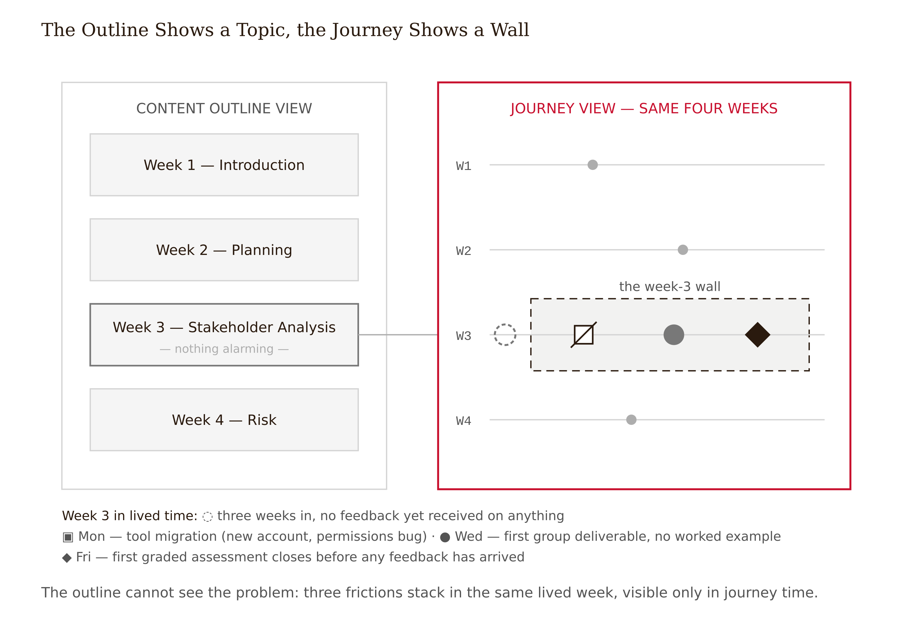
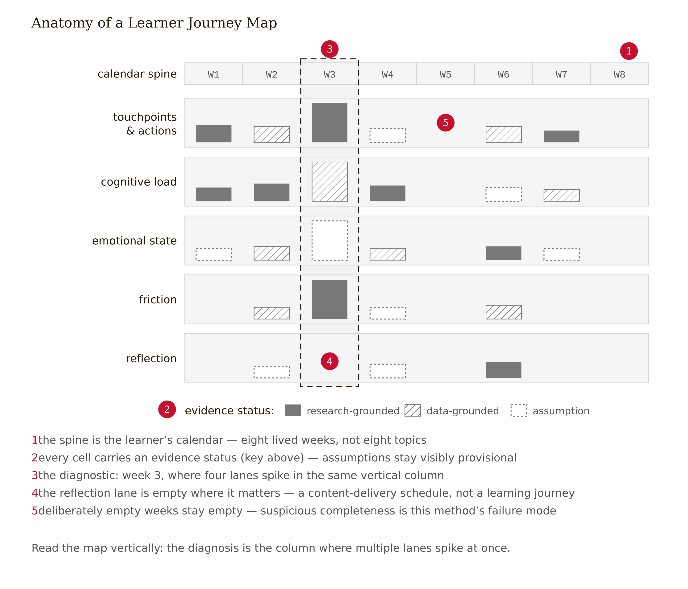
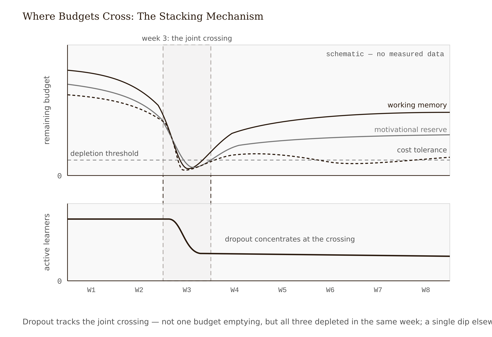
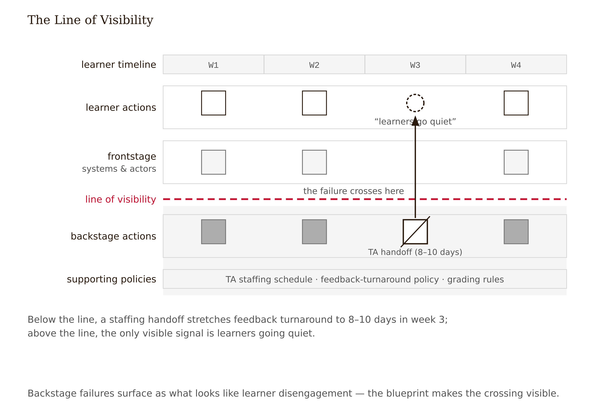
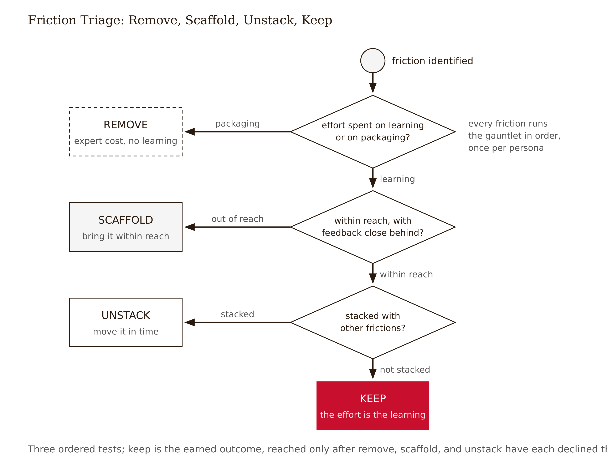

# Chapter 6 — Mapping the Learning Journey: Experience, Not Content
*The course your syllabus cannot show you.*

A course team spent three months chasing a dropout cliff that sat in the same week, in the same week, cohort after cohort. Of every hundred students who finished week two, forty never submitted anything again. Not a slow leak — a cliff, repeatable as clockwork. The team studied the content outline. Week three was *Stakeholder Analysis and Communication Planning*. Nothing alarming. Not the hardest topic in the course. The videos were well-produced. Satisfaction ratings from the students who remained were fine. The team concluded the topic must be secretly boring, commissioned a livelier video series, and watched the next cohort drop 41%.

Then someone asked a different question. Not *what is in week three?* but *what happens to a learner in week three?* Monday: the course migrates from the LMS's built-in tools to an external collaboration platform — new account, new interface, a permissions bug that support takes two days to resolve. Wednesday: the first group assignment opens — the course's first non-quiz deliverable, with no worked example, no rubric, and teammates the student has never spoken to. Friday: the first graded assessment of the entire course closes, before any student has received feedback on anything in three weeks. Three decisions, made by three different people, none wrong in isolation, all landing in the same five days of a real human being's life.

The content outline showed a topic. The experience showed a wall. And the wall was invisible until someone stopped reading the syllabus and started reading time.



---

The distinction that unlocks this chapter is simple and consequential. A *content outline* answers: what will be presented, in what order? A *learner journey map* answers: what will be experienced, in what order — and what does each moment do to a specific person's cognitive load, motivation, and likelihood of still being here next week? The two documents describe the same course and share almost no information. Courses are planned as outlines. They are lived as time.

The journey map comes from customer-experience design, where tracking a customer's end-to-end path — touchpoints, actions, emotions, friction — has been mature practice for decades (Kalbach 2016 is the standard treatment). Learning experience design borrows the structure and makes one crucial substitution. Where customer-experience work maps satisfaction and conversion, a learning map tracks the constructs that actually govern whether learning happens: cognitive load, motivation quality, feedback timing, the difference between productive and destructive struggle. A map that only tracks delight is a customer-experience artifact wearing an education costume. It will faithfully guide you toward the smoothed, beautiful, empty experience that opens this book.

Three commitments separate the learning version from the generic one.

*Time is the spine.* The horizontal axis is the learner's lived sequence — including everything the outline omits. Account creation. The wait for feedback. The gap between sessions on a Tuesday night after work. The return after a missed week. Learning-critical events concentrate disproportionately in the omitted parts. The week-three wall was built entirely from things the outline did not contain.

*Experience runs in parallel lanes.* Under the timeline, multiple lanes capture different dimensions simultaneously: where cognitive load is high, where affect signals danger, where friction accumulates, where the design asks for reflection and where it forgets to. The analytical move is vertical alignment — when the load lane and the affect lane and a tool-change touchpoint all spike in the same column, you have found something no single lane could show.

*Every cell carries an evidence status.* This is the discipline the method requires to be more than imagination arranged attractively in time. Each entry in the map is either research-grounded — a learner said this, you observed it — or data-grounded — analytics confirm it — or an assumption. The map labels which, cell by cell. A journey map built from the design team's imagination about how learners feel is not research. It is the team's assumptions given a timeline and a color scheme.



---

The lanes are not decorative. Each one tracks a construct with a real evidence base, and what you put in each lane shapes what the map is capable of finding.

**Cognitive load** is the lane for what Chapter 3 taught as mechanism. Where is intrinsic load genuinely high — material that requires holding many interacting elements in working memory simultaneously? Where is extraneous load being added by the design — new interfaces, split attention, ambiguous instructions, the time cost of fighting a tool? A high-load moment is not automatically a problem. High intrinsic load at a well-scaffolded point is the course doing its job. Extraneous load stacked *on top of* high intrinsic load is the killer. The cognitive-load lane exists to show you the stacking, which is invisible to any instrument that only measures one of them.

**Emotional state** is the lane that gets filled last and matters more than teams expect. The temptation is to annotate with emoji — confused here, happy there — which produces decoration rather than diagnosis. The useful entries are *appraisals*, not moods: Pekrun's control-value theory holds that achievement emotions arise from two distinct evaluations (Pekrun 2006). *Control:* can I do this? *Value:* does this matter? A learner writing "I failed the problem set and don't know why" is experiencing a control collapse — the belief that effort is not connected to outcome. A learner thinking "math for the final" is experiencing a value blank — no answer to why this matters. These produce different emotional signatures, different behavioral responses, and different fixes. Anxiety, boredom, hopelessness, and frustration are not interchangeable entries in the affect lane; they are diagnostic signals about which appraisal broke. Populate this lane from interview evidence and behavioral traces, never from how the design team imagines their learners feel. Teams reliably imagine their courses are exciting.

**Friction** gets logged neutrally — every point where progress requires effort beyond the learning itself: waits, tool switches, ambiguous instructions, hunting for requirements. The triage — whether each friction belongs or should be removed — comes later. The map's job in this lane is to accumulate, not to judge.

**Reflection opportunities** is the lane designers most often leave empty, because the outline never contained it. Where does the experience ask learners to consolidate — retrieve, self-explain, connect to prior work? Mark both designed reflection (a prompt, a retrieval quiz) and structural reflection (the gap between sessions that spacing research suggests is doing silent work; anchor the exact systematic-review citation before freeze). A journey map with no entries in this lane is a content delivery schedule. Expect fluency without durability.

---

Here is the mechanism the opening case illustrates — the closest thing this chapter has to a structural law. **Learners rarely quit over single causes. They quit where causes stack.**

Attrition research in online learning consistently finds dropout concentrated in the early weeks, and trajectory studies show disengagement is patterned rather than random — learners slide through identifiable behavioral states with inflection points that align with course events (Kizilcec, Piech & Schneider 2013). The persistence literature has made the structural version of this argument since Tinto (1993): departure is an interaction between the person and the institution's experience, not a property of the person.

Why stacking, mechanistically? Each friction consumes from a shared budget. The tool change spends working memory and time. The unscaffolded first assignment then arrives with no spare cognitive capacity, produces failure without explanation, and triggers a control collapse — the belief that effort is disconnected from outcome. The first graded assessment closes before any feedback could repair that belief. For the learner whose value lane was already blank — for whom the course was instrumental to begin with — no appraisal remains that argues for staying. Each designer made one reasonable decision. The learner experienced their sum.



The central diagnostic follows: scan the map for *vertical pile-ups* — columns where multiple lanes go red at once — and treat the worst column as the journey's highest-risk moment. Two cautions keep this honest. First, a pile-up is a hypothesis about cause. The analytics show where learners vanish; the map proposes why; the proposal awaits testing. Week three also coincides with everything else in a learner's life that happens three weeks in — add/drop deadlines, the first tuition installment, the moment when initial enthusiasm meets real schedule constraints. No redesign touches those. Second, absence of a pile-up where data shows a cliff means the lanes are missing something — usually backstage failures, which bring us to the instrument the journey map does not contain.

---

A journey map shows the learner's side of the experience. A *service blueprint* adds everything behind it (Stickdorn et al. 2018): the frontstage, the backstage, and the line of visibility separating them. The frontstage is every actor and system the learner directly encounters. The backstage is the work the learner never sees — grading queues, content updates, staffing schedules, the TA training handoff that happens in week three of every term. Supporting systems and policies run underneath: LMS rules, late penalties, notification logic.

Why a learning designer needs the backstage on paper: **backstage failures present as learner failures.** A course's analytics showed learners going silent mid-course — read by the team as classic disengagement, non-completers who had checked out. The blueprint told a different story: a support-staff transition had stretched assignment-feedback turnaround from two days to nine. Learners submitted work, waited, submitted the next assignment blind, and concluded — reasonably — that nobody was on the other end. The relatedness need was being starved by a staffing schedule. On the journey map: learner abandonment. On the blueprint: a service-level failure with a precise, unglamorous fix.

The blueprint also disciplines redesign ambition. Every frontstage improvement has a backstage cost. "Add individual feedback before the first assessment" is a sentence on a journey map and a staffing commitment on a blueprint. Designers who map only the frontstage routinely propose experiences their organizations cannot operate.

The course-minimum version of this is three added rows: frontstage actors and systems, backstage actions, governing policies. Draw the line of visibility. Then annotate every learner-facing promise — feedback, support, peer interaction — with who actually delivers it and at what turnaround. That single pass catches most of what the section describes.



---

The map is now covered in friction marks. The naive next move is the dangerous one: smooth everything. Some friction is the learning. Desirable difficulties feel worse in the moment and produce more durable retention; strip them out and you get Chapter 1's beloved product that taught nothing. The map's final skill is friction *triage* — deciding at each marked point whether to remove, keep, or keep but scaffold — with the evidence status of each call labeled. The remove-versus-keep distinction is the series' Frictional principle in instrument form: extraneous load impedes the mechanism of learning, while germane difficulty *is* the mechanism (see Appendix: The Fundamental Themes).

Three tests, in order.

**Is the effort directed at the learning or at its packaging?** Struggling to retrieve a sampling concept is germane — the effort and the schema-building are the same act. Struggling to install the statistics software is extraneous, full stop. A simple check: would a domain expert also pay this cost? The expert still installs the software — remove or smooth it. The expert does not struggle on retrieval — that struggle is the point.

**Is the difficulty within reach, with feedback close behind?** A desirable difficulty is desirable only when the learner can eventually succeed and learns from the attempt. The same retrieval task is germane for the prepared learner and a control collapse for the unprepared one. Difficulty is a property of the learner-task pair, not the task in isolation — Chapter 3's expertise caveat in journey clothes. Triage each friction *per persona*. A problem set that is productive struggle for one profile needs scaffolding — not removal — for another.

**Is it stacked?** A keepable difficulty in a pile-up column is still a redesign target — not by removing the difficulty but by *unstacking* it. Move the tool change a week earlier when budgets are slack. Insert a feedback cycle before the assessment. Let the difficulty stand alone where the learner can afford it. The most evidence-disciplined fix on most maps is not subtraction but redistribution.



The triage output is a table: friction point, lane evidence, call (remove / keep / scaffold / unstack), evidence status. Expect to remove mostly logistics, keep mostly assessment-adjacent struggle, and unstack the one column where the cliff lives. And expect learners to disagree with every "keep" — they will vote every desirable difficulty off the island, and that tension is next week's problem.

---

A worked example makes the method concrete. The *DataWise 101* eight-module course has 55% completion and a week-three cliff: 38% of students active in week two record no further submissions afterward. The course team's standing diagnosis is a content-difficulty problem — week three introduces sampling and variability, "the hard topic" — and the standing proposal is to soften it: shorter videos, an easier problem set, move the hard material later.

The map exposes three problems with that diagnosis before a single learner gets interviewed.

The first pass puts eight modules on a timeline with emotion guesses in the affect lane, and it cannot show the wait for feedback or the software install because nothing outside the outline has been entered. Rebuild from the learner calendar. Now the weeks have real shape.

The second pass adds transcript evidence from five learner interviews (Chapter 5's research package) and populates the load, affect, and friction lanes from actual quotes. Week three assembles itself: **(1)** Modules 1–2 run on embedded auto-graded quizzes; module 3 requires installing external statistics software for the first time. Two transcripts document multi-hour install-and-error sessions — extraneous load spike, unambiguous. **(2)** The first open-ended problem set opens, unscaffolded after two weeks of recognition-level quizzes, and the content for the first time directly collides with the documented stable-averages misconception from Chapter 5. Intrinsic load is high and the wrong model makes early attempts fail in ways learners cannot interpret. Affect lane, evidence-grounded: control collapse, anchored to direct quotes. **(3)** The first graded assessment closes end of week three.

The third pass adds the blueprint rows, and here is the thing no interview surfaced: problem-set grading runs on a weekly TA batch cycle, and a TA training handoff each term stretches feedback turnaround to 8–10 days in week three specifically. Learners who failed the first problem set received the explanation after the week-four assessment had already closed. On the frontstage map, they just went quiet. On the blueprint, the feedback loop was broken by a staffing policy.

<!-- → [TABLE: friction ledger for DataWise 101 week 3 — columns: Friction Point, Lane, Evidence (source), Triage Call, Evidence Status. Rows: (1) software install — extraneous load — transcripts P2/P5 — remove (move to week 1) — research-grounded; (2) unscaffolded problem set + misconception collision — intrinsic load + affect — transcripts P1/P3, misconception finding sheet — keep + scaffold (add worked example with immediate feedback) — research-grounded; (3) first graded assessment before any feedback — affect/motivation — analytics + blueprint — unstack (shift one week, restructure TA batch cycle) — data-grounded + assumption; (4) TA feedback delay 8–10 days — affect (control collapse) — blueprint + policy rows — backstage fix (service-level restructure) — data-grounded. Caption: "Each call is made per persona; the same friction is a different verdict for different learners."] -->

The verdict is the opposite of the smoothing proposal. Keep the problem set's difficulty — the first genuine collision with the documented misconception; removing it protects the wrong model. Remove the software install from the critical path by moving it to week one as a guided low-stakes setup task. Scaffold the leap from recognition quizzes to open problem-solving with a worked example and immediate-feedback practice problem. Unstack the assessment by shifting it one week later, and fix the backstage TA cycle so feedback arrives before the next assessment closes.

The map's limit is worth stating plainly. This is an observational hypothesis built from five interviews, one term's analytics, and a blueprint walk. Week three also coincides with add/drop deadlines and a tuition installment, which no redesign touches. If the unstacked version ships and the cliff does not move, the map was wrong in exactly the way maps are wrong: it showed the frictions the lanes were built to see, and the cause lived somewhere else. The map is a measurement if it leaves you less uncertain than before — honest gaps are part of how it does that.

---

What load theory cannot tell you, and what the journey map cannot tell you, and what the service blueprint cannot tell you is why a learner who *can* keep going *wants* to. Every instrument this chapter gave you is a theory of obstacles — of the conditions under which walls get built and how to find them. None of it is a theory of desire. The learner who clears every obstacle in week three still has to decide, on a Tuesday night in week five, whether to open the app. That decision runs on something the map has no lane for. The next chapter puts real learners in the room — not as research subjects but as design partners — and hands you the dilemma your triage table just created. You have evidence-based reasons to keep frictions they hate. What happens when you ask them?

---

## Evidence Box

<!-- → [TABLE: evidence summary — columns: Claim, Key evidence, Direction & strength, Unsettled. All five rows from source preserved.] -->

| Claim | Key evidence | Direction & strength | Unsettled |
|---|---|---|---|
| Journey mapping improves learning outcomes | — | **Honest status: no direct outcome evidence.** Practitioner method adapted from CX (Kalbach 2016); warrant is instrumental — surfaces experience-level problems content outlines structurally cannot represent | Whether mapped redesigns outperform unmapped ones has never been causally tested; the method earns its place by what it feeds into, not by being one |
| The constructs in the lanes govern learning | Cognitive load theory (Chapter 3); Pekrun 2006; Bjork 1994; Eccles & Wigfield 2002 | Strong — the lanes are where the chapter's evidence lives | Difficulty desirability reverses with expertise and complexity (Chen et al. 2018); affect inference from behavioral traces maturing |
| Online attrition concentrates early and is patterned, not random | Kizilcec, Piech & Schneider 2013; Tinto 1993; Jordan 2014 | Consistent and replicated as description | Causal attribution of a specific cliff to specific design events is the unsettled part — observational alignment is not proof |
| Frictions interact (stacking) rather than acting independently | Mechanistically grounded in shared working-memory, motivational, and cost budgets; consistent with trajectory data | Plausible and design-useful; taught as a diagnostic heuristic | Direct experimental evidence isolating *interaction* effects of stacked frictions in authentic courses is thin — flagged accordingly |
| Backstage service failures present as learner disengagement | Stickdorn et al. 2018; recurring practitioner pattern; mechanism consistent with Pekrun 2006 and SDT | Well-attested in practice | Prevalence unmeasured; a pattern to check for, not a base rate |

**Reading note:** the *method* this chapter teaches is folklore-grade; the *lanes* are evidence-grade. That combination — strong constructs carried by an unvalidated artifact — is the normal condition of design practice, and stating it plainly is the chapter's quiet second lesson.

---

## What Would Change My Mind

The chapter's load-bearing claim is the stacking diagnostic: attrition concentrates where frictions pile up across shared cognitive, motivational, and cost budgets, so redistributing frictions outperforms smoothing them. The finding that would force a rewrite: a well-instrumented multi-cohort study in which unstacking interventions — moving tool changes off critical weeks, inserting feedback cycles before first assessments, holding total difficulty constant — produce no reliable movement in early-weeks attrition relative to controls, while content-smoothing interventions do. If smoothing beats unstacking when properly tested, the pile-up scan is pattern-matching on noise, and friction triage should be rewritten to weight learner-reported difficulty far more heavily than the desirable-difficulties frame permits. The stacking mechanism is consistent with trajectory data and well-grounded constructs, but the interaction claim — the chapter's keystone — has thinner direct evidence than anything else taught here.

---

## Still Puzzling

- **The map's own validity.** Journey mapping has no outcome evidence. What would a fair test look like — mapped vs. unmapped redesign teams, same course, attrition as the endpoint? Nobody has run it; the field is teaching an instrument it has never calibrated.
- **Affect at scale.** Pekrun's constructs are solid, but populating an affect lane currently requires interviews. Behavioral proxies for control collapse — rapid-fire resubmission, hint exhaustion — are promising and unvalidated.
- **The unmappable causes.** Some share of every cliff is life, not course. Maps make design causes visible and thereby risk over-attributing to design what design cannot reach. How should a triage table represent the attrition the designer should not try to fix?
- **Friction tolerance as a learner variable.** Cost budgets differ across learners and weeks, but the map treats friction as if it had one price. Per-persona triage is a crude first answer; a real model of who can afford which difficulty when does not yet exist in usable form.

---

## Exercises

**Warm-up**

1. *(Recall — lane functions)* The affect lane on a journey map shows the following entry for week three: "learners feel confused." Explain why this is not a usable entry, what construct it should reference, and what evidence source would make it research-grounded. Name the specific appraisal that would distinguish anxiety from boredom at this moment.
*Difficulty: low. Tests: Pekrun's control-value framework applied to lane discipline.*

2. *(Recall — content outline vs. journey map)* A colleague argues that a well-written content outline already captures everything a learner experiences — "the topics are the experience." Using the opening case, construct the shortest possible counterargument. What specifically did the outline omit that caused the cliff?
*Difficulty: low. Tests: the structural distinction between outline and journey.*

3. *(Recall — service blueprint)* Name the three rows a course-minimum service blueprint adds below the learner timeline. For each row, give one example from the DataWise 101 case of a failure in that row that presented as learner disengagement.
*Difficulty: low. Tests: blueprint structure and backstage failure pattern.*

**Application**

4. *(Apply — evidence status)* You are auditing a peer's journey map. The affect lane shows "high anxiety" in week two, attributed to a quiz. The cell is labeled "research-grounded." On examination, the source is one forum post from an unnamed student and the designer's own memory of feeling anxious about quizzes as a student. Re-classify the evidence status of this cell, write the two-sentence entry that would make it genuinely research-grounded, and name the evidence source you would consult.
*Difficulty: moderate. Tests: evidence-status discipline, the assumption vs. research-grounded distinction.*

5. *(Apply — friction triage)* A journey map flags week four: "learners must attempt the problem set before viewing the solution — 72% flag this as frustrating in post-module surveys." Run the three triage tests. State your call (remove / keep / scaffold / unstack), the evidence status of each test, and the one fact you do not have that would change the call.
*Difficulty: moderate. Tests: three-test triage method, desirable-difficulty vs. undesirable-difficulty boundary.*

6. *(Apply — unstacking)* The DataWise 101 map shows week three's pile-up across four friction points. Two are candidates for unstacking by redistribution rather than removal. For each, describe where in the calendar you would redistribute it, what condition must be true in the receiving week for the move to work, and what you are checking in the load and affect lanes before approving the shift.
*Difficulty: moderate. Tests: unstacking vs. removing, cross-lane validation.*

**Synthesis**

7. *(Synthesize — map + blueprint + triage)* A peer's studio project is a four-week professional certification. Their journey map shows a single high-risk column in week two: a new platform login, the first peer-review assignment, and a graded quiz — all in the same three-day window. Their service blueprint shows peer-review matching runs on a manual instructor process with 48-hour turnaround. Their triage call: smooth the platform login, move the quiz, keep the peer review. Evaluate their triage table. For the calls you would change, name the specific evidence from their own map that overrules them.
*Difficulty: moderate-high. Tests: integrated application of map, blueprint, and triage across a new scenario.*

8. *(Synthesize — method limits)* The chapter states that the stacking diagnostic is a hypothesis awaiting testing, not a validated design law. Propose a minimal observational study — feasible within one course redesign cycle — that would provide meaningful (not conclusive) evidence that a specific unstacking intervention moved the attrition cliff. Name your outcome measure, your comparison condition, and the rival hypothesis your design cannot rule out.
*Difficulty: high. Tests: research-design thinking applied to the chapter's own epistemic limits.*

**Challenge**

9. *(Challenge — open)* The Evidence Box states that journey mapping has "no direct outcome evidence" — the method is folklore-grade. A program director reads this and asks: "Should we stop requiring journey maps in the curriculum?" Write a one-page memo arguing either position, using the chapter's constructs honestly. Your argument must name what evidence would settle the question, why that evidence has not been collected, and what follows for practice in the interim.
*Difficulty: high. Tests: reasoning under uncertainty, honest engagement with the method's validation gap.*

---

## Further Reading

- **Kalbach, J. (2016). *Mapping Experiences*. O'Reilly.** The standard treatment of alignment diagrams; read it for craft, then re-impose this chapter's evidence-status discipline, which it does not require of you.
- **Stickdorn, M., Hormess, M., Lawrence, A., & Schneider, J. (2018). *This Is Service Design Doing*. O'Reilly.** The blueprinting source at full depth — go here when backstage rows need to become an operating model.
- **Pekrun, R. (2006). "The control-value theory of achievement emotions." *Educational Psychology Review*, 18.** The evidence base under the affect lane: why "frustrated" is not one thing, and why control collapses and value blanks need different fixes.
- **Kizilcec, R. F., Piech, C., & Schneider, E. (2013). "Deconstructing disengagement: Analyzing learner subpopulations in massive open online courses." *LAK '13*.** The trajectory study behind the patterned-not-random claim.
- **Bjork, R. A. (1994). "Memory and metamemory considerations in the training of human beings."** The desirable-difficulties source underneath every *keep* in your triage table; pair with the cognitive-load literature's expertise caveats so the keeping stays honest.

---

## Chapter 6 Exercises: Mapping the Learning Journey

**Project:** The Redesign Dossier
**This chapter adds:** `dossier/06-journey-map.md` — your experience on the learner's calendar: touchpoint, load, affect, friction, and reflection lanes with an evidence-status label on every cell; service-blueprint rows with the line of visibility drawn; a pile-up scan; and a friction triage ledger in which every keep / remove / scaffold / unstack call is yours.

You arrive at this chapter holding more raw material than at any prior point in the project: an observation log of the experience as actually lived, Chapter 5's interview notes and misconception finding sheet, whatever analytics you can get. The map is a re-arrangement of that evidence in time. The model is excellent at the re-arranging — and disqualified from the two judgments the map exists to enable.

### Exercise 1 — When to Use AI

**Task 1 — Restructure your raw material into the map format.** Hand the model your observation log of the learner calendar — including everything the outline omits: account creation, installs, waits for feedback, gaps, returns after absence — plus the relevant moments from `dossier/05-learner-research.md`, and have it reformat the pile into a timeline spine with parallel lanes, carrying each entry's source along with it. *Why AI works here:* reformatting structured information you already collected. Nothing in the output should be new; every cell traces back to your material, which is exactly the property you will verify.

**Task 2 — Scan the assembled map for vertical pile-ups.** Once the lanes are populated and labeled, ask the model to find every column where multiple lanes spike together, rank the candidates, and — just as useful — name the weeks where the spine has no entries at all. *Why AI works here:* pattern detection across a structured artifact. Vertical alignment is mechanical once the lanes are honest, and you can verify the finding by looking at the same columns yourself.

**Task 3 — Generate rival hypotheses for your highest-risk column.** For the worst pile-up, demand the three strongest alternative explanations that do *not* involve your proposed cause — at least one backstage/service explanation and one off-design explanation the course cannot reach (add/drop deadlines, tuition installments, life) — each with the evidence that would distinguish it from yours. *Why AI works here:* option generation aimed against your own conclusion. A pile-up is a hypothesis about cause, and the cheapest discipline available is a machine that tirelessly proposes its rivals.

**The tell:** You know you are using AI appropriately when you can evaluate the output — when you have independent criteria to judge whether it is correct, complete, and fit for purpose.

### Exercise 2 — When NOT to Use AI

**Task 1 — Do not ask the model to make your triage calls.** Whether a friction is desirable difficulty or extraneous waste is not a property of the friction; it is a property of the learner-task-objective triple. The expert-cost test requires knowing the learning objective. The within-reach test requires knowing the persona. *Why AI fails here:* causal identification — friction classification requires the learning objective, and the model will classify confidently without one, producing a triage table that reads correct and smooths the learning out of your course. That is Chapter 1's beloved-but-empty product, generated on demand.

**Task 2 — Do not populate the affect lane from anyone's imagination, including the model's.** Affect entries are appraisals — a control collapse, a value blank — anchored to quotes and behavioral traces. *Why AI fails here:* missing ground truth. The model imagining how your learners feel in week three is the design team imagining their course is exciting, automated and made articulate. Teams reliably imagine wrong; the model imagines fluently wrong.

**Task 3 — Do not let the model fill gaps in the timeline with "typical" touchpoints.** If your log has nothing between weeks four and six, the honest map shows nothing between weeks four and six — and that emptiness is itself a finding about where your observation is thin. *Why AI fails here:* hallucination. Invented touchpoints turn the map into exactly the artifact this chapter warns against — the team's assumptions given a timeline and a color scheme — except worse, because now they are not even your assumptions.

**The tell:** When the task is done, close the chat and explain the conclusion — and the evidence behind it — out loud, to a colleague or to the wall. If the explanation is yours, the AI was an instrument. If you could not explain the conclusion without the AI, the AI did the work that should have been yours.

**Series connection:** Tier 5 Causal — friction classification requires the learning objective. Remove-versus-keep is a causal call about which efforts produce learning for which learner, and only you hold the objective, the personas, and the observations that decide it.

### Exercise 3 — LLM Exercise: Build dossier/06-journey-map.md

This exercise absorbs the chapter's standalone LLM exercise — its rival-diagnostician review is now Phase 6 of the build, with its guardrail intact: a model asked cold to "make a journey map" produces a plausible generic one in seconds, every cell an unlabeled assumption, the exact artifact the warm-up exercises teach you to autopsy.

**Tool:** Claude Project "Redesign Dossier," with `dossier/01`–`05` in Project knowledge.

**Before you start:** assemble your observation log — the learner calendar as lived, in whatever rough form you captured it — and have `dossier/05-learner-research.md` finished. The map is built from these; the prompt forbids building it from anything else.

Copy-paste prompt:

```
You are my mapping partner and then my rival diagnostician for the Redesign
Dossier project. We are building dossier/06-journey-map.md. Read
dossier/05-learner-research.md (personas, misconception finding sheet with its
"journey moment where it bites" predictions) and dossier/03-load-audit.md
(where intrinsic load genuinely lives) before we begin. If they are not in
this Project, ask me to paste them.

Cardinal rules: every cell in this map carries an evidence status —
research-grounded, data-grounded, or assumption — and you never upgrade one.
If I supply no source for an entry, it is an assumption and gets labeled as
one. You never add a touchpoint, wait, or event I did not report. Empty
stretches of the calendar stay empty.

Work in six phases.

PHASE 1 — THE SPINE. Interview me for the learner's lived calendar, not the
content outline: enrollment and account creation, installs and tool changes,
session rhythm, waits for feedback, gaps and returns after absence, deadlines,
assessments. Ask specifically about the parts an outline omits. Build the
timeline spine from my answers only.

PHASE 2 — THE LANES. Under the spine, build five lanes — touchpoints & actions,
cognitive load, emotional state, friction, reflection opportunities —
populating each cell from what I supply: transcript moments from 05, analytics
I paste, my direct observations. The load lane distinguishes intrinsic from
extraneous, carrying 03's classifications in. Affect entries must be
appraisals — control ("can I do this?") or value ("does this matter?") —
anchored to a quote or trace, never moods or emoji. The friction lane logs
neutrally; no judging yet. The reflection lane marks designed and structural
consolidation points; if it ends up empty, record that as a finding, not a gap
to fill. Every cell gets its evidence status.

PHASE 3 — THE BLUEPRINT ROWS. Add frontstage actors and systems, backstage
actions, and governing policies; draw the line of visibility. Walk me through
every learner-facing promise — feedback, support, peer interaction — and
record who actually delivers it and at what turnaround. Flag any backstage
event that could present frontstage as learner disengagement.

PHASE 4 — THE PILE-UP SCAN. Identify every column where multiple lanes spike
together, rank them, and name the worst as the candidate highest-risk moment.
Also name the columns my spine most plausibly omits (onboarding, waits,
returns after absence, support contact) and what a red column there would look
like in data I could actually collect.

PHASE 5 — THE TRIAGE LEDGER, MY CALLS. For each logged friction, walk me
through the three tests in order: (1) is the effort directed at the learning
or its packaging — would a domain expert also pay this cost?; (2) is the
difficulty within reach with feedback close behind, judged per persona from
05; (3) is it stacked with other frictions? You ask the questions and record
MY call — remove / keep / scaffold / unstack — with the evidence status of
each test. You do not make calls. Where my objective or persona evidence is
missing, record the call as UNRESOLVED, never guessed.

PHASE 6 — RIVAL DIAGNOSTICIAN. Now turn hostile. Do not generate a journey map
of your own, and do not rewrite mine. (1) EVIDENCE AUDIT: for each cell I
marked research- or data-grounded, state whether my cited evidence supports
the cell as written, or whether I upgraded an assumption; list every
affect-lane entry lacking a quoted or observed source. (2) RIVAL HYPOTHESES:
for my highest-risk moment, the three strongest alternative explanations that
do NOT involve my proposed cause — at least one backstage/service explanation
and one off-design explanation the course cannot reach — each with the
evidence that would distinguish it from mine. (3) TRIAGE CROSS-EXAMINATION:
for my three highest-stakes calls, argue the opposite call as strongly as the
desirable-difficulties and cognitive-load literatures permit, then name which
of my personas is most harmed if my call is wrong.

Then assemble the complete dossier/06-journey-map.md in markdown: spine, lanes
with evidence statuses, blueprint rows, pile-up ranking, the triage ledger
with my calls and your cross-examination noted, and a closing UNSETTLED
section carrying the strongest surviving rival hypothesis into my Evidence
Disclosure.
```

**What this produces:** your sixth dossier file — a journey map that is a measurement rather than a mood board: every cell statused, the highest-risk column identified and already cross-examined, and a triage ledger in which the calls are yours and the unresolved ones say so.

**How to adapt:** *Own project:* if you have no analytics, more cells will say *assumption* — that is the method being honest, not failing; the assumption-heavy columns become your Chapter 13 instrumentation wishlist. *ChatGPT/Gemini:* run it in a ChatGPT Project or Gemini Gem with the dossier files attached, or paste 05's finding sheet and personas at the top of the conversation; the six phases travel in the prompt. *Claude Project split:* add the finished map to Project knowledge — Chapters 7 and 8 both read it.

**Connection to previous chapters:** `dossier/03-load-audit.md`'s intrinsic/extraneous classifications populate the load lane. `dossier/05-learner-research.md` supplies the affect-lane anchors, the per-persona judgment in triage test 2, and the misconception finding sheet whose "journey moment where it bites" predictions now get placed on the calendar and tested against the pile-up scan. `dossier/02-project-charter.md`'s falsifiable outcome defines what "the learning" means in triage test 1.

**Preview of next chapter:** your triage ledger just created a dilemma — you now hold evidence-based reasons to keep frictions your learners hate, and they will vote every desirable difficulty off the island. `dossier/07-codesign-record.md` is what happens when you put real learners in the room as design partners and split the decision rights honestly.

### Exercise 4 — CLI Exercise: Visualize the Map

**Tool:** Cowork or Claude Code. Justification: this is a build task — generating a rendered artifact from a markdown source, then running a verification pass over its own output. An agent with file access can read the canonical map, emit a self-contained HTML file, and produce the trace table that proves it invented nothing.

**Skill level:** Intermediate. The output is code; the inspection is visual plus a traceability check.

**Setup checklist:**
- `dossier/06-journey-map.md` complete, with evidence-status labels on every cell
- Backup or git commit of the dossier folder
- The `CLAUDE.md` evidence-documents line in place (from Chapter 4's exercise)
- A browser to open the result

Paste-ready Task block:

```
Read dossier/06-journey-map.md. It and all other dossier files are read-only:
do not modify them.

Build dossier/visuals/06-journey-map.html — a single, self-contained HTML file
(no external dependencies; inline CSS/JS only) visualizing the journey map:

- Horizontal spine: the learner calendar exactly as the source file gives it.
- Parallel lanes below: touchpoints & actions, cognitive load, emotional
  state, friction, reflection opportunities.
- Each cell colored or patterned by its evidence status in the source
  (research-grounded / data-grounded / assumption), with a visible legend.
- Any column where three or more lanes spike highlighted as a pile-up,
  matching the source file's pile-up section.
- Blueprint rows (frontstage / line of visibility / backstage / policies)
  rendered beneath the lanes if present in the source.

Hard constraint (chapter concept: no invented touchpoints): every node, cell,
and label in the visualization must correspond to an entry in
06-journey-map.md. Do not add, infer, interpolate, or prettify-in content the
source does not contain. Weeks with no entries stay visibly empty.

Verification step, mandatory: after building, write
dossier/visuals/06-trace-table.md listing every rendered node and the exact
source entry it came from. Any node you cannot trace must be removed from the
HTML before you finish, and you must report that you removed it.

Stop after the HTML and the trace table. No redesign suggestions, no edits to
any dossier file, no other files.
```

**Expected output:** two new files — `dossier/visuals/06-journey-map.html` and `dossier/visuals/06-trace-table.md` — and nothing else changed. (Prefer Mermaid? Swap the deliverable to a `.md` with a Mermaid `timeline`/`flowchart` block; the hard constraint and trace table stay identical.)

**What to inspect:** open the HTML in a browser. Does the highlighted pile-up column match the one your own scan found? Scan the trace table for anything reported removed or untraceable — each one is an invention attempt you just caught. Spot-check three cells you labeled *assumption* and confirm they render as assumptions, not upgraded by a cheerful color choice. Confirm your empty weeks are empty on screen.

**If it goes wrong:** extra nodes on the spine is the exact failure the chapter warns about — the map as imagination with a color scheme — now automated: delete `dossier/visuals/` and re-run with *"list the source entry before rendering each node"* added. If every cell renders as research-grounded, check the legend mapping before suspecting your data. If the agent modified `06-journey-map.md`, restore from backup and restate the read-only rule at the top of the Task block. A broken or ugly HTML is the cheapest failure mode — iterate freely; the constraint that matters is traceability, not beauty.

**CLAUDE.md/AGENTS.md note:** add this line permanently: *"dossier/visuals/ is derived output — regenerate it at will, but the markdown files are canonical and the visuals are never a source of truth."* Mirror in `AGENTS.md` if needed.

### Exercise 5 — AI Validation Exercise: The Evidence-Status Audit

**Validates:** Exercise 3's map and Exercise 4's visualization, together — your own artifacts. (Optional calibration drill first: ask any model, cold, to "make a learner journey map for an online statistics course," and audit *that* — every cell will be an unlabeled assumption, and seeing the failure in a stranger's map trains your eye before you turn it on your own. That is the one legitimate use of a pre-generated artifact here: a specimen of the failure mode, never a starting point.)

**Validation type:** traceability and classification audit — every cell against its source, every triage call against its objective.

**Risk level:** Medium-high. The map is the diagnostic instrument the rest of the dossier acts on: an inflated evidence status here becomes a confident prototype in Chapter 8 and an unmoved cliff in Chapter 14.

**Setup:** `dossier/06-journey-map.md`, your observation log, `dossier/05-learner-research.md`, and the Exercise 4 trace table if you built it. AI out of the loop.

**The checklist:**
- **Correctness.** Lane entries use the lane's construct: affect cells name an appraisal — control or value — with its anchor, not a mood; load cells say intrinsic or extraneous, not just "high."
- **Completeness.** The omitted parts are on the spine — onboarding, installs, waits for feedback, returns after absence. The reflection lane was genuinely investigated: an empty lane is either a finding about the design or a hole in your mapping, and you can say which.
- **Scope.** The map describes the experience as it is; redesign moves live only in the triage ledger; no week was softened or dramatized beyond what its sources support.
- **Status honesty (chapter-specific).** Sample five cells marked research- or data-grounded and trace each to the actual quote, observation, or analytics row. One upgraded assumption fails the sample — upgrading is the failure the whole method guards against.
- **Objective-anchored triage (chapter-specific).** Every keep / remove / scaffold / unstack call names the learning objective the effort serves (or doesn't) and the persona it was triaged for. A call that cannot survive the question "which persona, which objective?" is the model's call wearing your initials.
- **Failure mode check.** (1) *Fluent-but-wrong:* a clean, plausible, beautiful map is this chapter's opening failure mode — ugliness and honest gaps are evidence of contact with reality, and suspicious completeness is evidence of the opposite. (2) *Invented touchpoints (chapter-relevant):* anything on the spine you cannot find in your log or notes. (3) *Missing ground truth:* any affect-lane entry with no learner quote or trace behind it that is not labeled *assumption*.

**What to do with findings:** All checks pass — file the map and write the disclosure. One fail — relabel or fix it yourself and note the correction. Multiple fails — the When-NOT moment: the map drifted from evidence to plausibility, so rebuild the offending lanes by hand from your observation log, and keep the model for spine formatting only.

**AI Use Disclosure prompt:** Add exactly two sentences at the top of `dossier/06-journey-map.md`. Sentence one states what the AI produced and what you produced (e.g., *"Claude structured my observations into the map format, ran the pile-up scan, and cross-examined my triage calls; all observations, evidence statuses, and triage calls are mine."*). Sentence two states what you verified and what remains open (e.g., *"Five research-grounded cells traced to source; the strongest rival hypothesis for the week-N pile-up remains untested and is carried in the UNSETTLED section."*).

**Series connection:** this exercise trains detection of evidence-status inflation and invented touchpoints — fluent-but-wrong wearing a timeline. The tier is Tier 5 Causal: the pile-up is a causal hypothesis and the triage a causal intervention, and both are only as good as the observations underneath them — observations the model never had.

---

## References

*The following sources cited in this chapter were verified as real and accurately characterized during fact-checking (2026-06-07). See `factchecks/06-mapping-the-learning-journey-experience-not-content-assertions.md` for full findings.*

1. Kizilcec, R. F., Piech, C., & Schneider, E. (2013). Deconstructing disengagement: Analyzing learner subpopulations in massive open online courses. *Proceedings of the Third International Conference on Learning Analytics and Knowledge (LAK '13)*, 170–179. — CONFIRMED.
2. Pekrun, R. (2006). The control-value theory of achievement emotions: Assumptions, corollaries, and implications for educational research and practice. *Educational Psychology Review*, 18(4), 315–341. — CONFIRMED.
3. Jordan, K. (2014). Initial trends in enrolment and completion of massive open online courses. *International Review of Research in Open and Distributed Learning*, 15(1), 133–160. — CONFIRMED.
4. Chen, O., Castro-Alonso, J. C., Paas, F., & Sweller, J. (2018). Undesirable difficulty effects in the learning of high-element interactivity materials. *Frontiers in Psychology*, 9, 1483. — CONFIRMED.
5. Cepeda, N. J., Pashler, H., Vul, E., Wixted, J. T., & Rohrer, D. (2006). Distributed practice in verbal recall tasks: A review and quantitative synthesis. *Psychological Bulletin*, 132(3), 354–380. — CONFIRMED (suggested source for the bracketed spacing/"systematic review" marker).
6. Tinto, V. (1993). *Leaving College: Rethinking the Causes and Cures of Student Attrition* (2nd ed.). University of Chicago Press. — Standard reference, not independently re-fetched; characterization accurate.
7. Stickdorn, M., Hormess, M., Lawrence, A., & Schneider, J. (2018). *This Is Service Design Doing*. O'Reilly. — Standard practitioner reference, not independently re-fetched; characterization accurate.
8. Kalbach, J. (2016). *Mapping Experiences*. O'Reilly. — Standard practitioner reference, not independently re-fetched; characterization accurate.
