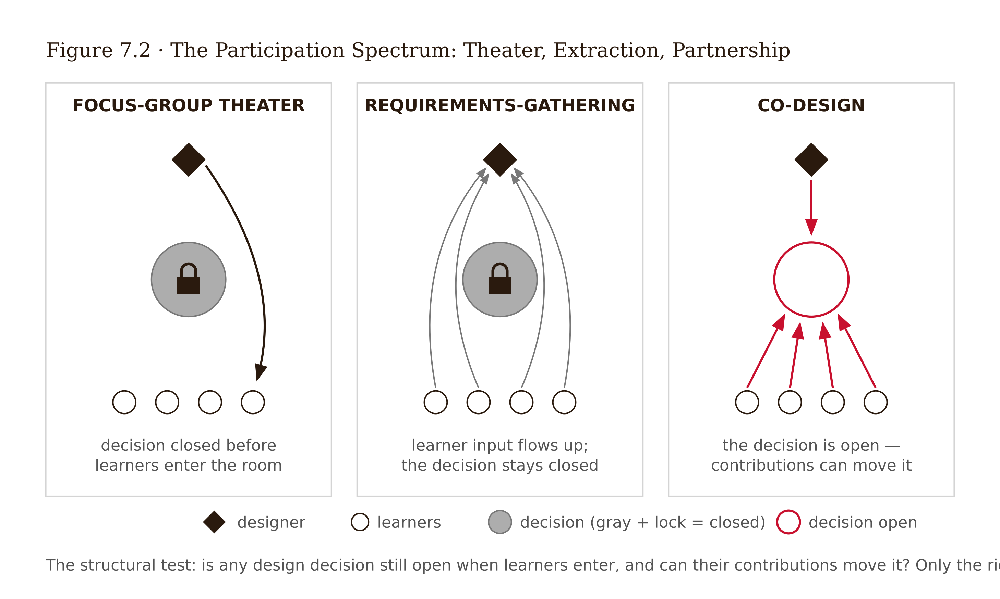
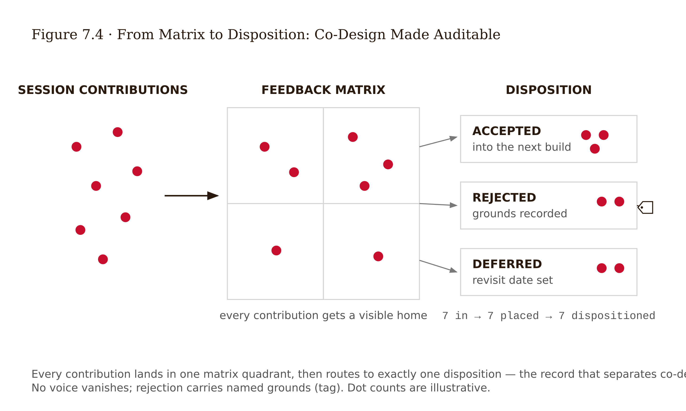
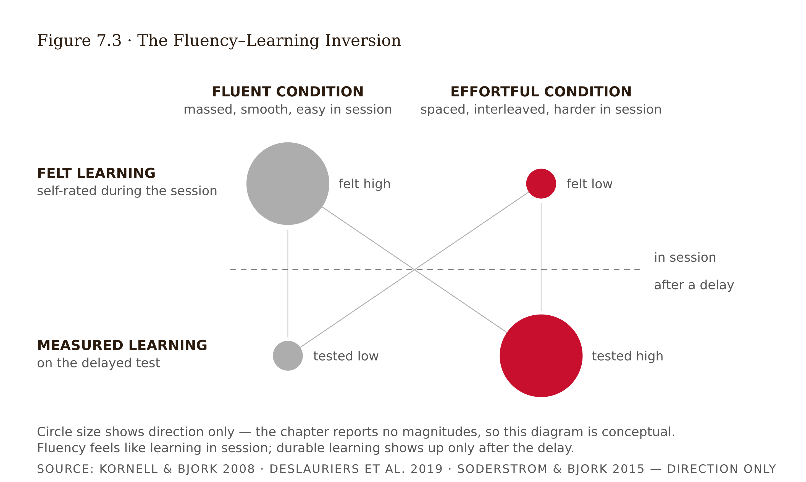
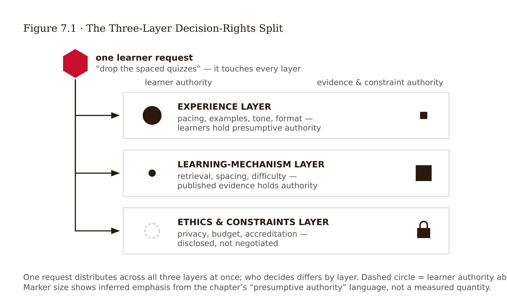

# Chapter 7 — Co-Design: Learners as Design Partners
*On the authority you can give away, the authority you cannot, and the difference between them.*

The whiteboard wall is covered in sticky notes. Eight learners — working nurses, six weeks into an online pharmacology refresher — have spent ninety minutes doing exactly what the facilitator hoped: annotating the journey map with moments the designer never saw. The module that loads badly on a phone during a night-shift break. The discussion forum nobody reads. The calculation walkthrough one learner calls "the only part that respects my time." The session is working. The room trusts itself.

Then the facilitator asks the prepared closing question: "If you could change one thing about this course, what would it be?"

A learner near the window says it first: the weekly quizzes. Get rid of them. Around the table, heads nod. The quizzes feel like surveillance. They make a hard week harder. One learner — the strongest student in the room, by the course data — makes the case crisply: "I learn from the videos and the walkthroughs. The quizzes just test me on what I already learned. They're not teaching me anything. They're stress."

The facilitator writes *REMOVE WEEKLY QUIZZES* on the board and circles it. The room applauds, lightly. It is the session's most unanimous finding.

It is also, by the weight of available evidence, the session's most reliably wrong one. The quizzes are retrieval practice — among the most robustly replicated learning interventions in cognitive psychology, with benefits for delayed retention demonstrated across hundreds of studies (Roediger & Karpicke 2006). And the learner's self-report — "they're not teaching me anything" — is precisely what the metacognition literature predicts a learner *will* say about retrieval practice. The act of effortful recall *feels* like assessment of learning rather than the production of it (Soderstrom & Bjork 2015). The feeling is accurate. The inference is wrong.

Here is the designer's dilemma, stated as plainly as it can be: **the learners are the experts on their experience, and they are wrong about their learning.** Both halves of that sentence are true at once. Co-design is the method of working with this fact rather than around it.

---

Before anything about structure or facilitation, a distinction that cuts deeper than it first appears.

Co-design means engaging learners as partners in framing problems and generating solutions — not as sources of reactions to designs that are already finished. The defining test is decision influence: in genuine co-design, something about the design is undecided when learners enter the room, and their contributions help decide it.

That test separates co-design from two look-alikes that consume most of the participation budget in real organizations.

Requirements-gathering treats learners as information sources. The designer extracts needs, preferences, and pain points, then leaves to design alone. Chapter 5 was largely requirements-gathering — useful, necessary, but it positions the learner as a subject of research rather than a partner in design. The power to frame the problem never changes hands.

Focus-group theater is worse: participation staged after the decisions are already made, to generate the appearance of consultation. Arnstein (1969) named this rung of the participation ladder precisely — tokenism — and the decades of participation research since have confirmed how common it is. If the redesign is locked and the session exists so the deck can say "co-designed with learners," you are doing theater. Learners can usually tell. A session that solicits opinions and visibly ignores them teaches learners that their voice is decorative, and you may only get to run that experiment once per cohort.

Before scheduling any session, write down which decisions are genuinely open, which are closed and why, and what learners will be told about both. If the open-decisions list is empty, cancel the session and run interviews. That is the honest method for the situation you are actually in.

---

Co-design did not begin in education. Its deepest root is the Scandinavian workplace-democracy tradition of the 1970s and 80s, where researchers like Pelle Ehn worked with trade unions to give workers a say in the technologies restructuring their jobs (Ehn 1988). The founding claim was political before it was methodological: people affected by a designed system have a right to influence it. The practical claim — that participation also produces better systems, because workers hold tacit knowledge designers lack — came alongside.

In HCI, Allison Druin developed cooperative inquiry with children as full design partners rather than as testers, showing that even young learners contribute design ideas adults systematically miss (Druin 2002). In design research broadly, Sanders and Stappers mapped the shift from user-centered design — designing *for* — to co-design — designing *with* — arguing that the generative moment, where new ideas come from, is where participation changes outcomes (Sanders & Stappers 2008).

Within learning experience design, the evidence base is younger and thinner than the method's popularity suggests. Consistent qualitative and case-study evidence shows co-design improving problem discovery and participant ownership. Recent work on co-design with youth around AI tools has produced some of the field's most careful method work, including findings on how young partners reason about relational privacy — who in the room learns what about them — when they help design systems they will use (Chang et al. 2025). What the lineage does not provide is what this book keeps asking for: controlled evidence that co-designed learning experiences produce better *learning outcomes* than expert-designed ones. Co-design has strong ethical grounding, consistent evidence of better problem discovery, and almost no causal outcome evidence either way. The honest justification for a co-design session is what it reliably delivers: access to experience knowledge the designer cannot get otherwise, early detection of mismatches between the design model and learners' lived reality, and a stronger relationship with the people the design serves. Not outcome claims.

---

Unstructured co-design collapses into either a complaint session or a referendum. Structure is what converts learner experience into material a designer can use, and it has three load-bearing parts.

**Roles, declared up front.** Every participant should know what authority they hold in the room. Learners are experience experts — authoritative on what happened to them, what it felt like, what it costs them. The designer is the integration authority, responsible for synthesizing contributions against evidence and constraints. A facilitator, ideally not the designer whose work is under discussion, keeps the process honest. Stating these roles is not bureaucratic theater. It is what makes the harder conversation survivable, because the limits of learner decision power are established before any specific disagreement arises.

**Artifacts to think with.** People co-design better around things than around abstractions (Sanders & Stappers 2008). The strongest artifact for a learning experience session is the journey map from Chapter 6, printed large, because it lets learners annotate their experience onto your model of it — every divergence is a finding. Useful companions: experience cards for sorting and ranking, and rough sketches of candidate redesigns at deliberately low polish, because polish suppresses critique.

**The feedback matrix.** Borrowed from service design practice (Stickdorn et al. 2018), a four-quadrant matrix — what works, what should change, questions raised, new ideas — separates evaluation from generation and gives every contribution a placed, visible home. After the session, every matrix item gets a disposition: accepted (and what changed), rejected (and on what grounds — evidence, constraint, or judgment), or deferred (awaiting what information). That accepted/rejected/why record is what separates co-design from theater made auditable.

When reviewing session notes, distinguish contributions that carry personal encounter texture — specific confusions, references to actual moments of struggle, position changes during the session — from contributions that are generic talking points. The GLP framework's social knowledge texture component makes this distinction measurable: genuine engagement leaves a signature that performed participation does not.

<!-- → [TABLE: Feedback matrix four-quadrant layout with example items from the pharmacology case — each cell shows sample learner contributions and their dispositions (accepted/rejected/deferred), with grounds column showing evidence citations for rejections] -->

---

Now the hard part.

Co-design distributes some design authority to learners. The authority-boundary problem is: *which* authority? To answer it, two facts must be held simultaneously, and neither can be used to dismiss the other.

**Fact one: learners hold real, exclusive expertise.** No amount of designer skill substitutes for knowing what the third week feels like on night shift, which explanation finally made sampling error click, or why the forum feels performative. On the experience layer — context, constraints, affect, meaning, cost — learner authority is close to absolute, because the designer has no independent access to the data.

**Fact two: learners' judgments of their own learning are systematically miscalibrated in a known direction.** This is not a vague claim about unreliable self-report; it is one of the better-documented regularities in cognitive psychology. Learners judge learning by current fluency — how smooth and confident the experience feels now — while durable learning is produced disproportionately by conditions that *reduce* current fluency (Soderstrom & Bjork 2015). The signatures are consistent. In interleaving studies, most participants rated the less effective massed schedule the better one *even after* interleaving had just outperformed it on their own test (Kornell & Bjork 2008). In a large physics course, actively taught students learned measurably more and reported *feeling* they learned less (Deslauriers et al. 2019). Retrieval practice — the opening case — is the canonical instance: it feels like assessment, is rated unpleasant, and beats restudy on delayed measures across a very large literature.

Learners asking for less desirable difficulty are not lazy or foolish. They are accurately reporting fluency and reasonably — but wrongly — inferring learning from it. The miscalibration is the *expected output of a well-functioning metacognitive system pointed at the wrong signal.* In the series' vocabulary, this is the Frictional principle seen from the learner's side: the difficulty they are asking you to remove is the mechanism producing the learning their fluency signal cannot detect.

This yields a three-layer split for allocating design authority.

The **experience layer** covers timing, pacing, framing, tone, context fit, workload distribution, what feels punitive or respectful. Learner authority is presumptive here because learners are the only source of this data; designer intuitions on this layer are guesses.

The **learning-mechanism layer** covers retrieval practice, spacing, interleaving, generation, feedback timing — cases where published evidence speaks to whether a practice condition improves delayed retention. Evidence authority is presumptive here because learner preferences on this layer run in a known wrong direction. Learner input informs *how* a mechanism is implemented, not *whether* it exists.

The **ethics-and-constraints layer** covers privacy, accessibility obligations, assessment integrity, policy. These are disclosed rather than voted on — they bind the designer regardless of anyone's preferences.

<!-- → [TABLE: Decision-rights split — columns: Layer, Examples, Authority, Why — rows: experience, learning-mechanism, ethics-and-constraints — with annotation showing how the pharmacology quiz vote falls across all three layers simultaneously] -->

The split is not a license to ignore learners about quizzes. Look again at what the nurses said. The quizzes feel like surveillance. They make a hard week harder. They arrive at a bad time. Every one of those is experience-layer material, and it is excellent — the designer can change the stakes, the framing, the scheduling, the feedback latency. Almost all of it is fixable without touching the mechanism. The evidence-disciplined response to "remove the quizzes" is almost never no. It is: *the retrieval practice stays, because the evidence for it is strong and your own report is the documented signature of it working. Everything about how it feels is now on the table, and you are the authority on that.*

One more obligation comes with this split: say it out loud and show your work. A designer who silently overrules the room has converted co-design into theater retroactively. Disclose the authority boundary in the session brief, name the evidence when you invoke it, and record the overruled preference with the citation attached. The learners who contributed something that was kept — and something that was not — and were told exactly which and why: that is a trust-building act. The alternative is not neutral. It spends trust that the method was supposed to create. This is also why the session itself is Tier 6 work in the series' taxonomy — irreducibly human because the participants have genuine stakes in the outcome and the synthesis must preserve dissent rather than smooth it (see Appendix: The Fundamental Themes).

---

Co-design also carries ethical obligations that sharpen when participants are minors, are institutionally subordinate to the designer, or belong to groups with less power to refuse.

The minimum, not the ideal: honest consent about influence, before participants contribute — they must know which decisions they can affect and which they cannot, and overstating influence to improve recruitment is the founding sin of tokenism. Role clarity and a genuine ability to exit, which has teeth only when the designer holds no grading or supervisory power over the participant — or has visibly firewalled it. Privacy treated as relational, not just informational, because sessions surface peer-visible disclosures about struggle, failure, and life constraints that participants did not anticipate sharing when they signed up. Recognition and credit, because design partnership is work. And for sessions with minors, adapted techniques, shorter cycles, and guardian consent layered with the child's own assent — Druin's cooperative inquiry tradition makes clear that children can be genuine design partners, but only with structure that accounts for power gradients adults barely notice and children feel acutely.

---

Translate the framework into a case. The introductory statistics course — 140 enrolled, documented dropout cliff at Unit 4, Sampling Distributions, where the weekly graded retrieval quizzes begin — needs a redesign direction before prototyping. The journey map shows *where* the experience fails. A co-design session is needed to show *why* from the inside.

Seven learners are recruited: five currently enrolled, two who completed last term — including one who nearly dropped at Unit 4 and one who did drop and re-enrolled. The decision brief, written before recruitment, states openly that whether retrieval practice exists is evidence-bound and not on the table, while everything about its implementation is.

The session plan opens with annotating the journey map — grounding in what actually happened before imagining what should. An earlier draft opened with open brainstorm ("redesign Unit 4 however you like") and produced feature wishlists unmoored from any experience data. Cut.

Mid-session, the facilitator slips and polls the room — hands up if the quizzes should go, six hands. The poll converts partners into a referendum bloc. The next ten minutes are advocacy, not design. The facilitator recovers by returning to the matrix: "That's recorded — six of seven want them gone. Now let's get specific about what about them fails you, because that part I can act on directly." The vote breaks into experience-layer findings, and they are excellent. The quiz deadline lands on shift-change night for the nursing majors. Feedback arrives five days later as a bare score with no explanation. The first attempt is graded cold, before any practice run. And one learner supplies the sentence the whole redesign will hang on: *"It's not that I mind being tested. I mind being graded on something I never got to try."*

The accepted/rejected/why record: removing weekly retrieval quizzes is rejected on evidence grounds, stated in plain language to the panel with the Kornell and Bjork result described — five of seven learners, told that the feeling of "it's not teaching me" is the documented signature of the mechanism working, accept the trade explicitly. Accepted: an ungraded practice attempt before each graded quiz; immediate elaborated feedback with explanations rather than bare scores; the deadline moved off Sunday; the quizzes reframed with a two-sentence rationale note explaining why the course makes you retrieve. A ten-minute sandbox tutorial for the simulation tool, decoupled from the graded week: accepted. A learner proposal for collaborative quiz attempts: deferred, no clear evidence either way, logged as an assumption for the measurement plan.

The vote to remove retrieval practice was wrong about the mechanism and right about nearly everything else. The designer's job was to split the two and honor each with its proper authority.

<!-- → [TABLE: Full accepted/rejected/deferred record from the Unit 4 redesign — columns: learner request, layer (experience/mechanism/constraint), disposition, grounds (evidence citation or constraint), what changed — designed to serve as a model for the studio assignment format] -->

What the session cannot settle: whether the practice-attempt redesign actually moves completion or retention. Seven self-selected learners cannot represent 140. The learners most harmed by Unit 4 are disproportionately the ones who already dropped and will never attend a session. Co-design sees the room and is blind to everyone who left before the invitation went out. A co-design record is a direction with reasons — not a result.

---

## Exercises

**Warm-up**

1. *(Recall — definitions)* Without consulting the text, define co-design, requirements-gathering, and tokenism in one sentence each. Then state the single test that separates co-design from the other two, and apply it to a participation experience you have had as a learner — which was it, and how do you know?

2. *(Recall — decision-rights split)* A coding bootcamp co-design session produces four requests: move the weekly project deadline from Sunday to Tuesday; replace the "explain your code aloud" exercises with multiple-choice review; add captions to all video content; let learners choose project topics from a provided menu rather than being assigned. Assign each to a layer — experience, learning-mechanism, or constraints — and state your presumptive response for each. Flag which of the four is harder to assign than it first appears, and why.

**Application**

3. *(Apply — roles and artifacts)* Plan a 90-minute co-design session for a learning product you are currently working on or familiar with. Write the decision brief first: which decisions are genuinely open, which are closed, and what are the grounds for the closed ones. Then specify: declared roles, the central artifact learners will think with, and the structure of the feedback matrix. Flag any decision you were tempted to list as "open" but suspect your plan quietly forecloses — this is the risk the decision brief exists to surface.

4. *(Apply — the overrule)* Your session produces a unanimous vote to remove interleaved practice problems in favor of blocked practice by topic. Write the response you would give in the room: which part of the request you are accepting (experience layer), which part you are declining (mechanism layer), the evidence you are declining it on, and how you will record the overrule. Then write the two-sentence addition you would make to the course materials to make the mechanism visible to learners rather than simply imposed on them.

**Synthesis**

5. *(Synthesize — theater diagnosis)* A vendor case study describes co-designing a compliance course: learners attended a kickoff workshop, voted on color themes and module names, and saw the finished course at launch six weeks later. Using this chapter's definitions, identify what participation method was actually performed, name the rung of Arnstein's ladder it occupies, and specify the two smallest structural changes that would have made the participation genuine rather than decorative. (~400 words.)

6. *(Synthesize — authority under pressure)* Chapter 4 established autonomy as an evidence-backed motivation mechanism — honoring learner choice has measurable benefits. For one specific mechanism decision in a learning product you know, construct the strongest honest case that granting the learners' "wrong" preference would beat overruling it, because the autonomy benefit is large enough to compensate for the difficulty loss. Then state what measurement at 90 days would settle which case is right.

**Challenge**

7. *(Challenge — blind spots)* Co-design reaches the learners who attend sessions. The learners most harmed by a design are disproportionately the ones who dropped before the invitation went out. Propose one method that could surface the experience of departed learners, specify what it could and could not tell you compared to a live co-design session, and state what design decision in the statistics course case would be most changed by their voice.

---

**Project:** The Redesign Dossier
**This chapter adds:** `dossier/07-codesign-record.md` — the decision brief, session plan, and accepted/rejected/deferred record of a real co-design session with learners from the experience you are redesigning. By the end of this block you will have planned the session with AI doing the legwork, run it with no AI in the room, and built a record that preserves exactly who said what — including who disagreed.

### Exercise 1 — When to Use AI

This week you put real people in a room and give them genuine decision influence over your redesign. Everything around that room — the planning, the materials, the post-session paperwork — is legwork AI handles well. Three tasks.

**Task 1 — Generate candidate session structures.** Paste your decision brief (open decisions, closed decisions, grounds) and a summary of `dossier/06-journey-map.md` into your AI and ask for three different 90-minute session agendas: one opening with journey-map annotation, one opening with experience-card sorting, one hybrid — each with timeboxes, transition language, and the feedback matrix placed where it does the most work. Pick one; steal the best moves from the other two.
*Why AI works here:* this is **option generation** — the task type where AI's speed at producing structured variations is most useful and least risky, because you hold the evaluation criteria from this chapter. Does the agenda ground in what happened before what should happen? Does it separate generation from evaluation? Does every contribution get a placed, visible home?

**Task 2 — Script the predictable hard moments.** The chapter handed you the facilitator's recovery line for the referendum moment: record the preference, split off the experience layer, redirect to actionable specifics. Ask AI to draft recovery scripts in that pattern for the four moments most likely to derail your session: the unanimous vote against a desirable difficulty, the participant who dominates, the silence after a sensitive peer-visible disclosure, and the request to reopen something on the closed-decisions list.
*Why AI works here:* **drafting from a known pattern.** The recovery move is fully specified by the chapter; the AI fills in fluent language, and you can check every script against the decision-rights split.

**Task 3 — Produce the session materials.** Feedback matrix sheets, role-declaration cards, a plain-language participant version of your decision brief, a note-capture template with a column for each of the three layers.
*Why AI works here:* **reformatting and templating** — mechanical transformation of structure you have already designed into artifacts you can print.

**The tell:** You know you are using AI appropriately when you can evaluate the output — when you have independent criteria to judge whether it is correct, complete, and fit for purpose.

### Exercise 2 — When NOT to Use AI

Three tasks that will tempt you this week precisely because they would save the most time. Refuse all three.

**Task 1 — Simulating your learners.** "Roleplay seven learners from my course in a co-design session and tell me what they would say." The output will be fluent, plausible, and worse than useless, because it feels like data.
*Why AI fails here:* **synthetic substitution.** The only justification for co-design the evidence actually supports is access to experience knowledge the designer cannot get otherwise. A language model has no access to your learners' night shifts, their forum fatigue, or the one sentence your whole redesign will hang on. It can only generate composites of learners in its training data. A simulated session is focus-group theater with no group — the appearance of consultation, manufactured this time by you, for you.

**Task 2 — Resolving the authority boundary.** When your session produces its version of the remove-the-quizzes vote, do not paste the notes into an AI and ask whether to accept or reject.
*Why AI fails here:* **judgment outsourcing.** The disposition is a values-plus-evidence judgment: weighing learner authority on the experience layer against evidence authority on the mechanism layer, and deciding what trust the overrule will spend and what the disclosure must say. The model will hand you a confident disposition either way — and it carries none of the consequences. You face these learners again. It does not.

**Task 3 — Delivering the overrule.** Once you have decided the mechanism stays and the experience around it changes, the explanation to your panel — naming the evidence, naming exactly what you kept of theirs — must come from you, in your voice.
*Why AI fails here:* **delegated accountability.** The chapter is explicit: silently overruling converts co-design into theater retroactively, and the disclosure is the trust-building act. A disclosure your learners could discover you did not write spends the trust twice.

**The tell:** Each refusal has the same signature. If your co-design record contains a learner quote no learner spoke, a disposition you cannot defend in the room without consulting a chat log, or an overrule explanation that arrived in thirty seconds of generation rather than thirty minutes of weighing — then the session happened, but the partnership did not, because the AI did the work that should have been yours.

**Series connection:** This is a **Tier 6 (Collective)** chapter — the tier where the irreducibly human work is contact with other people. AI can set the table for a co-design session; it cannot sit at it. The moment any voice in the loop is simulated, the tier collapses: you are no longer doing collective intelligence, just solo design with a ventriloquist's dummy.

### Exercise 3 — LLM Exercise: From Session Plan to Co-Design Record

**Builds:** `dossier/07-codesign-record.md`
**Tool:** Claude Project "Redesign Dossier," which should already contain `dossier/01` through `dossier/06` in project knowledge.

This exercise runs in two phases — one before your session, one after. The session itself runs with no AI present.

**Phase 1 — Red-team the plan (before facilitating).** Draft your decision brief and session plan yourself first — application exercise 3 above walks you through it. The LLM stress-tests your plan; it does not produce one. Then paste both into the project with this prompt:

> You are a skeptical co-design methodologist reviewing my session plan for the learning experience documented in this project. Read dossier/05-learner-research.md and dossier/06-journey-map.md for context on my learners and where the experience fails them. Here are my decision brief (open decisions, closed decisions, grounds) and my session plan:
>
> [PASTE YOUR DECISION BRIEF AND SESSION PLAN]
>
> Do four things, in order:
> 1. Identify any decision I listed as "open" that my plan's structure quietly forecloses — where I am at risk of running focus-group theater without noticing.
> 2. Generate the three hardest moments my facilitation could face — including at least one where learners unite behind removing a desirable difficulty — and for each, write the exact words a learner might say.
> 3. For each hard moment, ask me one question I must answer myself. Do not answer it for me.
> 4. List what my plan cannot discover about my learners no matter how well the session goes.
>
> Do not propose a revised plan. Do not invent findings, quotes from my actual learners, or citations. If I pasted no artifacts above, refuse and tell me to draft them first.

Record in the dossier file: the red-team's hardest moment, your written response to it with the decision-rights layer and evidence named, and one sentence on whether the red-team changed your plan.

**Phase 2 — Structure the record (after facilitating).** Run your session — three to seven real learners, your central artifact, your matrix. Capture raw notes as completely as you can, with vote splits and verbatim phrases. Then:

> Read dossier/06-journey-map.md for context, then structure my raw co-design session notes below into a session record with these sections: (1) Session summary — date, participants by role descriptor only, no names, artifacts used. (2) Feedback matrix — every contribution placed in one of the four quadrants (what works / what should change / questions raised / new ideas), worded as close to verbatim as my notes allow. (3) Contested items — every item where participants disagreed, recording the split (how many on each side) and each side's stated reasoning. (4) Disposition table — one row per matrix item, with columns for item, layer, disposition, grounds, and what changed; leave the layer, disposition, grounds, and what-changed columns entirely empty for me to fill. (5) Open questions my notes leave unresolved.
>
> Rules: use only what is in my notes. Do not paraphrase dissent into consensus — if my notes say six of seven, write six of seven, never "the group felt." Do not assign any disposition, layer, or evidence label. Do not invent, merge, or smooth quotes. Where my notes are ambiguous, ask me rather than assume.
>
> My raw session notes: [PASTE YOUR NOTES]

Then you do the chapter's work: assign every layer, every disposition, every grounds entry yourself — accepted (and what changed), rejected (evidence, constraint, or judgment — named), or deferred (awaiting what information). That table is what separates your record from theater made auditable.

**What this produces:** `dossier/07-codesign-record.md` — decision brief, red-teamed session plan with your response to its hardest moment, the structured session record with dissent intact, and a disposition table in which every call and its grounds are yours.

**How to adapt:**
- *Own project:* if your experience is workplace training rather than a course, the session can be three colleagues from the target audience and forty-five minutes — the decision brief and the disposition table do not shrink, because they are the method.
- *ChatGPT / Gemini:* no project knowledge, so paste two-paragraph summaries of `dossier/05` and `dossier/06` at the top of each prompt; Gemini's long context will take the full files if you prefer.
- *Claude Project:* when the record is final, upload `07-codesign-record.md` to project knowledge — Chapters 8 through 15 all reference it.

**Connection to previous chapters:** your Chapter 5 learner research supplies the recruitment criteria and the misconceptions your closed-decisions list protects; your Chapter 6 journey map is the session's central artifact — every learner annotation that diverges from your map is a finding.

**Preview of next:** Chapter 8 prototypes the direction this record sets. The disposition table's accepted rows become prototype features; its deferred rows become candidates for the riskiest-unknown sentence.

### Exercise 4 — CLI Exercise: The Session Kit Builder

**Tool:** Cowork. Justification: this is multi-file document assembly — reading dossier files, producing printable handouts — with no code involved, and Cowork's folder-native workflow lets you inspect every artifact as a document. Claude Code works identically if you prefer the terminal.
**Skill level:** Beginner — fine as a first or second agent task.

**Setup checklist:**
- [ ] Dossier folder connected, containing `01` through `06`
- [ ] Your decision brief and session plan (post-red-team, from Exercise 3 Phase 1) saved as `dossier/working/ch7-session-plan.md`
- [ ] Ten minutes afterward to inspect, not just collect, the output

**Paste-ready task:**

> Read dossier/05-learner-research.md, dossier/06-journey-map.md, and dossier/working/ch7-session-plan.md. Do not modify any of these files. Create the following six files inside dossier/working/ch7-session-kit/ and nowhere else:
>
> 1. agenda.md — a one-page facilitator agenda built from my session plan, with timeboxes and the transition language written out.
> 2. participant-brief.md — a plain-language participant version of my decision brief: which decisions are open, which are closed and on what grounds, and an honest statement of how much influence participants have. Do not overstate influence.
> 3. feedback-matrix.md — a printable four-quadrant feedback matrix sheet (what works / what should change / questions raised / new ideas) with a footer explaining that every item will receive a disposition: accepted, rejected with grounds, or deferred.
> 4. role-cards.md — three role declarations (experience experts / integration authority / facilitator), each stating in welcoming language what authority the role holds and does not hold.
> 5. consent-and-privacy.md — consent text covering honest influence, the right to exit without consequence, relational privacy (what participants share becomes peer-visible in the room), and how contributions will be credited.
> 6. note-template.md — a note-capture sheet with columns for contribution (verbatim), speaker code, matrix quadrant, and a blank layer column labeled "experience / mechanism / constraints — assign after session."
>
> Constraints: create exactly these six files; do not write to dossier/07-codesign-record.md or any numbered dossier file; do not invent learner names, quotes, or example contributions — where an example is unavoidable, write the bracketed placeholder [EXAMPLE]; if my session plan is missing something a file needs, stop and list what is missing instead of guessing. Finish by printing a checklist of the six files with one line each on what I should verify.

**Expected output:** six printable session artifacts that operationalize the chapter's structure — roles declared, matrix ready, consent honest — generated in minutes instead of an evening.

**What to inspect:** Read `participant-brief.md` first and hardest. Overstating influence to improve recruitment is the founding sin of tokenism, and agents err toward warm overpromise — check that every closed decision carries its grounds and the influence statement promises nothing your disposition authority will later revoke. Confirm `note-template.md`'s layer column is blank. Confirm no invented learner content appears anywhere.

**If it goes wrong:** If the agent invented example quotes despite the constraint, delete them and note the failure — it is a live preview of Exercise 5's failure mode. If it wrote to a numbered dossier file, restore from your Claude Project copies and re-run with the constraints moved to the top of the task.

**CLAUDE.md / AGENTS.md note:** Add to your dossier folder's `CLAUDE.md` (or `AGENTS.md`): *"Never simulate or invent learner data, quotes, or session findings. Never fill a disposition, layer, or grounds column — those are reserved for the human designer."* That line keeps paying off through Chapter 15.

### Exercise 5 — AI Validation Exercise: The Dissent Audit

**What you validate:** the Phase 2 output of Exercise 3 — the AI's structuring of your own session notes into the record. Use your own output: this chapter's failure mode must be caught against ground truth only you hold, your raw notes and your memory of the room.
**Type:** synthesis validation.
**Risk level:** Medium-High. The record sets the redesign direction Chapter 8 prototypes and survives into the final portfolio. A record that quietly converts a 4–3 split into "participants agreed" is focus-group theater laundered into your dossier — and you will not catch it later, because later you will trust the record more than your memory.

**The checklist:**
1. **Correctness** — pick five items from the record and trace each to your raw notes. Verbatim where claimed verbatim? Speaker code right? Quadrant placement defensible?
2. **Completeness** — count contributions in your notes; count items in the record. Every gap is a decision the AI made for you. Check specifically for single-voice items: the one learner who said the unpopular thing.
3. **Scope** — confirm the disposition, layer, and grounds columns are still empty; confirm no item, quote, or "implied theme" appears in the record that is absent from your notes.
4. **Dissent preservation** *(chapter-specific)* — every disagreement must survive with its split and both reasonings intact. "Six of seven wanted the quizzes gone; one said the practice tests are the only reason she passes" must never have become "participants expressed concerns about quizzes."
5. **Experience-layer granularity** *(chapter-specific)* — the record must keep the concrete detail your dispositions need. "Deadline lands on shift-change night" is actionable; "scheduling concerns" is not. Flag every abstraction that destroyed a fixable specific.
6. **Failure-mode check** — read the record start to finish asking one question: *does this room sound more agreeable than the room I was in?* Models are trained toward coherent, harmonious summaries; smoothing dissent into consensus is this task's documented failure mode, and it is exactly the failure a disposition table cannot survive, because a disposition answers a person, and a smoothed record has erased the person it should answer.

**Findings protocol:** All checks pass → fill in your disposition table and finalize the file. One check fails → repair it from your notes, note the repair in the file, and re-run that check. Multiple checks fail → you have hit a When-NOT moment: the synthesis was doing judgment work, not formatting work. Discard it, structure the record yourself from your notes, and log what failed in the dossier — that log is portfolio material.

**AI Use Disclosure:** every dossier file carries a two-sentence disclosure. Generate the draft with this prompt, then edit until both sentences are true:

> Draft a two-sentence AI Use Disclosure for my co-design record. Sentence one states exactly what AI did: red-teamed my session plan and structured my raw session notes into the record format. Sentence two states what I did and verified myself: facilitated the session with real learners, traced the record against my notes for dissent preservation, and made every disposition, layer, and grounds call without AI input.

**Series connection:** Tier 6 (Collective). What you validated here was the integrity of other people's voices passing through a machine. In the Collective tier, AI's most dangerous failure is not being wrong about facts — it is being smooth about people. The dissent you preserved this week is the raw material of every honest disposition you will ever write.

---

## References

*The following sources cited in this chapter were verified as real and accurately characterized during fact-checking (2026-06-07). See `factchecks/07-co-design-learners-as-design-partners-assertions.md` for full findings.*

1. Roediger, H. L., & Karpicke, J. D. (2006). Test-enhanced learning: Taking memory tests improves long-term retention. *Psychological Science*, 17(3), 249–255. — CONFIRMED.
2. Soderstrom, N. C., & Bjork, R. A. (2015). Learning versus performance: An integrative review. *Perspectives on Psychological Science*, 10(2), 176–199. — CONFIRMED.
3. Kornell, N., & Bjork, R. A. (2008). Learning concepts and categories: Is spacing the "enemy of induction"? *Psychological Science*, 19(6), 585–592. — CONFIRMED (~71% of participants judged massing more effective despite spacing winning on their own test).
4. Deslauriers, L., McCarty, L. S., Miller, K., Callaghan, K., & Kestin, G. (2019). Measuring actual learning versus feeling of learning in response to being actively engaged in the classroom. *Proceedings of the National Academy of Sciences*, 116(39), 19251–19257. — CONFIRMED.
5. Arnstein, S. R. (1969). A ladder of citizen participation. *Journal of the American Institute of Planners*, 35(4), 216–224. — CONFIRMED.
6. Sanders, E. B.-N., & Stappers, P. J. (2008). Co-creation and the new landscapes of design. *CoDesign*, 4(1), 5–18. — CONFIRMED.
7. Druin, A. (2002). The role of children in the design of new technology. *Behaviour & Information Technology*, 21(1), 1–25. — CONFIRMED.
8. Chang, M. A., et al. (2025). Co-designing AI with youth partners: Enabling ideal classroom relationships through a novel AI Relational Privacy ethical framework. *Computers and Education: Artificial Intelligence*. — CONFIRMED.
9. Ehn, P. (1988). *Work-Oriented Design of Computer Artifacts*. Arbetslivscentrum, Stockholm. — Canonical participatory-design reference, not independently re-fetched; characterization accurate.
10. Stickdorn, M., Hormess, M., Lawrence, A., & Schneider, J. (2018). *This Is Service Design Doing*. O'Reilly. — Standard practitioner reference for the feedback matrix; characterization accurate.
