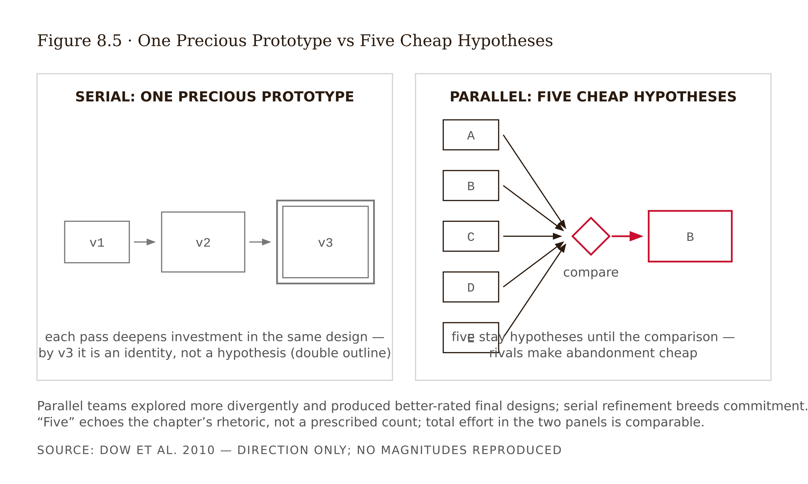
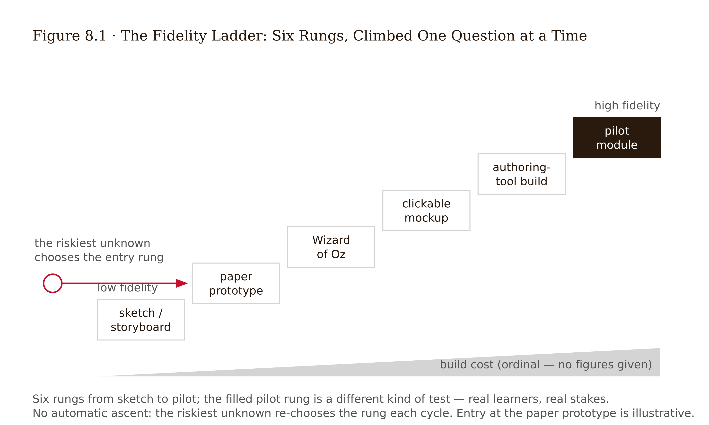
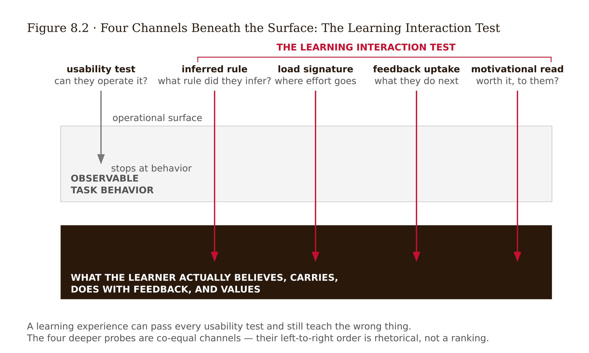
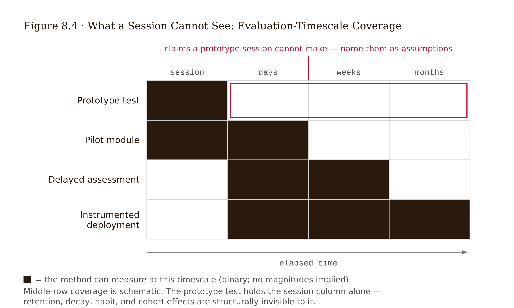
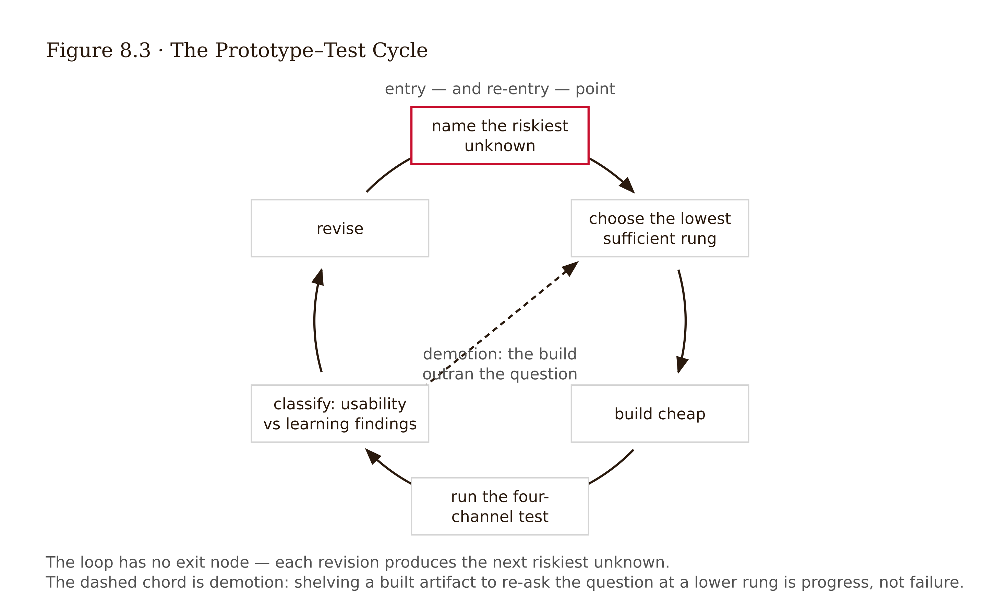

# Chapter 8 — Prototyping Learning Experiences: From Paper to Pilot
*The most expensive thing you can build is the wrong thing, finished.*

The team had four months and spent them well, by every visible measure. A branching patient-triage simulation for first-year respiratory therapy students: professionally illustrated, voice-acted, sixty-two decision nodes, an adaptive difficulty curve, a dashboard the dean had already screenshotted for a grant report. The launch review opened with the lead designer saying, honestly, "This is the best thing we've ever built."

Then they watched the first usability recording.

A student — bright, motivated, exactly the target learner — opens the simulation. The core mechanic is the vitals panel: at each decision node, the patient's oxygen saturation drifts in real time, and the intended lesson is that *waiting is itself a clinical decision* — delay has physiological cost. The student reads the first scenario. She studies the options. She does what every experience of digital learning has trained her to do: she treats the screen as a quiz page. She deliberates carefully — for as long as she likes — believing the scenario is paused while she thinks.

She never notices the saturation number falling. At ninety seconds, the simulated patient codes. The screen shows the outcome. The student's face shows the diagnosis: *"Wait — it was moving? I thought it was like, a question."*

She had not made a clinical error. She had made a perfectly reasonable inference about *what kind of object the simulation was* — and the design had spent four months polishing answers to questions no one had asked. Not "is the interface usable?" but "do learners understand what the experience is asking of them?" Nine more recordings, seven more students deliberating over a paused screen. The core mechanic — the one carrying the entire learning objective — was invisible to most of its audience.

A paper version of the vitals panel — index cards, one designer flipping the saturation card every ten seconds while a student thinks aloud — would have surfaced the misunderstanding in week one, at the cost of an afternoon. The team got the same finding in month four, at the cost of the budget. The polish was not wasted because polish is bad. It was wasted because it was *premature*: every hour of it answered small questions while the biggest question stood unexamined.

This chapter is about asking the biggest question first, with the cheapest object that can answer it.

---

A **prototype** is a question made testable — an artifact built to generate evidence about a design decision before the decision becomes expensive. **Fidelity** is how closely the prototype resembles the final experience: in visual finish, in interactivity, in content completeness. The opening case's deepest error was treating fidelity as a quality ladder you climb as fast as possible. The discipline here is the opposite: **fidelity is chosen, per test, to match the riskiest unanswered question — and no higher.**

Three reasons this matters, each backed by something beyond intuition.

*Cost asymmetry.* Changes are cheapest before commitment. Gould and Lewis (1985) made early empirical user testing a founding principle of usability engineering precisely because a design error grows in cost with everything built on top of it. Four months of voice acting on top of a misunderstood mechanic is the canonical shape of the failure — not an unlucky accident but the predictable consequence of building before testing.

*Critique suppression.* Polish changes what testers tell you. Participants shown highly finished artifacts comment on surface details and hesitate to challenge fundamentals — the artifact signals that the big decisions are already closed. Rough artifacts license rough feedback. Bill Buxton's argument for roughness as a deliberate feature (Buxton 2007) is exactly this: a sketch says "this is still a question"; a polished mockup says "this is a decision." The opening case's tester commented on chart colors. The important failure sat underneath, undisturbed.

*Commitment psychology.* Designers defend what they have invested in. Dow et al. (2010) found that creating multiple prototypes in parallel led to better-rated final designs and more divergent exploration than refining a single prototype serially. One precious prototype becomes an identity. Five cheap ones stay hypotheses.

A practical fidelity ladder for learning experiences, from bottom to top: *sketch or storyboard* (the experience as a comic strip — tests sequence and framing); *paper prototype* (hand-operated screens and materials — tests interaction logic and comprehension); *Wizard of Oz* (a human secretly simulates the system's intelligence — tests adaptive behavior before it exists); *clickable mockup* (real navigation, placeholder content — tests flow and orientation); *authoring-tool build* (Storyline, Rise, Genially-class — tests the integrated experience with real content); *pilot module* (real learners, real stakes, instrumented — tests what only deployment can). You will climb this ladder. The discipline is climbing one question at a time.

Before building anything, write one sentence: "The riskiest thing I don't know is ___." Then choose the *lowest* rung that can answer it. If you cannot name the riskiest unknown, you are not ready to prototype — you are decorating.

---

Here is where learning experience prototyping departs from the UX prototyping it borrows from — and the departure is the thing to understand most deeply.

A usability test asks: *can the learner operate the experience?* Can they find the button, follow the flow, complete the task? Necessary — extraneous load from a confusing interface is a genuine learning killer (Chapter 3) — but radically insufficient, because of an uncomfortable asymmetry: **a learning experience can pass every usability test and teach the wrong thing.** Task completion is a usability success criterion and almost meaningless as a learning one. The student in the opening case *completed her task fluently*. So does a learner who breezes through a beautifully usable statistics simulation and exits believing, as before, that bigger samples produce more variable sample means.

A **learning interaction test** therefore probes four channels a standard usability protocol never touches.

First: **the inferred rule.** What does the learner believe the underlying concept or rule *is*, right now? The probe is generative, never recognition-based. "Explain what just happened to the histogram as if to a classmate." "Predict what happens if I double the sample size — then say why." A learner can click correctly while holding the wrong rule underneath; only their generated explanation exposes which.

Second: **load signature.** Where does effort spike, and is the spike intrinsic (the concept is hard — keep it), extraneous (the design is hard — kill it), or germane (productive processing — protect it)? Live signals: long silences in think-aloud, re-reading loops, abandoning the task to fight the tool. Your Chapter 6 journey map predicted where these should cluster. The test checks the prediction.

Third: **feedback uptake.** When the prototype's feedback fires, what does the learner *do* — revise their thinking (read the explanation, change the prediction), or game the signal (click until green)? Feedback that is received is not the same as feedback that is used.

Fourth: **motivational read.** Does the learner know why this task is worth doing, and does difficulty read as challenge or as judgment? One probe suffices: "If this weren't required, would you do it — and what would make it feel worth it?"

Two additional channels from the GLP measurement framework are worth probing when time permits. *Transfer probe:* give a problem using the same concept with different surface features. Does the learner recognize the structural similarity? A learner who cannot transfer has a surface representation, not a schema. *Calibration probe:* ask confidence before and after — "how sure were you before you saw the answer?" A learner whose confidence is high before an incorrect answer and unchanged after is exhibiting borrowed certainty. Both probes take under two minutes and provide information the four-channel test cannot.

The protocol that carries all four channels is the **think-aloud with prediction probes**: the learner narrates continuously, and at each conceptually load-bearing moment the facilitator asks for a *prediction before* the system responds and an *explanation after*. Prediction-before is the trap that catches misconceptions in the act. The moment a learner says "the spread will get wider because more data means more spread," you have captured, on tape, exactly the misconception your Chapter 5 research documented, expressing itself against your design.

Build the test sheet with two ruled columns — **usability findings** and **learning findings** — and force every observation into one. The discipline of the second column is the whole method.

<!-- → [TABLE: two-column test sheet template — rows for each observation moment; columns: usability finding (fix-class: interface), learning finding (fix-class: pedagogical); caption: The column forces the classification in the moment of observation, before wishful thinking can reassign a learning failure to "needs clearer instructions." The fix for each column differs in kind.] -->

---

The design sprint — five days, map Monday through test Friday — is the most widely exported rapid-prototyping container in industry (Knapp et al. 2016), and it adapts to learning design well if you respect three differences.

Monday's map already exists. Your Chapter 6 journey map and Chapter 7 co-design record replace the sprint's mapping day. The "target moment" the sprint selects is your highest-risk journey moment — you have been running a slow-motion sprint for three weeks. Wednesday's decision step needs an evidence seat: a sketch that resolves the journey's dropout cliff by deleting the retrieval practice wins the dot-vote and fails the discipline. Put the Evidence Disclosure inside the sprint, not after it. And Friday tests learners, not customers — the sprint's five-user interview becomes the think-aloud-with-prediction-probes protocol, which is asking a different question than "did you find it intuitive?" The five-user number comes from Nielsen and Landauer's (1993) curve for frequent usability defects; treat it as a budgeting heuristic for learning work, where rare-but-severe failures — often the equity-relevant ones — routinely escape small samples.

Reports on sprint-style methods in curriculum and STEAM education are encouraging but methodologically thin — case studies, no controls. The sprint container plausibly transfers. Nothing yet shows it outperforms slower iteration on learning-relevant outcomes. Use it for the deadline discipline and the forced learner contact at the end; don't use it as evidence of a method.

For the studio checkpoint, run a compressed two-day version: half-day to storyboard against the co-design record, half-day to build at chosen fidelity, one day to test with three to five learners and write up. The container matters less than its two non-negotiables: a deadline measured in days, and real learners at the end of it.

---

The fidelity ladder says *when* to be rough; the medium question is *how*.

**Paper and cards** excel at interaction logic and concept sequencing — and they are secretly ideal for dynamic content, because a human operator is an infinitely flexible renderer. The opening case's vitals panel as index cards is not a degraded simulation; it is a *better test instrument* than the real one, because the operator can pause, vary the drift rate between participants, and probe at the exact moment of confusion. Paper's weakness: pacing, timing feel, and anything where the learner's experience depends on the system's real responsiveness.

**Wizard of Oz** (Kelley 1984) puts a hidden human behind the curtain, simulating system intelligence — the adaptive hint, the AI tutor reply, the difficulty adjustment — before any of it exists. For learning experiences this is disproportionately valuable right now: Week 12's AI-integration decisions can and should be Wizard-of-Oz tested before any model is wired in. You will discover what learners *do* with adaptive feedback at the cost of a colleague's afternoon. The ethical line: deceive about the *system*, never about the *stakes* — and debrief afterward.

**Authoring tools** (Storyline, Rise, Genially-class) sit mid-ladder: real interactivity, fast assembly, and a dangerous gravitational pull. Templates whisper that the lesson should be a click-to-reveal because the tool makes click-to-reveals effortless. The tool's path of least resistance is not a pedagogy. Use authoring tools when the open question genuinely requires system behavior — timing-dependent interactions, branching too complex to hand-operate, integrated flow. Beware the polish that accumulates while you are answering small questions.

Choose the medium by the channel you are testing: inferred rule and sequencing → paper; adaptivity and feedback uptake → Wizard of Oz; flow, pacing, orientation → clickable or authoring-tool build. When in doubt, go one rung lower than feels respectable.

---

The last discipline this week is refusing to overclaim. A prototype session — any fidelity, any protocol — observes a learner for an hour. Some of the most important properties of a learning experience are structurally invisible at that timescale.

*Durable retention.* The entire point of the course's thesis, and unmeasurable in a session. Retrieval practice's benefits appear at *delays*; a prototype test happens at *zero delay*, exactly where desirable difficulties look worst and fluent designs look best (Soderstrom & Bjork 2015). A prototype test is, by construction, biased toward the enjoyable side of the enjoyable ≠ effective divide. Never select between a difficulty-rich and a fluency-rich design on session performance alone. In the series' terms, the zero-delay session cannot see the Frictional mechanism working — only its cost.

*Spacing, decay, and habit effects.* Anything whose mechanism operates across days or weeks: spaced schedules, motivation decay after novelty — Chapter 4's leaderboard collapse happened at week twelve, not minute twelve — and the crutch effects from supports that Chapter 12 describes.

*Cohort and context effects.* Five learners in a quiet room are not 140 learners in week nine of a hard semester. Social dynamics, instructor variation, and the long tail of life circumstances belong to the pilot and instrumentation phase.

This is not a counsel of despair; it is a division of labor. The prototype test answers comprehension, interaction, load, and immediate misconception questions *now*. Everything above becomes a named assumption that flows into the Week 13 measurement plan. A checkpoint submission that claims its prototype "improved learning" has failed the week's central lesson. One that says "comprehension of the mechanic rose; retention effects unknown, measurement planned" has learned it.

---

Walk through the Track A case and the structure becomes concrete.

Chapter 7's co-design record set the direction for Unit 4 of the introductory statistics course: keep the retrieval practice, add an ungraded practice attempt with immediate elaborated feedback, add a simulation-tool sandbox, and redesign the sampling-distribution simulation — the segment where Chapter 5's research found the misconception that larger samples produce more variable sample means, and Chapter 6's map found the dropout cliff.

The riskiest unknown, written as the method demands: *I don't know whether the predict–observe–explain activity actually confronts the variability misconception — or whether learners can complete it while the misconception survives intact.* Everything else — tool choice, visual design, feedback wording — is downstream of that.

The first instinct was to open Storyline. Two days vanished into slider behavior and histogram animation timing. The first informal tester commented on the chart colors. The artifact's polish was steering the feedback exactly as Buxton predicts. The build was shelved — not deleted; the slider work would be reused — and the question was demoted down the fidelity ladder.

One afternoon produced nine hand-drawn screens and a deck of pre-printed histogram cards showing sampling distributions at n = 5, 25, 100. The designer played the simulation engine — learner sets a sample size, designer lays down the corresponding card. Prediction probe before each reveal; explanation probe after. Wizard-of-Oz feedback: the designer reading elaborated feedback aloud from a script, varying it to probe what learners did with it.

Five learners from the Chapter 7 panel pool, 30 minutes each, think-aloud protocol, two-column test sheet. Usability column: two learners could not distinguish which histogram was "the data" and which was "the sample means"; one wanted to change her prediction after seeing the card. Ordinary labeling and flow failures. Learning column — the one that matters: *three of five learners made the correct prediction for the wrong reason.* The prompt asked whether the histogram would get "wider or narrower"; learners answered "narrower" while their explanations revealed they were reasoning about the range of the raw data ("you'd have fewer weird values with more people"), not the variability of sample means. Task completed. Misconception intact. The prototype, as worded, was teaching nothing — and a polished build of it would have shipped this failure invisibly.

The first revision instinct was an animated explainer of sampling variability — engaging, beautiful, and a retreat from generation back to presentation (Chapter 3 would call this trading germane processing for fluency). Caught at the Evidence Disclosure stage and dropped.

The actual revision forced the misconception into the open: the prediction step now presents *two labeled candidate histograms* — one narrower (correct), one wider-but-smoother (the misconception's signature, drawn from the learners' own recorded explanations) — and requires choosing *and typing one sentence of why* before the reveal. Three fresh learners: the wrong-reason-right-answer pattern now surfaces visibly in the choice itself, and the scripted feedback addresses it directly.

Fidelity decision for the next iteration: a medium-fidelity interactive build is now warranted — the reveal's pacing and the slider's feel are genuinely open questions paper cannot answer — but voice-over, illustration, and adaptive difficulty remain unjustified spends until the pilot.

The limit deserves naming explicitly. Eight short sessions established comprehension and trapped a misconception; they established nothing about whether the redesign improves retention, transfer, or Unit 4 completion. Those claims now sit in the assumptions-awaiting-measurement register until Week 13 instruments them. And the five-then-three sample was drawn from volunteers; the learners the cliff actually claims were not in the room.

The lesson, in one sentence: the cheapest prototype that could catch the misconception caught it in week one for the cost of an afternoon — and the most dangerous test result of the week was a completed task.

---

## Exercises

**Warm-up**

1. *(Understand / reconstruct)* Reconstruct the opening case as a fidelity-ladder failure: name the riskiest unknown the team never wrote down, identify the lowest rung that would have answered it, and identify the channel (inferred rule / load / feedback uptake / motivation) the failure lived in. Then name one thing the four-month build *did* legitimately answer that paper could not have. *What this tests: ability to read a design failure in fidelity-ladder terms, not just "they should have tested earlier."*

2. *(Understand / classify)* You observe five things in a prototype test: (a) two learners cannot find the "next" control; (b) a learner balances every chemistry equation correctly but explains that balancing means "making the numbers symmetrical"; (c) a learner sighs at the third practice problem and says "more of these?"; (d) all five learners rate the session 5/5 and say they'd recommend it; (e) a learner re-reads the instruction three times and then asks "so I'm supposed to predict, or just answer?" Classify each as usability finding, learning finding, or neither-as-evidence. State the fix-class for (a) versus (b) in one sentence each. *What this tests: the two-column discipline applied to concrete observations, including the satisfaction rating that is neither.*

3. *(Understand / apply)* Write the riskiest-unknown sentence for your studio project's current state. Then name the lowest rung on the fidelity ladder that could answer it, and the medium (paper, Wizard of Oz, authoring tool) you would use. *What this tests: whether you can name the question before choosing the tool.*

**Application**

4. *(Apply / design)* Draft your full prototype test protocol: the think-aloud instruction, two prediction probes targeted at your Chapter 5 documented misconceptions, one feedback-uptake probe, one motivational read, and the two-column test sheet with those five moments pre-populated. Use the LLM Exercise below to red-team the protocol before running it. *What this tests: ability to build a test that probes learning channels, not just usability.*

5. *(Apply / analyze)* After running your test with at least three learners, classify all observations in the two columns. Find the one observation most tempting to call a success that is actually hiding a wrong rule. State the inferred rule the learner holds, the task they completed, and the probe that would have exposed the gap if you had not had it. *What this tests: the diagnostic reading of completion as a potential learning failure.*

6. *(Apply / produce — Prototype Checkpoint, 100 pts)* Submit: (1) the prototype — low-fidelity artifact of one redesigned segment, with your riskiest-unknown sentence on its cover page; (2) the test report — protocol, participants (n ≥ 3 real learners), two-column findings sheet, at least one prediction-probe transcript excerpt, and the revision you made; (3) the Evidence Disclosure (template below), including the fidelity decision for the next iteration with cost justified; (4) your track decision and one-sentence rationale. *Grading note: a rough prototype that trapped a real misconception outscores a polished one that reports only smooth completions.*

**Synthesis**

7. *(Synthesize / evaluate)* The chapter claims that low-fidelity tests have transfer validity for learning-relevant failures — that the misconceptions a paper prototype surfaces are substantially the same ones the built experience would produce. A classmate argues this is overconfident: misconception expression might depend on the real system's pacing, feedback timing, and the privacy of working without a facilitator present — none of which paper can reproduce. Respond: where is the classmate right, where are they wrong, and what study design would settle the disagreement? *What this tests: ability to evaluate the chapter's central craft claim on its evidence terms, not just cite it.*

8. *(Synthesize / design)* Your prototype test produced both a usability failure (the histogram labels) and a learning failure (the wrong-reason-right-answer pattern). A stakeholder has budget for one revision before the pilot and asks you to choose. Write a one-paragraph argument for prioritizing the learning fix, then one for prioritizing the usability fix. Then state what you would actually need to know — not currently in the test data — to choose with confidence. *What this tests: reasoning about the relationship between usability and learning failures when they compete for resources.*

**Challenge**

9. *(Challenge / open-ended)* The chapter identifies a structural problem: prototype tests are conducted at zero delay, which biases results toward fluent designs and against desirable difficulties — the exact trade-off that matters most for learning. Design a modified protocol that would let a single session generate *at least one signal predictive of delayed retention* without requiring a multi-week study. Name the signal you would measure, the theoretical basis for why it predicts delayed retention rather than just session performance, and the three hardest validity threats to your design. *What this tests: ability to reason about the gap between session performance and learning, and to propose — honestly, with stated limitations — a way across it.*

---

## Evidence Disclosure — Chapter 8 Template

Attach to the Prototype Checkpoint:

1. **The riskiest unknown:** the single sentence, and why this unknown outranked the others.
2. **Fidelity justification:** the rung you chose, the rungs you rejected (one line each — too low to answer, or too costly for the question).
3. **Evidence-grounded decisions:** which prototype features implement published evidence (name the finding and citation).
4. **Research-grounded decisions:** which features implement your own learner research or co-design record, with no published evidence either way.
5. **Findings by column:** at least one usability finding and one learning finding, each with its fix-class.
6. **GLP trace hooks:** which of the seven friction traces does this prototype's design allow you to observe? Which are invisible to your measurement plan? Any trace you cannot measure is an assumption carried forward.
7. **Assumptions awaiting measurement:** every claim your test could not establish (durable retention, completion effects, decay), stated as testable assumptions addressed to your Week 13 plan.
8. **Track decision:** stay or switch, and the rationale in one sentence.

---

**Project:** The Redesign Dossier
**This chapter adds:** `dossier/08-prototype-test-report.md` — the PROTOTYPE CHECKPOINT artifact: your riskiest-unknown sentence, the prototype at its justified fidelity, the four-channel test protocol, two-column findings from n ≥ 3 real learners, and the fidelity decision for the next iteration. This is the dossier's track-switch point: the file ends with your stay-or-switch call.

### Exercise 1 — When to Use AI

The fidelity ladder's whole argument is that cheap variants beat one precious build — and generating cheap variants is the thing AI is fastest at. Use it where parallel options and mechanical conversion are the work.

**Task 1 — Generate prototype variants in parallel.** Dow et al. (2010) found parallel prototyping beats serial refinement, partly because five cheap prototypes stay hypotheses while one becomes an identity. Paste your riskiest-unknown sentence and the relevant segment of `dossier/06-journey-map.md`, and ask for three structurally different paper-prototype concepts that could answer the unknown — different mechanics, not different decorations — each as a screen-by-screen script you could hand-operate with index cards.
*Why AI works here:* **parallel option generation.** Divergence is cheap for the model and psychologically expensive for you, and you hold the single evaluation criterion that matters: can this rung answer my riskiest unknown?

**Task 2 — Draft the Wizard-of-Oz scripts and branching copy.** The wizard needs more prepared responses than you expect: elaborated-feedback scripts for the operator to read aloud, varied per condition; candidate wordings for the prediction prompt; branching copy for each path a learner might take. Generate the full set from your protocol's spec, then trim.
*Why AI works here:* **drafting at volume against a specification.** You wrote the spec — which feedback move fires at which moment — so every script is checkable against it, and over-generation costs nothing when the operator is a human with a stack of cards.

**Task 3 — Convert raw test notes into the report structure.** After your sessions, AI turns messy observation notes into the two-column findings sheet and the Evidence Disclosure skeleton (this is Exercise 3, Phase 2, below).
*Why AI works here:* **reformatting.** Your notes hold the content; the chapter holds the structure; the AI moves one into the other, and you can trace every line back to its source.

**The tell:** You know you are using AI appropriately when you can evaluate the output — when you have independent criteria to judge whether it is correct, complete, and fit for purpose.

### Exercise 2 — When NOT to Use AI

**Task 1 — Simulating learner test sessions.** "Roleplay a confused first-year student using my prototype." An LLM roleplaying a confused student tells you about the model's training data, not about your learners' misconceptions — and the checkpoint requires n ≥ 3 real learners for exactly this reason.
*Why AI fails here:* **synthetic data substituting for observation.** The chapter's worked example caught the wrong-reason-right-answer pattern because real learners generated real explanations against a real probe — "you'd have fewer weird values with more people" is not a sentence a simulation of your learners would have supplied, because it came from a specific person's specific wrong model. A simulated test session produces findings with the texture of evidence and the provenance of fiction.

**Task 2 — Deciding the next iteration's fidelity.** Do not ask AI what fidelity to build next.
*Why AI fails here:* **context-blind calibration.** The fidelity decision weighs your budget, your deadline, your stakes, and your team's tolerance for being wrong — none of which the model knows and all of which it will cheerfully assume. It will recommend the respectable middle rung every time. The chapter's rule — when in doubt, go one rung lower than feels respectable — exists precisely because fluent advisers, human and machine, pull upward.

**Task 3 — Interpreting why a learner misread the mechanic.** When your notes show a learner deliberating over a screen she believed was paused, the causal question — what inference did she make about what kind of object this is? — cannot be answered by a model that was not in the room.
*Why AI fails here:* **causal explanation from thin observation.** Given two lines of notes, a model will produce a confident, coherent causal story; producing coherent stories is what it is for. Whether the story is true of your learner is undeterminable from the input, and a wrong-but-fluent diagnosis sends the revision in the wrong direction with full conviction. The fix is in the protocol, not the post-hoc chat: a generative probe at the moment of confusion, asked by you.

**The tell:** If your test report contains a finding no learner produced, a fidelity call you cannot defend in budget terms, or a causal diagnosis that arrived faster than the observation supposedly behind it — the report exists, but the test did not, because the AI did the work that should have been yours.

**Series connection:** Tier 4 (Metacognitive). The checkpoint's central skill is knowing what your test can and cannot tell you — that completion is not comprehension, that zero-delay sessions flatter fluency, that "comprehension rose; retention unknown, measurement planned" is the passing answer. Delegate the interpretation and you delete exactly the knowing-about-your-knowing this tier trains.

### Exercise 3 — LLM Exercise: Stress-Test the Test, Then Write It Up

**Builds:** `dossier/08-prototype-test-report.md`
**Tool:** Claude Project "Redesign Dossier," with `dossier/01` through `dossier/07` in project knowledge.

Two phases wrap around the live sessions, which run AI-free. The LLM critiques your protocol and formats your findings; it never runs your test, simulates a learner, or substitutes for the n ≥ 3 real learners the checkpoint requires.

**Phase 1 — Red-team the protocol (before testing).** Draft the protocol yourself first (application exercise 4 above): think-aloud instruction, prediction probes targeted at your documented misconceptions, a feedback-uptake probe, a motivational read, and the two-column test sheet. Then:

> You are a methods reviewer for a learning-experience prototype test. Read dossier/05-learner-research.md for my documented misconceptions, dossier/06-journey-map.md for my predicted load spikes, and dossier/07-codesign-record.md for the redesign direction under test. Here are my riskiest unknown, my prototype description, and my full test protocol, including every probe question:
>
> [PASTE YOUR ARTIFACTS]
>
> Audit, in order: (1) Can my protocol actually answer my riskiest unknown — or does it only test whether the interface is operable? Point to the specific probes that do learning-channel work (inferred rule, load signature, feedback uptake, motivational read), and name any channel I have left unprobed. (2) Find every probe that is recognition-based where it should be generative, and explain what each will fail to catch — do not rewrite them for me. (3) Given the misconceptions in dossier/05, identify the one observation my protocol is most likely to misclassify as a success: a completed task hiding a wrong rule. (4) List three claims I might be tempted to make from this test that the zero-delay structure of a prototype session cannot support.
>
> Ask me questions where my protocol is ambiguous rather than assuming answers. Do not generate sample learner responses or findings. If I have pasted no protocol above, refuse and tell me to draft one first.

Rewrite the weak probes yourself, then run the sessions: three to five real learners, think-aloud with prediction probes, two-column sheet. Record in the dossier file: the unprobed channel the audit identified (or its hardest critique), the probe you rewrote in response, and one sentence on what the audit changed.

**Phase 2 — Structure the report (after testing).**

> Convert my raw test notes into a prototype test report, using the Chapter 8 Evidence Disclosure template in this project for structure: (1) Riskiest unknown and fidelity justification — copy my wording, do not improve it. (2) Protocol as run, including deviations. (3) Two-column findings sheet — every observation classified as usability finding or learning finding with its fix-class, exactly as my notes classify it; where my notes do not classify an observation, place it in an "unclassified — designer decision required" list rather than deciding. (4) Prediction-probe transcript excerpts, verbatim from my notes. (5) Assumptions awaiting measurement — every claim my zero-delay sessions cannot support, stated as testable assumptions addressed to the Chapter 13 measurement plan. (6) Empty sections headed "designer only" for: the revision decision, the fidelity decision for the next iteration, and the track stay-or-switch call.
>
> Rules: use only my notes. Do not interpret why a learner did something unless my notes record the learner's own stated reason. Do not soften findings — "three of five completed the task while holding the wrong rule" must not become "most learners completed the task successfully." Do not write any retention, learning-gain, or completion-effect claim anywhere in the report.
>
> My raw test notes: [PASTE YOUR NOTES]

Then write the three designer-only sections yourself and attach the Evidence Disclosure.

**What this produces:** the checkpoint file — `dossier/08-prototype-test-report.md` — with a red-teamed protocol, findings traceable to real sessions, an honest assumptions register, and the three judgment calls (revision, fidelity, track) in your hand alone.

**How to adapt:**
- *Own project:* for workplace training, your three learners are three people from the target audience — never your design team; the wizard can be the colleague at the next desk and the prototype a stack of index cards.
- *ChatGPT / Gemini:* paste short summaries of `dossier/05`, `06`, and `07` plus the Evidence Disclosure template directly into each prompt; the audit logic is identical.
- *Claude Project:* upload the finished `08` file to project knowledge — Chapter 9 audits this exact prototype, and Chapter 13 instruments its assumptions register.

**Connection to previous chapters:** the misconceptions from `dossier/05` write your prediction probes; the journey map from `dossier/06` predicts where the load spikes should cluster — the test checks the prediction; the co-design record from `dossier/07` chose what got prototyped at all.

**Preview of next:** Chapter 9 walks this same prototype as the learners who were not in your test room. Your volunteers were sighted, fluent, on laptops, with time to spare — a sliver of the audience. The variability audit covers the rest.

### Exercise 4 — CLI Exercise: The Test-Session Kit

**Tool:** Claude Code or Cowork — Cowork if your prototype lives as documents and printables (most paper prototypes do); Claude Code if your prototype includes a clickable or HTML form and you want the kit generated alongside it. Justification: this is a multi-file scaffolding job with a self-reporting verification step — the four-channel coverage check — which is exactly the shape agentic tools handle better than a chat window.
**Skill level:** Intermediate — run Chapter 7's session-kit builder first if you have not.

**Setup checklist:**
- [ ] Dossier folder accessible with `05`, `06`, and `07`
- [ ] Prototype description and post-red-team protocol saved at `dossier/working/ch8-protocol.md`
- [ ] Session logistics decided: how many learners (3–5), how long (~30 minutes), wizard or no wizard

**Paste-ready task:**

> Read dossier/05-learner-research.md, dossier/06-journey-map.md, dossier/07-codesign-record.md, and dossier/working/ch8-protocol.md. Do not modify any of them. Create a test-session kit inside dossier/working/ch8-test-kit/ and nowhere else:
>
> 1. facilitator-script.md — the session script from my protocol: think-aloud instruction, warm-up, each probe at its planned moment, closing debrief. Copy probe wording from my protocol verbatim; do not improve it.
> 2. probe-cards.md — one card per prediction probe, each stating the probe, the misconception from dossier/05 it targets, what a misconception-revealing answer sounds like in general terms (do not script specific expected learner answers), and the follow-up "say why" wording.
> 3. wizard-script.md — if my protocol includes Wizard-of-Oz elements, the operator's response script with variations per condition; otherwise create the file containing only "Not applicable — no WoZ element."
> 4. observation-sheets.md — printable two-column sheets (usability finding / learning finding, each with a fix-class line), pre-populated with my protocol's planned observation moments plus blank rows for the unplanned.
> 5. consent-debrief.md — consent text (recording, purpose, right to stop) and, if a wizard is used, a debrief script that discloses the simulation: deceive about the system, never about the stakes.
> 6. coverage-check.md — REQUIRED FINAL STEP: a table mapping every probe and observation moment in this kit to one of the four channels (inferred rule, load signature, feedback uptake, motivational read). If any channel has zero probes, flag it in capital letters at the top of the file and stop — do not invent a probe to fill the gap.
>
> Constraints: write only inside dossier/working/ch8-test-kit/; never simulate learner responses or generate sample findings; never write to dossier/08-prototype-test-report.md; if a probe's channel is ambiguous, list it as UNMAPPED rather than guessing. Finish by printing the coverage table and anything UNMAPPED or flagged.

**Expected output:** a runnable session kit, and a coverage check that makes the chapter's four-channel discipline inspectable at a glance.

**What to inspect:** open `coverage-check.md` first — an empty channel that went unflagged means the agent failed its own stopping condition, and your session would have run with a hole in it. Then `probe-cards.md`: confirm every probe is still generative ("explain," "predict and say why"), because agents sometimes helpfully convert generative probes into cleaner multiple-choice — and that conversion silently deletes the method. Check the UNMAPPED list: classifying a moment's channel is a judgment, and the agent was right to leave you the ambiguous ones.

**If it goes wrong:** sample learner answers in the kit → delete them; that is Exercise 2, Task 1 sneaking back in through the toolchain. A usability check mapped to "inferred rule" → remap it yourself and treat the whole coverage table as draft, not verdict. Kit files written outside the target folder → restore the touched files and re-run with constraints first.

**CLAUDE.md / AGENTS.md note:** add to the dossier folder's `CLAUDE.md` (or `AGENTS.md`): *"Prototype test data comes only from live sessions with real learners. Never generate, simulate, or extrapolate learner responses, findings, or transcripts."*

### Exercise 5 — AI Validation Exercise: The Completion-Inflation Audit

**What you validate:** the Phase 2 output of Exercise 3 — the AI-structured test report — against your raw notes and, if you recorded, the session audio. Your own output, because the ground truth is in your hands.
**Type:** synthesis and classification validation.
**Risk level:** Medium-High. This is a graded checkpoint and the dossier's track-switch point; a report that inflates completions into successes can flip your stay-or-switch call.

**The checklist:**
1. **Correctness** — trace every transcript excerpt to your notes verbatim; trace five findings to their source observations.
2. **Completeness** — every session represented; every channel either reported or explicitly marked unprobed; your genuinely ambiguous observations sitting in the "unclassified — designer decision required" list rather than silently resolved.
3. **Scope** — designer-only sections still empty; no retention, learning-gain, or completion-effect claims anywhere; the assumptions register present and addressed to Chapter 13.
4. **Column discipline** *(chapter-specific)* — for every learning finding in your notes, confirm it was not reassigned to the usability column. The chapter names the wishful move: a learning failure relabeled "needs clearer instructions." Search the report for instruction-fix language and check what each instance is covering.
5. **Zero-delay claims audit** *(chapter-specific)* — read every sentence containing "learned," "understood," "improved," or "worked." Each must be scoped to the session ("explained the rule correctly at the end of the session"), never beyond it.
6. **Failure-mode check** — *completion inflation.* Find every completed task in the report and ask: does the report carry the learner's explanation, or just the completion? The chapter's most dangerous test result was a completed task; the most dangerous report is one that records the completion and drops the wrong reason underneath it.

**Findings protocol:** All checks pass → write the designer-only sections, attach the Evidence Disclosure, finalize. One check fails → repair from your notes, note the repair, re-run that check. Multiple checks fail → a When-NOT moment: the structuring pass was interpretive, not clerical. Rebuild the findings sheet yourself from your notes, and log the failure in the dossier — the log itself demonstrates the checkpoint's central lesson.

**AI Use Disclosure:** generate the draft with this prompt, then edit until both sentences are true:

> Draft a two-sentence AI Use Disclosure for my prototype test report. Sentence one states what AI did: red-teamed my test protocol, scaffolded the session kit, and structured my raw notes into the report format. Sentence two states what I did and verified: ran every session with real learners, traced all findings to my notes, audited the two-column classification and zero-delay claims, and made the revision, fidelity, and track decisions without AI input.

**Series connection:** Tier 4 (Metacognitive). This exercise is the tier in miniature: the checkpoint does not just test whether your prototype works — it tests whether you know what your evidence can and cannot say. A validated report that reads "comprehension of the mechanic rose; retention effects unknown, measurement planned" is the week's passing grade, and no AI can earn it for you.

---

## References

*The following sources cited in this chapter were verified as real and accurately characterized during fact-checking (2026-06-07). See `factchecks/08-prototyping-learning-experiences-from-paper-to-pilot-assertions.md` for full findings.*

1. Gould, J. D., & Lewis, C. (1985). Designing for usability: Key principles and what designers think. *Communications of the ACM*, 28(3), 300–311. — CONFIRMED.
2. Dow, S. P., Glassco, A., Kass, J., Schwarz, M., Schwartz, D. L., & Klemmer, S. R. (2010). Parallel prototyping leads to better design results, more divergence, and increased self-efficacy. *ACM Transactions on Computer-Human Interaction*, 17(4), Article 18. — CONFIRMED.
3. Nielsen, J., & Landauer, T. K. (1993). A mathematical model of the finding of usability problems. *Proceedings of INTERCHI '93 (CHI '93)*, 206–213. — CONFIRMED (five-user finding; chapter correctly preserves its limitation for rare/severe defects).
4. Soderstrom, N. C., & Bjork, R. A. (2015). Learning versus performance: An integrative review. *Perspectives on Psychological Science*, 10(2), 176–199. — CONFIRMED (grounds the zero-delay bias).
5. Kelley, J. F. (1984). An iterative design methodology for user-friendly natural language office information applications. *ACM Transactions on Office Information Systems*, 2(1), 26–41. — CONFIRMED (origin of the Wizard-of-Oz method).
6. Buxton, B. (2007). *Sketching User Experiences: Getting the Design Right and the Right Design*. Morgan Kaufmann. — Standard reference, not independently re-fetched; characterization accurate.
7. Knapp, J., Zeratsky, J., & Kowitz, B. (2016). *Sprint: How to Solve Big Problems and Test New Ideas in Just Five Days*. Simon & Schuster. — Standard reference, not independently re-fetched; characterization accurate.

*Note on the design-sprint-in-education claim ("case studies, no controls"): the fact-check pass confirmed the hedge as accurate — the locatable education design-sprint literature is case-study/descriptive, with no controlled evidence that the sprint outperforms slower iteration on learning outcomes.*
