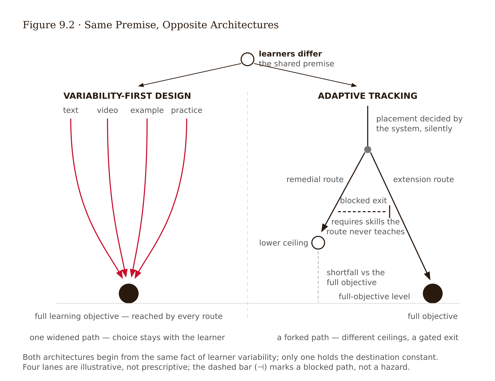
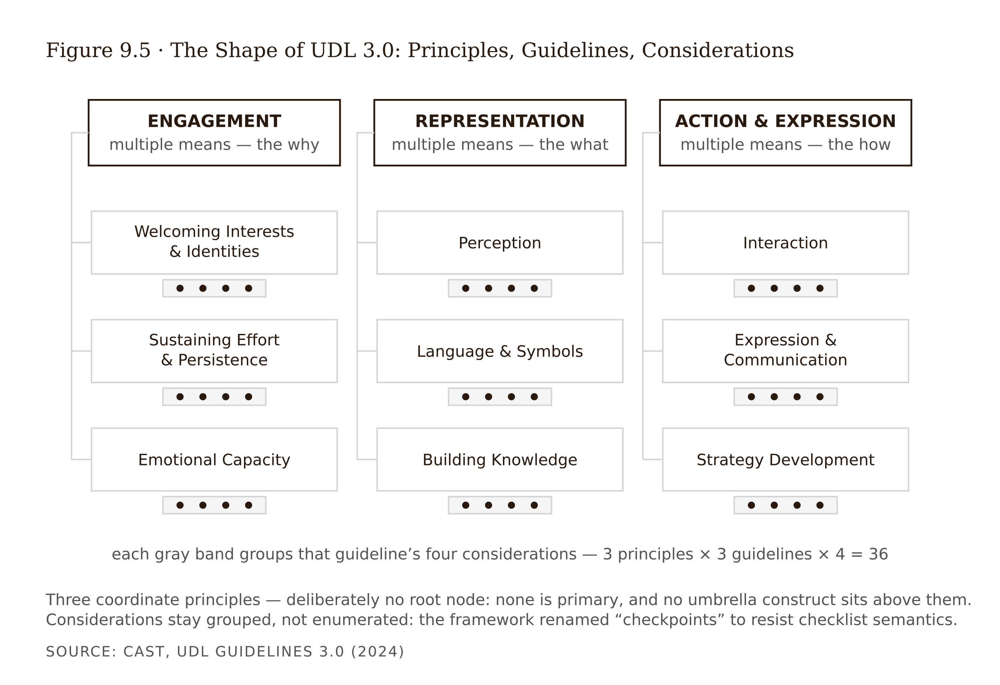

# Chapter 9 — Designing for Variability: UDL, Accessibility, and the Equity Test
*Holding two true statements at once.*

A middle-school math platform was adopted for the best reasons. Its adaptive engine promised the right problem for every student at the right moment, and it delivered: students scoring below threshold were routed into a remediation track — shorter problems, more repetition, more scaffolding — until accuracy recovered. Students above threshold advanced to extension challenges: open-ended modeling tasks, the creative work the curriculum saved for those who were ready. Teachers loved the dashboard. Remediation-track accuracy rose within weeks. Every individual routing decision, examined alone, was defensible.

A district analyst pulled the cohort data in April. Who was in the remediation track in September? Disproportionately the students who entered with weaker preparation — which, in this district as in most, meant disproportionately lower-income students and students still acquiring English. Who was still there in April? Mostly the same students. The track recovered accuracy on its own short, repetitive items and produced almost no exits, because advancement required performance on the extension-style problems the track never taught. Meanwhile the advanced group had spent seven months practicing modeling, argument, and transfer — the work that compounds. The September gap was a preparation gap. The April gap was a preparation gap *plus seven months of systematically different opportunity to learn*, administered automatically, at scale, with a dashboard certifying progress the whole time.

Note what this case is not. The routing rule used performance, not demographics. Intentions were good throughout. It is the pattern Cathy O'Neil (2016) taught designers to recognize: a proxy-driven model, operating at scale, whose outputs feed back into the conditions that generate its future inputs. The students were sorted by what they hadn't yet been taught, then taught less of it. The personalization worked exactly as designed. The design was the problem.

This chapter is about what it means to design for the *fact* of learner variability — real, universal, and the entire reason personalization is tempting — without building a sorting machine. And it asks you to hold two statements at once: accessibility is non-negotiable, and parts of the UDL evidence base are contested. Most writing on this topic drops one statement or the other. Advocacy treats the framework as settled science; debunking treats contested evidence as license to dismiss the obligations. Both are failures of exactly the discipline this course has been building. This chapter refuses both, which means it will be less comfortable than either.

---

Start with the premise underneath everything else, the chapter's least contested claim: **learner variability is universal, multidimensional, and poorly described by category labels.** Learners vary in sensory and motor access, language, prior knowledge, working memory, attention, executive function, bandwidth — literal and figurative — cultural reference points, and the circumstances surrounding each session. These dimensions vary *within* the same learner across contexts and weeks. The design tradition this chapter inherits begins from that fact rather than from a mythical average user, and understanding where that tradition comes from matters for evaluating its claims.

The lineage runs through architecture. Ron Mace's **universal design** reframed disability as a property of environments rather than persons: a staircase, not a wheelchair, is what makes a building inaccessible. The tradition's emblem is the **curb cut** — a ramp cut for wheelchair users that turned out to serve parents with strollers, travelers with luggage, cyclists, everyone some of the time. The *curb-cut effect* — designs required by some, beneficial to many — is the field's rhetorical engine, and it is often genuinely true. It is not a law of nature. Some accommodations involve real trade-offs. It is a pattern to check for, not an assumption to design on.

**Universal Design for Learning** is the education-side descendant, developed by CAST from the 1990s onward. If variability is the baseline, design multiple roads into the learning from the start, rather than building for the mythical average and retrofitting accommodations one diagnosis at a time. Retrofit logic is reactive, stigmatizing — the accommodated learner is marked as the exception — and slow. Variability-first logic is proactive and anonymous: the flexible design is just the design.

The current version is **UDL Guidelines 3.0**, released by CAST in July 2024 (CAST 2024): three principles — multiple means of **engagement** (the *why* of learning), of **representation** (the *what*), and of **action and expression** (the *how*) — elaborated into nine guidelines and thirty-six "considerations," renamed from "checkpoints," a deliberate move away from checklist semantics. The 3.0 revision shifted emphasis from individual learner differences toward barriers in the environment, including systemic ones. Read generously, this makes the framework more honest about where barriers live. Read skeptically, it moves the framework further from the operational specificity outcome research can grab onto — a tension treated squarely in a moment.

Used well, the UDL guidelines function as a **structured imagination prosthetic**: a systematic sweep across categories of variability a designer would otherwise sample by autobiography, because designers default to designing for their own perceptual, linguistic, and motivational profile. A framework's first service is interrupting that. Used badly, the guidelines become a compliance checklist where the artifact "has multiple means" of everything and nobody asked what any of it was *for*. The difference is whether each change traces to a named barrier for identifiable learners — which is why this book sequences the audit after learner research, mapping, and prototyping.

---

Here is the mechanism to master in this chapter — the one that separates rigorous from careless thinking about variability, and the one the evidence controversy depends on. Design changes emerging from a variability audit are **not all justified the same way**. Collapsing the three justification logics into one is the root error of both UDL advocacy and UDL debunking.

**The first logic is obligation.** Some changes are owed to learners as a matter of rights, law, and professional ethics, independent of any learning-outcome evidence. Captions. Screen-reader-compatible structure. Keyboard operability. Sufficient contrast. No information carried by color alone. These are codified in the **Web Content Accessibility Guidelines (WCAG 2.2)** — the W3C standard organized under POUR: perceivable, operable, understandable, robust — and carried into law by the ADA and Section 508 in the US and EN 301 549 in the EU. The justification test for an obligation is *access*, not effect size: does this change remove a barrier that excludes someone? Demanding learning-gain evidence before captioning a video is a category error — like demanding evidence that wheelchair ramps improve shopping outcomes. The ramp is owed because the building is public. No study can repeal an obligation, and no contested-evidence finding anywhere in this chapter touches Logic 1. This is what "accessibility is non-negotiable" means, precisely.

**The second logic is evidence.** Some changes a UDL audit surfaces are also supported by specific empirical literatures. Captions again — owed under Logic 1 *and* associated with comprehension benefits for many learners beyond those who require them, a genuine curb-cut effect (Gernsbacher 2015). Worked examples and scaffolding for novices, from Chapter 3's load literature. Making task value visible, from Chapter 4's strongest engagement predictor. When a change is double-justified — owed *and* evidenced — say so. It is the strongest position a design decision can occupy.

**The third logic is a documented bet.** Some changes rest on claims currently contested, under-evidenced, or unestablished — most prominently, that implementing UDL as a whole improves learning outcomes. The evidence status is documented in the pantry and fact-check notes rather than treated as settled. A Logic 3 label is not a prohibition. It is a requirement to decide under documented uncertainty: weigh plausibility, cost, risk, and reversibility, then record the bet. Designers decide under uncertainty constantly. The failure mode is not the uncertainty but the undisclosed confidence. In the series' taxonomy this is Tier 7 work — a judgment about acceptable trade-offs made under honest uncertainty, with real learners bearing the consequences, which is why it cannot be delegated (see Appendix: The Fundamental Themes).

Three errors, each common, each now nameable. Treating an obligation as if it needed outcome evidence — Logic 1 demoted to Logic 3 — is the debunker's error and the most harmful, because the people it harms are the ones the obligation protects. Treating a contested claim as settled because it shares a framework with obligations — Logic 3 promoted to Logic 1 — is the advocate's error, which spends credibility the obligations need. And treating the whole audit as undifferentiated virtue makes the design indefensible in exactly the budget meeting where it needs defending.

---

Now the contested middle, with both sides given their strongest form.

**The empirical predicament.** UDL is a meta-framework — a way of generating design decisions — not a single intervention. Implementations bundle many changes at once, vary enormously between studies, and usually arrive alongside other reforms. Isolating "the UDL effect" approaches impossibility. The most-cited meta-analysis by Capp (2017), covering 2013–2016 studies, reported improvements in learning *process* — engagement, access, perceived inclusion — while noting serious heterogeneity in what "UDL" meant across studies and limited, methodologically weak evidence on learning *outcomes*. Later systematic reviews trend positive on some academic outcomes, but across designs of mixed quality with persistent inconsistency in implementation description.

**The critics' strongest case.** Edyburn (2010) posed the foundational challenge from inside the field: if we cannot say operationally what counts as UDL implementation, we cannot validate it — "would you recognize UDL if you saw it?" The framework's brain-network framing is a loose translation of neuroscience, not a derivation from it; its guidelines mix well-evidenced practices with speculative ones; its institutional success — policy mandates, near-universal presence in teacher preparation — has outrun its outcome evidence, a pattern uncomfortably reminiscent of learning styles. That critique is itself disputed, and the evidence status is documented as contested in the pantry and fact-check notes. The critics' point is not that UDL-aligned classrooms harm anyone. It is that a framework can be humane, popular, mandated — and still not have demonstrated that *the framework itself* causes better learning.

**The advocates' strongest case.** Three replies have real force. First, the bundling problem cuts both ways: absence of clean whole-framework evidence is not evidence of absence, and demanding an RCT of a design philosophy may be a category error — you cannot randomize "designing for variability" any more than "user-centered design," and nobody concludes from that gap that user-centered design is bunk. Second, many UDL components are independently evidenced (Logic 2): the framework's value may be precisely as a delivery vehicle that gets evidenced practices implemented systematically. Third, part of UDL's justification was never about test scores — including learners otherwise excluded is a goal whose worth does not wait on outcome data, though advocates who make this correct argument must then accept its discipline and stop also claiming settled outcome superiority.

Where that leaves a designer is a calibration, not a verdict: treat UDL 3.0 as a valuable structured audit instrument whose component recommendations each earn their own label; treat whole-framework outcome claims as currently unestablished in either direction; and treat the obligations traveling alongside the framework as untouched by any of this, because they never rested on outcome evidence. If you feel an urge for a cleaner conclusion, notice it: that urge, gratified, is how fields end up with both uncritical mandates and uncritical backlashes.

---

Return to the opening case, because the variability conversation has a dangerous neighbor wearing its clothes.

**Designing for variability** and **adaptive personalization** begin from the same true premise — learners differ — and diverge structurally. Variability-first design widens the path: multiple means available to all learners, chosen by the learner, with the destination — the full learning objective — held constant. Choice is the learner's; no door closes. Adaptive tracking forks the path: an algorithm assigns different learners different experiences, often with different effective ceilings, based on inferred ability. Choice is the system's; doors close silently, at scale, and the learner rarely knows a fork existed.

The OECD's warning about AI-driven personalization names the risk plainly: layered onto already unequal systems, personalization can reproduce access gaps and unequal support — **digital tracking**, the algorithmic descendant of curricular tracking, which decades of education research found tends to entrench initial differences (OECD 2026). O'Neil (2016) supplies the anatomy the opening case instantiated: proxies stand in for the thing that matters, scale amplifies, opacity prevents appeal, and the feedback loop converts yesterday's gap into tomorrow's training data.

This does not mean adaptivity is forbidden — adaptive difficulty has genuine supporting evidence in some domains, and resist the lazy inversion as firmly as the lazy adoption. It means adaptive proposals must pass an **equity test** before the usual evidence test.

The test has four checks. **Ceiling:** does any group's assigned path foreclose access to the most cognitively rich work? The opening case fails here. **Exit:** does routing create the conditions for leaving the route it assigns — or does the remedial track teach only remedial performance? Fails here too. **Visibility and appeal:** do learners and teachers know routing happened, on what basis, and how to contest it — O'Neil's opacity criterion? **Cohort:** audit outcomes by group over time. The opening case looked fine at every resolution except the one that mattered.

<!-- → [TABLE: equity test checklist — four rows, one per check; columns: Check, Question, Passing condition, Opening-case verdict. Ceiling: "Does any routed path foreclose cognitively rich work?" / "All paths reach the full objective" / FAIL. Exit: "Does the track teach its own exit conditions?" / "Remediation includes skills required to advance" / FAIL. Visibility: "Do learners/teachers know routing happened and how to contest it?" / "Transparent basis, appeal mechanism" / NOT MET. Cohort: "Do outcomes disaggregate equitably over time?" / "No group systematically stranded" / FAIL. Caption: "A feature that passes the normal evidence test can still fail the equity test. Run them in this order."] -->

Two additional lenses extend the equity frame beyond access mechanics — both labeled honestly as value commitments with developing evidence bases rather than settled effect sizes. **Culturally sustaining pedagogy** (Paris 2012) asks whose language practices and ways of knowing the design treats as assets to sustain rather than deficits to remediate. **Trauma-informed design** — per SAMHSA's principles of safety, trustworthiness, choice, collaboration, empowerment — asks whether the experience's pressure points are load-bearing for learning or just ambient threat. And as the constructive alternative to algorithm-first personalization, **human-centered learning analytics** (Buckingham Shum, Ferguson & Martinez-Maldonado 2019) designs the analytic layer with its stakeholders: models interpretable, teachers in the loop on consequential routing, learners visible as agents rather than targets.

---

The audit method itself has a characteristic failure mode worth naming before the worked example. The tempting opening move is comprehensive: a spreadsheet scoring the experience against all thirty-six UDL 3.0 considerations. Two evenings later the spreadsheet is full and nothing has been decided; every row says "could add an option here." This is the checklist trap the framework's own renaming of "checkpoints" warns against. The useful audit is **barrier-first**: walk the experience as documented learner profiles — the phone-bound user, the EAL learner, the screen-reader user, the anxiety-carrying returner — logging the concrete barriers each one hits. Twenty minutes per walk. The considerations function as a prompt set for the walking, not a scoring grid.

The worked example is the *DataWise 101* statistics course, Unit 4's sampling-distribution segment — the prototype from Chapter 8, tested with five sighted, English-fluent volunteers on laptops with time to spare. The 140-person course includes, per the Chapter 5 research, learners on phones during work breaks, learners for whom English is an additional language, screen-reader users in recent cohorts, and a long tail of bandwidth, time, and confidence constraints. The segment survived its first test against a sliver of its audience.

The barrier-first walk as four documented profiles produces eleven concrete barriers. The resulting change table — abridged — looks like this:

The simulation walkthrough video has no captions or transcript. This excludes d/Deaf and hard-of-hearing learners and taxes EAL and phone-in-public learners. **OBLIGATED + EVIDENCE-SUPPORTED**: WCAG 2.2 criterion 1.2.2, and Gernsbacher 2015 for the documented comprehension benefit beyond required users. The double label matters rhetorically: the obligation holds regardless of the evidence; the evidence makes the case easier to fund.

The histogram comparison is encoded by color alone — the color-blind learner cannot see the contrast the misconception probe depends on. **OBLIGATED**: WCAG 1.4.1. Note that fixing this also protects the probe's validity as a research instrument.

The interactive slider is not keyboard-operable and screen-reader users cannot run the core activity at all. **OBLIGATED**: WCAG 2.1.1. The accessible alternative must be an equivalent activity, not a caption on an inaccessible one — the distinction between designed-accessible and genuinely equivalent is exactly where technical compliance fails real users.

Adding a parallel worked-example text path alongside the video walkthrough serves phone and bandwidth learners and learners who process text better than narrated animation. **EVIDENCE-SUPPORTED**: the worked-example effect from Chapter 3, independently justified by representation flexibility.

Framing the practice check's difficulty as designed and recoverable, and making the first attempt ungraded, serves anxious re-enrollers who read graded first attempts as judgment rather than practice. **EVIDENCE-SUPPORTED (motivation) / partially CONTESTED (specific wording)**: SDT competence framing from Chapter 4 supports the principle; the precise reframe wording is a documented bet.

Offering choice of written or audio explanation in the predict-observe-explain step addresses EAL learners taxed by typed English under time pressure. **CONTESTED/UNESTABLISHED**: low cost, reversible, plausible under UDL action/expression logic; the bet is documented and the measurement hook is whether modality choices correlate with probe quality.

The vendor's adaptive-remediation module — offered as a free trial, timed to the design sprint — is **declined**. It fails the ceiling check (the simplified track never reaches the misconception-confronting activity) and the exit check (advancement requires skills the track doesn't teach). This is the opening case sold as a feature. The underlying need is met by a human-in-the-loop instructor flag instead.

<!-- → [TABLE: abridged change table — columns: Change, Barrier addressed, Label, Grounds. Rows as described above, including the decline row for the adaptive module. Caption: "One row per change. One label per change. The decline is the table's most consequential output."] -->

The limit of this audit is worth stating in full: it was performed by one designer using documented profiles without testing with disabled learners or assistive-technology users. Walkthrough-by-proxy finds gross barriers and reliably misses subtle ones, and the data-table slider alternative is exactly the kind of "equivalent" that fails in real screen-reader use. The honest status of the OBLIGATED rows is *designed, not yet verified*. Verification with real AT users and an accessibility expert review is the segment's next gate. And nothing in the table claims the segment now teaches better — every learning claim still routes through Week 13.

---

The chapter opened with a platform that personalized perfectly and sorted inequitably. It ends with a method that finds obligations no evidence debate can touch, surfaces evidence-backed improvements the framework deserves credit for identifying, and labels the rest as bets rather than certainties. The most consequential output from the DataWise 101 audit was a refusal. That is not a failure of the method — it is what the method is for.

What happens next is verification debt: the gap between designed-accessible and verified-accessible with real users. Most "accessible" learning experiences live in that gap permanently, because the design pass happened and the verification pass never did. Closing the gap takes disabled users in the room, assistive-technology expertise, and institutional willingness to treat verification as a production requirement rather than a luxury. The chapter's Still Puzzling section ends on exactly this question, because it is the question the literature has not answered and practice has not solved. It is also, not coincidentally, the question this chapter cannot answer for you.

---

## Evidence Box

<!-- → [TABLE: evidence summary — columns: Claim, Key evidence, Direction & strength, Unsettled.] -->

| Claim | Key evidence | Direction & strength | Unsettled |
|---|---|---|---|
| Learner variability is universal and multidimensional | Foundational premise; not contested | Framework-level; undisputed | Disputes are about frameworks built on it, not the premise itself |
| Accessibility barriers exclude; codified standards remove identifiable barriers | WCAG 2.2; ADA/508/EN 301 549 | Engineering knowledge + rights law; not awaiting pedagogical validation | Whether a specific design is genuinely equivalent requires AT-user testing, not design review |
| Captions benefit comprehension broadly | Gernsbacher 2015 | Positive — single-author review corroborated by underlying studies | Cite the underlying studies for high-stakes claims; single-source flag applies |
| UDL-aligned implementation improves engagement and access measures | Capp 2017 | Positive average, with the author's own caveats about implementation heterogeneity and study quality | Outcome-level evidence mixed; effect sizes not stable across implementations |
| Whole-framework UDL → improved learning outcomes | Capp 2017; King-Sears et al. 2023; current reviews | Trend positive but contested; implementation heterogeneity prevents clean conclusions | Both a verdict-in-favor and a verdict-against are currently defensible |
| Digital tracking reproduces inequity | OECD 2026; O'Neil 2016 (mechanism); curricular-tracking literature | Well-documented pattern; mechanism consistent | Net equity effect of adaptive personalization is moderator-dependent; the moderator map is immature |
| Culturally sustaining pedagogy; trauma-informed design as outcome interventions | Paris 2012; SAMHSA principles | Strong theoretical and ethical grounding | Outcome evidence still developing; taught here as value commitments plus design questions |

---

## What Would Change My Mind

Two findings would force revisions in opposite directions — which is what calibration looks like. If a new generation of component-level studies showed consistent, replicated learning-outcome gains for the framework's currently unestablished recommendations — tested singly, with implementation fidelity reported against UDL reporting criteria — this chapter would promote those rows from Logic 3 to Logic 2 and credit the framework as a validated generator, not just a useful audit prompt. Conversely, consistent well-powered nulls for the framework's distinctive recommendations would shrink UDL's role here to "structured prompt for finding obligations and already-evidenced practices," said plainly. Note what is not on this list: no learning-outcome finding in either direction would change a word of the obligations sections, because those sections never rested on outcome evidence. That is what Logic 1's independence means.

---

## Still Puzzling

- **Can a meta-framework ever be validated?** If "UDL works" is unanswerable in principle — because the bundling problem prevents isolation — while "this UDL-derived change works" never aggregates back to the framework, the field's central empirical question may be permanently ill-posed. It is unclear what honesty requires us to say about mandates in the meantime.
- **The cost of the label, socially.** In institutions that fund only certainty, does labeling a change "documented bet" get equity work defunded? Is that a reason to soften the labels, or precisely the reason they matter?
- **Where does choice itself sit?** Modality choice is UDL bedrock — but Chapter 7 established that learners reliably mis-choose against desirable difficulty. When does multiple-means flexibility become an unguarded menu of fluency? The boundary between honored variability and abandoned guidance is undertheorized.
- **Verification debt.** Most "accessible" learning experiences are designed-accessible, not verified-accessible with real AT users. What would it take, institutionally and economically, to make verification as routine as the design pass?

---

## Exercises

**Warm-up**

1. *(Recall — justification logics)* A colleague proposes making all course videos keyboard-navigable and argues: "We should test whether this improves quiz scores before committing the development time." Identify the error in this argument by name, state the correct justification logic for keyboard operability, and cite the standard that establishes it as an obligation.
*Difficulty: low. Tests: Logic 1 vs. Logic 3 distinction; the category error of demanding outcome evidence for obligations.*

2. *(Recall — curb-cut effect)* The curb-cut effect is described as "a pattern to check for, not an assumption to design on." Explain the difference between those two stances, and give one example of a UDL-style accommodation where the curb-cut framing holds and one where it involves a real trade-off.
*Difficulty: low. Tests: honest vs. rhetorical use of the curb-cut framing.*

3. *(Recall — equity test)* Apply the four-part equity test to the following proposed feature: a platform that routes learners who fail two consecutive quizzes into a "consolidation mode" — shorter, scaffolded problems — with automatic return to the main track when accuracy reaches 80%. Which checks does it pass and which does it fail? What additional information would you need to complete the assessment?
*Difficulty: low. Tests: ceiling, exit, visibility, and cohort checks applied to a new scenario.*

**Application**

4. *(Apply — the three logics)* You are auditing an online professional certification. Label each of the following proposed changes with its justification logic — OBLIGATED, EVIDENCE-SUPPORTED, or CONTESTED/UNESTABLISHED — with one-sentence grounds for each. Flag any double-labeled changes: (a) adding alt-text to all images; (b) allowing learners to choose between a written essay or recorded presentation for the final assessment; (c) replacing a dense reading with a worked example for the first module's core concept; (d) adding a "choose your own order" navigation option for module sequencing.
*Difficulty: moderate. Tests: three-logic sort with real justification chains, including identifying the edge case where (b) and (d) require different treatments.*

5. *(Apply — barrier-first audit)* You are auditing a four-screen mobile learning experience for a professional audience. Describe the four documented learner profiles you would use to walk it barrier-first, the source for each profile (where the documentation comes from), and the specific accessibility and load-related barriers each profile is most likely to surface that a sighted, desktop-based design walkthrough would miss.
*Difficulty: moderate. Tests: barrier-first method, profile documentation discipline, audit coverage gaps.*

6. *(Apply — decline memo)* A product manager proposes adding a feature that automatically routes learners who haven't logged in for five days into a "re-engagement track" with simplified content and lower-stakes activities. Write a one-page decline memo: run the equity test, name which checks it fails and why, and propose an alternative that addresses the re-engagement goal without forking the path.
*Difficulty: moderate. Tests: equity test applied to a novel feature, constructive alternative thinking.*

**Synthesis**

7. *(Synthesize — advocate and skeptic)* The chapter states that both a verdict-in-favor and a verdict-against the whole-framework UDL outcome claim are currently defensible. Write a 200-word version of each, giving each side its strongest evidence-based case. Then write a third 100-word statement that gets the calibration right — acknowledging what is established, what is contested, and what that means for a designer making decisions today.
*Difficulty: moderate-high. Tests: intellectual honesty under genuine uncertainty; three-tier calibration rather than false resolution.*

8. *(Synthesize — double-justified design)* Identify three changes you would make to a hypothetical online statistics course that are double-justified — both obligated and evidence-supported — and three that are single-justified (either obligated only or evidence-supported only). For the double-justified changes, explain why the double label matters rhetorically in a budget conversation. For the single-justified changes, identify the argument you cannot make and why.
*Difficulty: high. Tests: integrated application of all three logics, real rhetorical deployment.*

**Challenge**

9. *(Challenge — verification debt)* The chapter ends on verification debt: the gap between designed-accessible and verified-accessible with real AT users. Propose a minimal verification protocol that a team of three — one learning designer, one developer, one subject-matter expert — could execute for a twenty-module online course without dedicated accessibility expertise on staff. Specify: what you can verify internally, what requires AT-user testing, what requires specialist review, and how you would prioritize the queue if you had budget for only five external verification sessions across all twenty modules.
*Difficulty: high. Tests: practical reasoning about resource constraints, honest limits of proxy methods.*

---

## Further Reading

- **CAST (2024). *Universal Design for Learning Guidelines, version 3.0.* udlguidelines.cast.org.** Read the primary source, not summaries — note the considerations' actual wording and the shift toward environmental and systemic barriers.
- **Capp, M. J. (2017). "The effectiveness of universal design for learning: A meta-analysis of literature between 2013 and 2016." *International Journal of Inclusive Education*, 21(8).** The most-cited synthesis — read it for its caveats as much as its means.
- **Edyburn, D. L. (2010). "Would you recognize universal design for learning if you saw it?" *Learning Disability Quarterly*, 33(1).** Still the sharpest framing of the validation problem, from inside the field.
- **Gernsbacher, M. A. (2015). "Video captions benefit everyone." *Policy Insights from the Behavioral and Brain Sciences*, 2(1).** The model citation for a double-justified change — obligation and evidence in one artifact.
- **O'Neil, C. (2016). *Weapons of Math Destruction.* Crown.** The proxy-scale-opacity-feedback anatomy behind the digital-tracking warning; the education chapters make the opening case's mechanism unforgettable.

---

**Project:** The Redesign Dossier
**This chapter adds:** `dossier/09-variability-audit.md` — the barrier-first audit of your prototyped segment: the WCAG sweep, the documented-profile walks, a change table with a justification-logic label on every row, the equity test on anything adaptive, and — if your audit goes the way most honest ones do — at least one decline.

### Exercise 1 — When to Use AI

The chapter splits the audit into mechanical work and judgment work, and the split maps directly onto AI. The sweep, the formatting, the prompt-set customization: AI's. The labels, the equity call, the documented bets: yours — and the rest of this block guards them.

**Task 1 — Run the mechanical WCAG sweep.** Describe your prototype's artifacts — every video, image, color-coded histogram, slider, timed element — and ask AI to list each applicable WCAG 2.2 Level A and AA success criterion with its number, its requirement in plain language, and a likely status based on your description, flagging everything it cannot determine.
*Why AI works here:* **pattern recognition against a codified public standard.** Every output is checkable: the criteria are numbered, published, and free at w3.org. This is the rare audit task where your independent evaluation criteria are literally a document you can open in another tab.

**Task 2 — Customize the considerations into walk prompts.** The chapter says the thirty-six UDL 3.0 considerations are a prompt set for the barrier-first walk, not a scoring grid. Paste your documented profiles from `dossier/05-learner-research.md` and ask AI to turn the considerations into a profile-specific walking checklist: for the phone-bound learner, which considerations to hold in mind at each screen; for the screen-reader user, which; and so on.
*Why AI works here:* **checklist customization** — this is the "structured imagination prosthetic" service the chapter credits the framework with, mechanized one step further. The walk itself, and what you notice on it, stays yours.

**Task 3 — Draft the change table.** After your walks, AI converts your barrier log into the chapter's table format — change, barrier addressed, label, grounds — with the label and grounds columns left empty.
*Why AI works here:* **reformatting.** The content is your walk; the format is the chapter's; the AI is a typesetter.

**The tell:** You know you are using AI appropriately when you can evaluate the output — when you have independent criteria to judge whether it is correct, complete, and fit for purpose.

### Exercise 2 — When NOT to Use AI

This is the book's hardest chapter and — alongside Chapter 5 — its premier When-NOT chapter. The three refusals below are not stylistic preferences. Each one delegates the exact judgment the chapter exists to teach.

**Task 1 — Assigning the justification-logic labels.** Do not ask AI to label your change-table rows OBLIGATED, EVIDENCE-SUPPORTED, or CONTESTED.
*Why AI fails here:* **justification-logic collapse.** A label is not a fact about the change; it is a judgment about what kind of justification the change rests on — and the chapter's two named errors are precisely the directions models drift. Trained-in agreeableness pushes accessibility framing toward warm universal endorsement, which flattens three distinct logics into one undifferentiated virtue. An audit flattened that way is exactly the one the chapter says is indefensible in the budget meeting where it most needs defending.

**Task 2 — Making the equity call.** When your audit reaches an adaptive feature — routing, remediation tracks, personalization, the vendor's free trial timed to your sprint — do not ask AI whether to accept or decline.
*Why AI fails here:* **values judgment under uncertainty — the Tier 7 boundary.** Anyone can draft the four checks; weighing a failed ceiling check against real benefits, on behalf of learners who will never know a fork existed, is a wisdom call about whose interests count and what risks are acceptable on other people's behalf. The model will produce a balanced-sounding recommendation either way, and balanced-sounding is not accountable. The most consequential row in the chapter's worked example was a refusal — the precise move a hedging model would have softened into "consider piloting with safeguards."

**Task 3 — Sourcing UDL evidence claims.** Do not ask AI "what does the evidence say about UDL?" and paste the answer into your grounds column.
*Why AI fails here:* **advocacy flattening of a contested literature.** The honest state of the evidence — process measures positive, outcome evidence contested, the whole-framework question possibly ill-posed — is exactly the calibrated uncertainty models reliably round off into "research shows UDL improves learning outcomes." The framework's institutional success has outrun its outcome evidence, and the model's training data is saturated with the institutional success. For Logic 2 grounds, cite the underlying study you have actually checked; for Logic 3 rows, the absence of settled evidence *is* the content of the label.

A specific risk in the current landscape: AI tools are increasingly able to generate "accessibility fixes" — auto-captioning, auto-alt-text, automated contrast adjustment. These are genuine assists on the WCAG mechanical sweep. They are not the justification logic call. An AI that adds captions satisfies SC 1.2.2. An AI that decides which changes to make based on a holistic reading of the learner population, the learning objective, and the equity test — that judgment is still yours.

**The tell:** If your change table carries labels you could not defend against both of Exercise 3's reviewers, an equity verdict you could not explain to the learners it routes, or a "research shows" you never traced to a study you read — the audit document exists, but the audit did not happen, because the AI did the work that should have been yours.

**Series connection:** Tier 7 (Wisdom) — the tier reserved for judgments that bind other people under genuine uncertainty. The three logics, the equity test, and the decline are this book's clearest cases of decisions whose weight comes from being answerable for them. AI can carry the audit's clipboard. It cannot carry its responsibility.

### Exercise 3 — LLM Exercise: Audit, Label, Defend Every Label Twice

**Builds:** `dossier/09-variability-audit.md`
**Tool:** Claude Project "Redesign Dossier," with `dossier/01` through `dossier/08` in project knowledge.

Three phases: AI runs the sweep, you run the walk and the labels, then the model challenges every label twice. Throughout: the labels are yours. The model may not assign, change, or originate a label, and it may not be cited as the grounds for one. It cannot tell you whether your design is actually accessible — only testing with real assistive-technology users can.

**Phase 1 — The sweep (AI).**

> Read dossier/08-prototype-test-report.md for the current state of my prototyped segment. Here is a full inventory of its artifacts and interactions: [PASTE — every video, image, interaction, color use, text block, and timed element]
>
> Produce two things. (1) A WCAG 2.2 sweep table: every applicable Level A and AA success criterion, with criterion number, plain-language requirement, and status — LIKELY MET, LIKELY NOT MET, or CANNOT DETERMINE from my description. Use CANNOT DETERMINE freely; never guess. (2) A walk-prompt sheet: for each documented learner profile in dossier/05-learner-research.md, the UDL 3.0 considerations most relevant to that profile's walk of this segment, phrased as questions to hold while walking, not boxes to tick.
>
> Do not assign justification-logic labels. Do not recommend changes. Do not summarize UDL outcome evidence. If my artifact inventory is missing detail you need, ask me.

**Phase 2 — The walk and the labels (you, no AI).** Walk the segment as each documented profile — twenty minutes per walk — logging concrete barriers. Build the change table. Assign every label yourself, with grounds: a named standard for OBLIGATED; a named, checked finding for EVIDENCE-SUPPORTED; a documented bet (cost, plausibility, reversibility, measurement hook) for CONTESTED/UNESTABLISHED. Run the four-check equity test on anything adaptive, including anything a vendor has offered you lately.

**Phase 3 — Defend every label twice (AI challenges, you answer).** Paste the completed table:

> You are two reviewers in sequence, examining my variability-audit change table: [PASTE YOUR COMPLETED TABLE, WITH LABELS AND GROUNDS]
>
> **Reviewer 1 is a rigorous UDL advocate:** for each row, argue where my labeling understates the case — obligations missed, evidence uncredited, curb-cut effects unanticipated. **Reviewer 2 is a rigorous evidence skeptic:** for each row, argue where my labeling overstates the case — citations that do not support the specific change, contested claims smuggled in as supported, obligations asserted without a named standard. Then, as yourself: (1) identify the single most vulnerable label and ask me the one question that would settle it — do not answer it; (2) identify any row where both reviewers agree I am wrong, since that is where I should look first; (3) list what neither reviewer can know from this table alone — for example, verification with assistive-technology users, or my learners' actual profiles.
>
> Do not produce a corrected table. Do not assign labels. If no completed table is pasted above, refuse and tell me to do the audit first.

Relabel only where you are persuaded, and record in the file: the most vulnerable row, your answer to the settling question with any relabeling and why, and one sentence on which reviewer was harder to answer.

**What this produces:** `dossier/09-variability-audit.md` — sweep table, barrier logs by profile, the labeled change table with grounds, equity-test verdicts including any declines, the defend-twice record from Phase 3, and the verification-debt statement: the honest closing line that every OBLIGATED row is *designed, not yet verified* until real AT users test it.

**How to adapt:**
- *Own project:* if your experience is in-person or low-tech, the WCAG sweep shrinks but does not vanish — handouts, slides, and LMS pages are all in scope — and the profile walks and three logics apply unchanged.
- *ChatGPT / Gemini:* paste profile summaries from `dossier/05` and a one-paragraph summary of `dossier/08` into Phase 1; if one model blurs the two reviewers into a single mushy voice, run them as two separate chats.
- *Claude Project:* upload the finished `09` file to project knowledge — the declined feature reappears in Chapter 15's defended-declines section, and the measurement hooks feed Chapter 13.

**Connection to previous chapters:** the profiles you walk come from `dossier/05` — this audit is only as honest as that research was; the artifact you audit is `dossier/08`'s prototype, which passed its test against five volunteers who resembled almost none of the full audience.

**Preview of next:** Chapter 10 takes the labeling habit you built here to gamification — `dossier/10-motivation-decision.md` — where a headline effect size of g = 0.782 contains negative studies, and a label becomes a decision.

### Exercise 4 — CLI Exercise: The Audit Scaffold (and the Honest "Cannot Determine")

**Tool:** Cowork by default — the audit is a documents job. Use Claude Code instead if your prototype includes HTML or web artifacts, because the agent can then run real checks (contrast ratios, alt-text presence, heading hierarchy, label–control association) rather than guessing from descriptions. Justification: this task's center of gravity is a self-honesty constraint — marking what cannot be machine-determined — and agents honor that constraint best when it is an explicit output category.
**Skill level:** Intermediate.

**Setup checklist:**
- [ ] Dossier folder with `05` and `08`
- [ ] Prototype artifacts (files or written descriptions) gathered in `dossier/working/ch9-artifacts/`
- [ ] If using Claude Code on web artifacts: the HTML/CSS in that same folder

**Paste-ready task:**

> Read dossier/05-learner-research.md, dossier/08-prototype-test-report.md, and everything in dossier/working/ch9-artifacts/. Do not modify any of these. Create exactly one file, dossier/working/ch9-audit-scaffold.md, containing:
>
> 1. WCAG 2.2 sweep table — every applicable Level A and AA criterion for these artifact types, with criterion number, plain-language requirement, and status. Status must be one of: MET (only if you verified it directly from the artifact files), NOT MET (only if directly verifiable), or CANNOT DETERMINE — REQUIRES HUMAN/AT TESTING. For any artifact you can inspect programmatically (HTML contrast, alt text, heading structure), run the actual check and cite what you found. Never infer MET from absence of evidence.
> 2. Profile walk-log skeleton — one section per documented learner profile found in dossier/05, quoting each profile's documented characteristics verbatim. Do not add, merge, or embellish profiles. Each section gets an empty barrier-log table (screen/step, barrier observed, severity) for me to fill during my walks.
> 3. Change-table skeleton — columns: Change, Barrier addressed, Label, Grounds, Equity test (if adaptive). Pre-fill only the Change and Barrier columns, and only from the NOT MET rows of your sweep. The Label, Grounds, and Equity-test columns must contain only the text "[LEARNER — judgment required]" in every row.
>
> Constraints: one output file only; never assign or suggest a justification-logic label; never state or summarize UDL outcome evidence; never recommend for or against any adaptive feature; if dossier/05 contains fewer than three documented profiles, stop and tell me the audit input is too thin instead of inventing profiles. Finish by printing counts: criteria swept, MET / NOT MET / CANNOT DETERMINE, profiles found, change rows pre-filled.

**Expected output:** one scaffold file that does the mechanical share of the audit and visibly refuses to do the share that is yours.

**What to inspect:** the CANNOT DETERMINE count first — if it is near zero, be suspicious, not pleased. For most artifact sets, most criteria are not machine-determinable, and a low count means the agent guessed. Spot-check three criterion numbers against the published WCAG 2.2 standard — models transpose criterion numbers with complete confidence. Confirm every profile section quotes `dossier/05` rather than paraphrasing toward stereotype. Confirm the Label column contains nothing but the placeholder.

**If it goes wrong:** if labels appeared anywhere, do not edit them into correctness — delete the column contents entirely and assign from scratch, because a wrong anchor label biases your judgment even after you "fix" it. If the sweep contains an invented criterion number, re-check every row before trusting any. If profiles were embellished, the scaffold is contaminated at its root: re-run with the verbatim-quote constraint promoted to the first line.

**CLAUDE.md / AGENTS.md note:** add to the dossier folder's `CLAUDE.md` (or `AGENTS.md`): *"Never assign justification-logic labels (OBLIGATED / EVIDENCE-SUPPORTED / CONTESTED). Never present whole-framework UDL outcome claims as settled. Mark every accessibility check not directly verified as CANNOT DETERMINE."*

### Exercise 5 — AI Validation Exercise: The Planted Audit

**What you validate:** a pre-generated artifact, supplied below — the one exercise in this block that deliberately breaks the validate-your-own-output rule. The failure modes this chapter warns about are easiest to learn on an artifact where they are guaranteed present, and hardest to catch in your own work, where motivated reasoning runs in the same direction the model drifts. Find them here first; then re-run the identical checklist on your own change table from Exercise 3.
**Type:** judgment-claims validation — labels, evidence claims, equity reasoning.
**Risk level:** High. A wrong load estimate costs a revision. A wrong audit label costs either a learner's access (an obligation demoted) or the audit's credibility (a bet promoted) — and a missed equity failure costs other people's opportunities, at scale, with a dashboard certifying progress the whole time.

**The artifact.** An AI assistant was asked to draft a variability audit for a twelve-module online data-literacy course (video lectures, auto-graded quizzes, a drag-and-drop dashboard-builder exercise). It returned this change table:

| # | Change | Barrier addressed | Label | Grounds |
|---|---|---|---|---|
| 1 | Add alt text to all dashboard screenshots | Screen-reader users cannot access image content | OBLIGATED | WCAG 2.2 SC 1.1.1 (Non-text Content) |
| 2 | Add captions and transcripts to lecture videos | d/Deaf and hard-of-hearing learners excluded; EAL learners taxed | EVIDENCE-SUPPORTED | Captions improve comprehension for many learners (Gernsbacher 2015). Recommended as an optional enhancement for a future release, budget permitting |
| 3 | Offer every concept in both text and video form | Learners differ in preferred means of representation | EVIDENCE-SUPPORTED | UDL research has established that multiple means of representation improves learning outcomes (Capp 2017); the framework is well validated and widely mandated |
| 4 | Raise color contrast of dashboard-builder labels to 4.5:1 | Low-vision learners cannot read control labels | OBLIGATED | WCAG 2.2 SC 1.4.3 (Contrast Minimum) |
| 5 | Auto-route learners who fail two consecutive quizzes into a "Foundations track" with shortened videos and simplified exercises until quiz accuracy reaches 80% | Struggling learners are overwhelmed by main-track difficulty | EVIDENCE-SUPPORTED | Adaptive difficulty is supported in the personalization literature; meets learners where they are and protects motivation. Strongly recommended |
| 6 | Provide a worked example before the first independent dashboard exercise | Novice learners hit high load at the first open task | EVIDENCE-SUPPORTED | Worked-example effect (cognitive load literature, Chapter 3) |

The table contains three serious failures — and several defensible rows, because over-rejection is also an error. Run the checklist. You must catch all three.

**The checklist:**
1. **Correctness** — does each citation support the specific claim attached to it? Check what Capp (2017) actually reported, and what its author's own caveats were.
2. **Completeness** — does any row claim *less* than it should? Is any change carrying one justification when it is owed two — and does the missing label change what happens to the row in a budget meeting?
3. **Scope** — does any row exceed what an audit-by-description can know? Which statuses would require AT-user verification that no table can supply?
4. **Logic-label integrity** *(chapter-specific)* — test every label against the chapter's two named errors: an obligation demoted to evidence-or-optional (the debunker's error — who does it harm?), and a contested claim promoted to settled (the advocate's error — what credibility does it spend?).
5. **Equity-test coverage** *(chapter-specific)* — for every adaptive or routing row, check whether the four checks (ceiling, exit, visibility, cohort) were run at all. A recommendation with the equity test unrun is not a finding; it is the opening case sold as a feature.
6. **Failure-mode check** — *advocacy flattening.* Read the whole table asking whether anything contested got rounded up to settled, and anything owed got rounded down to optional. Those two drifts, in those two directions, are this task's documented failure mode.

**Findings protocol:** this artifact is built to fail, so the protocol inverts. Caught all three planted failures → write one sentence per failure naming the error class and the fix, then run this same checklist on your own Exercise 3 table. Caught one or two → reread the three-logics section and the equity test before looking again; the one you missed is the one your own audit is most likely to contain. Flagged a defensible row as a failure → that earns a sentence too: over-rejection is the debunker's error wearing rigor's clothes. *(Answer key — commit to your findings before reading: row 2 demotes a WCAG 1.2.2 obligation to an optional, evidence-only enhancement; row 3 promotes the contested whole-framework outcome claim to settled, against Capp's own caveats; row 5 recommends digital tracking with the equity test never run — it fails ceiling and exit on its face. If you flagged different rows, argue it out in your dossier; defending a disagreement with the answer key is itself the skill.)*

**AI Use Disclosure:** generate the draft with this prompt, then edit until both sentences are true — for this file especially, note that the disclosure is itself a logic exercise: it must not claim verification that has not happened.

> Draft a two-sentence AI Use Disclosure for my variability audit. Sentence one states what AI did: ran the WCAG sweep and walk-prompt generation, formatted the change table, and challenged my labels as two opposed reviewers. Sentence two states what I did and verified: walked the segment as each documented profile, assigned and defended every justification-logic label, ran the equity test on all adaptive features and made the accept/decline calls myself, and confirmed every evidence claim against a source I read — with AT-user verification still outstanding and recorded as verification debt.

**Series connection:** Tier 7 (Wisdom). The validation you just ran trained the tier's defining question — not "is the AI right?" but "which of these claims was the AI ever in a position to make?" An obligation is not the model's to waive, an equity call is not the model's to settle, and a contested literature is not the model's to resolve. Carry the question forward: Chapter 14 will ask it again, under stakeholder pressure, about your own conclusions.

---

## References

*Fact-checked 2026-06-07. All sources below were verified against the publisher or standards body and CONFIRMED. See factchecks/09-designing-for-variability-udl-accessibility-and-the-equity-test-assertions.md for the full report.*

1. CAST (2024). *Universal Design for Learning Guidelines version 3.0.* udlguidelines.cast.org. — CONFIRMED: released July 2024; three principles, nine guidelines, 36 considerations (formerly "checkpoints").
2. W3C (2023, updated Dec 2024). *Web Content Accessibility Guidelines (WCAG) 2.2.* w3.org/TR/WCAG22/. — CONFIRMED: current W3C Recommendation as of 2026; POUR structure.
3. Capp, M. J. (2017). "The effectiveness of universal design for learning: A meta-analysis of literature between 2013 and 2016." *International Journal of Inclusive Education*, 21(8), 791–807. — CONFIRMED: process gains; outcome evidence not demonstrated.
4. King-Sears, M. E., et al. (2023). "Achievement of learners receiving UDL instruction: A meta-analysis." *Teaching and Teacher Education.* — CONFIRMED: 20 studies (2014–2021), moderate positive g = 0.43.
5. Edyburn, D. L. (2010). "Would You Recognize Universal Design for Learning if You Saw it?" *Learning Disability Quarterly*, 33(1), 33–41. — CONFIRMED.
6. Gernsbacher, M. A. (2015). "Video Captions Benefit Everyone." *Policy Insights from the Behavioral and Brain Sciences*, 2(1), 195–202. — CONFIRMED (single-author review, as the chapter notes).
7. O'Neil, C. (2016). *Weapons of Math Destruction.* Crown. — CONFIRMED.
8. Paris, D. (2012). "Culturally Sustaining Pedagogy: A Needed Change in Stance, Terminology, and Practice." *Educational Researcher*, 41(3), 93–97. — CONFIRMED.
9. OECD (2026). *OECD Digital Education Outlook 2026.* OECD Publishing. — CONFIRMED (exists; contains equity/personalization warnings).
10. Buckingham Shum, S., Ferguson, R., & Martinez-Maldonado, R. (2019). "Human-Centred Learning Analytics." *Journal of Learning Analytics*, 6(2). — CONFIRMED.
