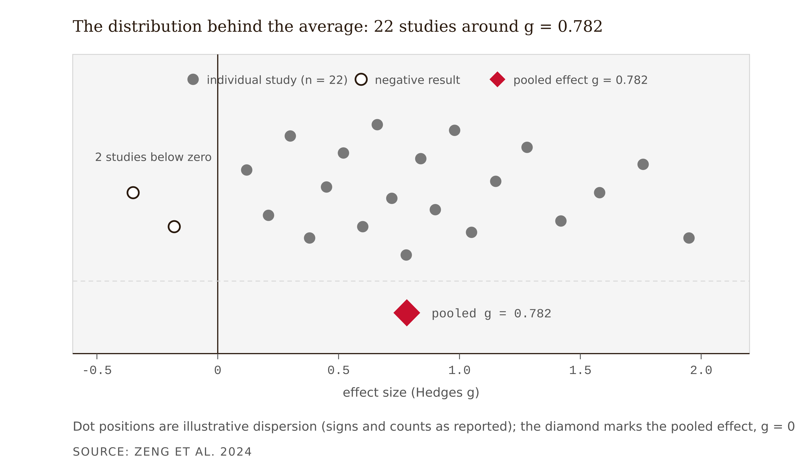
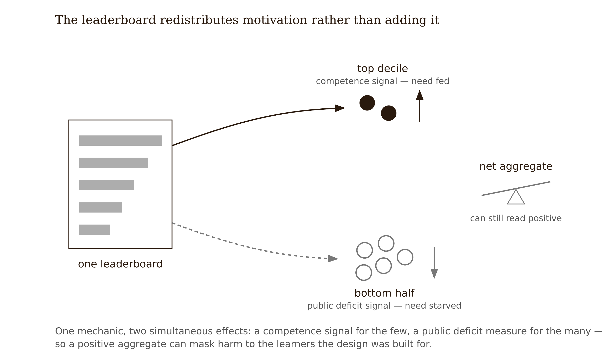
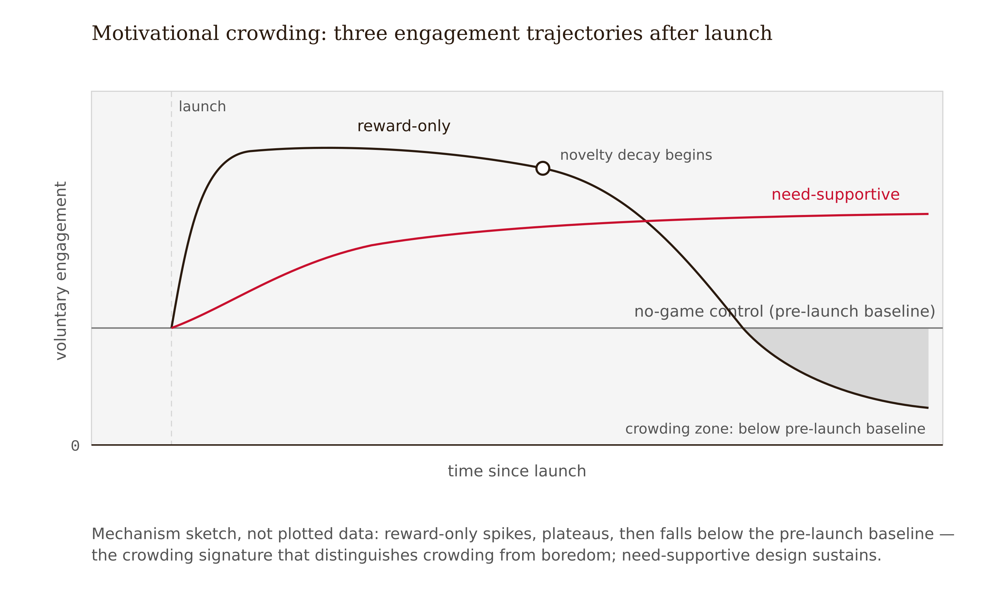
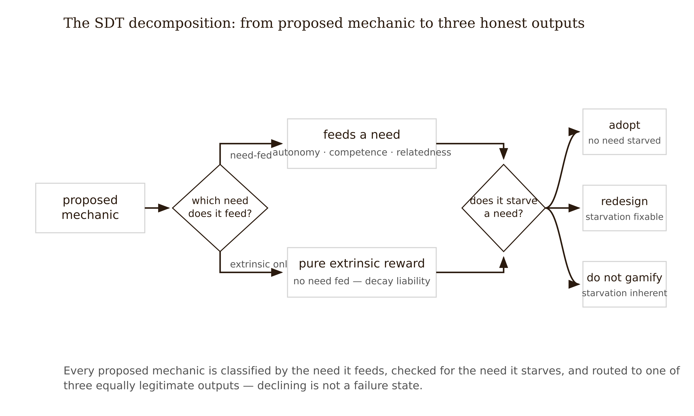
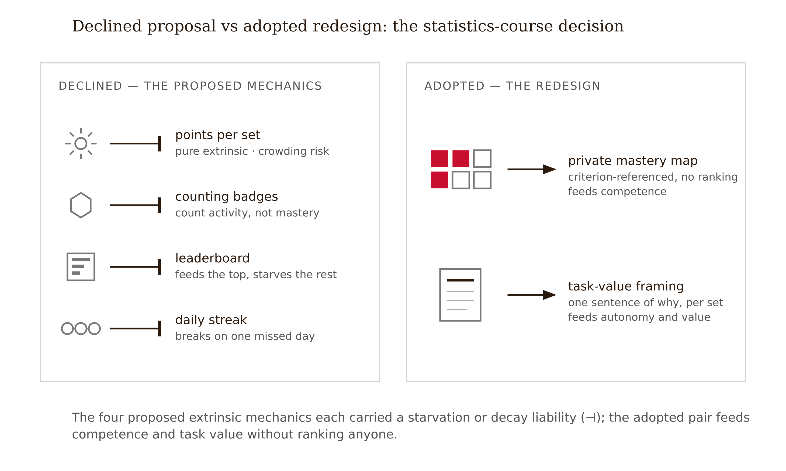

# Chapter 10 — Gamification Under Evidence: Motivation Mechanics That Survive the Meta-Analyses
*Why two deployments with identical feature lists can diverge by three years and an entire distribution.*

Consider two deployments of the same gamified curriculum.

The first is documented. A higher-education course was gamified and tracked longitudinally — 1,001 students across three academic years — against a traditional classroom condition and a plain online condition (Lampropoulos & Sidiropoulos 2024). The gamified condition won on every outcome the study measured: success rate, average grade, retention, and — most strikingly — excellence rate, the proportion of students earning top marks. That last detail matters and we will return to it. The biggest gain was at the top of the distribution. Gamification raised the ceiling more than the floor.

The second deployment is an illustrative composite, assembled from the pattern the extrinsic-reward literature predicts and practitioners repeatedly report (Deci, Koestner & Ryan 1999; Hanus & Fox 2015). A different program licenses a similar curriculum and applies the same surface checklist: points, badges, a leaderboard, completion streaks. Usage spikes for six weeks. The launch retrospective declares victory. By week twelve, voluntary practice has fallen below the pre-launch baseline. The students who sit atop the leaderboard keep going; the students in the bottom half, who can now see precisely how far behind they are, quietly stop logging in. Satisfaction surveys stay excellent the entire time — you saw this exact signature in Chapter 4, and now you know to distrust it.

Same curriculum. Same nouns on the feature list. One deployment compounds for three years; one collapses after novelty. If "gamification" were a single treatment, this could not happen. The difference is not the badges. It is which psychological needs the mechanics feed — and that is a design property you can analyze before launch, not a mystery you discover after it.

---

The most cited number in this space comes from a meta-analysis in the *British Journal of Educational Technology*: across 22 experimental studies, gamification produced a moderately positive effect on academic performance, Hedges' *g* = 0.782 (Zeng et al. 2024). Read naively, that is a strong endorsement, comfortably above the conventional moderate threshold. Read the way Chapter 1 trained you: the exact pooled sample size and count of negative studies remain manuscript-freeze checks, but the design lesson already holds. The average is not a guarantee; it is the center of a distribution wide enough to contain harm.



This is the actual finding, and it is the one students most reliably skip. Heterogeneity — the technical term for variation in true effects across studies — means a meta-analytic average tells you what happened across many implementations of many designs in many contexts. It cannot tell you what your design will do, because "gamification" is not one treatment. A points-for-completion system and a team-quest system with meaningful choices are as different as two drugs that happen to share a marketing category. The field's research program has accordingly shifted from asking *whether* gamification works to asking *which gamification works, for whom, under what conditions* (Sailer & Homner 2020). You are not entitled to the average. You are entitled to the slice of the distribution your design choices put you in. In the series' taxonomy, that placement is Tier 5 work — a causal judgment about your population that no average computed over other people's deployments can make for you.

Three moderating patterns recur across the recent evidence and are worth knowing before any mechanic is proposed.

**Implementation quality and creativity matter as much as which elements are present.** A PRISMA-based systematic review concluded that gamification significantly influences motivation and skill development, but that creativity and adaptability in implementation matter as much as the presence or absence of game elements (Jaramillo-Mediavilla et al. 2024). The same badge can be a meaningful competence signal or wallpaper, depending on what it is attached to.

**Need-supportive designs sustain; reward-only designs decay.** Gamification designed to satisfy intrinsic psychological needs — autonomy, competence, relatedness — leads to autonomous motivation and long-term retention. Systems relying purely on extrinsic rewards, the points-badges-leaderboards triad, frequently show rapid engagement decline once novelty fades, and can actively undermine intrinsic motivation. This is the moderator that best explains the opening case, and it has independent support: SDT's core claims about need support and motivation quality carry strong meta-analytic backing in education (Wang et al. 2024; Ryan & Deci 2000).

**The largest gains are at the top of the distribution.** The three-year longitudinal study's most important finding is also its least frequently cited: the biggest gain was in excellence rate. If your learning goal is to move the struggling majority — which for most courses it is — a mechanic that primarily energizes the already-successful may produce impressive aggregate numbers while doing little for the learners you built the redesign for. Any mechanic that publicly ranks learners should be interrogated against a specific question: what does this do to the person in the 30th percentile in week six?

---

Here is the chapter's core method. Take any proposed gamified system. Refuse to evaluate "the gamification." Instead, list every individual mechanic and ask of each: which psychological need does this feed — autonomy, competence, relatedness — or is it a pure extrinsic reward? Then ask the darker twin question: which need might it starve?

<!-- → [TABLE: SDT decomposition of seven common mechanics — columns: Mechanic, Can Feed (with conditions), Can Starve (with conditions), Crowding Risk, Population Warning — rows: points for completion, badges, leaderboard, streaks, levels/unlockable paths, team quests, narrative/role framing — designed to serve as the analytical tool for the studio assignment] -->

Two rows deserve extended attention.

Leaderboards are the clearest case of a mechanic with opposite effects on different learners simultaneously. For the top decile, a leaderboard is a competence signal and a competitive environment — it feeds exactly what they came for. For everyone else, it is a precise, public measure of how far behind they are, updated on every login. Review literature suggests benefits concentrated among high performers and competitive-orientation learners, with discouragement and disengagement risks for those persistently ranked low; the exact leaderboard-review anchor remains a manuscript-freeze check. A leaderboard is not a motivation mechanic. It is a motivation *redistribution* mechanic. What it adds at the top it may subtract from the bottom, and the aggregate can look positive while the effect on the learners who most needed help is negative.



Streaks deserve a different kind of suspicion. The persuasion literature describes commitment and consistency: once people take a small public action, they experience internal and social pressure to behave consistently with it (Cialdini 2009). A streak is a commitment device. It reliably produces *behavior*. Whether it produces *learning* depends entirely on what the streak-preserving behavior is. A streak that can be kept alive with a thirty-second token lesson trains exactly that: the thirty-second token lesson. You met this product category in Chapter 1's EVER finding — beloved, habit-forming, minimal learning value. The streak worked. The learning was optional.

The decomposition method's output is a table, and the table is the argument. When you can show a stakeholder that four of five proposed mechanics are pure extrinsic reward and the fifth starves autonomy, "should we gamify?" stops being a matter of taste.

---

The decomposition identifies *which* mechanics feed which needs. The mechanism that explains *why* reward-only systems collapse rather than merely plateau is worth understanding directly, because it is the piece practitioners most often miss.

**Motivational crowding** — also called the undermining effect — is the phenomenon in which extrinsic rewards displace rather than add to intrinsic motivation. The canonical evidence is a meta-analysis of 128 experiments: tangible rewards that are expected and contingent on doing a task reliably reduced subsequent free-choice engagement in that task (Deci, Koestner & Ryan 1999). People who were paid to do something they previously did for its own sake became less likely to do it once the payment stopped.

The mechanism in plain language: motivation is not a single fuel tank that rewards top up. It is a quality dimension as much as a quantity. When a learner practices statistics because the problems are starting to make sense — competence satisfaction — the activity is self-sustaining. When the same learner practices to earn points, the implicit answer to "why am I doing this?" changes. The reward reframes the activity as the kind of thing one does *for rewards*. Remove the reward — or let it become stale, which novelty decay guarantees — and the reframed activity has no remaining reason. The system did not add motivation. It performed a swap: durable, self-generated motivation out; fragile, externally-maintained motivation in.

This produces the characteristic decay curve from the opening case: spike (novelty plus reward), plateau (reward maintenance), then fall *below baseline* (original intrinsic motivation crowded out, reward no longer compensating). The below-baseline endpoint is the signature that distinguishes crowding from simple boredom. Boredom returns you to where you started. Crowding leaves you worse off than if the mechanic had never launched.

Three design corollaries follow directly.

Rewards are least dangerous where intrinsic motivation is already near zero — there is little to crowd out in a mandatory compliance module with no prior interest. This is why gamification findings from low-interest contexts transfer poorly to contexts where learners arrive curious.

Informational rewards behave differently from controlling rewards. Feedback that says *here is what you can now do* — criterion-referenced badges, mastery progress displays — supports competence. Rewards experienced as *here is your payment for compliance* control behavior and trigger crowding. The same artifact can be either; the framing and contingency structure decide.

Decay risk must be disclosed at design time. A mechanic with a predictable six-week half-life is not necessarily wrong — a six-week onboarding course might happily spend it. A two-semester statistics sequence cannot.



---

The decomposition method has three honest outputs, not two: gamify this way, gamify differently than proposed, and do not gamify. The third is underused because it feels like a non-deliverable. It is not. A documented, evidence-cited decision to decline is the artifact that proves you select for learning rather than engagement.



The "no game" answer is indicated when the decomposition table shows mostly extrinsic-reward rows; when the learner population is far from the leaderboard's top decile; when the content already carries intrinsic interest that crowding would endanger; when the maintenance cost of keeping mechanics fresh exceeds the team's capacity (stale game layers decay fastest); or when a cheaper, better-evidenced intervention serves the same motivational diagnosis.

That last clause is the one to internalize. Gamification proposals are usually a symptom report — learners are not practicing — and the evidence-disciplined move is to treat the diagnosis rather than to accept the prescription that arrived stapled to it. Often the diagnosis is a task-value gap: learners cannot see what the practice buys them. Making the content's utility visible costs nothing, decays slowly, and has stronger evidence support as a predictor of cognitive engagement quality than any mechanic in the decomposition table (Chapter 4). Declining gamification is not refusing to think about motivation. The motivation design obligation remains. You are declining one family of treatments because the evidence prices it honestly.

---

Translate the framework into the case it was built for.

The introductory statistics course's Week 8 prototype redesigned practice around retrieval and spaced problem sets. Completion of optional practice remains low — 38% of enrolled students attempt fewer than half the optional sets. A well-meaning program director, back from a conference, proposes a gamification layer: points per completed problem set, achievement badges, a course-wide leaderboard, and a daily practice streak.

The diagnosis behind the proposal is real: students are not practicing enough. But the proposal is a treatment named before the diagnosis was examined. The actual question: will any of these four mechanics increase durable practice for the students currently not practicing — the bottom 60%, not the top 10% — without crowding out the fragile intrinsic motivation the Week 8 redesign just started building?

Run the SDT decomposition. Points-per-set: pure extrinsic, contingent and expected — the exact reward profile in Deci, Koestner and Ryan (1999). Badges: inert unless criterion-referenced; "completed 10 sets" is a counting badge, not a competence badge. Leaderboard: the course's struggling majority is precisely the population the leaderboard evidence warns about, and the Week 5 learner research found statistics anxiety in nine of twelve interviews — public ranking is close to contraindicated. Streak: would reward daily touches; the problem sets take 25–40 minutes, so the streak-preserving behavior would likely shrink to token engagement.

Two dead ends are worth naming. Spending a day trying to fix the leaderboard — relative-improvement ranking, opt-in, anonymized — produces a mechanic that must be defanged into near-invisibility to be safe. A mechanic that requires defanging is not earning its complexity. Drafting a narrative quest frame — "you are a data detective" — reads as charming for week one and as a seductive detail thereafter; nothing in the learner research suggests the problem is insufficient whimsy.

Re-reading the Week 5 interviews surfaces the actual moderator: students skip optional practice because they cannot see what it buys them. Task-value gap. Not a reward gap.

The memo declines the gamification layer. In its place: a private, criterion-referenced mastery progress map showing which course skills each student has demonstrated and which the next practice set develops — competence-feeding, informational, no ranking; each optional set opens with one sentence connecting it to the exam and to a named real job task; practice sets remain optional, preserving autonomy. Decay risk of the progress map is judged low because it is informational rather than reward-contingent — *this is an assumption awaiting measurement*. Whether map usage and practice persistence hold through week twelve enters the instrumentation plan.



The gamification decision is not made about gamification. It is made about the diagnosis, the population, and the needs each mechanic feeds. And "no game, but here is what instead" is a complete, defensible design output — arguably more rigorous than a gamification proposal that does not account for the learners it will leave below baseline.

---

## Exercises

**Warm-up**

1. *(Recall — heterogeneity)* A colleague cites *g* = 0.782 from Zeng et al. (2024) as proof that adding badges to your course is evidence-based. Name the two distinct errors in that sentence, and write the two questions you would ask about the meta-analysis before treating the average as a design warrant.

2. *(Recall — crowding mechanism)* In your own words, without consulting the text: explain why a reward-only gamified system lands *below* its pre-launch baseline at week twelve, rather than simply returning to it. What is the mechanism, and what did the reward swap out?

**Application**

3. *(Apply — SDT decomposition)* Choose any gamified learning product you have used. List every mechanic you can identify. For each, classify the psychological need it feeds (autonomy, competence, or relatedness) or mark it as pure extrinsic reward, and identify any need it starves. Produce the table, then write three sentences: which mechanics carry the most decay risk, which are most worth keeping, and what the decomposition reveals about what the product is actually optimized for.

4. *(Apply — population audit)* Take the leaderboard mechanic from Exercise 3 or from the statistics course case. Predict its effect on three specific learner segments: the top 10% by performance, the middle 50%, and the bottom 40%. Write one sentence per segment, naming the mechanism. Then state the single metric at 90 days that would tell you whether the mechanic helped or hurt the segment that needed the most help.

5. *(Apply — informational vs. controlling)* For a learning product you know, identify one mechanic that is currently functioning as a controlling reward and propose a redesign that makes it informational instead. The redesign must leave the mechanic's surface appearance as close to unchanged as possible — the test is whether the framing and contingency structure, not the visual, is what changes.

**Synthesis**

6. *(Synthesize — the decision memo)* Produce a gamification decision memo for a learning experience you are designing or are familiar with. Required structure: diagnosis (what motivation problem the proposal is trying to solve), SDT decomposition table (every proposed mechanic, need fed, need starved), decision (design as proposed / redesign / decline), and a mandatory decay-risk disclosure (the expected decay profile of any mechanic you kept, and whether the experience still functions for learning if that mechanic is ignored). Maximum two pages.

7. *(Synthesize — ceiling vs. floor)* The three-year longitudinal study found gamification's largest gain in excellence rate — the ceiling, not the floor. Your course serves a population where the majority are in the bottom half of prior performance. Construct the argument for adapting rather than rejecting gamification for this population: which mechanics might move the floor, what design changes the leaderboard evidence would require, and what you would measure to know whether the floor actually moved.

**Challenge**

8. *(Challenge — the missing file drawer)* The published gamification literature almost certainly under-samples week-twelve failures — institutions rarely publish collapsed deployments. Design a study that would estimate publication bias in this literature: what you would measure, how you would find unpublished null and negative results, and how a more complete picture of the distribution would change the advice you would give a stakeholder citing *g* = 0.782 as justification for a new leaderboard.

---

## Chapter 10 Exercises: Gamification Under Evidence: Motivation Mechanics That Survive the Meta-Analyses

**Project:** The Redesign Dossier
**This chapter adds:** `dossier/10-motivation-decision.md` — the gamification decision memo for your project: an SDT decomposition of every proposed mechanic, a verdict (design as proposed / redesign / decline), and a mandatory decay-risk disclosure.

---

### Exercise 1 — When to Use AI

**The judgment:** In this chapter's work, AI assistance is appropriate for the following tasks:

- **Decomposing proposed mechanics by the need each one feeds — and starves.** Hand the model the mechanics your stakeholders have proposed — points, badges, a leaderboard, streaks, whatever arrived stapled to the symptom report — and have it tag each one with the SDT need it could feed, the need it could starve, and its crowding risk, in the format of the chapter's decomposition table. — *Why AI works here:* this is structured classification against a published framework — the categories (autonomy, competence, relatedness, pure extrinsic reward) are fixed, the chapter gives you the reference table, and every tag the model assigns is checkable against it.
- **Generating mechanic alternatives.** For any mechanic that decomposes badly, have the model generate controlling-to-informational redesigns: the counting badge re-cut as a criterion-referenced competence signal, the public leaderboard re-cut as a private mastery map. — *Why AI works here:* this is option generation inside known constraints — the model is fast at producing variants, and you hold the test that sorts them (does the contingency structure inform or control?).
- **Steelmanning both sides before you write the verdict.** Have the model argue the strongest case *for* each mechanic and the strongest case *against* it, including what it does to the learner at the 30th percentile in week six. — *Why AI works here:* adversarial drafting is a generation task, and a decision memo that has survived a good opposing argument is a stronger portfolio artifact than one that never met one.

**The tell:** You know you are using AI appropriately when you can evaluate the output — when you have independent criteria to judge whether it is correct, complete, and fit for purpose.

---

### Exercise 2 — When NOT to Use AI

**The judgment:** In this chapter's work, the following tasks require human judgment. Delegating them to AI is not appropriate — not because AI cannot produce output, but because AI output in these cases cannot be trusted without verification that requires the same expertise as doing the task yourself.

- **The verdict itself — gamify, redesign, or decline.** — *Why AI fails here:* causal identification problem. *g* = 0.782 is the center of a distribution wide enough to contain harm — two of the twenty-two studies went negative — and which slice of that distribution your design lands in depends on your population, your diagnosis, and your mechanics. The model has the average; only you have the context the moderators run on. You are not entitled to the average, and neither is it.
- **Representing the evidence honestly.** — *Why AI fails here:* training-data bias. The public corpus on gamification is dominated by enthusiasm — vendor case studies, conference talks, launch retrospectives written at week six, before the decay arrives. Ask a model what the research says and you will reliably get the headline effect size without the negative tail, the crowding evidence, or the below-baseline endpoint. The omission is not deception; it is the shape of what it read.
- **Reading the diagnosis out of your own learner research.** — *Why AI fails here:* missing ground truth. Whether your learners' non-practice is a reward gap or a task-value gap lives in your Chapter 5 interviews — the statistics-anxiety finding, the "I can't see what this buys me" finding — data the model has never seen and will cheerfully replace with plausible inventions if you let it.

**The tell:** You know you have crossed the line when you are using AI output as your reason for a conclusion rather than as a tool for reaching one. If you could not explain the conclusion without the AI, the AI did the work that should have been yours.

**Series connection:** Tier 5 Causal. The motivation decision is a prediction about what a mechanic will *cause* in a specific population — including the harm an aggregate can hide. Averages describe other people's deployments; causal judgment places your design inside the distribution, and that placement cannot be delegated to a system that has only ever seen the average.

---

### Exercise 3 — LLM Exercise

**What you're building this chapter:** The working draft of `dossier/10-motivation-decision.md` — decomposition table, both-sides arguments, informational redesign options, and a memo skeleton whose verdict line is deliberately left blank for you.
**Tool:** Claude Project "Redesign Dossier" — this prompt depends on three prior dossier files, and a Project holds them in persistent context so the model argues from your evidence instead of its enthusiasm.

**The Prompt:**

```
You are helping me build my Redesign Dossier. Read these project files
before doing anything: dossier/01-evidence-brief.md (my evidence summaries
with claim-status labels), dossier/04-motivation-audit.md (my diagnosis of
the experience's motivation design), and dossier/05-learner-research.md
(my interview findings). If any of these files is missing from this
Project, stop and tell me which one.

This chapter's decision: whether to add motivation mechanics
(gamification) to my redesign, and if so, which ones.

Work in this order:

1. From my motivation audit, restate the motivation problem in one
   sentence — the diagnosis, not a treatment. If the audit does not
   support a clear diagnosis, say so and list what is missing.

2. List every mechanic that has been proposed for my project or that
   plausibly fits this diagnosis (points, badges, leaderboards, streaks,
   levels, team quests, narrative framing — plus any you generate). For
   each, build a decomposition row: need it can FEED (with conditions),
   need it can STARVE (with conditions), crowding risk (is the reward
   expected and contingent on the task?), and a population warning
   grounded in my learner research — what does this mechanic do to my
   struggling majority, not my top decile?

3. For each mechanic, argue the strongest case that it will sustain
   motivation for THIS population, naming the psychological need it
   feeds; then argue the strongest case that it will decay or backfire,
   including the motivational-crowding risk and the below-baseline
   endpoint, and what it does to learners in the bottom half of the
   distribution.

4. For every mechanic whose reward structure is controlling, propose one
   redesign that makes it informational instead — same surface, different
   framing and contingency.

5. STOP. Do not tell me whether to adopt anything. Assemble the memo
   skeleton: diagnosis, decomposition table, redesign options, and a
   DECISION section containing only the three questions from my own
   evidence and learner data that I must answer before I can fill it in.
   Leave the verdict and the decay-risk disclosure blank — those are mine.

Do not invent study citations. If you reference research, describe the
finding generically and tag it [VERIFY AGAINST 01-EVIDENCE-BRIEF]. Where
my dossier files contradict gamification enthusiasm, the files win.
```

**What this produces:** A draft of `dossier/10-motivation-decision.md` with a complete SDT decomposition table, paired steelman/decay arguments per mechanic, informational redesigns, and an empty verdict. You finish the file by answering the three questions from your own data, writing the decision, and writing the decay-risk disclosure: the expected decay profile of any mechanic you kept, and whether the experience still functions for learning if that mechanic is ignored. Attach a 150-word reflection stating (a) which of the model's arguments survived contact with your actual learner research, (b) one claim the model made that you could not verify, and (c) your decision. The reflection and the verdict — not the transcript — are what get assessed.

**How to adapt this prompt:**
- *For your own project:* nothing to fill in — the prompt reads your dossier files. If stakeholders proposed specific mechanics, append one sentence naming them so step 2 starts from the real proposal rather than the generic list.
- *For ChatGPT / Gemini:* without Project files, paste the relevant sections of your three dossier files above the prompt and change "Read these project files" to "Read the material above." Gemini in particular benefits from repeating the step-5 STOP rule at the end of the message.
- *For a Claude Project:* keep the dossier files as Project knowledge; put the "do not invent citations / the files win" rule in the Project's custom instructions so it persists across every chapter's session, not just this one.

**Connection to previous chapters:** This is the first dossier file that *spends* the earlier ones: the diagnosis comes from `04-motivation-audit.md`, the population warnings from `05-learner-research.md`, and the discipline of citing the distribution rather than the average comes straight from the evidence brief you built in Chapter 1.
**Preview of next chapter:** The same decline-is-a-deliverable discipline turns on the medium itself — `dossier/11-modality-decision.md` asks whether immersion earns its cost, and the model's training data is even more enthusiastic about headsets than about badges.

---

### Exercise 4 — CLI Exercise

**What you're building this chapter:** `dossier/audits/10-claims-trace.md` — a claims-trace audit mapping every empirical claim in your finished motivation decision memo to its source in the dossier, or flagging it UNSOURCED.
**Tool:** Cowork — this is multi-file reading plus one new file written into your dossier folder, with no code involved; Claude Code works identically if you prefer the terminal, and the task below pastes into either.
**Skill level:** Beginner. No terminal required in Cowork.

**Setup:**

Before running this exercise, confirm:
- [ ] `dossier/10-motivation-decision.md` is complete — Exercise 3's draft plus *your* verdict and decay-risk disclosure
- [ ] `dossier/01-evidence-brief.md` and `dossier/05-learner-research.md` exist in the project folder
- [ ] A `dossier/audits/` folder exists (create it empty if not)
- [ ] The CLAUDE.md rule from the note below has been added

**The Task:**

```
Read dossier/10-motivation-decision.md, dossier/01-evidence-brief.md, and
dossier/05-learner-research.md. Do not read any other files, and do not
modify any of these three.

Build a claims-trace table for the decision memo: one row per empirical
claim it makes (effect sizes, decay predictions, population effects,
interview findings). Columns: the claim, quoted exactly; where it is
sourced — a named entry in the evidence brief, a named finding in the
learner research, or UNSOURCED; and, for sourced claims, whether the
memo's wording matches the source's claim-status label or upgrades it
(for example, a correlational finding stated as causal).

Write the table to dossier/audits/10-claims-trace.md with a three-line
summary at the top: number of claims, number UNSOURCED, number upgraded.
Then stop. Do not fix anything, do not edit the memo, do not add sources.

Verification: every quoted claim must appear verbatim in the memo — if
you cannot find a claim verbatim, mark the row CHECK-ME rather than
paraphrasing.
```

**Expected output:** `dossier/audits/10-claims-trace.md` — a summary header plus one row per claim, with UNSOURCED and upgraded claims clearly flagged. The memo itself is untouched.

**What to inspect in the output:** Spot-check two rows marked as sourced — open the evidence brief and confirm the entry actually says what the trace says it says. Look hardest at "upgraded" rows: a decay prediction stated as established fact, or *g* = 0.782 cited without its negative tail, is exactly the heterogeneity failure this chapter trained you to catch. Finally, confirm your decay-risk disclosure appears in the table at all — if the agent skipped it, your most important claim went unaudited.

**If it goes wrong:** The most likely failure is helpfulness: the agent "improves" the memo or invents an evidence-brief entry so an UNSOURCED claim looks sourced. If the memo's modification date changed, restore it from your backup or version control and re-run with the do-not-modify instruction moved to the first line of the task. If the trace paraphrases instead of quoting, the CHECK-ME rule was ignored — re-run and treat every non-verbatim row as unverified.

**CLAUDE.md / AGENTS.md note:** Add a standing rule now; it serves every remaining chapter: "Files in `dossier/` are human-authored decision records. Agents may read them and may write to `dossier/audits/`, but must never edit `dossier/` files directly. DECISION sections and verdicts are off-limits in all modes."

---

### Exercise 5 — AI Validation Exercise

**What you're validating:** An AI-drafted gamification recommendation memo — generated by you, under deliberately naive instructions — validated against your own `dossier/01-evidence-brief.md`.
**Validation type:** Reasoning chain + factual claims.
**Risk level:** Medium-high. A one-sided memo in a portfolio is durable misinformation with your name on it — stakeholders act on memos — and the failure mode here, enthusiasm presented as evidence, is the one the model's training data shares with your stakeholders' conference notes.

**Setup:**

Generate the artifact yourself, in a fresh chat — *not* your Project, because you want the model's defaults, not your guardrails — with this deliberately weak prompt, which is how a busy designer actually prompts:

> Write a one-page memo recommending gamification for an online course where most students skip optional practice. Cite the research on gamification's effectiveness.

The chapter predicts what you will get. The validation tests the prediction.

**The Validation Task:**

Evaluate the AI output using the following checklist. For each item, record: Pass / Fail / Cannot determine — and explain your reasoning.

```
Validation Checklist — Gamification Under Evidence

□ Correctness: Does the output accurately reflect the chapter's core concept?
  If the memo cites a meta-analytic effect (g = 0.782 or any other
  average), does it present it as the center of a distribution — or as a
  guarantee? Check every figure and its framing against
  dossier/01-evidence-brief.md.

□ Completeness: Is anything important missing?
  Search the memo for three things a domain expert would demand: the
  negative-effect studies inside the average; motivational crowding and
  the below-baseline decay endpoint; any population moderator (what a
  leaderboard does to the bottom half). Score each present/absent.

□ Scope: Did the AI stay within the task boundaries?
  The prompt asked for a recommendation — but did the memo disclose decay
  risk and the decline option as honest outputs, or did it treat
  "recommend gamification" as the only deliverable a memo can have?

□ Evidence completeness: Could a reader of this memo reconstruct the
  heterogeneity finding — that "gamification" is not one treatment and
  the average is not a design warrant? If not, the memo fails the chapter.

□ Decay disclosure: Does any recommended mechanic carry a decay profile
  and a named measurement that would detect below-baseline collapse at
  week twelve? Or does the memo's evidence end at launch?

□ Failure mode check: Does this output exhibit any of the following?
  - Fluent but wrong (plausible-sounding incorrect claims)
  - One-sided evidence: the headline average cited without the negative
    tail — enthusiasm bias inherited from the training corpus
  - Missing ground truth (confident claims about "your learners" the
    model has no data on)
```

**What to do with your findings:**

- If the output passes all checks: proceed to use it in your project. Note what made it trustworthy — and check whether your naive prompt accidentally contained guardrails.
- If the output fails one check: revise the prompt and re-run. Document what changed.
- If the output fails multiple checks or you cannot determine pass/fail: this is a "When NOT to Use AI" moment. Do this part of the task yourself — and in the likely case the memo failed the completeness checks, keep it: file the failed memo and your checklist beside `dossier/10-motivation-decision.md` as an appendix. "What the unguarded draft claimed versus what the evidence brief says" is itself portfolio evidence of your discipline.

**AI Use Disclosure prompt:**

After completing this validation, write a two-sentence AI Use Disclosure:

> *Sentence 1:* What AI produced in this exercise and how you used it.
> *Sentence 2:* One specific thing the AI could not determine that required your judgment.

**Series connection:** This exercise trains the evidence-completeness check against enthusiasm bias — Tier 5 Causal supervision. A meta-analytic average is a description of other people's deployments, not a causal warrant for yours, and a model trained on a corpus of week-six victory laps will hand you the average without the tail unless you go looking for the tail. Knowing to look is the judgment; the checklist is just where you write it down.

---

## References

*Fact-checked 2026-06-07. All named studies below were verified against the publisher and CONFIRMED. See factchecks/10-gamification-under-evidence-motivation-mechanics-that-survive-the-meta-analyses-assertions.md for the full report, including two precision items (Zeng's pooled n and negative-study count; the Wang et al. 2024 SDT citation; the leaderboard review) flagged for full-text confirmation before manuscript freeze.*

1. Zeng, J., Sun, D., Looi, C.-K., & Fan, A. C. W. (2024). "Exploring the Impact of Gamification on Students' Academic Performance: A Comprehensive Meta-Analysis of Studies from the Year 2008 to 2023." *British Journal of Educational Technology*, 55(6), 2478–2502. — CONFIRMED: 22 studies, Hedges' g = 0.782.
2. Lampropoulos, G., & Sidiropoulos, A. (2024). "Impact of Gamification on Students' Learning Outcomes and Academic Performance: A Longitudinal Study Comparing Online, Traditional, and Gamified Learning." *Education Sciences*, 14(4), 367. — CONFIRMED: 1,001 students, 3-year design, largest gain in excellence rate.
3. Deci, E. L., Koestner, R., & Ryan, R. M. (1999). "A Meta-Analytic Review of Experiments Examining the Effects of Extrinsic Rewards on Intrinsic Motivation." *Psychological Bulletin*, 125(6), 627–668. — CONFIRMED: 128 experiments; undermining effect.
4. Hanus, M. D., & Fox, J. (2015). "Assessing the effects of gamification in the classroom: A longitudinal study..." *Computers & Education*, 80, 152–161. — CONFIRMED: gamified course showed declining motivation and lower exam scores.
5. Sailer, M., & Homner, L. (2020). "The Gamification of Learning: a Meta-analysis." *Educational Psychology Review*, 32(1), 77–112. — CONFIRMED: cognitive g = 0.49, motivational g = 0.36, behavioral g = 0.25.
6. Jaramillo-Mediavilla, L., et al. (2024). "Impact of Gamification on Motivation and Academic Performance: A Systematic Review." *Education Sciences*, 14(6), 639. — CONFIRMED: PRISMA review; creativity and adaptability decisive.
7. Ryan, R. M., & Deci, E. L. (2000). "Self-Determination Theory and the Facilitation of Intrinsic Motivation." *American Psychologist*, 55(1), 68–78. — CONFIRMED.
8. Cialdini, R. B. (2009). *Influence: Science and Practice* (5th ed.). — CONFIRMED (commitment and consistency).
