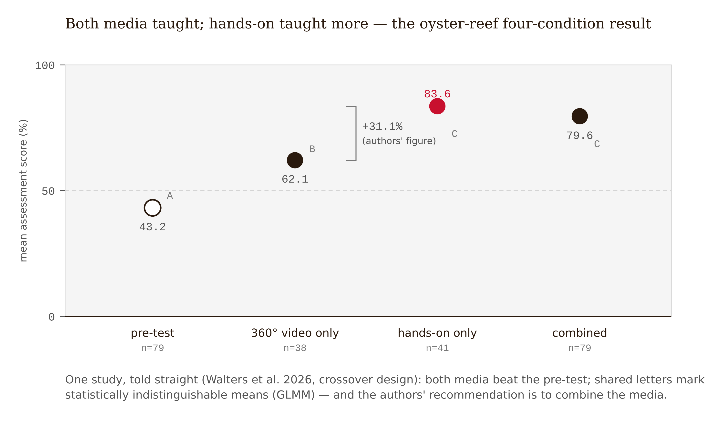
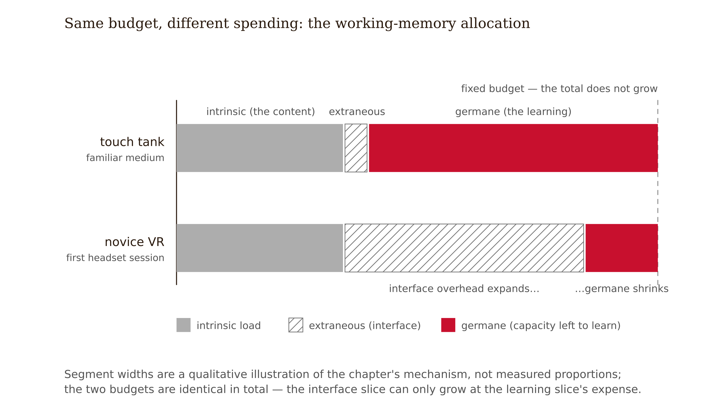
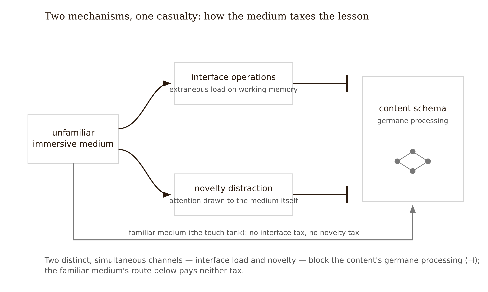
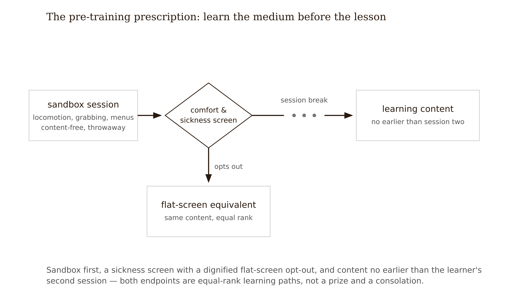
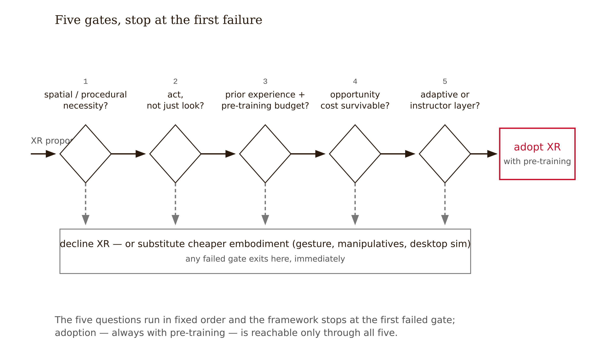

# Chapter 11 — Immersive and Embodied Learning: When the Medium Earns Its Cost
*A headset is not a pedagogy. The question is what it lets the learner do that a cheaper object cannot.*

Two groups of students are learning about the same coastal habitat — an oyster reef in Florida's Indian River Lagoon (Walters et al., 2026, *Frontiers in Education*).

The first group gets the hands-on lesson: live habitat touch tanks. Students hesitate at the waterline, then find crabs hiding in the oyster clusters; an oyster "spits" a jet of filtered water and the table erupts. A second activity runs lagoon water through filter paper — collective disgust at the muck oysters remove — and a third passes reef-restoration materials around while an outreach leader fields questions in real time.

The second group puts on headsets for a 360° video of the same reef, much of it filmed from a crab's-eye view on the reef itself. The camera goes where no class field trip could — under wading birds, across boat-wake damage, into restoration in progress. By every conventional measure of experience design, it works: students say it feels like *actually being there*, and when a bird sweeps overhead in the footage, several physically duck.

Then everyone takes the same assessment. The pre-test mean was 43.2%. The headset group scores 62.1% — the video taught, and taught real things. The hands-on group scores 83.6%, and the authors state the comparison plainly: assessment scores were **31.1% higher** after the hands-on lesson than after the 360° experience. The bucket of seawater beat the headset — not because the technology failed, but because hands, water, and a live crab taught more.

The study is an outreach comparison, not a mechanism experiment — but its data point somewhere specific, and the pointing is the chapter. The authors' own reading: the 360° experience, for all its immersion, was *passive* — students could look anywhere and touch nothing — while the hands-on lesson forced the active engagement that builds knowledge. And one measured detail: students who already used XR at least monthly scored better than students who had never worn a headset. The authors attribute that to the novelty of the medium — first-time users spend attention getting accustomed to the experience before the content lands. This chapter will give those observations their theoretical names — interface-induced **extraneous cognitive load** and the **novelty effect**, from Sweller's load theory and Mayer's multimedia research and the broader XR literature, not from this single study — because the names are what let you predict the next case instead of merely reading this one. For a novice, the headset is a second curriculum, silently enrolled alongside the first — and the second curriculum eats the first one's attention.

Hold the result carefully. This is one study, 79 students, in one domain, against an unusually strong physical comparator — live animals are not a strawman control. And its own conclusion is not "never headsets": students who did *both* lessons scored statistically the same as hands-on alone, the video showed damage and restoration no touch tank can stage, and the authors' recommendation is to combine the media. It does not prove VR fails. It proves that **immersion is a cost the learning must repay**, and this chapter teaches you to compute, before purchase, whether it will.



---

**Immersion** is the degree to which a medium surrounds the learner and substitutes its sensory stream for the room's. **Presence** is the resulting feeling of *being there*. Neither is a learning outcome. The evidence-disciplined question is what immersion lets the learner *perceive or do* that a cheaper medium cannot — because that delta is the only thing the cost can buy.

The literature converges on three territories where that delta is real.

*Spatial knowledge.* Some content is irreducibly three-dimensional — anatomical structure, molecular geometry, architectural space. Meta-analytic work on VR and AR in anatomy education finds genuine gains where the learning target is spatial structure itself. A heart you can orbit teaches its chambers' relations in a way no diagram cleanly can.

*Procedural rehearsal.* When the outcome is performing a procedure — a clinical sequence, an equipment operation, an emergency protocol — immersive simulation lets learners rehearse with consequences switched off. Reviews of immersive procedural training find benefits concentrated here, where practicing in reality is dangerous, expensive, or rare; the exact 2024 procedural-training review citation remains a manuscript-freeze check.

*Functionally aligned embodied action.* Embodied cognition research holds that thinking is grounded in bodily interaction with the world, and recent meta-analytic work finds overall positive effects of embodied learning designs — with the critical moderator that the body's action must be *functionally aligned* with the learning task (Lyu & Deng 2024; see references). Tracing a force vector with your arm while learning forces: aligned. Waving at a menu to advance slides: decorative gesture, which adds motor load and buys nothing. The moderator is the finding. Movement is not magic; *task-relevant* movement is mechanism. In the series' taxonomy this is Tier 2 territory — knowledge that lives in physical engagement with the world and resists capture by any system without a body.

Outside these three territories — for declarative knowledge, conceptual relations, verbal reasoning — the honest summary of the immersion literature is moderate average effects, strong moderators, and real counterfindings. A systematic review in higher-education science contexts found significant positive impact in 18 of 33 studies — 33 screened down from 172 candidate articles (*Emerging Science Journal*, April 2024). A vendor will read that as "majority positive." A designer should read it as "a coin flip plus a margin, before you know your moderators." A meta-analysis of immersive technologies in teacher education — 52 studies, 22 experimental or quasi-experimental — found a moderate overall effect, Hedges' *g* = 0.524, with immersion level and equipment type significantly moderating outcomes (Frontiers in Virtual Reality, 2025). More immersion was not monotonically better.

---

Now the first mechanism in depth, because it converts Chapter 3's most abstract idea into a purchasing decision.

Recall the architecture: working memory is brutally limited. Intrinsic load is the content's irreducible complexity. Extraneous load is everything the design wastes capacity on. Germane load is the productive processing that builds schemas (Sweller). Learning happens in the germane channel, and all three channels compete for one fixed budget.

Now put a novice in a headset. Before a single concept arrives, the learner is paying for: locomotion (how do I move?), interaction grammar (which button grips?), viewport management (where am I supposed to look — the freedom to look anywhere is also the obligation to choose), proprioceptive mismatch (body says standing still, eyes say gliding forward — for a meaningful fraction of users this escalates to simulator sickness, which is not a side effect but a total capacity loss), and the standing background task of simply *operating the medium*. Every one of these is extraneous load. None of it exists at the touch tank, where the interface — hands, water, eyes — was installed in infancy at zero marginal cost.

Here is the subtlety students miss: this load is invisible in the experience data. The headset learners in the opening case were not suffering; they were *delighted* — ducking under a recorded bird, reporting they were *actually there*. Extraneous load does not feel like waste — it often feels like richness, because attention is fully occupied. This is the seductive-details problem at the scale of an entire medium: the experience can be saturated with engagement while the germane channel runs near empty. And an effortful interface is *never* a desirable difficulty — desirable difficulties (Chapter 3) load the learning operations (retrieval, generation, discrimination); interface struggle loads the delivery. Difficulty in the delivery channel is pure tax.

The design arithmetic: immersion is justified only when the germane gain from what the medium uniquely enables — spatial perception, procedural action, aligned embodiment — exceeds the extraneous cost of operating it for your actual learners at their actual familiarity level. Both sides of that inequality are estimable before purchase. Most failed XR deployments never wrote it down.



---

The second mechanism is distinct and worth understanding on its own terms.

Unfamiliar technology commands attention *as technology*. The learner in a headset for the first time is having a headset experience that happens to contain a lesson. This is the **novelty effect**, and it distorts evaluation in two ways.

First, it diverts attention — cognitive resources go to the interface rather than the content, and learners with prior XR experience, for whom the novelty has already burned off, score better. That moderator is the mechanism's fingerprint: if the medium itself were adding learning value, experience with it should matter less, not more.

Second, novelty inflates every short-term measure a pilot collects — engagement, satisfaction, time-on-task, recall of the event — which means a typical one-session XR pilot is structurally rigged to recommend purchase. The novelty is doing the performing, and novelty is a depreciating asset. By the fourth session it is gone, and the deployment's true, post-novelty effect is what the budget actually bought. Note the symmetry with last week: novelty decay in gamification; novelty distraction in XR. Two chapters, one underlying warning about week-one data.

The two mechanisms interact most viciously for exactly one population: novices get maximum interface load *and* maximum novelty distraction simultaneously. Which is why the single highest-leverage moderator in the XR literature is prior experience with the equipment — and why the most concrete prescription follows directly.



---

If the analysis says immersion is warranted, the evidence imposes a precondition: **separate learning the medium from learning the target.**

The oyster-reef study's discussion points to exactly this prescription: pre-training in XR — exposing learners to unrelated, low-stakes immersive content before the educational content arrives — to burn the novelty effect off ahead of the lesson (Walters et al., 2026, citing Howard & Lee, 2020). This is the immersive-scale version of Mayer's pre-training principle — people learn better from a lesson when they already know the names and behaviors of its components (Mayer, *Multimedia Learning*). Applied here, the component the learner must know first is the medium itself.

A pre-training block looks like: a short sandbox session (locomotion, grabbing, menus — content-free, deliberately throwaway); a sickness screen with a dignified opt-out path to an equivalent flat-screen version (this is your Chapter 9 variability obligation — an XR-only design with no alternative fails the accessibility audit before it fails the load analysis); and the learning content scheduled no earlier than the learner's second session, so the novelty spike spends itself on the sandbox. Budget honesty: pre-training is a real cost — headset-hours, scheduling, attrition — and it belongs inside the modality decision, not discovered after it. If the deployment cannot afford pre-training, it cannot afford VR; running novices cold into content is choosing the opening case's losing condition on purpose.



One more moderator deserves a line: early evidence suggests AI-VR combinations that adapt difficulty in real time show the strongest results of the current wave — the adaptive layer matters as much as the immersion itself (Springer, 2026 [single source — treat as promising, not established]). The pattern to notice: the value is coming from *responsiveness to the learner*, which is medium-independent. A skeptic could read the adaptive-VR finding as evidence for adaptivity, with VR along for the ride. Until dismantling studies separate the two, that skeptical reading should sit beside the enthusiastic one in any decision memo.

---

Assemble the mechanisms and moderators into five questions, asked in order, written down.

**One: Is there a spatial or procedural component that flat media cannot represent?** Not "would 3D be nice" — does the learning outcome itself live in space or in performed action? If no, stop. The strongest evidence territory is closed and you are shopping for extraneous load.

**Two: Will the learner act, or only look?** Functionally aligned action is where embodiment pays. A passive 360° tour is the weakest XR genre and the one the counterfinding directly tested.

**Three: What is the learners' prior XR experience, and is pre-training budgeted?** If novices and no pre-training budget: decline, on the opening case's authority.

**Four: What does immersion cost — in load, money, time, supervision, sickness exclusion — and what else would that budget buy?** The comparison set must include the boring alternatives: the same dollars spent on retrieval practice, feedback, or worked examples, whose effects are better evidenced and decay-free. "Would VR help?" is the wrong question. "Is VR the best marginal spend on this learning problem?" is the right one.

**Five: Is there an adaptive or instructor layer, or is the medium expected to teach alone?** Unattended immersion is where many null results appear, although the reviews do not always report this moderator cleanly.

Three honest outputs, as with last week: *adopt with pre-training*, *adopt a cheaper embodiment* (desktop simulation, manipulables, AR-on-tablet — often the quiet winner), or *decline with reasons*. All three are portfolio artifacts. Declining with evidence scores as well as adopting with evidence.



---

Walk the five questions through the Track A case and the discipline becomes concrete.

The university has an immersive-learning innovation grant. A vendor demo has circulated: students "walk inside the data," strolling through a 3D scatterplot landscape in headsets. The department chair, genuinely trying to help the redesign, suggests the statistics course apply for the grant. The Week 8 prototype and the Week 10 no-game decision are on the table. The question is whether the course's medium should change.

The grant is free money with a non-free design cost. Question 1: does any learning outcome in introductory statistics have a spatial or procedural component that flat media cannot represent? Inventory the outcomes: interpret descriptive statistics, reason about sampling distributions, run and read hypothesis tests, critique study designs. None is spatial in the physical sense — a scatterplot is a *notation*, not a place; making it walkable adds locomotion load to content whose difficulty was never about viewpoint. None is procedural in the embodied sense — the performed procedure is software use, already practiced in its real medium at zero transfer distance. Question 1 fails. The framework stops.

The designer drafts a justification anyway — "immersion will reduce statistics anxiety by making data playful." Act One vocabulary kills the draft: that is an engagement claim wearing a learning claim's clothes, and the opening case shows exactly how a delightful medium coexists with worse learning. Anxiety appears in the learner research as fear of being wrong publicly. A headset does not address it.

A second dead end: embodiment enthusiasm. The designer sketches a gesture-based histogram-building activity — physically placing data points feels functionally aligned. Checking the moderator literature deflates it: the aligned action that matters for sampling-distribution reasoning is *manipulating the simulation and predicting its behavior* — drawing samples, watching the distribution build, being surprised. A mouse performs that action at zero interface cost. The gesture version is the same action plus motor overhead: decorative embodiment.

That dead end surfaces the real finding: the course currently has *no manipulation at all*. Students watch lecture videos about sampling distributions. The modality problem is real; it is one rung lower than the grant assumed.

The memo declines XR for this course and documents why. In its place: **direct-manipulation desktop simulations** for the three highest-misconception topics. Students drag sample sizes, draw repeated samples, predict-then-observe the sampling distribution. This captures the active-manipulation benefit the embodiment literature actually supports — functionally aligned action on the concept — at near-zero interface load and no per-seat hardware cost. Grant money is redirected toward building the simulation set and the Week 13 instrumentation plan. The memo discloses one revisit condition: if the program later adds a data-collection lab module, the framework runs again and may answer differently.

The lesson, stated plainly: the modality decision is not "is the medium impressive?" It is "what does the medium let the learner *do* that this outcome *needs* — and at what load?"

The limit to name honestly: this resolution is local to a conceptual-statistical domain. An anatomy course, a chemistry-lab-safety module, or a clinical-procedure curriculum running the same five questions could legitimately arrive at *adopt with pre-training* — and the method would deserve equal credit there. Declining here is an output of the framework, not a stance against the medium. The framework also cannot price one real thing: the recruitment and morale value of visible innovation. If the institution needs a lighthouse project, that is a legitimate goal. It just must not be billed as a learning outcome.

---

## Exercises

**Warm-up**

1. *(Understand / explain)* Name the two mechanisms by which immersion reduces learning. For each, state the fingerprint — the observable pattern in evaluation data that confirms this mechanism is the cause rather than something else. *What this tests: whether you can distinguish the two mechanisms operationally, not just as labels.*

2. *(Understand / analyze)* A vendor's pilot of a VR lab module shows higher engagement, higher satisfaction, and higher quiz scores after one session. State precisely why this is nearly zero evidence for purchase, naming which mechanism renders the engagement finding suspect and which renders the quiz-score finding suspect. *What this tests: ability to read a pilot report with the zero-delay and novelty-decay warnings active.*

3. *(Understand / classify)* For each of the following learning outcomes, identify which framework question closes the door and at which step: (a) "interpret confidence intervals"; (b) "identify the bones of the wrist from 3D orientation"; (c) "perform a sterile dressing change in the correct sequence." *What this tests: ability to apply the spatial/procedural gate before running all five questions.*

**Application**

4. *(Apply / analyze)* A museum replaces a hands-on circuits bench with a VR circuits room. Visitor dwell time doubles; a quiz at exit shows no change; a delayed quiz two weeks later shows scores below the old bench's cohort. Using both mechanisms, explain the three numbers — including why dwell time rose. Identify which single piece of additional data would best confirm your account. *What this tests: ability to read a three-number pattern as a mechanism story rather than a verdict.*

5. *(Apply / produce — Studio Assignment #6, 25 pts; Track B +5)* Produce the modality decision memo for your studio project (Track A: the statistics course — you may contest the worked example's resolution if you argue from the same framework; Track B: your own project). Required structure: outcome inventory → the five questions in order with the failing or passing gate shown → decision (adopt with pre-training / cheaper embodiment / decline) → cost line naming what else the same budget would buy → Evidence Disclosure. *What this tests: ability to run the framework honestly, stopping at the first failed gate, and naming the boring alternative.*

6. *(Apply / produce)* Build the artifact your memo implies: if *adopt* — a one-page pre-training session plan (sandbox tasks, sickness screen, opt-out pathway, session schedule); if *cheaper embodiment* — a paper or clickable sketch of one direct-manipulation activity, annotating the functionally aligned action; if *decline* — the redesigned non-immersive treatment of the topic the XR proposal targeted. Attach to Studio Assignment #6. *What this tests: ability to make the decision operational, not just documented.*

**Synthesis**

7. *(Synthesize / evaluate)* A stakeholder says: "That touch-tank study is one paper — the meta-analyses are positive, so we should buy headsets." Write a 200-word response using the heterogeneity discipline from Chapter 10 and at least one moderator from this chapter. End with a decision rule rather than a verdict. *What this tests: ability to hold a moderate average effect and strong moderators simultaneously, and to redirect from "is the average positive" to "which moderators govern my deployment."*

8. *(Synthesize / design)* The chapter identifies a blind spot: nearly the entire evidence base is single-session. Design a study — realistic in scope for a single institution — that would measure the post-novelty learning effect of an XR deployment across at least four sessions. Specify: the comparison condition, the timing of assessments, how you would control for the novelty spike in the analysis, and the sample size you would need to detect a half-standard-deviation difference. Name the hardest logistical problem in running it. *What this tests: ability to translate the "where are the week-six studies" puzzle into a concrete research design.*

**Challenge**

9. *(Challenge / open-ended)* The chapter claims that the adaptive-VR finding might be an adaptivity finding wearing a headset — that responsiveness to the learner, not immersion, carries the effect. Design the dismantling study that would separate the two: what would the four conditions be, what would you measure, and what result pattern would confirm that immersion is the active ingredient versus adaptivity? Then name two reasons this study is probably not being run, and what would have to change for it to be. *What this tests: ability to identify a confounded finding in the literature and reason about what it would take to unconfound it.*

---

## Evidence Disclosure — Chapter 11 Template

Attach to Studio Assignment #6:

- **Evidence-grounded:** my modality decision rests on [moderator/mechanism finding], citing [source]; the framework gate that decided it was Question [n].
- **Research-grounded:** my Week 5/6 learner research shows [prior XR experience level / anxiety / access constraint], which affects the decision by [effect].
- **Assumption awaiting measurement:** I am assuming [e.g., the desktop simulation produces the predict-observe engagement I designed for / post-novelty performance holds]. Disconfirming signal: [metric + timepoint], entering the Week 13 plan.
- **Counterfinding line (mandatory this chapter):** the strongest evidence against my decision is [finding], and I proceed anyway because [population/domain/moderator difference — not because the finding is single-source].

---

## Chapter 11 Exercises: Immersive and Embodied Learning: When the Medium Earns Its Cost

**Project:** The Redesign Dossier
**This chapter adds:** `dossier/11-modality-decision.md` — the modality decision memo for your project: outcome inventory, the five questions run in order with the failing or passing gate shown, the verdict (adopt with pre-training / cheaper embodiment / decline), the cost line, and the mandatory counterfinding line.

---

### Exercise 1 — When to Use AI

**The judgment:** In this chapter's work, AI assistance is appropriate for the following tasks:

- **Enumerating modality options with their full cost structures.** For each candidate medium — headset VR, AR-on-tablet, desktop direct-manipulation simulation, physical manipulables, the existing flat treatment — have the model itemize per-seat hardware, supervision, pre-training hours, sickness opt-out provisions, and maintenance. — *Why AI works here:* this is structured enumeration — the option space is public knowledge, the chapter gives you the cost categories, and every line is checkable against vendor pricing and your own budget.
- **Drafting the decision memo skeleton.** The outcome inventory table, the five-question scaffold with a slot for each gate's pass/fail, the cost line naming what else the same budget would buy. — *Why AI works here:* this is reformatting and structural drafting — the memo's shape is fixed by the chapter and the studio assignment, and the model is filling a template, not making the call.
- **Red-teaming your draft decision with the two named mechanisms.** Once you have a draft, have the model attack it: where would interface-induced extraneous load appear in *your* deployment, and what would the novelty effect inflate in *your* pilot data. — *Why AI works here:* critique generation against named criteria — you supply the mechanisms, the model's job is coverage, and a memo that survives the attack is stronger for it.

**The tell:** You know you are using AI appropriately when you can evaluate the output — when you have independent criteria to judge whether it is correct, complete, and fit for purpose.

---

### Exercise 2 — When NOT to Use AI

**The judgment:** In this chapter's work, the following tasks require human judgment. Delegating them to AI is not appropriate — not because AI cannot produce output, but because AI output in these cases cannot be trusted without verification that requires the same expertise as doing the task yourself.

- **The Question 1 judgment: does this outcome have a spatial or procedural component flat media cannot represent?** — *Why AI fails here:* causal identification problem. The model can manufacture a plausible "spatial story" for any content — a scatterplot becomes a landscape, a timeline becomes a corridor — but whether the outcome itself *lives* in space or performed action, rather than merely being drawable in it, is a mechanism call about your specific content. The chapter's trap is exact: a notation is not a place, and the model cannot tell the difference for you because both produce equally fluent justifications.
- **Taking the model's modality recommendation at face value.** — *Why AI fails here:* novelty bias in the training data. The corpus is saturated with XR enthusiasm — vendor decks, innovation-grant press releases, one-session pilot writeups taken during the novelty spike — while the chapter's best causal comparison ran the other way: a hands-on lesson with live touch tanks beat a headset-delivered 360° video by 31% on assessment scores. A model that has read a thousand demos and one counterfinding recommends accordingly.
- **Estimating what the interface will cost *your* learners.** — *Why AI fails here:* missing ground truth. Prior XR experience, simulator-sickness susceptibility, and the anxiety findings sit in your Week 5/6 learner research — the single highest-leverage moderator in the XR literature is data the model does not have and will replace with population-level guesses dressed as facts.

**The tell:** You know you have crossed the line when you are using AI output as your reason for a conclusion rather than as a tool for reaching one. If you could not explain the conclusion without the AI, the AI did the work that should have been yours.

**Series connection:** Tier 5 Causal. The modality decision is the load inequality computed for real people: does the germane gain from what the medium uniquely enables exceed the extraneous cost of operating it, for your learners, at their familiarity level? Both sides of that inequality are causal estimates about a specific deployment — exactly the reasoning a model trained on averages and demos cannot do in your place.

---

### Exercise 3 — LLM Exercise

**What you're building this chapter:** The working draft of `dossier/11-modality-decision.md` — outcome inventory, steelman and red-team per the chapter's mechanisms, cheapest-alternative analysis, and a memo skeleton whose five gates and verdict are deliberately left for you to run.
**Tool:** Claude Project "Redesign Dossier" — the decision depends on four prior dossier files, and the Project's persistent context keeps the model arguing from your charter and your learners rather than from its demos.

**The Prompt:**

```
You are helping me build my Redesign Dossier. Read these project files
first: dossier/02-project-charter.md (the learning outcomes),
dossier/03-load-audit.md (my cognitive load analysis),
dossier/05-learner-research.md (interviews, including prior technology
experience and anxiety findings), and dossier/01-evidence-brief.md. If
any is missing, stop and tell me which.

This chapter's decision: whether my redesign should change its medium —
specifically, whether an immersive or embodied treatment (VR, AR,
simulation, manipulables) earns its cost for any of my learning outcomes.

Work in this order, and obey the stop rule in step 4:

1. Build an outcome inventory from my project charter: one row per
   learning outcome, with your provisional classification — does the
   outcome itself live in spatial structure, in performed procedure, or
   in neither? Mark every classification PROVISIONAL — I make the actual
   Question 1 call. Where the charter is too vague to classify, say so;
   that is a finding about my charter.

2. Steelman the strongest immersive or embodied proposal for the
   outcomes that survived step 1: what exactly would the medium let MY
   learners perceive or do that flat media cannot? If you cannot find a
   spatial, procedural, or functionally-aligned-action justification,
   say so plainly — do not manufacture one.

3. Red-team your own steelman using two named mechanisms. First,
   interface-induced extraneous load: itemize what my actual learners,
   at the familiarity level documented in my learner research, would pay
   before any content arrives — locomotion, interaction grammar,
   viewport management, sickness risk. Second, the novelty effect: state
   what it would inflate in my pilot data and what a one-session pilot
   would overestimate. Then name the single cheapest alternative design
   that captures the step-2 benefit — and include the boring
   alternatives in the comparison set: desktop direct manipulation,
   physical manipulables, retrieval practice, worked examples.

4. STOP. Do not run the five-question framework and do not tell me the
   decision — the gates are mine to run. Instead give me: the memo
   skeleton (outcome inventory, five empty question gates, decision
   section, cost line, counterfinding line); the three questions about
   my learners I must answer from my own research before deciding; and a
   cost table comparing your steelman proposal against the cheapest
   alternative, with pre-training (sandbox session, sickness screen,
   opt-out pathway) as a budget line item, not a footnote.

Do not invent citations or effect sizes. Describe findings generically
and tag them [VERIFY AGAINST 01-EVIDENCE-BRIEF]. If my learner research
says my learners are XR novices, that fact outranks any enthusiasm in
your training data.
```

**What this produces:** A draft of `dossier/11-modality-decision.md` with the inventory, both arguments, the cheapest-alternative comparison, and empty gates. You finish it by running the five questions in order yourself — stopping at the first failed gate — writing the verdict, and writing the chapter's mandatory counterfinding line: the strongest evidence against your decision and why you proceed anyway. Attach a 150-word reflection naming (a) whether the model's steelman survived your outcome inventory, (b) the cheapest alternative it proposed and whether your memo adopts it, and (c) one thing the model asserted that you checked and found unsupported. The reflection and the gates — not the transcript — are what get assessed.

**How to adapt this prompt:**
- *For your own project:* nothing to fill in — the prompt reads your dossier files. If a specific proposal is already on the table (a vendor demo, a grant), append one sentence describing it so step 2 steelmans the real candidate.
- *For ChatGPT / Gemini:* paste your outcome list and the relevant learner-research findings above the prompt and change the file references to "the material above." Both models steelman XR eagerly — keep step 2's "do not manufacture one" line intact.
- *For a Claude Project:* the dossier files stay as Project knowledge; add "modality classifications are always PROVISIONAL — the human runs the gates" to the Project's custom instructions so the rule survives into future sessions.

**Connection to previous chapters:** The cost side of the inequality comes from your Chapter 3 load audit; the moderator data — prior XR experience, anxiety — comes from your Chapter 5 learner research; and the decline-with-reasons discipline is the same muscle you built writing the Chapter 10 motivation decision. Three dossier files in, declining is now a deliverable you know how to write.
**Preview of next chapter:** The medium question becomes the AI question — `dossier/12-ai-integration-decision.md` runs the same logic ("what does this let the learner do, versus do *for* the learner?") on the one technology that will help you write the memo about itself.

---

### Exercise 4 — CLI Exercise

**What you're building this chapter:** `dossier/audits/11-outcome-gate-matrix.md` — a cross-check matrix comparing every learning outcome in your charter against the gate flags your decision memo actually addressed.
**Tool:** Cowork — two-file reading and one audit file written into the dossier, no code; Claude Code runs the identical task if you prefer the terminal.
**Skill level:** Beginner.

**Setup:**

Before running this exercise, confirm:
- [ ] `dossier/11-modality-decision.md` is complete — gates run, verdict and counterfinding line written by you
- [ ] `dossier/02-project-charter.md` exists and lists your learning outcomes explicitly
- [ ] The standing CLAUDE.md rule from Chapter 10 is in place (agents never edit `dossier/` files; audits go to `dossier/audits/`)

**The Task:**

```
Read dossier/02-project-charter.md and dossier/11-modality-decision.md.
Do not modify either, and do not read other files.

Create dossier/audits/11-outcome-gate-matrix.md: a table with one row per
learning outcome in the charter. Columns: the outcome, quoted verbatim
from the charter; Gate 1 flag — SPATIAL-CANDIDATE, PROCEDURAL-CANDIDATE,
or NEITHER, with the charter phrase justifying the flag quoted; Gate 2
flag — would the learner ACT or only LOOK under the memo's proposed or
declined treatment; and a CONSISTENCY column comparing your flags against
what my decision memo concluded for that outcome — MATCH, MISMATCH, or
NOT-ADDRESSED.

Rules: every flag is a provisional proposal for my review, not a
classification — state this in a header note. Quote the charter, never
paraphrase it. If an outcome is too vague to flag, mark it VAGUE — that
is a finding about my charter, not a failure of the task.

Stop after writing the matrix. Do not edit the memo or the charter, do
not resolve mismatches, and do not propose modality choices.
Verification: the row count must equal the number of outcomes in the
charter — state both counts at the top of the file.
```

**Expected output:** `dossier/audits/11-outcome-gate-matrix.md` — one row per charter outcome, provisional gate flags with verbatim charter quotes, and a MATCH/MISMATCH/NOT-ADDRESSED consistency column. Charter and memo untouched.

**What to inspect in the output:** Every MISMATCH and NOT-ADDRESSED row — either your memo skipped an outcome (fix the memo) or the agent found a "spatial story" your gate run rejected (check it for the notation trap: is the quoted charter phrase about the concept, or about its diagram?). Then audit two CANDIDATE flags yourself: would Question 1 actually pass, or did the agent classify a representation as a place?

**If it goes wrong:** The most likely failure is confident classification — the agent drops the PROVISIONAL framing and writes flags as verdicts, which is exactly the delegation Exercise 2 forbids; treat every flag as a proposal regardless of how it is phrased. The second failure is row-count padding (splitting compound outcomes to make the verification pass) — count the charter's outcomes yourself before trusting the header counts.

**CLAUDE.md / AGENTS.md note:** Extend the Chapter 10 standing rule with one line: "Agents never fill DECISION fields or gate verdicts in dossier files; all classifications they produce are flagged proposals for human review."

---

### Exercise 5 — AI Validation Exercise

**What you're validating:** An AI modality recommendation — generated by you under a naive prompt — checked for the two failure modes this chapter taught you to see: novelty bias and the missing pre-training requirement.
**Validation type:** Reasoning chain.
**Risk level:** Medium-high. A modality decision is a procurement decision — this memo spends real money, and its failure mode (week-one delight read as learning) is invisible in exactly the pilot data that will be used to defend it.

**Setup:**

Generate the artifact in a fresh chat — not your Project — with this deliberately naive prompt, worded the way the question actually arrives in organizations:

> We run an online course where students learn mostly through videos and problem sets. Engagement is low. Should we invest in VR or other immersive technology to improve learning? Recommend an approach.

If you want a harder test, replace the first sentence with one describing your own project's current medium — the validation checklist below works either way.

**The Validation Task:**

Evaluate the AI output using the following checklist. For each item, record: Pass / Fail / Cannot determine — and explain your reasoning.

```
Validation Checklist — Immersive and Embodied Learning

□ Correctness: Does the output accurately reflect the chapter's core concept?
  Does the recommendation tie the medium to a specific perceive-or-do
  delta for a named learning outcome — or to engagement? "Immersion is a
  cost the learning must repay" is the concept; check whether the
  recommendation computes any version of that inequality.

□ Completeness: Is anything important missing?
  Search for four things: an interface pre-training plan; a sickness
  screen with a flat-screen opt-out path; any measurement beyond session
  one (post-novelty); and the boring alternatives in the comparison set
  (desktop simulation, retrieval practice, worked examples). Score each
  present/absent.

□ Scope: Did the AI stay within the task boundaries?
  The prompt asked "should we" — did the answer include "no" or "not for
  these outcomes" as a live option? Did it ask what the learning
  outcomes are before recommending a medium, or did it prescribe the
  treatment without the diagnosis?

□ Novelty-bias check: Count the engagement-register words ("immersive,"
  "engaging," "memorable," "interactive") against the learning-mechanism
  words (load, retrieval, transfer, delayed test). Does the
  recommendation cite pilot-style or satisfaction evidence as learning
  evidence? The chapter's counterfinding — a hands-on lesson beat a
  headset 360° video by 31% on assessment scores — is the base rate
  this enthusiasm must answer to.

□ Pre-training gate check: If the recommendation includes any headset
  modality for novice learners without interface pre-training, it has
  missed the chapter's central mechanism — the interface consumes the
  working memory the content needs. Automatic fail on this row.

□ Failure mode check: Does this output exhibit any of the following?
  - Fluent but wrong (plausible-sounding incorrect claims)
  - Novelty bias: the medium's impressiveness counted as a learning
    benefit — enthusiasm inherited from a corpus of vendor demos and
    one-session pilots
  - Missing ground truth (claims about "your learners" — their XR
    experience, their anxiety — that no learner data supports)
```

**What to do with your findings:**

- If the output passes all checks: proceed to use it in your project. Note what made it trustworthy — and check whether your prompt named the outcomes, because outcome-anchored prompts are usually what saved it.
- If the output fails one check: revise the prompt to require the missing element (for example, "include a pre-training plan and a post-novelty measurement") and re-run. Document what changed.
- If the output fails multiple checks or you cannot determine pass/fail: this is a "When NOT to Use AI" moment — the recommendation is the model's training data talking. Write the two-line correction yourself and file the failed recommendation plus your checklist as an appendix to `dossier/11-modality-decision.md`: a worked example of why your memo's gates exist.

**AI Use Disclosure prompt:**

After completing this validation, write a two-sentence AI Use Disclosure:

> *Sentence 1:* What AI produced in this exercise and how you used it.
> *Sentence 2:* One specific thing the AI could not determine that required your judgment.

**Series connection:** This exercise trains the novelty-bias catch — Tier 5 Causal supervision. The model recommends from a corpus that systematically mistakes week-one delight for learning, because week-one is when the writeups were written. The validator's question is always mechanistic: *which mechanism would carry the gain, and what does week four look like?* If the recommendation cannot answer that, it is not evidence — it is the novelty effect, laundered through fluent prose.

---

## References

*Fact-checked 2026-06-07; corrections applied the same day against the sources' full text. See factchecks/11-immersive-and-embodied-learning-when-the-medium-earns-its-cost-assertions.md (including its Resolution section) for the full trail.*

1. **Walters, L. J., et al. (2026). "Immersive and experiential approaches in environmental outreach: a comparison of 360° video and hands-on learning." *Frontiers in Education*, 11, 1774496. doi:10.3389/feduc.2026.1774496.** — CONFIRMED against full text (re-verified 2026-06-07). Crossover design, n = 79 students; assessment means: pre-test 43.2%, 360°-video-only 62.1%, hands-on-only 83.6%, combined 79.6%. The authors report assessment scores 31.1% higher after the hands-on lesson than after the 360° video (p < 0.0001); combined was statistically indistinguishable from hands-on. Monthly-or-more prior XR use correlated with higher scores (p = 0.02); the authors invoke the novelty effect and point to XR pre-training as a remedy (citing Howard & Lee, 2020). Their conclusion: both media add value; combining 360° video with hands-on activities is most effective. *Correction note (2026-06-07):* the chapter's pre-correction draft described the comparator as a "360° VR rendering" (it was a filmed 360° video in headsets), invented the touch-tank animal roster, attributed a formal "mechanism analysis" to the paper (the load-theory framing is the chapter's, via Sweller/Mayer; the paper's own reading is passive-vs-active media plus novelty), and omitted the combined condition and combine-media recommendation. All corrected above.
2. *Frontiers in Virtual Reality* (2025). "Using virtual reality for teacher education: a systematic review and meta-analysis of literature from 2014 to 2024." doi:10.3389/frvir.2025.1620905. — CONFIRMED: 52 studies, 22 experimental, Hedges' g = 0.524; immersion level and equipment type moderate.
3. **"The Role of Immersive Virtual Realities: Enhancing Science Learning in Higher Education." *Emerging Science Journal*, 8(2), April 2024.** — CONFIRMED: 18 of 33 studies positive, the 33 screened from 172 candidate articles. *Correction note (2026-06-07):* previously misattributed in the text to "Frontiers in Education, 2024"; venue corrected.
4. García-Robles, P., et al. (2024) / Salimi, M., et al. (2024). VR/AR in anatomy education: systematic reviews and meta-analyses. *Anatomical Sciences Education.* — CONFIRMED: spatial/3D knowledge gains.
5. Lyu & Deng (2024). Embodied-learning meta-analysis (cognitive-load perspective); see also the 2025 *Frontiers in Psychology* embodied-learning meta (46 studies). — CONFIRMED: positive effects with embodiment-alignment moderation.
6. Mayer, R. E. *Multimedia Learning* (Cambridge University Press). — CONFIRMED: pre-training principle. Sweller, J., cognitive load theory. — CONFIRMED.
7. Procedural-training review (*Computers & Education*, 2024) and adaptive AI-VR finding (*Springer*, 2026) — UNVERIFIED within check budget; both are chapter-flagged. Confirm exact citations before freeze.
