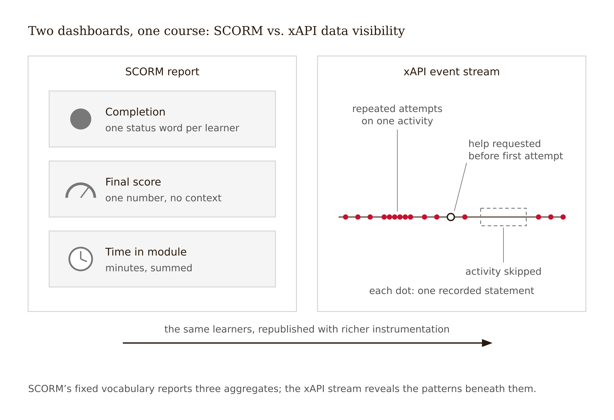
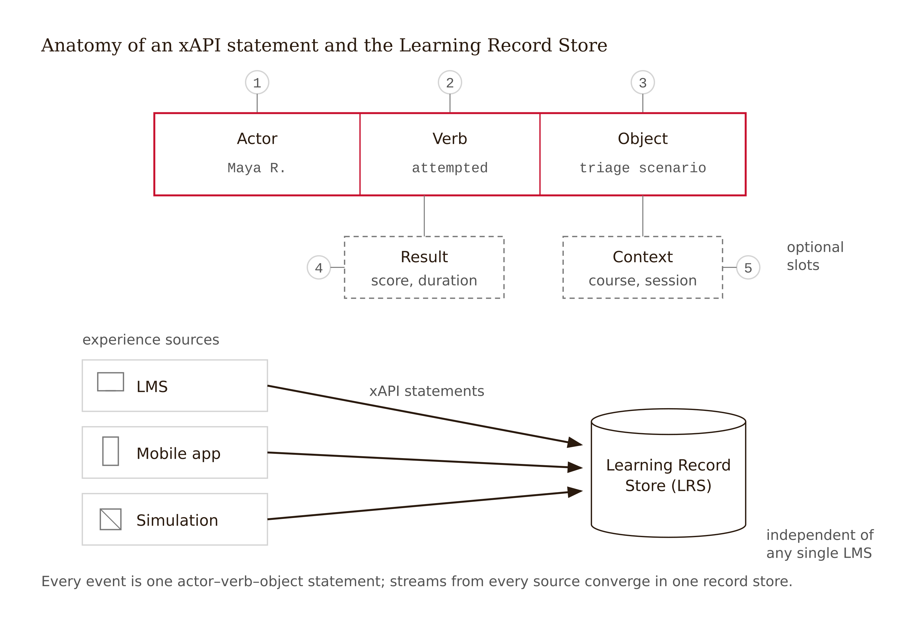
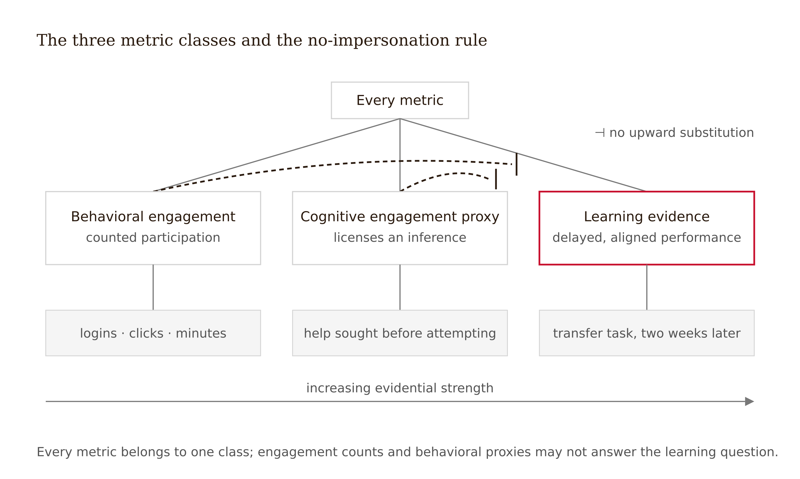
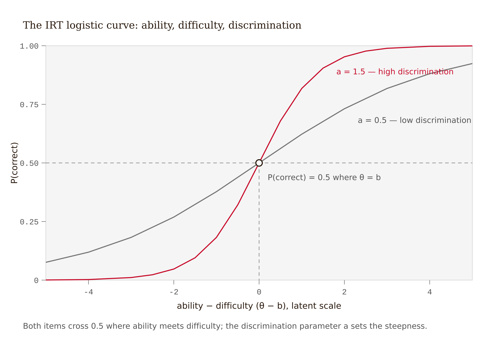
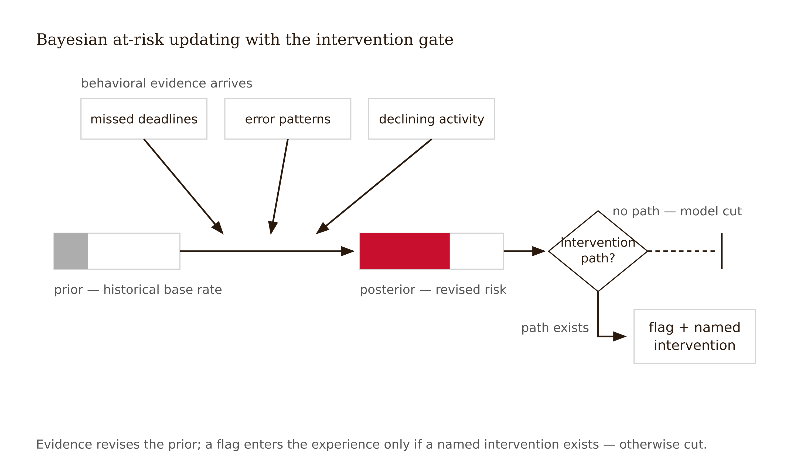

# Chapter 13 — Instrumenting the Experience: xAPI, Analytics, and Adaptive Models
*On the difference between a dashboard that says the course works and one that says what actually happened.*

The director of learning at a mid-sized health system pulls up the quarterly dashboard for "Medication Safety Foundations," a required online course her team rebuilt last year. The dashboard is green from edge to edge. Completion: 94%. Average quiz score: 88%. Average time in course: 47 minutes against a 45-minute design target. She screenshots it for the board deck.

Down the hall, an analyst has been piloting the same course republished with xAPI instrumentation feeding a Learning Record Store. His view of the same learners is not green — it is *specific*, which is worse and better at once.

The video on dosage calculation shows a dense cluster of pause-and-rewind events at 3:40 — the same fifteen seconds, replayed a median of four times — exactly where the narrator compresses two conversion steps into one sentence. In the practice module, 61% of learners open the first hint within nine seconds, before any answer attempt. The optional practice set — the one element built on retrieval practice, the one element the evidence says produces durable learning — is skipped by 72% of learners. The quiz allows two attempts; most of the 88% average is second attempts, taken a median of three minutes after the first.

Both dashboards describe the same course and the same learners. The first says *the course works*. The second says *learners are completing a course that is quietly teaching them to harvest hints and retake quizzes* — a pattern the first dashboard had no vocabulary to display. SCORM's data model can report completion, score, and time. It cannot report a pause cluster, a hint-before-attempt, or a skipped practice set, because it has no words for them.



The chapter's discipline in one sentence: **you can only learn what your instruments can say, and the designer — not the engineer, not the vendor — decides what the instruments can say.** The director did not choose a bad dashboard. She failed to make a design decision, and the default made it for her.

---

Start with the right question, because most instrumentation projects begin with the wrong one. The wrong question is: what can we track? The answer is "almost everything," which is why it is wrong. Douglas Hubbard's formulation is more useful: a measurement is not a number — it is a reduction in uncertainty about a decision you have to make (Hubbard 2010). If no decision changes when the number comes back, you have not measured anything. You have decorated a dashboard.

Hubbard's clarification chain runs: if a thing matters, it has observable consequences; if it has observable consequences, it can be detected; if it can be detected, it can be measured — at least well enough to reduce uncertainty. "Cognitive engagement" feels unmeasurable the way "employee morale" feels unmeasurable. It is not. But the chain runs through *observable consequences*, and choosing which consequences count is a design act, not a data-science act.

So every line of a measurement plan must answer three questions before any tooling is chosen. What design assumption does this metric test? What decision changes at what threshold — "if fewer than half of learners attempt before opening a hint, we redesign the hint ladder" is a measurement, "we will monitor hint usage" is not. And what is the cheapest observation that would reduce the uncertainty? The first few observations carry most of the informational value; you rarely need a research-grade instrument to make a better design decision than you would have made blind.

David Spiegelhalter adds the caution that keeps this honest: data does not speak for itself (Spiegelhalter 2019). Numbers arrive carrying the assumptions of whoever decided to collect them. The director was not lied to. She was answered — precisely and truthfully — by questions she never knew had been asked on her behalf.

---

SCORM — the Sharable Content Object Reference Model — is the legacy interoperability standard that lets a course package run in any LMS and report back. Its vocabulary is fixed and small: launched, completed, passed/failed, score, time. For two decades that vocabulary defined "learning data" in practice, which is why a generation of dashboards can say *finished* and *scored* and nothing else.

xAPI — the Experience API, stewarded by the Advanced Distributed Learning Initiative — replaces the fixed vocabulary with an open grammar. Every event is a **statement** in the form *actor – verb – object*, with optional result and context: `Maria paused dosage-video at 3:41`, `Maria attempted conversion-problem-4 (incorrect, 22 seconds, no hint)`, `Maria requested hint-2 on conversion-problem-4`. Statements flow to a **Learning Record Store** — a database independent of any single LMS — so the record can span an LMS module, a mobile app, a simulation, even an offline workshop logged afterward.



The design-relevant difference is not technical richness. It is which questions become answerable.

<!-- → [TABLE: Two-column comparison of SCORM vs. xAPI capability — left column: design question (did learners finish, where do they get stuck, do they attempt before seeking help, is the practice component used, did the score come from learning or retakes, does behavior differ across cohorts); right column: SCORM answer (yes/no) and xAPI answer (yes, with example statement for each) — designed to show the gap as a series of answerable design questions, not a technical spec comparison] -->

Two warnings before you fall in love with xAPI. First, it is a grammar, not a curriculum: it will record whatever verbs you specify, including ten thousand meaningless ones. An over-instrumented course answers no questions slower and at higher privacy cost than one that answers no questions quickly. Second, the statement is still behavior, not cognition. `paused at 3:41` is compatible with confusion, with a doorbell, and with note-taking. The inference layer is where instrumentation succeeds or fails.

Specify statements at the granularity of your design decisions and no finer. The hint ladder needs attempt-and-hint ordering. It does not need mouse coordinates.

---

Every metric you define belongs to one of three classes, and the discipline is refusing to let them impersonate each other.



**Behavioral engagement metrics** count observable participation: logins, completions, posts, minutes, clicks. They are cheap, reliable, and honest about exactly one thing — presence. The engagement literature has insisted since Fredricks, Blumenfeld, and Paris (2004) that behavioral engagement is only one dimension of a multidimensional construct, and Chapter 1 showed you a market that rewards exactly this dimension.

**Cognitive engagement proxies** are behavioral records selected and patterned to license an inference about mental effort or strategy: attempting before help-seeking; predicting before a simulation runs; self-correcting after errorful first attempts; revisiting prior material when a new problem demands it. No single event proves cognition; patterns constrain the plausible interpretations. The honest name is *proxy*, and the honest posture is Spiegelhalter's: state what else could produce the same pattern. Notice, too, what every example on the list watches: friction. Instrumentation is where the Frictional mechanism becomes observable — productive struggle, unlike the learning it produces, leaves traces in the log.

**Learning metrics** require performance on tasks aligned with the learning outcome and separated from the instructional moment — delayed retrieval, transfer problems, performance in the criterion context. No log file contains them unless you design assessment events into the experience. This is the most common hole in real measurement plans: pages of telemetry, no delayed aligned performance task anywhere. A plan with no learning metric can detect engagement failure but can never detect learning success.

Time-on-task is the trap that teaches the whole lesson. Clickstream research has found persistence, consistency, and time-on-task statistically predictive of course performance at population scale; anchor this synthesis to one or two named primary studies before freeze. Predictive at scale — and almost uninterpretable for a single design decision. Forty minutes on a problem set is mastery-in-progress for one learner, floundering for a second, an open tab during lunch for a third. Worse, the moment time-on-task becomes a target, it stops being even weakly informative — learners and vendors alike will produce minutes on demand. That is Goodhart's law, in Strathern's phrasing: "when a measure becomes a target, it ceases to be a good measure" (Strathern 1997). Duration data is worth collecting as context for other events. It is never, by itself, evidence of engagement, let alone learning.

For every metric in your plan, write down its class, what it cannot distinguish, and what would have to be co-present before you would treat it as meaningful. A metric specified without its failure modes is a future lie.

<!-- → [TABLE: Metric classification examples — columns: metric, class, what it cannot distinguish, co-presence required before treating as meaningful — rows: minutes per session, prediction submitted before simulation runs, score on retrieval quiz two weeks after unit, forum posts, hint requested before answer attempt — designed to model the metric-class honesty the measurement plan requires] -->

## The GLP Friction Traces: A Design-Aligned Measurement Framework

The Genuine Learning Probability framework formalizes seven observable friction traces that genuine cognitive engagement leaves in behavioral data. Each maps onto the metric classes above, and each tests a specific design decision.

| GLP Component | Metric Class | Design decision it tests | Minimum measurement spec |
|---|---|---|---|
| Y1 Temporal Engagement Pattern | Cognitive engagement proxy | Is time spend correlated with item difficulty? | Log time-on-task per item; correlate with difficulty rating from load audit |
| Y2 Error Trajectory Coherence | Cognitive engagement proxy | Do errors follow conceptually adjacent paths? | Log error sequences; note whether errors cluster around related misconceptions |
| Y3 Cross-Context Transfer | Learning evidence | Can the learner apply the concept in a novel context? | Near-transfer and far-transfer items on delayed assessment |
| Y4 Uncertainty Calibration | Cognitive engagement proxy | Does confidence track actual performance? | Confidence elicitation before answer reveal; compare to correctness |
| Y5 Social Knowledge Texture | Cognitive engagement proxy | Does discussion show personal encounter? | Code discussion posts for personal-encounter markers vs. generic talking points |
| Y6 Retrieval Strength Decay | Learning evidence | Does the spacing effect appear? | Spaced retrieval quiz on previously covered material weeks later |
| Y7 Scaffolding Response Curve | Cognitive engagement proxy | Does partial hint produce near-full gain? | Log hint-rung depth; compare performance by rung |

Note the connection to Chapter 1's time-on-task warning: time-on-task as a raw count is a Goodhart target, but time-on-task *correlated with item difficulty* (Y1) is a different and more informative signal. If learners spend more time on harder items, the engagement is genuine. If time is flat across difficulty, it is borrowed.

A measurement plan that includes at least Y3 (transfer) and Y6 (spacing effect) has the minimum requirements for a genuine learning claim. A plan with only behavioral metrics cannot make that claim regardless of how many rows it contains.

One warning: GLP traces are subject to Goodhart's law if made visible to learners as targets. Design GLP measurement as invisible infrastructure, not visible gamification.

---

Adaptive platforms calibrate difficulty using Item Response Theory, a psychometric family with roots in Rasch (1960) and Lord (1980). You will not build these models — that boundary is deliberate. But adaptive products will hand you their outputs, and a designer who cannot read them will either ignore the signal or obey it blindly. Both are design failures.

Here is the only equation this section needs. A common IRT form gives the probability that a learner with latent ability θ answers an item of difficulty *b* correctly, with *a* governing how sharply the item discriminates:

$$P(\theta) = \frac{1}{1 + e^{-a(\theta - b)}}$$

Now translate, because the translation is the design literacy. The model imagines each learner as a position on an invisible scale (θ, latent ability) and each item as a position on the same scale (*b*, difficulty). When learner and item sit at the same position, the learner has a 50% chance of success. The further the learner sits above the item, the closer the probability climbs toward certainty; below, toward floor. The *a* parameter says how decisively the item separates those above from those below.



What this gives the designer: an empirical difficulty ordering of your items, which routinely contradicts the expert's intuition; detection of items that discriminate poorly, which usually signals a flawed item rather than flawed learners; and the machinery for adaptive sequencing that keeps challenge near the learner's edge — the operational cousin of the desirable-difficulty zone from Chapter 3.

What the model cannot tell the designer is just as load-bearing. High difficulty *b* is compatible with intrinsic complexity — keep it, scaffold it — and with extraneous load from ambiguous wording or a confusing interface — fix it. The model cannot distinguish a desirable difficulty from a design flaw. That is Chapter 3's distinction, and it remains a human diagnostic. The model also cannot say what θ means beyond ability on these items — if your item bank under-represents transfer, θ is a precise measure of something narrower than your learning outcome. And it knows nothing about a learner the items never probed: misconceptions held alongside correct performance, motivation, context.

Treat IRT output as a flag generator. A surprising difficulty estimate is a prompt for the diagnostic you already know how to run — load analysis, think-aloud, item review. Never a verdict that arrives pre-interpreted.

---

The second adaptive model family predicts rather than calibrates. Bayesian at-risk models — including Bayesian Belief Networks for dropout risk and Bayesian Knowledge Tracing for skill mastery — update a probability estimate as behavioral evidence arrives (Corbett & Anderson 1994). Bayes' rule gives the posterior probability that a student is at risk given the evidence *E* observed:

$$P(S_{\text{risk}} \mid E) = \frac{P(E \mid S_{\text{risk}})\, P(S_{\text{risk}})}{P(E)}$$

In words: the model starts with a base rate learned from historical data and updates it as evidence arrives — missed deadlines, error patterns, declining activity. The output is a probability, continuously revised.

Three things a designer must hold onto when working with these models.

The prior is the past. The base rate is learned from historical students, so the model's starting belief about a new learner is a statement about people who resembled them in the training data. Cathy O'Neil's warning enters here by the front door: models that encode historical patterns, run opaquely, and operate at scale can convert past inequity into future routing (O'Neil 2016). The at-risk flag is the same mechanism wearing a helpful expression.

A probability is not a diagnosis. `P(risk) = 0.74` says students who looked like this often struggled. It does not say why or what to do. The model is silent on whether the cause is a misconception, a job schedule, a sick child, or boredom — interventions with nothing in common.

A flag without intervention logic is surveillance. This is the chapter's sharpest design rule. Before any at-risk model enters your experience, the design must already specify who sees the flag, what they are equipped to offer, what the learner is told, and what the false-positive experience is like. A 74% risk probability means roughly one flagged learner in four was not headed for trouble — and your design decides what being wrongly flagged feels like. The evidence-disciplined question is never "is the model accurate?" It is "is flag-plus-intervention better than no flag, for the flagged?" — an empirical claim like any other design decision in this book. In your measurement plan, every predictive model gets a fourth column: intervention owner and script. If the column is empty, cut the model.



---

Instrumentation is not ethically neutral, and the ethics are not a compliance appendix. They are design constraints with empirical teeth.

Start with the asymmetry: learners usually cannot see what is collected, cannot opt out without opting out of the course, and are the least powerful party in the system. That triad — opacity, no exit, power imbalance — is the configuration O'Neil identifies as dangerous at scale. The learning-analytics ethics literature converges on workable obligations: collect for a stated purpose, minimize to that purpose, tell learners what is collected and why, give them access to their own record, and keep a human accountable for consequential decisions (Slade & Prinsloo 2013; Drachsler & Greller 2016).

Two design-level points deserve more weight than they usually receive.

Every metric is also a message. Learners infer what an experience values from what it visibly counts. Count minutes and you have told learners that minutes matter — and they will produce minutes. A measurement plan is part of the experience design, not a layer behind it.

More tracking can mean less trust and less signal. A university pilot added detailed telemetry to its discussion forums and announced it carelessly. Within weeks, students migrated substantive discussion to an unofficial group chat; the instrumented forum kept the compliance posts. The dashboard showed declining engagement; reality showed displaced engagement, now invisible. Monitoring alters behavior — an old, robust finding — so data dignity is not merely the right thing to do. It is a validity requirement.

Your measurement plan ends with a data-dignity section: purpose, minimization, learner-facing disclosure, retention limit, access path, and the named human accountable for any consequential use. These are not aspirational. They are the conditions under which the rest of the plan means anything.

---

Translate the framework into the case that has been running since Chapter 5.

The redesigned sampling-distribution unit is ready for a pilot: a browser simulation where students predict before they sample, weekly retrieval quizzes retained over the co-design objection from Chapter 7, a mastery progress map instead of the declined leaderboard from Chapter 10, and the AI hint ladder with a hard floor — it explains errors and asks guiding questions but never produces an answer. The Evidence Disclosure ledger carries five open assumptions. The pilot term is one shot at converting them into evidence.

The LMS offers SCORM-grade reporting by default. A small LRS is available on request. The instructor's first instinct — candidly recorded — was to instrument everything and decide what matters later. This died on Hubbard's test: no design decision anywhere in the ledger turns on scroll depth or mouse hover. The schema ran to 70+ statement types; the decision-threshold exercise killed two-thirds of it.

The second draft computed a composite engagement index — weighted logins, minutes, clicks. It died in peer review when a colleague asked what a 0.7 means and what else could produce it. A composite of behavioral metrics is a behavioral metric with better marketing — and a Goodhart target besides.

The plan that passed starts from the assumption ledger and works backward to the cheapest observable consequence of each assumption.

A1 — that low task value, not ability, is the dominant motivation problem — is tested by entry and exit micro-surveys logged as statements. The signal: if value stays low while performance rises, redesign the "why statistics" framing, not the difficulty.

A2 — that the simulation produces conceptual engagement rather than button-mashing — is tested by whether learners predict before they run the sampler and whether they revise predictions after surprising results. If fewer than half predict first, the prediction gates the sampler. If a spam cluster appears in more than 20% of sessions, add friction before the run button.

A3 — that the progress map sustains use without a leaderboard — is tested by whether learners return to the map voluntarily after week six. If the return rate collapses, the motivation design reopens before any leaderboard is considered.

A4 — that the hint ladder preserves productive struggle — is tested by attempt-before-hint ordering and hint-exhaustion rate per problem. If fewer than 60% attempt first, or more than 15% exhaust the ladder, the floor delay lengthens and the hint copy is redesigned.

A5 — that retrieval quizzes improve durable learning — is the core learning claim, and it is the only assumption that requires a learning metric rather than a behavioral proxy. Six final exam items plus a three-week delayed quiz on new isomorphic items. If there is no delayed gain relative to baseline, the learning claim fails and the redesign reopens. If quiz-skipping exceeds 50%, retrieval becomes non-optional before A5 can be fairly judged.

The data-dignity section: 12 statement types (down from 70), plain-language syllabus disclosure, learner access on request, one-term raw-event retention, the instructor as named accountable human. No individual at-risk flags — the intervention column could not be filled honestly with one instructor and 140 students.

The lesson in one sentence: a measurement plan is the assumption ledger turned into instruments. Anything else on the dashboard is decoration.

The limit: one pilot term, no random assignment. The plan can retire assumptions about use and detect gross learning failure. A positive A5 result will still be confounded — that is exactly the problem Chapter 14 exists to handle honestly.

---

## Exercises

**Warm-up**

1. *(Recall — metric classes)* Classify each of the following as behavioral engagement, cognitive engagement proxy, or learning evidence — and for each, name one alternative explanation the metric cannot rule out: (a) minutes per session; (b) prediction submitted before running a simulation; (c) score on a retrieval quiz two weeks after the unit; (d) number of forum posts; (e) hint requested before any answer attempt.

2. *(Recall — Goodhart)* In your own words: why does time-on-task stop being informative the moment it becomes a target? Give one concrete example from a learning product you have used where a metric you can now identify became a target and the behavior it was meant to measure changed as a result.

**Application**

3. *(Apply — SCORM vs. xAPI)* Take the opening case's SCORM dashboard — completion 94%, average score 88%, average time 47 minutes. For each of the three numbers: state what it does not establish, and write the xAPI statement specification that would give you the next most useful piece of information about the same learning event.

4. *(Apply — IRT)* You are handed IRT calibration showing that your "warm-up" item has the highest difficulty *b* in the item bank and near-zero discrimination *a*. Write two rival explanations for each parameter, the diagnostic you would run before acting on either, and one defensible design response. Then state one thing the IRT model cannot tell you that you would need to learn directly from learners.

5. *(Apply — at-risk model)* A Bayesian at-risk system flags 22% of your cohort at P(risk) > 0.7 in week two, trained on three prior years of data. Write the four-column entry for your measurement plan: assumption being tested, observable consequence, metric class, and intervention owner and script. If you cannot honestly fill the fourth column, say so and explain what would have to be true before the model should be deployed.

**Synthesis**

6. *(Synthesize — measurement plan)* Produce the measurement plan for a learning experience you are designing or know well. Include: the assumption ledger drawn from your prior design decisions; xAPI statement specifications for each assumption; a metric table with class and named failure modes; decision thresholds that would actually change a design; the intervention column for anything predictive; and the data-dignity section. Every predictive element without an intervention owner gets cut from the plan in this exercise — do it explicitly and record what you cut and why.

7. *(Synthesize — the metric that lies)* Choose one metric from your plan. Write the one-paragraph story of how a future stakeholder will misread it — what they will claim it shows, what it actually shows, and what is being confused. Then revise the metric's name and its dashboard label so the misreading becomes harder. Naming is design.

**Challenge**

8. *(Challenge — triangulation)* This chapter treats triangulation — log patterns plus delayed performance plus self-report — as mandatory before any behavioral pattern is called "cognitive engagement." Design a study that would determine whether triangulation is permanently required (because the construct cannot be read from logs alone) or temporarily required (because the current proxy battery hasn't been validated yet). What would a validated cognitive-engagement instrument from logs look like, and what would have to be true for it to survive Goodhart pressure once learners know it exists?

---


**Project:** The Redesign Dossier
**This chapter adds:** `dossier/13-measurement-plan.md` — the Measurement Plan Checkpoint. Every open assumption your dossier has accumulated gets mapped to an instrument, a threshold that would actually change a decision, and a data-dignity section with a named accountable human.

---

### Exercise 1 — When to Use AI

**The judgment:** In this chapter's work, AI assistance is appropriate for the following tasks:

- **Drafting the metric-to-assumption mapping table from your prior dossier files** — *Why AI works here:* this is structured extraction and reformatting. The open assumptions already exist in writing — in your load audit, your motivation audit, your AI integration decision — and pulling them into a ledger format is legwork you can check line by line against files you wrote.
- **Generating xAPI statement structures for the events your plan watches** — *Why AI works here:* statement drafting is pattern generation against a published grammar (actor–verb–object, plus result and context). You can verify every statement against the xAPI spec and against the design decision it serves, so your evaluation criteria are fully independent of the generator.
- **Enumerating rival explanations for each behavioral pattern in your plan** — *Why AI works here:* this is option generation, and the chapter handed you the test for the output: `paused at 3:41` must list confusion, the doorbell, and note-taking before you accept the list as honest. If the AI's rival-explanation list is shorter than yours, you reject it; that asymmetry is what makes the delegation safe.

**The tell:** You know you are using AI appropriately when you can evaluate the output — when you have independent criteria to judge whether it is correct, complete, and fit for purpose.

---

### Exercise 2 — When NOT to Use AI

**The judgment:** In this chapter's work, the following tasks require human judgment. Delegating them to AI is not appropriate — not because AI cannot produce output, but because AI output in these cases cannot be trusted without verification that requires the same expertise as doing the task yourself.

- **Choosing the primary learning endpoint — what counts as learning in *this* project** — *Why AI fails here:* this is a construct-validity judgment with no ground truth the model can reach. AI will fluently propose a delayed quiz, and only you know whether that quiz samples the capability your redesign actually promises — the model cannot tell a measure of your outcome from a measure of something narrower wearing its name, which is exactly the θ warning from the IRT section.
- **The data-dignity call — deciding what will *not* be measured** — *Why AI fails here:* this is a values judgment about purpose, minimization, and the experience of being watched. The model can recite Slade and Prinsloo; it has no stake in your learners' trust, and it will not foresee the forum-migration failure — declining engagement on the dashboard, displaced engagement in reality — before it happens to your learners.
- **Setting the plan's metric mix** — *Why AI fails here:* training-data default. Ask an LLM for "learning metrics" and it reaches for engagement proxies — minutes, completions, streaks — because that is what the internet calls learning data. The time-on-task trap is the model's default output, and accepting the default builds Goodhart targets into your plan's foundation.

**The tell:** You know you have crossed the line when you are using AI output as your reason for a conclusion rather than as a tool for reaching one. If you could not explain the conclusion without the AI, the AI did the work that should have been yours.

**Series connection:** This exercise trains Tier 4 Metacognitive judgment — knowing what a metric can and cannot certify. The chapter's whole machinery (metric classes, rival explanations, Goodhart) exists because a number's meaning is not in the number; the designer who knows what the green dashboard *cannot* say is exercising a supervision the model does not have over its own outputs.

---

### Exercise 3 — LLM Exercise

**What you're building this chapter:** the draft of `dossier/13-measurement-plan.md` — your assumption ledger turned into instruments, then survived a hostile audit.
**Tool:** Claude Project "Redesign Dossier" — the plan must be built from your own prior decisions, and the Project is the only place that holds all of them in context.

*Productive-struggle guardrail: the model drafts structure and extracts assumptions in Phase 1; it audits in Phase 2. It never writes your endpoint, your thresholds, or your data-dignity section — those cells stay empty until your hand fills them.*

**The Prompt:**

```
You are helping me draft the measurement plan for my redesign dossier. Work only
from three files in this Project: dossier/03-load-audit.md,
dossier/04-motivation-audit.md, and dossier/12-ai-integration-decision.md. These
are my open-assumption sources. If any of the three is missing, say so and stop.

PHASE 1 — DRAFT (do all of this, then stop for my review):

1. Extract every open assumption from the three files — every claim my design
   depends on that has not been tested. Quote the source line and file for each.
   Do not invent assumptions that are not in the files; if a file contains no
   open assumptions, say so.
2. For each assumption, build one row of an assumption ledger with five columns:
   assumption (one sentence, falsifiable) / cheapest observable consequence /
   xAPI statement specification (actor–verb–object, plus result or context only
   where the decision needs it) / metric class (behavioral engagement, cognitive
   engagement proxy, or learning evidence) / decision threshold written as
   "if X, then we change Y." A threshold that changes no design decision is
   decoration — flag any row where you cannot name the decision.
3. For each metric, add what it cannot distinguish: at least two rival
   explanations for the pattern it watches.
4. Mark the following cells [LEARNER DECIDES] and leave them empty: the primary
   learning endpoint (the delayed, outcome-aligned, unassisted performance
   task), every final threshold number, and the entire data-dignity section
   (purpose, minimization, disclosure, retention, access, accountable human).
   Draft nothing in those cells.

PHASE 2 — AUDIT (run only after I paste my completed draft back, with every
[LEARNER DECIDES] cell filled in by me):

Act as a hostile measurement auditor. Do not praise and do not rewrite. For
each metric: (1) classify it yourself as behavioral engagement, cognitive
engagement proxy, or learning evidence, and say whether my label is wrong;
(2) name the strongest rival explanation for the pattern it watches;
(3) describe how a learner or vendor could game it once it becomes a target;
(4) tell me which design decision in my ledger would NOT actually change at my
stated threshold, and why. Then name the one assumption my plan tests least
convincingly. Ask me three questions about my data-dignity section, and stop —
do not answer them for me.
```

**What this produces:** a Phase 1 draft ledger whose judgment cells you finish by hand, then a Phase 2 audit transcript. The final artifact is `dossier/13-measurement-plan.md` — assumption ledger, metric table with named failure modes, decision thresholds, data-dignity section — plus a one-page revision memo: which audit critiques you accepted and what changed, which you rejected and why, and your answers (yours, not the model's) to its three data-dignity questions.

**How to adapt this prompt:**
- *For your own project:* if your files 03, 04, and 12 carry few open assumptions, add other dossier files as named sources — but keep them named. An assumption the model "remembers" without a file citation is an invention.
- *For ChatGPT / Gemini:* paste the three source files in full at the top of the message instead of referencing Project files, and run Phase 2 in a fresh conversation so the auditor is not grading its own draft.
- *For a Claude Project:* keep the three source files in Project knowledge and the running-project description in the Project instructions; run Phase 2 in a new conversation inside the same Project for a cleaner audit.

**Connection to previous chapters:** Chapters 3, 4, and 12 produced the assumptions; this exercise turns that ledger into instruments. Until now your dossier's claims were words. From this file forward, they have consequences — observable, scheduled, falsifiable.

**Preview of next chapter:** Chapter 14 runs the evaluation. The verdicts — survived, refuted, open — come back against exactly this ledger, which means every vague threshold you let slide now returns as an unanswerable question then.

---

### Exercise 4 — CLI Exercise

**What you're building this chapter:** an xAPI statement design doc plus a small validator script that checks sample statements against your measurement plan.
**Tool:** Claude Code — this is a code-adjacent task where the agent's ability to write a script, generate test data, run the script, and iterate on the result is the whole point; a chat window can draft the spec but cannot execute the verification loop.
**Skill level:** Intermediate — you will run a Python script from the terminal. If you have never used a terminal, do the no-terminal variant in the task's last line, or pair with someone who has.

**Setup:**

Before running this exercise, confirm:
- [ ] `dossier/13-measurement-plan.md` is complete (Exercise 3, including your hand-written cells)
- [ ] Claude Code is installed and Python 3 is available (`python3 --version`)
- [ ] Your dossier folder is under version control or backed up — the task is non-destructive, but verify your own safety net anyway

**The Task:**

```
Read dossier/13-measurement-plan.md. Do not modify it or any other dossier file.

1. Create dossier/13a-xapi-statement-spec.md: for each metric in my measurement
   plan, one xAPI statement template — actor, verb (use a verb IRI from the ADL
   or TinCan verb registries where one exists; where you must invent one, mark
   it [LOCAL] and explain why no registry verb fits), object, and result/context
   fields only where the plan's decision threshold needs them. Under each
   template, one line naming the ledger assumption it serves. If a metric has no
   workable statement, list it under "Unmeasurable as specified" — do not invent
   a proxy for it.
2. Create tools/validate_statements.py: a script that reads a JSON file of xAPI
   statements and checks each for (a) required fields present (actor, verb,
   object), (b) verb id is a well-formed IRI, (c) the statement matches one of
   the templates in 13a — reporting the matched assumption, or "ORPHAN: maps to
   no assumption in the plan."
3. Create tools/sample_statements.json with 10 sample statements: 6 valid, 2
   with missing or malformed required fields, 2 well-formed ORPHANS matching no
   template.
4. Run the validator on the sample file and show me the output. Stop when the
   validator correctly flags all 4 seeded problems.

Do not add statement types, metrics, or data fields that are not in
dossier/13-measurement-plan.md — if you find a gap, list it; never fill it.

(No-terminal variant: do step 1 only.)
```

**Expected output:** `dossier/13a-xapi-statement-spec.md`, `tools/validate_statements.py`, `tools/sample_statements.json`, and a validation run that catches all four seeded problems.

**What to inspect in the output:**
- **Granularity:** the chapter's rule is statements at the granularity of your design decisions and no finer. Any mouse-coordinate-grade field is scope creep — the 70-statement schema from the running case, reproduced on your desk.
- **Orphan integrity:** every template must trace to a ledger assumption. A template with no assumption is over-instrumentation; the validator's ORPHAN check exists to make that failure visible in data, not just in review.
- **Verb provenance:** spot-check two registry IRIs in a browser. Models produce plausible-looking verb URLs that do not exist.

**If it goes wrong:** the most likely failure is invented verb IRIs that look official. Check them against the ADL registry; recover by re-asking for `[LOCAL]` honesty rather than registry cosplay. Second most likely: the validator passes everything — meaning the seeded errors were never really seeded. Ask the agent to show you the four problem statements and state, before re-running, which error each should raise; if it cannot, the test data was decoration.

**CLAUDE.md / AGENTS.md note:** add this standing rule to your dossier project's CLAUDE.md: *"The measurement plan in dossier/13-measurement-plan.md is the single source of truth for metrics and statement types. Never add metrics, statement types, or data fields not present in that file; list gaps instead of filling them."* That one rule keeps every future agentic task inside Hubbard's test — no instrument without a decision.

---

### Exercise 5 — AI Validation Exercise

**What you're validating:** your own Exercise 3 output — the AI-drafted assumption ledger and metric table, examined before and after your hand-written cells went in.
**Validation type:** Structured data + reasoning chain.
**Risk level:** High — a measurement plan with no genuine learning metric can detect engagement failure but can never detect learning success, and the failure is invisible: the plan looks complete, the dashboard turns green, and Chapter 1's trap closes around your own project with your name on the instrumentation.

**Setup:**

Use the Phase 1 draft from Exercise 3 — the version before your judgment cells were filled. That draft is where the AI's defaults live undisturbed.

**The Validation Task:**

Evaluate the AI output using the following checklist. For each item, record: Pass / Fail / Cannot determine — and explain your reasoning.

```
Validation Checklist — Instrumenting the Experience

□ Correctness: Is every metric's class label right?
  Re-classify each row yourself — behavioral engagement, cognitive engagement
  proxy, or learning evidence — before re-reading the AI's labels. Every
  disagreement is a finding; the AI's most common error is labeling a proxy
  as learning evidence.

□ Completeness: Is anything important missing?
  Does the plan contain at least one delayed, outcome-aligned, unassisted
  performance task? Is there a data-dignity section with a named accountable
  human? A plan missing either is structurally incomplete, however long it is.

□ Scope: Did the AI stay within the task boundaries?
  Does every metric trace to a quoted assumption in dossier files 03, 04, or
  12? A metric with no source line is the AI instrumenting on instinct.

□ Endpoint integrity: Is the "learning" row actually learning?
  Is it separated from the instructional moment and aligned with the outcome —
  or is it completion, score-with-retakes, or a quiz on just-presented
  material wearing the label?

□ Goodhart resistance: For each metric, write one sentence describing how a
  learner or vendor games it once it becomes a target. Any metric whose gaming
  you cannot describe is a metric you do not yet understand. Any predictive
  element with an empty intervention column gets cut, per the chapter's rule.

□ Failure mode check: Does this output exhibit any of the following?
  - Fluent but wrong (plausible-sounding metric classifications)
  - Engagement wearing learning's clothes: count the rows by class. If the
    learning-evidence count is zero — or its members are minutes, completions,
    or first-week quiz scores — the plan measures everything except the thing
    itself. This is the chapter's central trap and the AI's default failure.
  - Missing ground truth (the plan cannot be validated without knowing your
    actual learning outcome — which only you hold)
```

**What to do with your findings:**

- If the output passes all checks: proceed — finalize `dossier/13-measurement-plan.md`. Note what made it trustworthy.
- If the output fails one check: revise the Exercise 3 prompt and re-run Phase 1. Document what changed.
- If the output fails multiple checks — especially the engagement-in-learning's-clothes count — this is a "When NOT to Use AI" moment: the endpoint and the metric mix are yours to write by hand, from the chapter's three-class discipline, before any AI touches the plan again.

**AI Use Disclosure prompt:**

After completing this validation, write a two-sentence AI Use Disclosure:

> *Sentence 1:* What AI produced in this exercise and how you used it.
> *Sentence 2:* One specific thing the AI could not determine that required your judgment.

**Series connection:** This exercise trains Tier 4 Metacognitive supervision — knowing what a metric can and cannot certify, and catching the moment when a plan full of confident numbers contains nothing that measures learning. The director in the opening case never ran this checklist; her green dashboard was built by the defaults this exercise exists to catch.

---

## References

*Fact-checked 2026-06-07. All cited sources below were verified and CONFIRMED. See factchecks/13-instrumenting-the-experience-xapi-analytics-and-adaptive-models-assertions.md.*

1. ADL Initiative. xAPI (Experience API) Specification, v2.0 (github.com/adlnet/xAPI-Spec). — Statements as actor–verb–object with optional result/context; Learning Record Store independent of any LMS; ADL stewardship; succeeds SCORM.
2. ADL Initiative. SCORM 2004 Run-Time Environment data model. — Fixed completion/score/time vocabulary.
3. Slade, S., & Prinsloo, P. (2013). Learning Analytics: Ethical Issues and Dilemmas. *American Behavioral Scientist*, 57(10), 1510–1529.
4. Drachsler, H., & Greller, W. (2016). Privacy and Analytics — it's a DELICATE issue. *LAK '16*.
5. Rasch, G. (1960); Lord, F. M. (1980). *Applications of Item Response Theory to Practical Testing Problems*. — IRT roots; 2PL logistic form.
6. Corbett, A. T., & Anderson, J. R. (1994). Knowledge Tracing: Modeling the Acquisition of Procedural Knowledge. *User Modeling and User-Adapted Interaction*, 4, 253–278.
7. Fredricks, J. A., Blumenfeld, P. C., & Paris, A. H. (2004). School Engagement. *Review of Educational Research*, 74(1), 59–109.
8. Strathern, M. (1997). 'Improving ratings': audit in the British University system. *European Review*, 5(3), 305–321 (Goodhart phrasing, p. 308).
9. Hubbard, D. (2010). *How to Measure Anything: Finding the Value of Intangibles in Business*.
10. Spiegelhalter, D. (2019). *The Art of Statistics*.
11. O'Neil, C. (2016). *Weapons of Math Destruction*.
