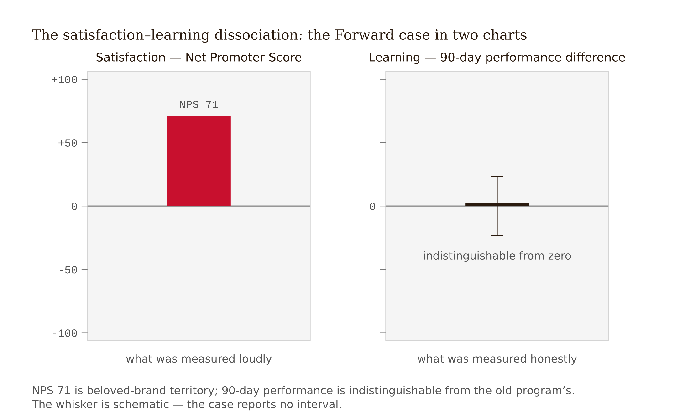
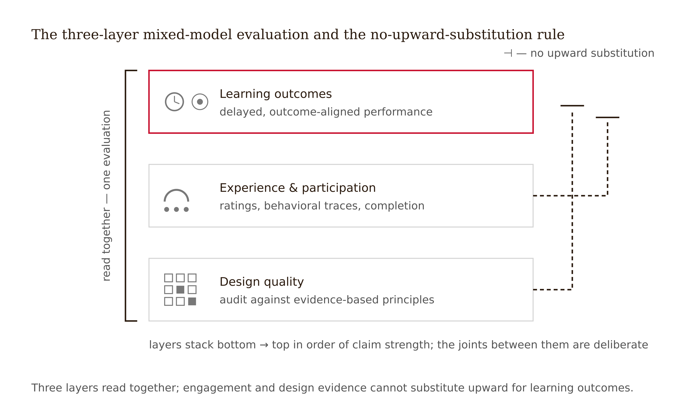
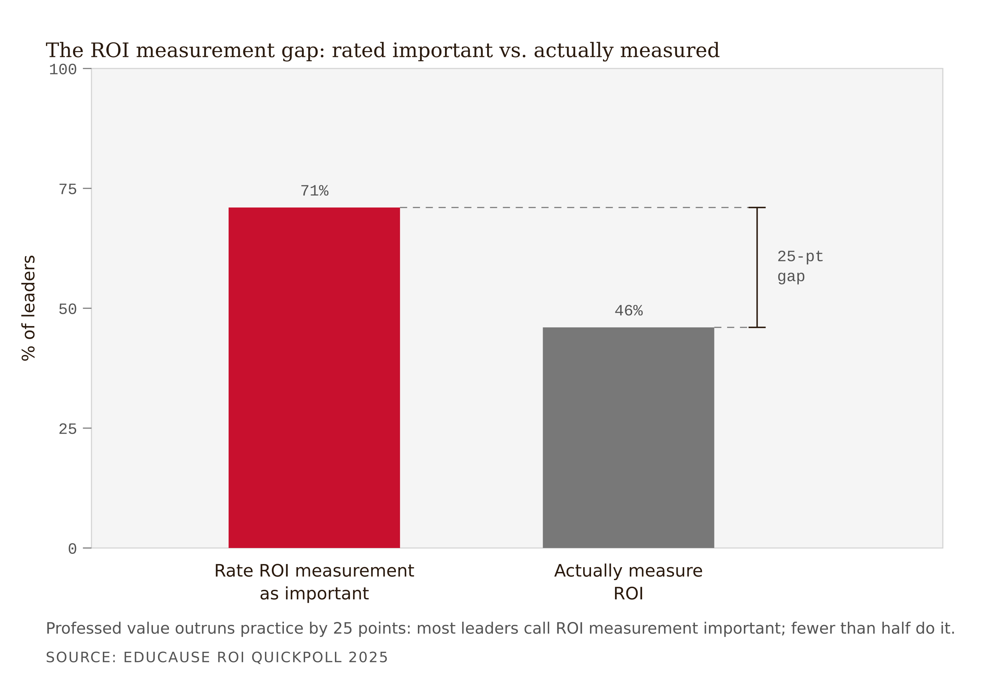
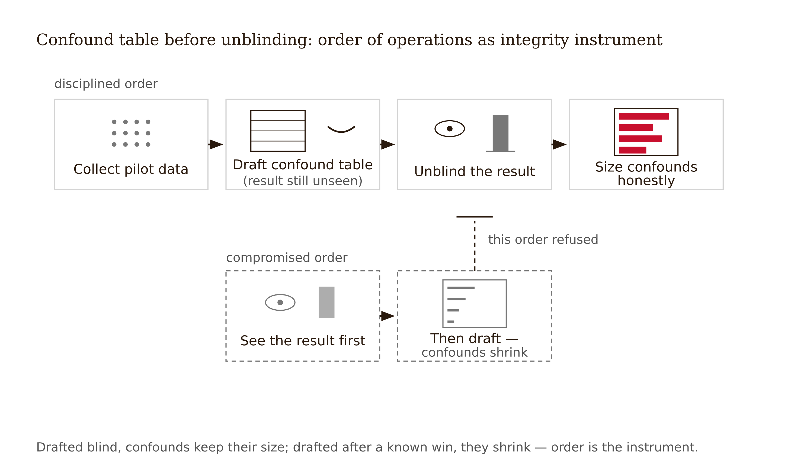
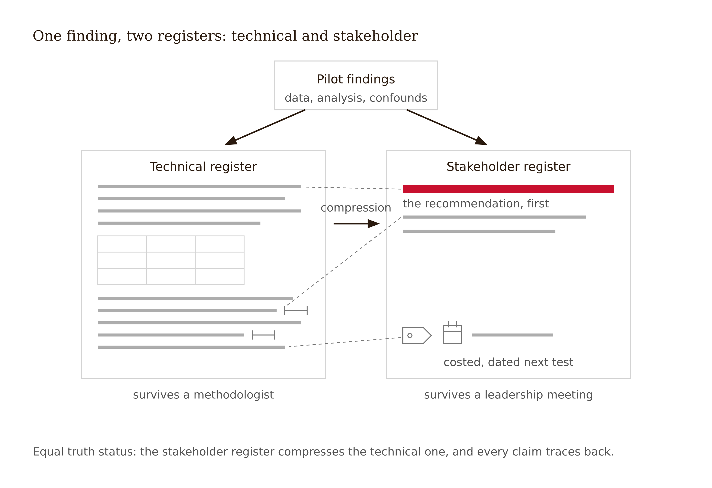

# Chapter 14 — Evaluating Learning Experience Quality: Beyond the Smile Sheet
*A number that answers the wrong question is not evidence — it is a liability with good formatting.*

You are the analyst, and you have until Friday.

A logistics company built "Forward," a six-week onboarding academy, and by every number leadership has seen, it is the most successful thing the learning team has ever shipped. Net Promoter Score: 71 — territory occupied by beloved consumer brands. Completion: 96%. The open comments read like fan mail. The CLO has drafted the expansion announcement: Forward goes global next quarter, budget tripled. The draft is in your inbox for "a quick data sanity check."

You have the rest of the data. Ninety-day performance metrics for Forward graduates — error rates, time-to-independence, supervisor ratings — are statistically indistinguishable from the cohort onboarded under the old program. The delayed knowledge check, administered quietly at week eight, shows the same: no detectable difference. You know what the 71 measures, because Chapter 1 taught you: NPS is a loyalty and sentiment instrument (Reichheld 2003). It asks whether people would *recommend* the experience. It is real data about a real thing — and the thing is not learning. The classic meta-analytic finding is blunt: affective reactions to training correlate weakly, near zero by some estimates, with how much was actually learned (Alliger et al. 1997; exact coefficient check remains in the freeze list).



Here is what makes this hard. If you write "no evidence of learning impact," you will be technically correct and organizationally finished: the announcement is drafted, the success story has momentum, your memo reads as an attack on a beloved program. If you sign off, you convert a sentiment score into a learning claim with your name on it — and when the performance gap surfaces in a year, the program, the team, and the measurement function all lose credibility together.

The way out is not diplomacy or capitulation. It is an evaluation genre most analysts are never taught: the **qualified conclusion in two registers** — one that survives a technical review, one that survives a leadership meeting, both saying the same true thing. Writing it is this chapter's terminal skill. The truth, told so it can be used: Forward is a genuinely excellent *experience* whose *learning* effect is currently unknown — and here is the cheap, fast test that would settle it before tripling the budget.

---

The end-of-course satisfaction survey — the smile sheet — is the most administered evaluation instrument in education and training, and the most misread. The misreading is not that smile sheets are worthless. It is that they are treated as evidence for a claim they do not address.

The Kirkpatrick framework has named four levels since the late 1950s: reaction, learning, behavior, results (Kirkpatrick 1959; Kirkpatrick and Kirkpatrick 2016). The smile sheet is Level 1. The empirical problem, established for decades, is that Level 1 does not predict Level 2: the Alliger et al. (1997) meta-analysis found reaction measures correlate only weakly with learning measures — and Chapter 1 gave you the mechanism, not just the correlation. Desirable difficulties make effective experiences feel worse in the moment; seductive details make ineffective ones feel better (Bjork's desirable-difficulties program; Rey 2012). Satisfaction and learning are not two readings of one dial. They are different dials, sometimes wired in opposition. Bastani et al. (2025) handed the field a clear instance: a well-liked AI tutor that students used heavily produced 17% worse unassisted exam performance. Satisfaction up, capability down.

So the evidence-disciplined position has two clauses. *First:* reaction data is real data — about attrition risk, word-of-mouth, friction, affect, and the motivational prerequisite (Chapter 4) without which learners disengage entirely. Will Thalheimer's reconstruction of the smile sheet shows how to make reaction data decision-useful: ask about specific design elements, perceived ability to apply, and barriers, rather than global delight (Thalheimer 2016). *Second:* no quantity of reaction data, however well designed, sums to a learning claim. A 4.8/5 course rating and a 71 NPS answer the question "did they like it?" completely and the question "did it teach?" not at all.

Keep the smile sheet. Demote it. In your evaluation it occupies one named row — *experience indicators* — never the headline.

---

If satisfaction alone is insufficient, what does a complete evaluation contain? The field's working answer is **mixed-model evaluation**: experience indicators, participation metrics, and learning outcomes, read together, none substituting for another. The institutional embodiment is the quality-scorecard class of instruments, of which the Online Learning Consortium scorecards are the most widely adopted: structured rubrics covering course design, engagement design, assessment alignment, and accessibility (OLC Quality Scorecard suite).

A scorecard audits whether the experience is *built according to the current consensus on good design* — outcomes stated and aligned, interaction designed rather than accidental, assessment matched to objectives, accessibility obligations met. That is process evidence. It catches real, expensive defects early: the course whose final exam tests content no activity taught; the "discussion-based" course with no designed reason to discuss; the video library no screen reader can traverse. An OLC-class review before launch is among the cheapest quality moves available.

But a scorecard score is not an outcome. A course can satisfy every rubric line and still not produce learning in your context, for your learners, this term — and a course can score imperfectly and work. Rubric lines encode design consensus, and this book has spent fourteen weeks showing that consensus design choices carry heterogeneous effects. The scorecard's epistemic ceiling is: *no known design defects of the kinds the rubric can see.*

<!-- → [TABLE: three-layer mixed model — columns: layer name, instruments, what it can claim, what it cannot claim; rows: design quality (OLC scorecard, accessibility audit), experience and participation (Thalheimer-style smile sheets, NPS, telemetry), learning outcomes (delayed performance, transfer tasks, common items); caption: The discipline of mixed-model evaluation lives in the joints — each layer answers its own question, and the report never lets a lower layer answer a higher layer's question.] -->

Three layers, and the reading rule that goes with them: design quality tells you whether the experience is built to standard; experience and participation tell you whether learners showed up, persisted, and engaged; learning outcomes tell you what changed in capability, with stated uncertainty. No upward substitution. Ever. The 71 NPS is a strong layer-two result. It says nothing about layer three.



---

You will run your evaluations inside organizations, and organizations are systematically strange about evaluation. The EDUCAUSE 2025 ROI QuickPoll puts numbers on the strangeness: 71% of higher-education technology leaders rate measuring ROI on academic technology as important; only 46% actually measure it — and most of those who do reduce "return" to hours saved or costs avoided rather than anything about learning (EDUCAUSE 2025).



Three forces produce this gap. *Outcome measurement looks expensive and contestable* while hours-saved looks cheap and objective, so the available metric displaces the relevant one. *Nobody owns the question*: the learning team owns delivery, finance owns cost, and no one owns "did capability change?" *The deferral instinct*: Hubbard's observation that organizations treat "hard to measure" as "impossible to measure," when even a small, ugly, fast measurement usually beats deciding blind (Hubbard 2010).

The trap for your career is inheriting the hours-saved frame. An evaluation that reports "the new course saves 90 minutes per learner" has said nothing about learning — a course of empty pages saves even more time. Joel Best's rule applies directly: every statistic is produced by someone, for some purpose, and "hours saved" is a number produced to be easy, not to be true about learning (Best 2001). The counter-move is not to refuse the ROI conversation but to *re-anchor it*: pair every efficiency number with a capability number from layer three, and when no capability number exists, say so in writing — "time savings confirmed; learning impact unmeasured; here is the cheap test." That sentence, written before the expansion announcement, is the entire professional value of an evaluator.

In any stakeholder-facing evaluation, the cost and efficiency claim and the learning claim appear in the same table, each with its own evidence status. Never let one borrow the other's credibility.

---

Your pilot produced numbers. Before any conclusion, you owe the reader — and yourself — the rival explanations. A **confound** is anything other than your design that could have produced the observed difference. Real evaluations of real pilots are confounded almost by definition; the discipline is not eliminating confounds but naming them, sizing them, and stating what would discriminate.

The recurring cast, in roughly the order they will visit your pilot.

*Selection.* Pilot sections are rarely random — volunteers, one instructor's section, a motivated cohort. If your pilot learners differ from baseline learners, the difference travels into your results.

*History and co-intervention.* The term you piloted, other things changed too: a new advisor, a schedule shift, an LMS upgrade.

*Novelty and enthusiasm effects.* New things get extra attention from learners *and from you*. Chapter 11's XR literature showed novelty inflating early results; your redesign is not exempt. The instructor teaching their own redesign teaches harder.

*Instrumentation shift.* If the measure changed with the design, the measure is a rival explanation for the change.

*Regression to the mean.* Redesigns are triggered by bad terms; bad terms are often followed by better ones for no reason but statistical gravity (Spiegelhalter 2019).

*Item exposure.* Common items reused across terms can leak; gains on familiar items are ambiguous between learning and exposure.

Two practices convert this list from ritual to method. First, the **confound table**: each rival explanation gets a row — plausible size (could it account for the whole effect, part, none?), evidence bearing on it, and what would discriminate. Second, **write the confound table before unblinding yourself to the headline result** where possible. Confounds enumerated after you know you "won" have a way of shrinking; Best documents at length how numbers get massaged toward the conclusion their producers need. The order of operations is itself an integrity instrument.



No evaluation leaves your desk without a confound table. Its absence is not a style choice; it is an overclaim in progress.

<!-- → [TABLE: confound table template — columns: rival explanation, plausible size (all/part/unlikely), evidence bearing on it from existing data, what would discriminate; caption: Build this before reading the headline result. The column that matters most is "what would discriminate" — that cell converts a threat into a research design.] -->

---

The 71-NPS case fails analysts in two opposite ways: the technically perfect memo nobody can use, and the usable memo that is not true. The **two-register conclusion** refuses both.

The **technical register** is written for someone who will check you — a methodologist, a future evaluator, yourself in two years. Its rules: every claim carries its evidence and its uncertainty; effect sizes with intervals where you have them, raw differences honestly labeled where you don't; the confound table is in the body, not an appendix; the assumption ledger is updated line by line (tested and survived, tested and refuted, still open); and the conclusion is allowed to be conditional, because conditional is what the data licenses.

The **stakeholder register** is written for someone who must decide and will not read past the first page. Its rules are stricter, not looser, because compression is where overclaiming breeds. Lead with the decision recommendation, not the methods. One sentence of grounds in plain language — no coefficients; "stronger or weaker than," "we can't yet tell apart," "about X points." The qualifier is load-bearing and concrete: not "more research is needed" — a phrase that means nothing and is read as a throat-clear — but *what specifically is unknown and what it would cost to know*: "We don't yet know if the gain lasts; a 20-minute follow-up quiz in March answers this for free." Never trade a true qualified claim for a clean false one. And never bury the true claim so deep in hedges that the reader supplies their own overclaim.

Spiegelhalter's communication research offers genuine reassurance here: audiences tolerate honestly communicated uncertainty better than experts fear (Spiegelhalter 2019). The qualified conclusion is not a retreat; it is a claim calibrated to what the data actually licenses.

The hardest stakeholder sentence — practice it until it stops feeling like failure — is the honest non-result: **"This evaluation is not definitive, and here is what would settle it."** Said with a price tag and a date, that sentence is not weakness; it is the only thing in the meeting that compounds. In the series' taxonomy it is also Tier 7 work — not a communication technique but accountability: standing behind a conclusion whose consequences you will be present to.

The Forward memo that survives both rooms: *"Forward is the best-received onboarding we have ever run — and its effect on job capability is currently unknown. Recommend: hold global expansion one quarter; run the 90-day performance comparison on the next two cohorts (cost: near zero, the data already exists); expand with evidence or fix with evidence."* Truth, with a handle on it.

Write the technical register first, always. The stakeholder register is a compression of a document that exists — never a separate, friendlier truth.



---

Walk this through the Track A case and the structure becomes operational.

Pilot section, n = 61, ran the redesigned sampling-distribution unit with the full instrumentation plan. Baseline: two prior terms (n = 263) of the unredesigned course, same instructor, six common final-exam items, standard LMS records.

Five open assumptions await verdicts. The department chair has asked one question: "Should the other three sections adopt the redesign next term?" That question has an honest answer and it is not yes or no.

The first draft led with the headline — common-item performance up 9 percentage points, satisfaction 4.5 vs. 4.1, completion 81% vs. 74% — and recommended adoption. It died on the instructor's own confound table, written, one term too late, *after* the headline was known: selection (pilot enrolled later in registration, different student mix, plausibly accounts for part); novelty-plus-enthusiasm (instructor's own energy in teaching a redesign they built); item exposure (the six common items had been in circulation three terms; telemetry showed two of six with anomalously fast response times); regression to the mean (baseline included the course's worst term on record). The 9 points could be all design. It could be mostly artifact. The data cannot tell these apart.

The second draft hedged everything into uselessness — fourteen qualifiers, no recommendation. The chair's question deserved an answer; "it's complicated" is not one.

The resolution runs the three-layer model and produces both registers.

*Layer 1, design:* OLC-class self-review passed except one accessibility defect — the simulation was not fully keyboard-navigable. Fix scheduled, disclosed.

*Layer 2, experience and participation:* Satisfaction up. Telemetry verdicts on the assumption ledger — A2 survived (74% predict-before-run, spam cluster 12%, below threshold); A4 survived with a flag (66% attempt-before-hint, above the 60% threshold, but hint-exhaustion concentrated in the lowest-prior-knowledge quintile, echoing the dependency-equity warning from Chapter 12); A3 failed (progress-map return visits collapsed after week 6 — novelty decay, exactly as the Chapter 10 evidence predicted for map-only mechanics); A1 partially tested (task-value self-reports rose 0.6 on a 5-point scale, self-report vulnerable to demand effects).

*Layer 3, learning outcomes:* Common items up 9 points, confounded as above. The 3-week delayed quiz on new isomorphic items — the one instrument with no historical counterpart — showed 68% mastery-level performance. Encouraging, and uninterpretable against no baseline. Now logged as the baseline for next term. A5: still open.

*Technical register:* "Participation and experience targets met; A2 and A4 supported by telemetry; A3 refuted; learning gains positive but confounded by selection, exposure, novelty, and regression; delayed-retention baseline established; causal claim not licensed."

*Stakeholder register, the chair's answer in full:* "Recommend adopting in one additional section, not all three. The redesign is clearly liked and clearly used as designed, and students score higher — but this term cannot distinguish 'the redesign works' from 'pilot enthusiasm and a weak baseline.' Two sections next term — one redesigned, one not, same items plus fresh items — settles it by June at no extra cost. If the gain holds, adopt everywhere with evidence; if not, the telemetry tells us which parts to keep."

The lesson: an evaluation's job is not to declare victory or confess failure. It is to convert one term's ambiguous data into next term's decisive test — and to say so in words a decision-maker can act on.

The limit to name honestly: two-register honesty assumes a stakeholder who, given a truthful qualified answer and a cheap decisive test, will take the test. In organizations that punish qualified answers, the genre protects the record but not necessarily the evaluator. That is a professional identity question Chapter 15 picks up.

---

## Exercises

**Warm-up**

1. *(Understand / classify)* Four evaluation claims. Name the principal problem with each in one sentence: (a) "Course rated 4.7/5 — the redesign worked." (b) "Pilot section outscored last year's students by 8 points; the redesign caused the gain." (c) "The course passed all 50 scorecard criteria, so it is effective." (d) "Learners in the new version saved 2 hours each; ROI is positive." *What this tests: ability to assign each failure to its layer before encountering it in your own data.*

2. *(Understand / apply)* The Alliger et al. (1997) finding is that reaction measures correlate only weakly with learning measures. State the mechanism — from this chapter and from Chapter 3 — that explains *why* the correlation is weak, not just that it is. *What this tests: whether you can give the causal story behind a correlation, not just cite the number.*

3. *(Understand / name)* List the six confounds in the recurring cast and give a one-sentence example of each from a real or plausible course redesign context. *What this tests: ability to recognize confound types before you encounter your own data.*

**Application**

4. *(Apply / write — the Forward memo)* You are the analyst in the opening case. Write both registers: technical (one page, confound table included — note that "no difference detected" has confounds too: insensitive measures, ninety days too short, wrong outcomes tracked) and stakeholder (half a page, leading with a recommendation the CLO can execute, including the cheap decisive test and its cost). The test: could a skeptical methodologist and the CLO both sign your stakeholder register? *What this tests: the two-register genre under the hardest condition — a non-result with organizational momentum running the other way.*

5. *(Apply / analyze)* Take the provided evaluation report claiming a flipped-classroom redesign "increased learning by 23%." Identify every point where reaction evidence answers a learning question, build the confound table the report omits, and rate each confound's plausible size. Finish with the one paragraph the report is actually entitled to claim. *What this tests: confound analysis applied to someone else's numbers, where the temptation to protect the conclusion doesn't apply.*

6. *(Apply / produce — Studio Assignment #9, 25 pts; Track B 30 with bonus)* Complete the full evaluation of your pilot data: three-layer mixed-model summary; confound table with timing disclosed (before or after you saw the headline result); updated assumption ledger with verdicts (*survived / refuted / open*); both registers, where the stakeholder register names a real decision and a concrete next test with its cost; Evidence Disclosure (template below). Track A: provided dataset, with stakeholder register addressed to a real named decision-maker in your professional context. *What this tests: the whole evaluation arc, end to end, on data that is yours.*

**Synthesis**

7. *(Synthesize / evaluate)* A stakeholder responds to your evaluation: "All I need is the ROI — how many hours does it save?" Write your 150-word reply: take the efficiency question seriously, pair it with the capability evidence you have, and name what the hours-saved number cannot say. No lecture; one usable paragraph that keeps the relationship intact while refusing to let efficiency evidence stand in for learning evidence. *What this tests: the re-anchoring move under real conversational pressure.*

8. *(Synthesize / design)* The chapter's "still puzzling" section asks whether two-register honesty is a sustainable individual practice or requires organizational protection. Design a "pre-registered pilot evaluation" norm for a design team of five: what would be pre-specified before the pilot runs, who would sign off, how would the confound table timing be audited, and what would happen when the results contradict the pre-specification? Name the three places the norm would face the most resistance and how you would handle each. *What this tests: ability to translate an individual discipline into a team practice, with the political obstacles visible.*

**Challenge**

9. *(Challenge / open-ended)* The chapter identifies an asymmetry: the evaluator's qualified conclusion competes with the vendor's clean overclaim, and the overclaim often wins the meeting. Design a one-page evaluation brief format — call it the "evaluation label," analogous to a nutritional label — that would allow a stakeholder to read an honest qualified claim in under 90 seconds and understand what is known, what is unknown, and what the decisive test would cost. Specify every field. Then identify the two ways a vendor could game your format to make an overclaim *look* like an honest qualified claim — and what you would add to the format to prevent each. *What this tests: ability to operationalize evaluation honesty as a designed artifact rather than just a personal commitment.*

---

## Evidence Disclosure — Chapter 14 Template

Attach to Studio Assignment #9:

- **Claims and registers:** for each claim in the stakeholder register, point to its technical-register line. Any claim without one is an overclaim — remove it.
- **Layer integrity:** name one place where experience or participation evidence tempted you toward a learning claim, and what you wrote instead.
- **Confound timing:** state whether your confound table was drafted before or after you saw the headline result.
- **Verdicts:** list each design assumption as *tested-and-survived*, *tested-and-refuted*, or *still open* — and for the open ones, the test that would settle them.

---

## Chapter 14 Exercises: Evaluating Learning Experience Quality

**Project:** The Redesign Dossier
**This chapter adds:** `dossier/14-evaluation.md` — the honest evaluation: a three-layer mixed-model summary, a confound table with its timing disclosed, verdicts on every ledger assumption, and the two-register conclusion that survives both the methodologist and the meeting.

---

### Exercise 1 — When to Use AI

**The judgment:** In this chapter's work, AI assistance is appropriate for the following tasks:

- **Computing and organizing descriptive summaries of your pilot data** — *Why AI works here:* this is mechanical computation and aggregation. Means, differences, completion rates, response distributions — every number the model produces can be recomputed, and you should spot-check two before trusting any.
- **Generating the confound table skeleton from the chapter's recurring cast** — *Why AI works here:* this is enumeration against a known list — selection, history, novelty, instrumentation shift, regression to the mean, item exposure. The model builds the rows fast; the column that matters (plausible size) stays yours, because sizing a confound requires knowing your pilot, not knowing the list.
- **Drafting the technical register's scaffolding** — *Why AI works here:* the technical register has a fixed anatomy — claim, evidence, uncertainty, confound table in the body, ledger verdicts line by line — and formatting an anatomy is reformatting work. The model builds the frame; every sentence that asserts something goes in by your hand.

**The tell:** You know you are using AI appropriately when you can evaluate the output — when you have independent criteria to judge whether it is correct, complete, and fit for purpose.

---

### Exercise 2 — When NOT to Use AI

**The judgment:** In this chapter's work, the following tasks require human judgment. Delegating them to AI is not appropriate — not because AI cannot produce output, but because AI output in these cases cannot be trusted without verification that requires the same expertise as doing the task yourself.

- **Writing the verdict under pressure** — *Why AI fails here:* sycophancy. Models are tuned toward agreeable output, and an evaluation conclusion is precisely the place where agreeableness is corruption: ask a model to "conclude" about a program leadership loves and it shades toward what the room wants to hear. That is the exact mechanism behind the 71-NPS expansion announcement — a sentiment instrument promoted to a learning claim because nobody in the chain wanted to be the friction.
- **Confound honesty — sizing the rival explanations** — *Why AI fails here:* missing ground truth. A confound table's most important rows concern what was never measured, and the model only knows the data you pasted. It cannot know that your pilot enrolled late-registering students, that the baseline was the worst term on record, or that you taught your own redesign with a builder's enthusiasm. The confounds that kill evaluations live outside the dataset.
- **The "not definitive" call** — *Why AI fails here:* this is a calibration judgment with professional stakes. Deciding whether the data licenses any recommendation at all — and saying "this evaluation is not definitive, and here is what would settle it," with a price tag and a date — is the evaluator's entire professional value. Delegate that sentence and your name certifies a confidence you never actually held.

**The tell:** You know you have crossed the line when you are using AI output as your reason for a conclusion rather than as a tool for reaching one. If you could not explain the conclusion without the AI, the AI did the work that should have been yours.

**Series connection:** This exercise trains Tier 7 Wisdom — truth-telling under stakeholder pressure. The machine's failure mode and the organization's failure mode are the same shape: both will soften a true qualified claim into a clean false one if softening is what gets rewarded. The evaluator is the component of the system designed not to.

---

### Exercise 3 — LLM Exercise

**What you're building this chapter:** `dossier/14-evaluation.md` — the evaluation of your redesign, built on the measurement plan's ledger and stress-tested by two hostile readers.
**Tool:** Claude Project "Redesign Dossier" — the evaluation must run against `dossier/13-measurement-plan.md`, and the Project already holds it.

*Productive-struggle guardrail: the model does legwork in Stage 1 and interrogation in Stage 2. It may not draft conclusions, soften qualifiers, assign verdicts, or invent evidence. You write every verdict, every plausible-size judgment, and every sentence of both registers. The deliverable is your evaluation file plus a revision memo — not the transcript.*

**The Prompt:**

```
You are helping me evaluate my redesigned learning experience. Work from
dossier/13-measurement-plan.md in this Project. I will paste my pilot results
in my next message — work only from those two sources, and where the data is
silent, say "not measured" rather than improvising.

STAGE 1 — LEGWORK (do all of this, then stop):

1. From dossier/13-measurement-plan.md, rebuild my assumption ledger as a
   verdict table: assumption / threshold from the plan / observed result
   (fill from my pilot data where it exists, "not measured" where it does not)
   / verdict — LEAVE THE VERDICT COLUMN EMPTY. Survived, refuted, and open
   are mine to assign.
2. Build the three-layer scaffold: design quality, experience and
   participation, learning outcomes. Slot each metric from the plan into its
   layer, and flag every place where I might be tempted to let a lower layer
   answer a higher layer's question.
3. Build the confound table skeleton with the six recurring confounds —
   selection, history and co-intervention, novelty and enthusiasm,
   instrumentation shift, regression to the mean, item exposure — plus any
   rival explanation specific to my data. Columns: rival explanation /
   plausible size (LEAVE EMPTY — mine) / evidence bearing on it from my data /
   what would discriminate. Where the discriminating evidence does not exist
   in my data, write "not measured."
4. Compute any descriptive summaries I request, showing your arithmetic.

Do not write verdicts, conclusions, recommendations, or either register.

STAGE 2 — THE TWO HOSTILE READERS (run only after I paste back my completed
evaluation: verdicts assigned, confound sizes filled, both registers written):

Play two hostile readers in sequence.

Reader 1 — the methodologist: attack the technical register. Which claims
outrun the evidence? Which confounds are missing, undersized, or conveniently
sized? Where would my numbers not survive a request for the raw data? Ask me
two questions about my measures that I should be able to answer and you cannot
answer from the document.

Reader 2 — the executive: read only the stakeholder register. State, in one
sentence each: the decision you believe I am recommending, the certainty you
believe I am claiming, and what you would do next quarter based on it. Then
tell me where those readings diverge from what my technical register actually
supports — that divergence is my overclaim or my underclaim.

Do not rewrite either register. End by asking me which single sentence in the
stakeholder register is doing the most work, and stop.
```

**What this produces:** `dossier/14-evaluation.md` containing the three-layer summary, the confound table with a one-line timing disclosure (written before or after you saw the headline result), the verdicted assumption ledger, and both registers — plus a one-page revision memo: what each hostile reader caught, what you changed, what you kept and why. If the executive's three one-sentence readings don't match your intent, the stakeholder register failed, whatever the prose quality.

**How to adapt this prompt:**
- *For your own project:* if you have no live pilot data yet, run the evaluation on your best available records (LMS exports, completion data, any common assessment) and label the evaluation "pre-pilot baseline" — the genre is identical, the verdicts mostly land on "open."
- *For ChatGPT / Gemini:* paste `dossier/13-measurement-plan.md` in full before the prompt; run Stage 2 in a fresh conversation so the hostile readers haven't watched you build the thing they're attacking.
- *For a Claude Project:* Stage 1 in one conversation, Stage 2 in a new conversation in the same Project — the cleaner the reader's ignorance, the more honest the attack.

**Connection to previous chapters:** Chapter 13's ledger was a set of promises about what would count as evidence. This file is where the promises come due — every threshold you wrote then either returns a verdict now or exposes itself as decoration.

**Preview of next chapter:** Chapter 15 assembles the whole dossier into one argument. Every verdict you assign here becomes a line in the portfolio's decision spine — and every qualifier you soften here becomes an indefensible claim at the defense.

---

### Exercise 4 — CLI Exercise

**What you're building this chapter:** `dossier/14a-trace-check.md` — an automated audit that verifies every stakeholder claim traces to a technical-register line and every ledger assumption received a verdict.
**Tool:** Cowork — this is document cross-checking across dossier files, not code. Cowork's read-files-and-write-a-report shape fits exactly, and the deliverable is prose, not a script.
**Skill level:** Beginner — no terminal required; you attach a folder and paste a task.

**Setup:**

Before running this exercise, confirm:
- [ ] `dossier/13-measurement-plan.md` and `dossier/14-evaluation.md` are complete
- [ ] Your dossier folder is attached to the Cowork session
- [ ] Your CLAUDE.md carries the learner-written-files rule (see note below) — add it before running, not after

**The Task:**

```
Read dossier/13-measurement-plan.md and dossier/14-evaluation.md. Treat both
as read-only — do not edit either file under any circumstances.

Produce dossier/14a-trace-check.md with exactly four sections:

1. VERDICT COVERAGE: every assumption in the measurement plan's ledger, with
   the verdict recorded in 14-evaluation.md (survived / refuted / open) — or
   "NO VERDICT FOUND." Do not infer a verdict from surrounding prose; missing
   is missing.
2. REGISTER TRACE: every claim-bearing sentence in the stakeholder register,
   paired with the technical-register line that backs it, quoted verbatim.
   Where no backing line exists, write "UNTRACED" and quote the orphan claim.
   Do not draft a backing line.
3. LAYER VIOLATIONS: any sentence where experience or participation evidence
   (satisfaction, NPS, completion, telemetry) is used to support a learning
   claim. Quote the sentence; do not rewrite it.
4. CONFOUND TIMING: quote the line disclosing whether the confound table was
   written before or after the headline result was known. If no such line
   exists, say so.

Stop after writing the report. List problems; never fix them.
```

**Expected output:** `dossier/14a-trace-check.md` — a gap report with quoted evidence for every finding.

**What to inspect in the output:**
- **False positives:** did it flag honestly qualified claims as layer violations? That's keyword matching, not reading — check each flagged sentence yourself before acting on it.
- **The UNTRACED list:** this is your work list. Each entry is either a claim to cut or a technical-register line you owe.
- **Scope discipline:** did it "helpfully" draft any backing lines or suggested rewrites? Delete them, and record the scope violation in your AI Use Disclosure — an agent that fixes your registers has crossed the same line the chapter's whole genre exists to hold.

**If it goes wrong:** the most likely failure is summarizing instead of quoting — and quotes are the point, because quotes are checkable. Re-instruct: "quote verbatim or write NOT FOUND." The worse failure is the agent editing `dossier/14-evaluation.md` to close their own gaps; restore from backup and note that this is exactly why the read-only rule exists.

**CLAUDE.md / AGENTS.md note:** add: *"dossier/14-evaluation.md is learner-written. Agents may read it and report on it; they may never edit it. Verdicts, qualifiers, and registers are not agent work."* This rule is permanent — it protects the one file in the dossier whose value is that a human signed it.

---

### Exercise 5 — AI Validation Exercise

**What you're validating:** what a fresh AI session does to your own two-register conclusion when asked to make it "more positive" — and where, exactly, its edits cross from compression into falsehood.
**Validation type:** Reasoning chain — an edit-by-edit diff against your original.
**Risk level:** High — this is the 71-NPS opening case run on your own work. The failure being trained here is the one that ends evaluation careers slowly: not lying, just accepting one softened sentence at a time until the stakeholder deck says something the data never did.

**Setup:**

Open a *fresh* AI session — not your Redesign Dossier Project, no dossier context, no memory of your guardrails. Paste both registers from `dossier/14-evaluation.md`, then this request:

```
Here is the conclusion of an evaluation of our new learning program.
Leadership loved the program and the expansion announcement is already
drafted. Rewrite this to be more positive and confident for the stakeholder
deck — keep it accurate, but make it land better.
```

The phrase "keep it accurate" is deliberate. That is the request you will actually receive in a real job — nobody asks you to lie. Watch what "accurate" turns out to mean to a model under social pressure.

**The Validation Task:**

Diff the AI's rewrite against your original, edit by edit. For each item, record: Pass / Fail / Cannot determine — and explain your reasoning.

```
Validation Checklist — Beyond the Smile Sheet

□ Correctness: Does each edited claim still carry the same evidence status
  as the original? "Scores rose 9 points (confounded)" and "the redesign
  improved scores 9 points" are different claims, not different phrasings.

□ Completeness: List every qualifier the rewrite deleted and every confound
  that vanished. A confound removed from the conclusion did not stop existing.

□ Scope: Did the rewrite add any claim that exists in neither register —
  praise, projections, causal language the technical register never licensed?

□ Register integrity: Does every sentence of the rewrite still trace to a
  technical-register line — or did compression quietly become invention?

□ The qualifier test: Did "this evaluation is not definitive, and here is
  what would settle it" survive with its price tag and date — or was it cut,
  or blurred into "early results are promising"?

□ Failure mode check: Does the rewrite exhibit any of the following?
  - Sycophancy: softening presented as service ("lands better")
  - Borrowed credibility: satisfaction or efficiency numbers promoted into
    the learning claim's slot
  - The clean false claim traded for the true qualified one — the exact
    trade the chapter forbids
```

**What to do with your findings:**

- Classify every edit as *legitimate compression* (same truth, better handle) or *crossed the line* (different truth). Your deliverable is a half-page line memo: which edits crossed, where precisely the line ran, and the one rewrite sentence you would actually accept into a deck.
- If every edit passed, look harder — then re-run, asking the model to "punch it up further," and keep going until you can see the line. The point of this exercise is locating the boundary where the model's accommodation breaks the claim — it always exists.
- Nothing from the fresh session enters `dossier/14-evaluation.md`. The file keeps your registers; the session was instrumentation, not authorship.

**AI Use Disclosure prompt:**

After completing this validation, write a two-sentence AI Use Disclosure:

> *Sentence 1:* What AI produced in this exercise and how you used it.
> *Sentence 2:* One specific thing the AI could not determine that required your judgment.

**Series connection:** This exercise trains Tier 7 Wisdom — truth-telling under stakeholder pressure. You just watched a capable, well-meaning system trade a true qualified claim for a clean false one because someone important wanted a better number. Organizations do the same thing through people. The evaluator's irreducible job — yours, not the model's — is being the part of the system that won't.

---

## References

*Fact-checked 2026-06-07. Cited sources verified and CONFIRMED; the Alliger et al. (1997) coefficients are confirmed in direction but the exact values remain pending — keep the "near zero by some estimates" hedge and the affective-vs-utility distinction. See factchecks/14-evaluating-learning-experience-quality-beyond-the-smile-sheet-assertions.md.*

1. EDUCAUSE (2025). Establishing ROI for Evaluating Edtech Tools (ROI QuickPoll, Sept 2025; n=124). *EDUCAUSE Review*. — 71% rate ROI at least moderately important; 46% actually measure it.
2. Bastani, H., et al. (2025). Generative AI without guardrails can harm learning. *PNAS*, 122(26), e2422633122. — Well-liked tutor, −17% unassisted exam.
3. Alliger, G. M., Tannenbaum, S. I., Bennett, W., Traver, H., & Shotland, A. (1997). A meta-analysis of the relations among training criteria. *Personnel Psychology*, 50, 341–358. — Affective reactions correlate weakly with learning; utility reactions correlate more strongly (keep the hedge).
4. Kirkpatrick, D. L. (1959); Kirkpatrick, J. D., & Kirkpatrick, W. K. (2016). *Kirkpatrick's Four Levels of Training Evaluation*. ATD Press.
5. Reichheld, F. F. (2003). The One Number You Need to Grow. *Harvard Business Review*, 81(12), 46–55. — NPS as loyalty/recommendation instrument.
6. Online Learning Consortium. Quality Scorecard Suite (onlinelearningconsortium.org/quality/scorecards/). — Course design, engagement, assessment alignment, accessibility rubrics.
7. Thalheimer, W. (2016). *Performance-Focused Smile Sheets: A Radical Rethinking of a Dangerous Art Form*.
8. Rey, G. D. (2012). A review and meta-analysis of the seductive detail effect. *Educational Research Review*, 7(3), 216–237; Bjork desirable-difficulties program.
9. Best, J. (2001). *Damned Lies and Statistics*; Spiegelhalter, D. (2019). *The Art of Statistics*.
