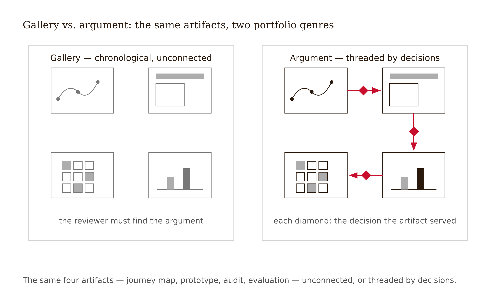
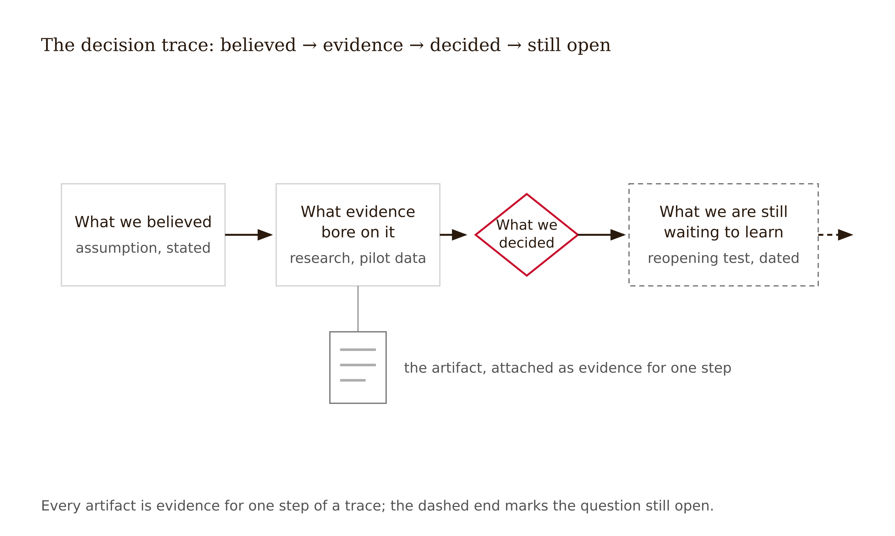
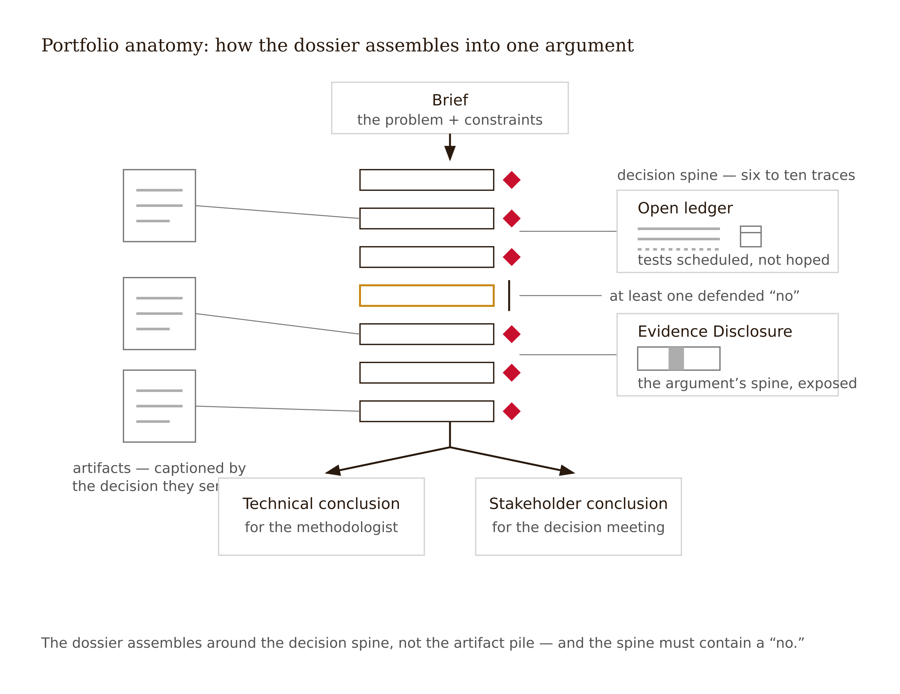
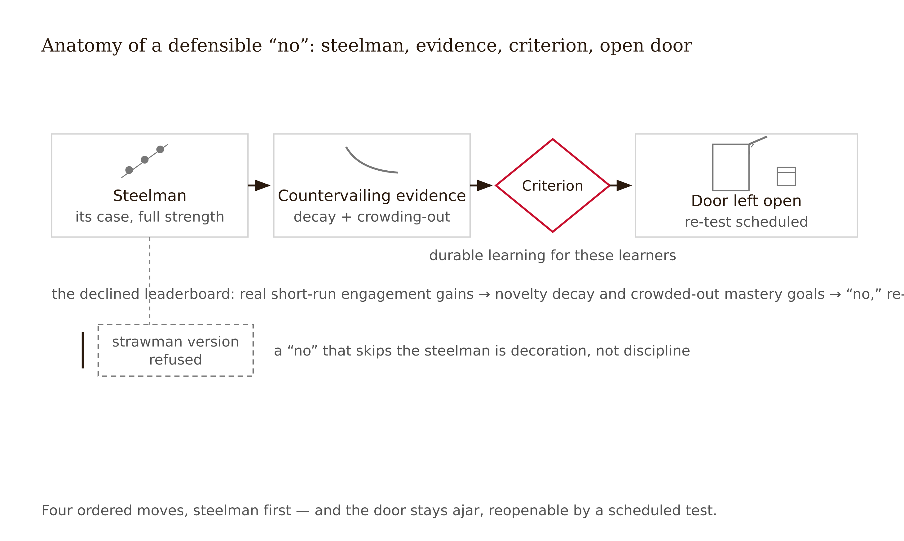
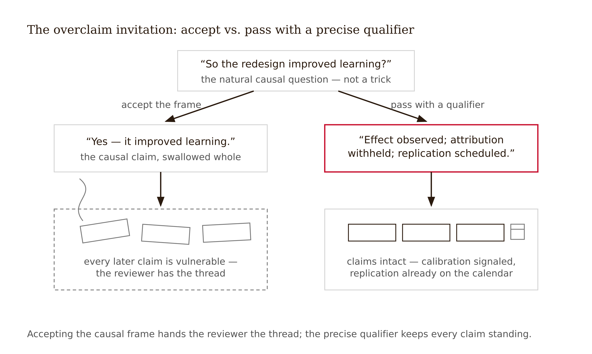
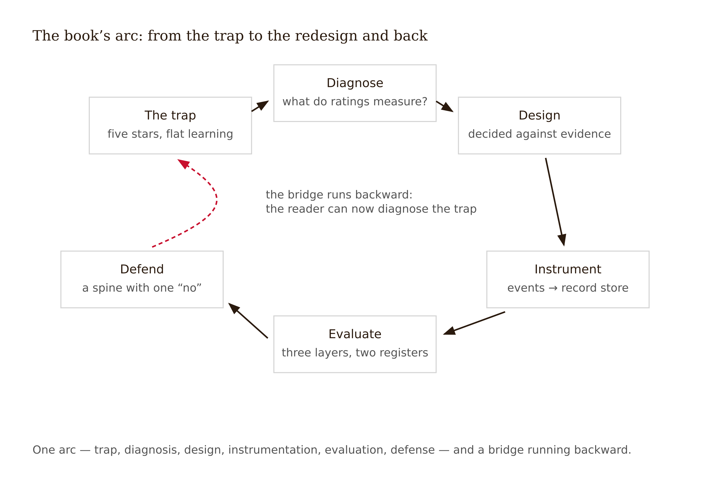

# Chapter 15 — The Full Redesign: One Experience, Every Decision
*Done does not mean every question is closed. It means every decision is accounted for.*

On the last studio day, before any student presents, the instructor presents — and gets reviewed by the room under the same protocol the students will face.

On screen: the complete redesign portfolio for the introductory-statistics online course. Fourteen weeks ago it was a course with 4.1/5 satisfaction, a 26% non-completion rate, and no evidence about learning either way. What "done" looks like is twelve artifacts and a ledger.

The artifacts appear in argument order: the learner research that found low task-value, not low ability, at the center of the trouble; the journey map locating the highest-risk moment at the sampling-distribution unit; the co-design record, including the session where learners voted to remove the practice quizzes — and the memo explaining why the quizzes stayed; the prototype and its test report; the variability audit with one accessibility defect found, fixed, and disclosed; the gamification memo that declined a leaderboard; the modality memo that declined VR; the AI decision — a hint ladder with a floor it cannot cross; the measurement plan; the evaluation with two registers, confound table and all.

Then the part that makes first-time viewers uncomfortable: the **open decisions, shown rather than buried.** The progress map failed its novelty test — that assumption was refuted, and its replacement is undecided. The nine-point gain is real but confounded; the decisive two-section comparison is next term, which means the portfolio's central learning claim is, in its own words, not yet licensed. The retrieval-quiz spacing schedule is an educated guess awaiting local data.

A student asks the obvious question: "You're presenting a redesign whose headline result you admit you can't claim yet. Why does this count as done?"

The instructor's answer is the chapter: **done, in evidence-disciplined design, does not mean every question is closed. It means every decision is accounted for** — grounded in evidence, grounded in learner research, or named as an assumption with its test specified and scheduled. A portfolio that claims more than that is not more finished. It is less honest. The ones that get funded twice are the honest ones, the instructor adds, because the second ask arrives with the first ask's promises kept.



---

The most common failure mode of design portfolios is the gallery: beautiful artifacts, arranged chronologically, each captioned with what it *is* rather than what it *did*. Galleries demonstrate effort. Hiring loops, budget meetings, and skeptical reviewers are not buying effort; they are buying judgment, and judgment is only visible as a chain of decisions under constraint.

The unit of the portfolio is not the artifact. It is the **decision trace**: what we believed → what evidence or research bore on it → what we decided → what we are still waiting to find out. Each artifact appears as the evidence for a step in that trace. The journey map is not "a journey map"; it is *the reason the redesign concentrated on the sampling-distribution unit and not on the visual refresh the stakeholders originally requested*. McDonald and Westerberg's framing of LXD as an orienting guide — design moves justified by how people actually learn — describes exactly this genre: the portfolio is the argument that your design moves were so justified (McDonald & Westerberg 2023).



The required structure: a brief naming the experience, its intended learning outcome, and its evidence of effectiveness at the start (usually none — say so); a decision spine of six to ten major traces, each a one-paragraph case with pointers into the artifacts, and including at least one *declined* feature so that the spine contains the word "no"; the artifacts themselves, each captioned by the decision it served; a ledger with verdicts and scheduled tests for every open assumption; the final Evidence Disclosure; and two registers of conclusion.

One more required element, new to this edition because the market made it necessary: where AI sits in this experience's delivery chain — in front of the learner (pedagogically engineered or not), behind the teacher, or absent — and the evidence rationale for that placement. A portfolio that adds an AI tutor without this accounting has not done the disciplinary work.



About holes. A missing or weak artifact, disclosed — "co-design ran with two learners instead of five; the record is thin and the decisions it grounds are flagged accordingly" — costs points once. The same hole papered over costs the portfolio its credibility everywhere, because a reviewer who finds one silent gap stops believing the rest. Disclosure is not contrition. It is calibration, and calibration is the product.

---

Every studio assignment this semester carried an Evidence Disclosure: which decisions are evidence-grounded, which research-grounded, which assumptions awaiting measurement. The final portfolio raises the bar, because by Week 15 you have something you did not have in Week 5 — a record of your own preferences colliding with evidence.

The final Evidence Disclosure must name, with artifact citations, three things. **Three decisions where evidence overruled preference** — yours, your learners', or your stakeholders'. Not three decisions where the evidence happened to agree with you; three where something you or they *wanted* lost. The disclosure must say who preferred what, which evidence overruled it, and what was decided instead. **One decision where the evidence could not decide and judgment did.** State the competing options, why the evidence underdetermined the choice — absent, heterogeneous, or not transportable to your context — what you chose, on what grounds, and what future signal would tell you the judgment was wrong. **And one statement about where AI sits in this experience's delivery chain, with the evidence rationale:** what AI does, what it is forbidden to do, who the human is who holds the learning relationship, and what the measurement plan can see.

The asymmetry is deliberate. Anyone can narrate evidence agreeing with them. The capacity this course was built to produce shows up only in the other two moves: losing to the evidence gracefully, and choosing under acknowledged uncertainty without dressing the choice up as science. A portfolio claiming every decision was evidence-forced is either designing in a fantasy literature or laundering judgment as data, and the Week 9 work on contested UDL evidence already taught you which is more likely.

<!-- → [TABLE: Evidence Disclosure structure — five rows: (1) Decision census: every spine item labeled evidence-grounded / research-grounded / assumption awaiting measurement; (2) Three overrulings: who preferred what, the evidence, the decision — at least one declining an engaging feature; (3) One judgment call: options, why underdetermined, grounds for choice, reversal signal; (4) The corrections: any earlier claim retracted or weakened, shown rather than erased; (5) The open ledger: every live assumption with its test and date. Footer: "An empty open-ledger section reads as overclaiming, not completeness." Caption: "The disclosure is not an appendix. It is the argument's spine exposed."] -->

---

Before any portfolio reaches the reviewer, it passes through a peer — and the peer review is itself graded work, because reviewing is a professional capability, not a courtesy.

The protocol runs the course's evidence diagnostic against six probes. **Trace check:** pick two decisions from the spine and follow each from claim to artifact to evidence without the author in the room — a portfolio that needs its author is a talk, not a document. **Register check:** read the stakeholder conclusion, then the technical one; does the stakeholder version claim anything the technical version cannot back? **Causal-claim hunt:** find every sentence implying this design produced that outcome; for each, decide whether the claim is licensed, confounded-and-qualified, or naked — unsupported causal claims are the single most common portfolio defect and the easiest for a hostile reviewer to detonate. **The declined-feature probe:** find the "no" and ask whether the case for the declined feature was stated at its strongest before being declined; a "no" argued against a strawman is decoration, not discipline. **Ledger audit:** are the open assumptions genuinely open, with tests specified and scheduled, or are they euphemisms for "we hope"? **The one-question rule:** end with the single question you would ask in the defense — the sharpest one you have. Giving a colleague your best question before the real defense is the entire point of peer review.

A declined AI feature is worth special attention in the declined-feature probe. The AI tutor declined in favor of AI-assisted teacher support, or the AI-generated curriculum declined in favor of a human-designed one with AI drafting assistance — these are the decisions that demonstrate the discipline most clearly, because they are the decisions the market is currently making wrong at scale.

Two norms make this work. Review the argument, not the person — every probe is about traces and claims, none about talent. And findings before the defense are gifts; the same findings during the defense are wounds. Professional communities that institutionalize pre-review outperform those that rely on after-the-fact judgment. This is the last rep with a net.

---

The defense is fifteen minutes: five of presentation, ten of questioning by a reviewer whose role — announced in advance — is to be skeptical, informed, and fair. Three moves carry most defenses; their absence sinks most.

**Concede fast and precisely.** When the reviewer lands a real hit — a confound you undersized, a trace that breaks — the winning response is immediate, specific concession with consequence: "Correct. That weakens the adoption recommendation from 'expand to all sections' to 'replicate first,' and it is already the ledger's next test." Defending the indefensible costs you every subsequent claim. Precise concession buys credibility you will spend two questions later.

**Distinguish the registers under pressure.** Reviewers will quote your stakeholder register and demand technical backing. If Chapter 14's discipline held, the backing exists line for line. If it didn't, the defense is where the seam shows — which is why the peer review's register check exists.

**Defend the "no."** The format requires you to defend at least one decision to decline an engaging feature the evidence argued against. This is the course's thesis as a performance: the market selects for engagement; you must show you can select for learning *and justify it to people who wanted the engaging thing*. The defensible structure: steelman first — here is the real appeal and the real evidence for the engaging feature, stated at full strength — then the specific countervailing evidence, then the criterion that decided, then the door left open. A "no" defended that way is not conservatism. It is the most senior-sounding thing a junior designer can say.



One reviewer behavior to expect: the invitation to overclaim. "So the redesign improved learning by nine points?" The pass is: "Performance rose nine points; the term's confounds mean we can't yet attribute it; the replication that settles it runs next term." You will get this question. It is not a trick. It is the job.



---

The course ends. The mechanic doesn't.

Outside this room there is no Evidence Disclosure rubric, no instructor checking your confound table's timestamp — and a market that, as Week 1 established, rewards engagement signals and rarely audits learning claims. Whether the discipline survives contact with that market is not a curriculum question. It is an identity question.

Be honest about what you are joining. LXD is an emerging field — borrowing from UX, ID, and the learning sciences without yet consolidating its own canon; the stronger bibliometric version of this claim remains contested and is carried in the freeze-check list. The labels on your future job postings will wobble: learning experience designer, learning engineer, instructional designer, product designer. What does not wobble is the capability split the market is already pricing: people who can make learning experiences people like are plentiful; people who can also instrument them, evaluate them honestly, and defend a "no" are not. The discipline is the differentiator precisely because the field hasn't standardized it.

What the identity consists of, stated as practice rather than virtue: every design decision is an empirical claim — the book's thesis, now your default reflex, and you noticed weeks ago that you can't stop. The ledger travels with you: real products ship with assumptions; professionals ship with *named* assumptions and scheduled tests, and the deliverable is never just the design but the design plus the honest map of its uncertainty. You are the person in the room who asks the measurement question — kindly, early, with a cheap test attached, not the cynic but the one who makes claims keepable. And you lose to evidence in public and on purpose, because you have learned that the alternative is losing to reality later, with interest, in front of learners.

The obligation underneath: learners trust that experiences labeled educational teach. The market does not enforce that promise — Week 1's five-star apps, Week 12's well-liked tutor that taught 17% less. You are the enforcement. That is not a burden the field hands you with a credential. It is one you pick up, portfolio by portfolio, "no" by defensible "no."

---

Here is what assembling a portfolio that argument looks like at the end of the semester.

The instructor's Act Three case — segments presented across Chapters 12–14 — now arrives whole. The challenge was not production but *assembly into an argument*, which turned out to be neither automatic nor obvious.

Chronological assembly produced a diary, not a case. Re-reading old artifacts with Week-14 eyes surfaced embarrassments: a causal claim in the Week 8 test report — "the simulation improved understanding" — that no evidence then licensed; a Week 5 persona trait — "statistics anxiety" — that quietly drove two design decisions despite resting on three interviews. Dead end one was polishing the diary with better captions. It still made the reviewer do all the work of finding the argument. Dead end two was the instinct to silently rewrite the Week 8 overclaim. The discipline said otherwise: the portfolio keeps the original line, struck through, with the Week 14 correction beside it — turning a defect into displayed calibration. A peer reviewer later called it the most convincing page in the document.

The turn was rebuilding around a seven-decision spine: (1) target the sampling-distribution unit, not a visual refresh; (2) simulation with prediction-first interaction; (3) keep retrieval quizzes over the co-design vote; (4) decline the leaderboard; (5) decline VR; (6) AI hint ladder with a floor; (7) adopt in one section, replicate before scaling. Each trace points into its artifacts; each artifact is captioned by the decision it served.

The ledger on submission day: A2 and A4 survived; A3 was refuted — the progress map failed its novelty test, replacement undecided and stated as such; A1 partially supported; A5 open pending the two-section comparison. The Evidence Disclosure names the three overrulings. The leaderboard: stakeholders and, candidly, the instructor wanted it; extrinsic-decay mechanisms and SDT-alignment evidence overruled it — specifically the heterogeneity underneath Zeng et al. 2024's positive average, which licenses nothing about a population whose intrinsic motivation was already measured as fragile. VR for sampling visualizations: the instructor's enthusiasm, overruled by extraneous-load and novelty mechanisms, the touch-tank counterfinding, and the cost differential against a browser simulation that tested equal on the learning task. The retrieval quizzes: the learners' unanimous co-design preference to remove them, overruled by the retrieval-practice literature — with the compromise honestly recorded: quizzes stayed, stakes dropped to near-zero, framing rewritten from "quiz" to "checkpoint." The one judgment call: a weekly synchronous data clinic. The sync/async evidence shows small, inconsistent differences — it could not decide. Judgment chose the clinic on relatedness grounds and the journey map's isolation signal at week three; the named reversal signal is attendance collapse plus no movement in belonging self-reports by week six.

The defense excerpt on the declined leaderboard:

> "Steelman: leaderboards reliably spike short-run behavioral engagement, and our completion problem is real — that evidence is fair to them. But the spike decays after novelty, can crowd out the intrinsic motivation we measured as already fragile, and pulls design attention to the metric rather than the learning. Our criterion is durable learning for low-task-value general-education students. The progress map we tried instead just failed its novelty test too — that's in the ledger, openly. The difference is that the map cost us two design days, and the leaderboard would have cost a semester of motivational signal we can't recover. If next term's data shows sustained-engagement collapse without a competitive mechanic, decision four reopens — that test is scheduled."

The lesson: a finished portfolio is not a record of being right. It is a traceable record of deciding well — including the corrections, the refusals, and the questions still open on the day it shipped. It is also the series' humans + AI division of labor practiced into identity: across the whole dossier the machine drafted, assembled, and attacked, while the judgment on every page stayed human-signed (see Appendix: The Fundamental Themes).

The limit: this portfolio's honesty is load-bearing only where reviewers reward calibration. In venues that read qualifiers as weakness, the two-register discipline helps but does not guarantee the honest portfolio beats the confident gallery. That is a market condition you now know how to name, and which Week 1 predicted.

---

## Evidence Box

<!-- → [TABLE: evidence backbone — columns: Finding, Source, Status.] -->

| Finding | Source | Status |
|---|---|---|
| Top-rated educational apps mostly provide minimal learning value by evidence-based criteria | Hirsh-Pasek et al. (EVER routine analyses) | The market-failure premise; app-store composition changes, the selection mechanism hasn't |
| Effective learning often feels worse in the moment; engaging additions can reduce learning (seductive details) | Bjork research program; Rey 2012 meta-analysis | Robust; the mechanism behind the book's thesis |
| Gamification: moderately positive on average with negative-effect studies underneath; SDT-aligned mechanics durable, reward-only mechanics decay | Zeng et al. 2024; Lampropoulos & Sidiropoulos 2024 | Heterogeneity is the headline — the average licenses nothing about your design |
| Immersion helps conditionally; can lose to a strong hands-on alternative (31% touch-tank counterfinding — single study, n = 79, whose authors recommend combining the media); novelty and interface load are Chapter 11's mechanism reading | Frontiers VR meta-analysis 2025 (g = 0.524); Walters et al. 2026, Frontiers in Education | Conditional; moderators decide |
| A well-liked GPT tutor produced 17% worse unassisted exam performance | Bastani et al. 2025 RCT | The era's cautionary benchmark; "currently" qualifier mandatory |
| Causal evidence on AI in education is thin: ~20 high-quality causal studies in 800+ papers | Stanford HAI synthesis | Practice outrunning evidence; design accordingly |
| Behavioral and cognitive engagement are distinct and can diverge; task-value beliefs are central to cognitive engagement behaviors | Fredricks et al. 2004; online engagement research | Construct settled; measurement frameworks not standardized |
| Organizations rate learning ROI important (71%) far more often than they measure it (46%) | EDUCAUSE ROI QuickPoll 2025 | The evaluation environment you are graduating into |
| UDL: accessibility obligations are non-negotiable; UDL's learning-outcome evidence base is contested | CAST UDL 3.0; recent critical reviews (Week 9) | The book's standing example of designing under honest uncertainty |

**Unsettled, by design:** whether these effects persist long-term; whether enjoyable ≠ effective is fully resolvable by measurement; whether LXD consolidates into a discipline. Your portfolio inherits these open questions — which is why it ships with a ledger.

---

## What Would Change My Mind

The defense format and the final disclosure presume that calibrated, qualifier-bearing portfolios outperform confident galleries where it matters — hiring loops, budget meetings, scaling decisions. That is itself a partly untested design decision. Systematic evidence that evaluators in real LXD hiring and procurement consistently *penalize* disclosed uncertainty — that the confident gallery reliably wins, and that the penalty persists after evaluators are trained on calibration — would force a redesign: not of the underlying discipline (the epistemics don't change) but of this chapter's communication strategy, toward a layered portfolio in which calibration is fully present but progressively disclosed. I would regret that revision. I would make it. That posture is what this book has been recommending all along.

---

## Still Puzzling

These are the book's open questions as much as the chapter's. You inherit them.

- **Durability.** Almost everything in the evidence spine — gamification, immersion, AI tutoring, your own pilot — is measured over weeks or a semester. Whether evidence-disciplined redesigns produce durable advantages over years is largely unknown because the longitudinal studies mostly do not exist yet.
- **Measuring the distinction that matters.** The behavioral-versus-cognitive-engagement pair still lacks a standardized measurement framework. Until one exists, every measurement plan in this course is a local, hand-validated solution to a problem the field has not solved in general.
- **The AI ground shifting underfoot.** The crutch-effect mechanism looks stable; the tools, the usage patterns, and the thin causal base are not. The guardrail logic you learned may outlive every specific finding you cited.
- **Whether the field consolidates.** If LXD standardizes its methods and outcome measures, this book's discipline becomes the field's floor. If it remains a borrowing field, the discipline remains a personal practice you carry between rooms that don't require it. Both futures are live; your career will be data.

---

## Exercises

**Warm-up**

1. *(Recall — decision trace)* Name the four components of a decision trace in the correct sequence, then give an example of each drawn from the statistics course's portfolio — not from a generic description, from a specific artifact and decision described in this chapter.
*Difficulty: low. Tests: decision-trace structure with concrete grounding, not abstract recall.*

2. *(Recall — the two Evidence Disclosure moves)* The final Evidence Disclosure has a "higher bar" than the semester-long version. Name the two moves it adds and explain the asymmetry between them: why is losing to evidence on the record treated as the more important capability?
*Difficulty: low. Tests: the three-overruling / one-judgment-call structure; the specific claim about what the asymmetry reveals.*

3. *(Recall — the steelman requirement)* What is the structural difference between a declined feature defended with a steelman and one defended without? Use the leaderboard defense excerpt to illustrate both the steelman move and the countervailing evidence move.
*Difficulty: low. Tests: the four-part declined-feature defense structure; why strawman-based refusals are "decoration, not discipline."*

**Application**

4. *(Apply — trace check)* You are peer-reviewing a portfolio whose decision spine includes: "We added a weekly synchronous session because learners prefer live interaction." Run the trace check: identify what is missing for this to be a complete decision trace, write the two questions you would ask the author, and name the artifact — with week number — that would need to exist for the claim to be research-grounded rather than assumed.
*Difficulty: moderate. Tests: trace-check probe applied to a concrete claim; distinguishing preference-grounded from research-grounded decisions.*

5. *(Apply — causal-claim hunt)* A portfolio's stakeholder conclusion reads: "The redesign improved quiz scores by 14% and reduced dropout by 8 points." Its technical conclusion reads: "Quiz performance rose 14% and dropout fell 8 points in the pilot term; a between-section comparison runs next term to test attribution." Run the causal-claim probe on both sentences: identify which license what, where the seam is, and what the peer reviewer's register-check finding should say.
*Difficulty: moderate. Tests: licensed vs. unlicensed causal claims; the two-register discipline applied to a specific example.*

6. *(Apply — open ledger)* A portfolio's ledger section reads: "We assume the guarded AI channel will be used by most students rather than free alternatives." Write this as a properly formatted open-ledger entry: the assumption stated precisely, the test specified with a metric, the timepoint, and the result that would constitute disconfirmation. Then name the second assumption this one depends on, which is currently absent from the ledger.
*Difficulty: moderate. Tests: transforming a vague hope into a testable, timestamped assumption; identifying implicit assumption dependencies.*

**Synthesis**

7. *(Synthesize — the three overrulings)* From the statistics course's portfolio, three decisions overruled a preference: the leaderboard, the VR memo, and the co-design vote on retrieval quizzes. For each: name who held the preference, which evidence overruled it, and what was decided. Then identify what the three have in common as a structural pattern — what kind of preference the evidence most often overrules in evidence-disciplined design, and why.
*Difficulty: moderate-high. Tests: recall and synthesis across three decisions; pattern recognition about the design context where preferences most often conflict with evidence.*

8. *(Synthesize — identity and market)* The chapter claims that "the discipline is the differentiator precisely because the field hasn't standardized it." Write a 200-word argument for this claim and a 100-word counterargument. Then name the single empirical fact that would, if known, settle which is more accurate — and why it isn't yet known.
*Difficulty: high. Tests: genuine engagement with the market/identity tension; willingness to steelman the chapter's own claim before accepting it.*

**Challenge**

9. *(Challenge — design the transfer)* The chapter ends with a recommended but ungraded transfer memo: the three discipline practices most at risk in a future workplace, and the cheapest version of each you could sustain without institutional support. Write it, but elevate it: for each practice, identify the specific workplace dynamic (incentive structure, review process, stakeholder expectation) most likely to erode it, describe the minimal intervention that preserves it under that pressure, and name the early warning signal that would tell you the erosion had already begun. One page.
*Difficulty: high. Tests: realistic self-knowledge about where the discipline is most fragile; designing for transfer rather than describing it.*

---

## Closing the Book: The Trap, Revisited

There is no next chapter, so the bridge runs backward. In Week 1 you met a five-star app — millions of downloads, glowing reviews, minimal learning value by evidence-based criteria — and the question that started everything: what exactly did the five stars measure?

You can answer it now, at every level the book has built. The five stars measured affective reaction — real, and not learning. The streak counter behind them measured behavioral engagement — presence, not processing. The smoothness that earned the reviews likely came from stripping the difficulties that make learning durable, and the delight may have been seductive detail doing its quiet damage. The app never ran a delayed, unassisted, aligned performance task, so on the only question that justifies the word "educational," its dashboard had — say it with precision now — no vocabulary. And the market that made it a bestseller was selecting on exactly the signals it did measure.



In Week 1, the trap needed a chapter to explain. It just took a paragraph to diagnose — and you could write the measurement plan that would catch it, the evaluation that would say so in two registers, and the defense of the redesign that would fix it, including the engaging features you would decline. The trap is still out there; it is fully funded and shipping weekly. What changed is you. The market selects for engagement. You select for learning — and now you can prove the difference.

---

## Further Reading

- **McDonald, J. K. & Westerberg, T. J. (2023). "Learning Experience Design as an Orienting Guide for Practice."** The clearest academic statement of LXD as justified design moves rather than deliverable production — the portfolio genre's theory.
- **Floor, N. (2023). *This Is Learning Experience Design*. New Riders.** The field's philosophy text; read it after this course and notice what you now demand from each chapter — that is your acquired discipline talking.
- **Brown, P., Roediger, H. & McDaniel, M. (2014). *Make It Stick*. Harvard University Press.** The science your spine leans on, in the form you will hand to colleagues who haven't taken this course.
- **Hubbard, D. (2010). *How to Measure Anything*, 2nd ed. Wiley.** The book to reopen the first time a workplace tells you learning impact "can't be measured."
- ***Transdisciplinary Learning Experience Design* (Springer, 2025).** Where the research conversation is heading; read with your ledger open and the contested-discipline question in mind.

---

## Chapter 15 Exercises: The Full Redesign

**Project:** The Redesign Dossier
**This chapter adds:** `dossier/15-portfolio.md` — the finished dossier. A decision spine of six to ten traces, every artifact captioned by the decision it served, the open ledger with scheduled tests, the final Evidence Disclosure, and both conclusion registers. This is the chapter where the dossier stops being a folder and becomes an argument.

---

### Exercise 1 — When to Use AI

**The judgment:** In this chapter's work, AI assistance is appropriate for the following tasks:

- **Assembling and formatting fourteen dossier files into the portfolio structure** — *Why AI works here:* this is compilation and reformatting. Every assembled section is checkable against a source file you wrote, which means errors are visible by inspection — the safest possible delegation, and at fourteen files, a genuinely large one.
- **Completeness checking against the required portfolio anatomy** — *Why AI works here:* checklist verification is deterministic. Brief, spine, captions, ledger, disclosure, two registers — each element is either present or absent, and the agent's job is to say which, not to judge quality.
- **Red-teaming the defense — generating the skeptical reviewer's questions** — *Why AI works here:* adversarial option generation. You can evaluate every generated question against something the model doesn't have: your private knowledge of where the portfolio is actually weak. A question that lands, you prepare for; a question that misses, you discard — either way you stay the judge.

**The tell:** You know you are using AI appropriately when you can evaluate the output — when you have independent criteria to judge whether it is correct, complete, and fit for purpose.

---

### Exercise 2 — When NOT to Use AI

**The judgment:** In this chapter's work, the following tasks require human judgment. Delegating them to AI is not appropriate — not because AI cannot produce output, but because AI output in these cases cannot be trusted without verification that requires the same expertise as doing the task yourself.

- **The decision trace's honesty — which decisions the evidence actually drove, and which you rationalized after the fact** — *Why AI fails here:* missing ground truth. The model sees your artifacts, not your deciding. It will narrate every decision as evidence-driven, because the documents were written to read that way — and only you remember wanting the leaderboard before you found the reason. The trace's value is that a human who knows the difference certified it.
- **The declined-features defense** — *Why AI fails here:* this is a values judgment. The steelman a model can draft; the criterion that decided — durable learning over engagement, for these learners, at this cost — is a commitment, not an inference. A criterion you didn't choose is one you cannot hold under two rounds of pushback, and the defense format guarantees two rounds.
- **The final Evidence Disclosure — three overrulings and one judgment call** — *Why AI fails here:* it requires an introspective record the model does not have, and the delegation falsifies itself: asking AI to draft the document whose entire function is certifying which work was yours is the one delegation that cannot be disclosed honestly.

**The tell:** You know you have crossed the line when you are using AI output as your reason for a conclusion rather than as a tool for reaching one. If you could not explain the conclusion without the AI, the AI did the work that should have been yours.

**Series connection:** This exercise trains Tier 7 Wisdom. The portfolio's product is calibration — a traceable record of deciding well, including the refusals and the open questions — and calibration cannot be outsourced, because the thing being calibrated is you. The chapter's asymmetry applies to AI use exactly as it applies to evidence: anyone can narrate the machine agreeing with them; the capability worth hiring is knowing, on the record, where it didn't.

---

### Exercise 3 — LLM Exercise

**What you're building this chapter:** the argument core of `dossier/15-portfolio.md` — the decision spine, the captions, the ledger rollup — followed by the full red-team of your finished draft.
**Tool:** Claude Project "Redesign Dossier" — this is the only place all fourteen prior files exist in one context, and the capstone is the payoff for having kept them there.

*The final LLM exercise runs under the strictest rule of the semester: the model assembles and attacks; it authors nothing that certifies. Phase 2 runs after your peer review and before your human defense, in that order, so a human's judgment frames the machine's, not the reverse. The deliverable is your portfolio core plus a defense-preparation memo — not the transcript.*

**The Prompt:**

```
This Project contains my complete redesign dossier: dossier/01-evidence-brief.md
through dossier/14-evaluation.md. Work only from those files. Begin by listing
all fourteen; if any is missing, stop and tell me.

PHASE 1 — THE ARGUMENT, DRAFTED (do all of this, then stop for my review):

1. Brief: draft the half-page portfolio brief — the experience, its intended
   learning outcome, and the evidence of its effectiveness at the start. If
   the dossier shows none, write "none — that is the point."
2. Spine candidates: extract eight to twelve candidate decision traces from
   across the dossier. Format each as: what we believed → what evidence or
   research bore on it (file and section pointer) → what was decided → what
   is still open. Include every decision where something was declined or
   removed — the spine must contain the word "no." I will cut this list to
   six to ten.
3. Captions: for each dossier file, one caption naming the decision it
   served — not what it is ("journey map") but what it did ("why the redesign
   targeted X and not the feature the stakeholders requested").
4. Ledger rollup: compile every open assumption with its verdict from
   dossier/14-evaluation.md and its scheduled next test. Where no verdict or
   test exists, write MISSING — do not supply one.
5. Mark these sections [LEARNER WRITES — DO NOT DRAFT]: the three
   evidence-over-preference overrulings, the one judgment call, the
   declined-feature defense, the final Evidence Disclosure, and both
   conclusion registers.

PHASE 2 — RED TEAM (run only after I paste my completed learner-written
sections, after my peer review and before my human defense):

You are the skeptical reviewer at my final portfolio defense — informed, fair,
and unimpressed by polish. Attack in this order; after each phase ask your
questions and STOP for my typed answers before continuing.

Phase 2a — causal claims: quote every sentence that implies my design caused
an outcome and rank the three least defensible. Ask me to defend the weakest,
then critique my defense for precision of concession.

Phase 2b — the disclosure: test my three evidence-over-preference decisions:
for each, am I describing evidence genuinely overruling a preference, or
evidence conveniently agreeing with me? Test my one judgment call: did I
launder judgment as evidence anywhere?

Phase 2c — the declined feature: argue FOR the engaging feature I declined,
at full strength, citing its best evidence. Push back on my rebuttal twice.

Phase 2d — the verdict I'm avoiding: name the single question from this
transcript I answered worst. Do not suggest improved answers at any phase —
that is my work, not yours.
```

**What this produces:** a Phase 1 draft — brief, spine candidates, captions, ledger rollup — that you cut and correct; your hand-written core sections (save them as `dossier/15-core-sections.md` for Exercise 4); and a Phase 2 red-team transcript feeding a one-page defense-preparation memo: the two weakest points the red-team exposed, your revised self-written responses, one place the model's attack was wrong and the evidence that shows it, and the question you most hope the human reviewer doesn't ask — with the honest answer you will give if they do.

**How to adapt this prompt:**
- *For your own project:* if your dossier has gaps (a thin co-design record, a skipped chapter), do not hide them from Phase 1 — disclosed holes cost points once; silent ones cost the portfolio its credibility everywhere. Add the gap to the ledger rollup explicitly.
- *For ChatGPT / Gemini:* without a Project, paste files 01–14 across messages before the prompt (or attach as documents), and run Phase 2 in a fresh conversation so the reviewer hasn't watched the assembly.
- *For a Claude Project:* Phase 1 and Phase 2 in separate conversations within the same Project; the red-team is sharper when it meets the portfolio cold.

**Connection to previous chapters:** every prior exercise built one file; this one builds the argument that connects them. The spine's pointers reach back into all fourteen — which is why a missing file announces itself now, at assembly, rather than at the defense.

**Closing note — there is no next chapter:** the bridge runs backward instead. In Chapter 1 you met a five-star app — millions of downloads, glowing reviews, minimal learning value — and the engagement trap took a whole chapter to explain. Look at what you can do to it now: your dossier diagnoses that app in a paragraph — affective reaction mistaken for learning, behavioral metrics with no delayed aligned performance task anywhere, a market selecting on exactly the signals it measured — and contains, file by file, the redesign that would fix it, including the engaging features you would decline and the defense of declining them. The trap is still out there, fully funded and shipping weekly. What changed is in your hands, with your name on the disclosure.

---

### Exercise 4 — CLI Exercise

**What you're building this chapter:** the assembled `dossier/15-portfolio.md` — all fourteen prior files compiled into the portfolio structure, with a completeness checklist and a decision-trace index.
**Tool:** Cowork — multi-file compilation across a project directory is exactly Cowork's shape: it reads the whole dossier folder, writes one document, and no code is involved. Claude Code would work, but the verification here is a document audit, not a test suite.
**Skill level:** Beginner — attach the folder, paste the task. (Intermediate if your dossier files have drifted from the canonical names — fix the names first.)

**Setup:**

Before running this exercise, confirm:
- [ ] All fourteen files `dossier/01-evidence-brief.md` through `dossier/14-evaluation.md` exist under their canonical names
- [ ] `dossier/15-core-sections.md` exists — your hand-written spine selections, overrulings, judgment call, declined-feature defense, final Evidence Disclosure, and both registers from Exercise 3
- [ ] Your CLAUDE.md carries the verbatim rule (see note below), and the dossier folder is backed up

**The Task:**

```
Read all files dossier/01-evidence-brief.md through dossier/14-evaluation.md,
plus dossier/15-core-sections.md (my hand-written sections). Treat every one
of them as a read-only source.

Assemble dossier/15-portfolio.md in this structure:
1. Brief.
2. Decision spine — the six to ten traces I selected in 15-core-sections.md,
   copied verbatim.
3. Artifact index — every dossier file with its decision caption.
4. Open ledger — every live assumption, its verdict, its scheduled test.
5. Final Evidence Disclosure — verbatim from my core sections.
6. Both conclusion registers — verbatim from my core sections.

Then append two audit sections:
7. COMPLETENESS CHECKLIST: each required portfolio element above, marked
   present or MISSING, with its file location.
8. DECISION-TRACE INDEX: a table of every design decision asserted anywhere
   in the portfolio → the dossier file and section where that decision was
   actually made. Where a decision has no source in any dossier file, list it
   under "UNTRACED DECISIONS." Do not invent a source. Do not soften the list.

Rules: my core sections are copied verbatim — no rewording, no smoothing, no
qualifiers added or removed. If two files contradict each other, record the
contradiction in the checklist; do not resolve it. Stop after writing
dossier/15-portfolio.md — touch no other file.
```

**Expected output:** `dossier/15-portfolio.md` — the complete portfolio plus its own audit: a completeness checklist and a decision-trace index in which every design decision links back to the dossier file where it was made, with missing links listed, not invented.

**What to inspect in the output:**
- **Spot-check the index:** open the cited file for three random index rows — does the decision actually live there? An index row pointing to a file that doesn't contain the decision is the portfolio equivalent of a hallucinated citation.
- **Diff your verbatim sections** against `15-core-sections.md`. An agent that "improves" a qualifier has changed your claim — and your claims are the only part of this document you will defend under oath.
- **Work the UNTRACED list:** each entry is either a decision you made off the record — write the trace now, honestly dated — or a claim that should not be in the portfolio. Cut or trace; never leave, never backfill a fake source.

**If it goes wrong:** the most likely failure is quiet smoothing — assembled prose that reads slightly better and means slightly differently. Recover by re-running with the verbatim rule restated, or paste the certifying sections back in by hand. The second failure is an empty UNTRACED section produced by generosity rather than completeness: if your spot-checks find even one bad index row, re-run the index with "when in doubt, UNTRACED."

**CLAUDE.md / AGENTS.md note:** add: *"dossier/15-core-sections.md and the disclosure/register sections of dossier/15-portfolio.md are learner-written and verbatim-only. Agents assemble and index; they never reword. UNTRACED means untraced — never supply a source."* This is the last standing rule the dossier needs, and the one that makes the whole file map auditable.

---

### Exercise 5 — AI Validation Exercise

**What you're validating:** the red-team transcript from Exercise 3, Phase 2 — your own adversarial output. The question is the capstone's version of every validation exercise in this book: did the AI generate real objections, or theater?
**Validation type:** Reasoning chain — adversarial output quality.
**Risk level:** Medium — nothing false enters the dossier directly, but a theatrical red-team manufactures false confidence, and you will spend that confidence at the defense, in public, in front of the reviewer it was supposed to prepare you for.

**Setup:**

Before re-reading the transcript, write down by hand — off-screen, on paper — the one portfolio weakness you most hope nobody finds. That note is your ground truth for the Completeness check. Then evaluate the transcript.

**The Validation Task:**

Evaluate the red-team output using the following checklist. For each item, record: Pass / Fail / Cannot determine — and explain your reasoning.

```
Validation Checklist — The Full Redesign

□ Correctness: Are the sentences the red-team quoted actually in your
  portfolio, verbatim? An attack on a misquote is noise, and a model under
  instruction to find causal claims will sometimes manufacture them.

□ Completeness: Is the weakness you wrote down on paper among its three
  least-defensible claims? If the red-team missed the seam you already knew
  about, it found nothing you didn't — fail, regardless of how bruising the
  transcript felt.

□ Scope: Did it attack, or did it start fixing? Any suggested improved
  answers violate the exercise contract — and are not yours to use at the
  defense.

□ Objection specificity: For each objection, ask — could this be pasted under
  any portfolio in the room unchanged? "How do you know it scales?" is
  reviewer-noise. A real objection names your trace, your artifact, your
  number.

□ Steelman strength: In the declined-feature phase, did it argue from the
  feature's actual best evidence — the genuine short-run engagement findings,
  the real completion problem — or from a strawman you could swat? A weak
  steelman is flattery wearing armor.

□ Failure mode check: Does the transcript exhibit any of the following?
  - Critique theater: fluent, severe-sounding, transferable to any portfolio,
    empty
  - Sycophancy disguised as attack: objections calibrated to be answerable,
    so the session ends with you feeling tested rather than being tested
  - Missing ground truth: only you know which decisions were rationalized
    after the fact — the red-team's silence on a trace is not that trace's
    absolution
```

**What to do with your findings:**

- If the red-team was real: fold its two best hits into your defense-preparation memo, with responses you wrote yourself.
- If it was theater: re-run Phase 2 pointing the model at the specific traces you know are weakest. At that point you are no longer testing the red-team — you are using it, which is the correct end state.
- Either way, record one objection the model raised that was simply wrong, and the evidence that shows it. Knowing when the machine's attack fails is the same skill as knowing when its help does.

**AI Use Disclosure prompt:**

After completing this validation, write a two-sentence AI Use Disclosure:

> *Sentence 1:* What AI produced in this exercise and how you used it.
> *Sentence 2:* One specific thing the AI could not determine that required your judgment.

**The closing AI Use Disclosure — for the whole dossier.** This one is written by hand, with no AI assistance of any kind, and it goes on the last page of `dossier/15-portfolio.md`. It is the book's thesis test: fifteen chapters have claimed that AI can do the legwork while the judgment stays human — this is where you certify, on the record, whether that was true of you. Complete the following, exactly:

> *Across this dossier, AI drafted, assembled, formatted, and attacked; the judgment was mine. Here is the proof.*
>
> *1. Three decisions where evidence overruled a preference — for each: who preferred what, the evidence that overruled it (with artifact citation), and what was decided instead. Not three decisions where the evidence agreed with you; three where someone — you included — lost.*
>
> *2. One decision where the evidence could not decide and judgment did — the competing options, why the evidence underdetermined the choice, the grounds I chose on, and the future signal that would tell me the judgment was wrong.*
>
> *3. One place in this dossier where an AI output was wrong, fluent, and almost survived — and what caught it.*
>
> *4. The sentence: "If every claim above were audited against the dossier files, every one would survive." Sign it only if it is true. Where it is not yet true, the disclosure is not finished — and neither is the dossier.*

**Series connection:** This exercise trains Tier 7 Wisdom — the capstone tier. The entire series turns on the difference between AI doing work and AI replacing judgment, and the closing disclosure is the only artifact in the dossier that can tell those apart, because it is the only one whose author had to be you.

---

## References

Fact-check pass (2026-06-07) — CONFIRMED references. See `factchecks/15-the-full-redesign-one-experience-every-decision-assertions.md` for full findings.

1. McDonald, J. K., & Westerberg, T. J. (2023). "Learning Experience Design as an Orienting Guide for Practice: Insights From Designing for Expertise." *Journal of Applied Instructional Design* 12(3). doi:10.59668/515.12898. — CONFIRMED (Further Reading initial corrected to T. J., 2026-06-07).
2. Floor, N. (2023). *This Is Learning Experience Design: What It Is, How It Works, and Why It Matters*. New Riders. ISBN 978-0137950737. — CONFIRMED.
3. Schmidt, M., Earnshaw, Y., Exter, M., Tawfik, A., & Hokanson, B. (Eds.) (2025). *Transdisciplinary Learning Experience Design: Futures, Synergies, and Innovation*. **Springer** (Educational Communications and Technology: Issues and Innovations). doi:10.1007/978-3-031-76293-2. — CONFIRMED (publisher corrected to Springer in Further Reading, 2026-06-07).
4. Bastani, H., Bastani, O., Sungu, A., et al. (2025). "Generative AI without guardrails can harm learning: Evidence from high school mathematics." *PNAS* 122. doi:10.1073/pnas.2422633122. — CONFIRMED (≈48% higher during practice; ≈17 points lower on unassisted exam).
5. Zeng, J., et al. (2024). "Exploring the impact of gamification on students' academic performance: A comprehensive meta-analysis." *British Journal of Educational Technology*. doi:10.1111/bjet.13471. — CONFIRMED (Hedges's g = 0.782).
6. Stanford SCALE/HAI. "The Evidence Base on AI in K-12" (2026 review). — CONFIRMED (~20 rigorous causal studies among 800+ analyzed).
7. Jahnke, I., Earnshaw, Y., Schmidt, M., & Tawfik, A. "Theoretical Considerations of Learning Experience Design." — CONFIRMED; supports the emerging/borrowing-field characterization.
